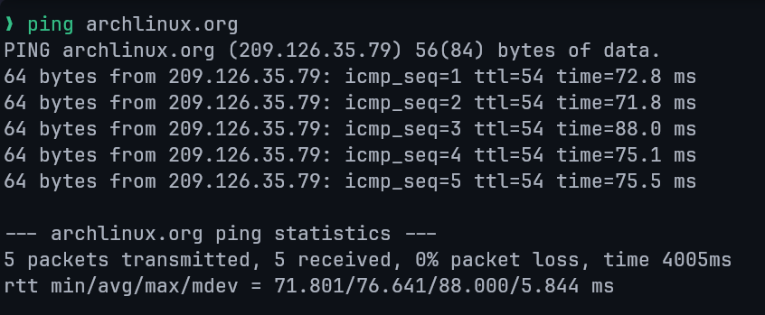
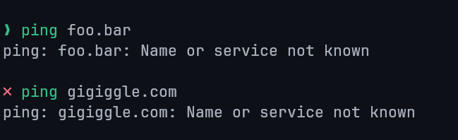
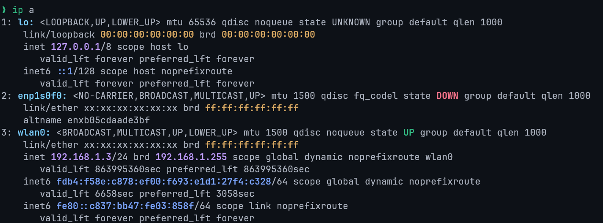
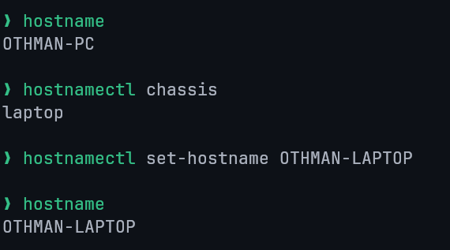
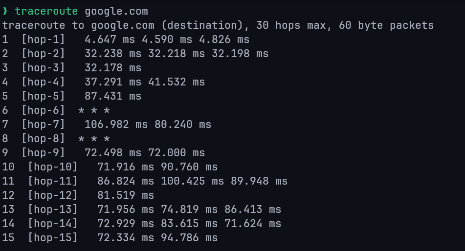
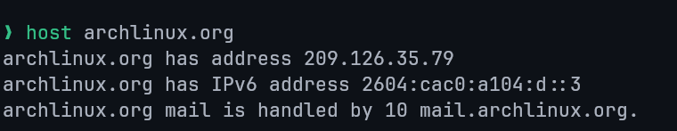
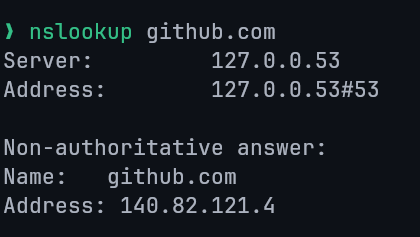
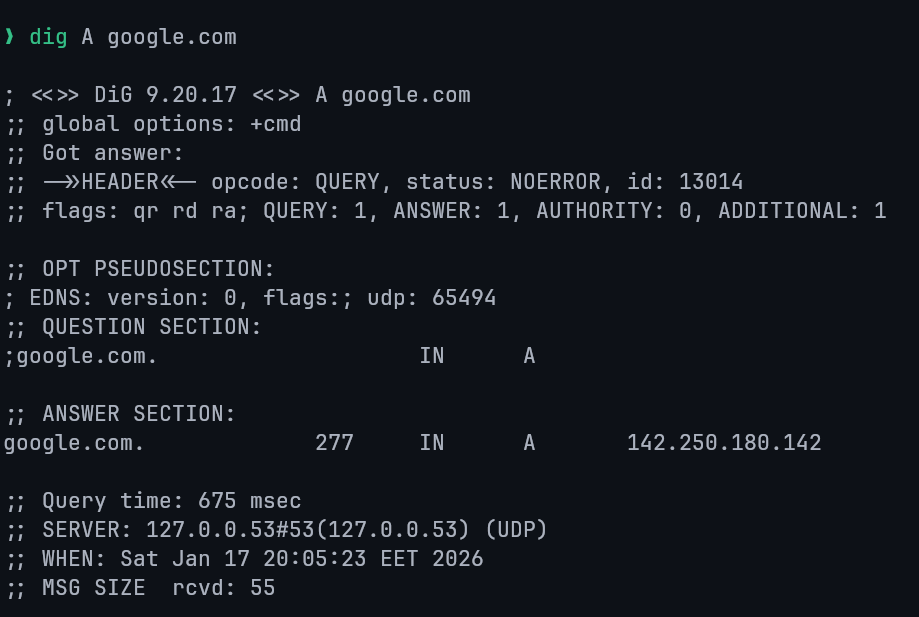

# Lecture 1: Introduction to Linux

## What is an Operating System?

- The **Operating System (OS)** is the software that starts when the computer boots and manages all system operations.
- It acts as a **manager**, controlling resources such as the CPU, memory, and storage.

**Main Functions:**

1. **Control Hardware:** Coordinates all hardware components.
2. **Run Applications:** Executes application software (e.g., browsers, editors, games).
3. **Manage Data and Files:** Handles operations like copying, moving, deleting, and renaming data.

## Before Linux

- **1980s:** Microsoft DOS dominated personal computers.
- **Apple MAC:** Superior but expensive.
- **UNIX:** Advanced but highly costly.
- Users wanted a **UNIX-like, affordable system** that could run on PCs.

## Linux Overview

- A **UNIX-like**, **free**, and **open-source** OS.
- Based on **UNIX**, designed initially for PCs but later used in **servers**, **mainframes**, and **supercomputers**.
- Runs on diverse hardware: PCs, phones, mainframes, and embedded devices.

## Linux vs Unix vs Windows

| Parameter      | Linux                | Unix           | Windows       |
| -------------- | -------------------- | -------------- | ------------- |
| Inception Year | 1991                 | 1969           | 1985          |
| Availability   | Open-source and free | Proprietary    | Paid          |
| Developer      | Linus Torvalds       | AT&T Bell Labs | Microsoft     |
| Security       | Secure               | Secure         | Less secure   |
| Virus Count    | 60–100               | 85–120         | ~60,000       |
| Interface      | GUI + CLI            | Mostly CLI     | GUI-focused   |
| Language       | C, Assembly          | C, Assembly    | C++, Assembly |
| License        | GPL (open)           | Closed         | Proprietary   |

## History of Linux

**Linux** was first released by **Linus Torvalds** on **September 17, 1991**.

- **Origin:** Linus developed Linux while he was a student at the **University of Helsinki**.
- **Collaboration:** The developers of the **Free Open Source Foundation** assisted in the development of Linux.
- **Motivation:** He created it for his computer because he could't afford a licensed operating system.
- **GPL (General Public License):** Ensures that Linux source code remains free to use, modify, and redistribute.

## Linux Operating System

- Based on the **Linux Kernel**, which handles communication between hardware and software.
- A **distribution** combines the kernel with utilities and applications, forming a complete OS.
- Various **Linux distributions** cater to different users and needs.

## Features of Linux OS

### Open Source and Free

- Source code available to everyone.
- Users can modify and redistribute freely.

### Multi-User & Multiprogramming

- Supports multiple users and simultaneous programs.

### Security

- Resistant to most viruses; supports authentication, authorization, and encryption.
- No antivirus required.

### Lightweight

- Requires minimal resources (4–8GB storage, low RAM usage).
- Supports numerous file formats.

### Graphical User Interface

- CLI by default, but can include GUI environments (GNOME, KDE, etc.).

### Stability & Performance

- Rarely crashes; supports many concurrent users efficiently.

### Portability & Compatibility

- Runs on a wide range of hardware and supports extensive applications.

### Community Support

- Backed by a large and active user/developer community.

## Why Linux?

- Open-source flexibility, stability, and reliability make it ideal for developers, servers, and end users alike.

## Linux Architecture

1. **Kernel:** Core component managing hardware and virtual resources.
2. **System Libraries:** Provide reusable functionality for developers.
3. **Shell:** Interface that interprets user commands.
4. **Hardware Layer:** Physical components (CPU, RAM, I/O devices).
5. **System Utilities:** Tools for managing system configurations, software, users, and performance.

## Linux Distributions

Main componentes of a distribution:

- Kernel + device drivers
- Shell (bash, sch, etc.)
- GUI (X11, Xfree, X.org)
- Window mangers (KDE, Gnome, etc.)
- Boot managers (LILO, GRUB, systemd-boot)
- Application software
- Installation and maintenance tools

**Examples:** Ubuntu, Mint, Fedora, Arch, Debian

- Summary: A **Linux distribution** = Kernel + Libraries + Tools + GUI + Applications.

## Linux Distribution Families


### Check Distribution

```bash
cat /etc/issue      # Distribution name
uname -a            # Kernel version
```

## Choosing the Right Distribution

- **Hardware Compatibility:** Ensure support for system architecture and devices.
- **Application Requirements:** Verify package availability.
- **Security & Stability:** Choose well-maintained distros.
- **Community Support:** Prefer active, documented communities.
- **Customizability:** Consider distros like Gentoo or Yocto for flexibility.
- **User Experience:** Evaluate desktop environments and usability.

## Linux Licensing

- Licensed under **GNU GPL v2**, ensuring source code openness.
- **GPL:** Promotes free modification and distribution.
- Linus Torvalds declined GPL v3 for the kernel due to added restrictions.

## Linux Commands

- **Commands** are instructions executed in the terminal.
- **Case-sensitive.**
- Processed by the **shell**, which interacts with the **kernel**.

**Types:**

- **Built-in Commands:** Integrated in the shell (e.g., `cd`, `echo`).
- **External Commands:** Separate executables (e.g., `ls`, `cat`).

**Command Syntax:**

```
command [ -options ] [ arguments ]
```

## Shell

- Interface between user and kernel.
- Executes user commands and manages processes.
- Popular shells: `sh`, `bash`, `csh`, `tcsh`.
- Open terminal: `Ctrl + Alt + T`
- View default shell:

```bash
echo $SHELL
```

## Bash (Bourne-Again Shell)

- Developed by **Brian Fox** for the **GNU Project**.
- Default shell for most Linux distributions.
- Functions as both a **command interpreter** and **scripting language**.
- Supports variables, conditionals, loops, and functions.
- Reads scripts directly from files.

## Shell Scripts

- A **script** is a series of commands saved in a file.
- Executed by a shell interpreter.

**Steps to Write:**

1. Create a file with commands.
2. Add a shebang line (`#!`).
3. Make it executable:

```bash
chmod u+x script.sh
```

4. Run:

```bash
./script.sh
```

**Alternative Execution:**

- Run via shell: `bash script.sh`
- Source in current shell: `source script.sh` (any variables defined by the script remain in the current shell)

## Example Script

```bash
#!/bin/bash

rm *.txt # remove all text files
ls -l
```

## Man Command

- Access command manuals using:

```bash
man <command>
```

- Contains sections: **NAME**, **SYNOPSIS**, **DESCRIPTION**, **OPTIONS**, **EXAMPLES**.
- Exit manual: press **q**.

## Manual Sections

1. General commands: Command used in the terminal.
2. System calls: Functions provided by the kernel.
3. Library functions: Functions within program libraries.
4. Special files: Devices are usually found in the /dev directory and corresponding drivers.
5. System administration commands
6. File formats and conventions
7. Kernel routines
8. Specs and interfaces
9. Games
10. Miscellaneous

## Examples

```bash
man -aw     # View all sections of a topic
man -f      # Search by command name (whatis)
man -k      # Search by keyword
whereis -m  # Find man page location
```


---

# Lecture 2: Linux Directories

## Directory

### What is a Directory?

A **directory** is a container for system and data files — essentially a folder used to organize files within the filesystem.

### Linux vs. Windows Directory Structure

- **Windows:** Each drive (e.g., `C:\`, `D:\`) has its own root.
- **Linux:** A **single root (`/`)** exists for the entire system; all files and directories branch from it.

## Linux Directory Structure


| Directory | Purpose              | Directory | Purpose                |
| :-------: | -------------------- | :-------: | ---------------------- |
|  `/bin`   | User Binaries.       |  `/sbin`  | System Binaries.       |
|  `/etc`   | Configuration Files. |  `/dev`   | Device Files.          |
|  `/proc`  | Process Information. |  `/var`   | Variable Files.        |
|  `/tmp`   | Temporary Files.     |  `/usr`   | User Programs.         |
|  `/home`  | Home Directories.    |  `/boot`  | Boot Loader Files.     |
|  `/lib`   | System Libraries.    |  `/opt`   | Optional Applications. |
|  `/mnt`   | Mount Directory.     | `/media`  | Removable Devices.     |
|  `/srv`   | Service Data.        |  `/run`   | Volatile runtime data. |

## Difference Between `/` and `/root`

| Directory | Description                                                                                        |
| --------- | -------------------------------------------------------------------------------------------------- |
| `/`       | The **root directory**, top of the Linux file hierarchy. Every directory is a subdirectory of `/`. |
| `/root`   | The **home directory** of the system administrator (root user).                                    |

## The `/boot` Directory

- Contains essential boot files, including the **Linux kernel** and **bootloader** (e.g. GRUB).
- Required for system startup; losing this directory prevents the OS from booting.
- Static and unshareable directory used **before user-mode processes** start.

## Linux Directory Commands

| Command | Description                                |
| ------- | ------------------------------------------ |
| `pwd`   | Prints the current working directory path. |
| `ls`    | Lists directory contents.                  |
| `cd`    | Changes the current directory.             |
| `mkdir` | Creates a new directory.                   |
| `rmdir` | Removes an empty directory.                |

## `pwd` Command

### Description

- **pwd** stands for _Print Working Directory_.
- Displays the absolute path of the current directory.
- Exists as both a **shell built-in** and a **binary** (`/bin/pwd`).

### Syntax

```bash
pwd    # Print the full filename of the current working directory.
pwd -L # Use the $PWD environment variable, even if it contains symlinks
pwd -P # Resolve all symlinks
```


### `$PWD` Environment Variable

- Stores the path of the current working directory.
- `echo $PWD` gives the same output of `pwd -L`.

### Options

- `--help`: Displays help for the command.
- `--version`: Displays version information.


## `cd` Command

### Description

- **cd** stands for _Change Directory_.
- Used to move between directories.
- Available as a shell built-in.

### Syntax

```bash
cd [directory]
```

### Examples

```bash
cd /         # Move to the root directory
cd           # Move to home directory
cd ~         # Move to home directory
cd Documents # Move to a subdirectory
cd ..        # Move to parent directory
```

### Absolute vs Relative Paths

- **Absolute Path:** Starts from `/` (root). Example: `/home/user/Documents`
- **Relative Path:** Starts from the current directory. Example: `../Downloads`

### Path Completion

- Press `Tab` to auto-complete filenames and directories.

## `ls` Command

### Description

Lists the files and directories within a directory (by default the current working directory).

### Syntax

```bash
ls [options] [directory]
```

### Common Options

| Option                 | Description                                      |
| ---------------------- | ------------------------------------------------ |
| `-a, --all`            | Include hidden files (`.` prefix).               |
| `-A, --almost-all`     | Show hidden files but omit `.` and `..`.         |
| `-d, --directory`      | List directories themselves, not their contents. |
| `-g`                   | Show group ownership instead of file owner.      |
| `-h, --human-readable` | Show human-readable sizes (e.g., KB, MB).        |
| `-i, --inode`          | Show inode numbers.                              |
| `-l`                   | Long listing format with detailed info.          |
| `-r, --reverse`        | Reverse the sorting order.                       |
| `-R, --recursive`      | Recursive listing including subdirectories.      |
| `-S`                   | Sort by file size, largest first                 |
| `-t`                   | Sort by modification time, newest first.         |

### `ls -l` Format Fields

1. **Permissions:** e.g., `-rwxr-xr--` (user/group/others).
2. **Links:** Number of hard links.
3. **Owner:** File owner.
4. **Group:** Group ownership.
5. **Size:** File size in bytes.
6. **Date/Time:** Last modification.
7. **Name:** File or directory name.


**Custom Block Sizes:**

| Unit          | Unit          |
| ------------- | ------------- |
| K = Kilobyte  | M = Megabyte  |
| G = Gigabyte  | T = Terabyte  |
| P = Petabyte  | E = Exabyte   |
| Z = Zettabyte | Y = Yottabyte |

```bash
ls -l --block-size=M  # Display sizes in megabytes
```


### Hidden Files and Directories

- Hidden files start with a dot (`.`), e.g., `.bashrc`.
- `ls -a`: Lists all files including `.` (current directory) and `..` (parent directory).
- `ls -A`: Lists hidden files but omits `.` and `..`.

**Reasons for Hidden Files:**

- Keeps directories clean.
- Hides backups or configuration files.
- Prevents accidental deletion.

### Other Examples

- `ls ~` -> Lists home directory contents.
- `ls ../` -> Lists parent directory contents.

- `ls -g` -> Excludes owner column from output.

  

- `ls -R` -> Recursively lists subdirectories.

  

## `mkdir` Command

### Description

Creates directories in the filesystem.

### Syntax

```bash
mkdir [options] directory_name
```

### Options

| Option             | Description                                 |
| ------------------ | ------------------------------------------- |
| `-p` / `--parents` | Create parent directories if needed.        |
| `-v` / `--verbose` | Print a message for each directory created. |
| `-m MODE`          | Set permissions (same format as `chmod`).   |
| `--help`           | Display help information.                   |
| `--version`        | Show version info.                          |

### Examples

```bash
mkdir new_folder
mkdir -p dir1/dir2/dir3
mkdir -m 755 secure_dir # Create a new directory with rwx-rw-rw- permissions
```

## `rmdir` Command

### Description

Removes **empty** directories only.

### Syntax

```bash
rmdir [options] directory_name
```

### Example

```bash
rmdir temp_folder
```

### Recursive Deletion

```bash
rmdir -p parent/child
```

Deletes a directory and its empty parent directories.

## Renaming Directories

Linux uses the `mv` command to move or rename directories (and files).

There is no dedicated rename command.

### Syntax

```bash
mv [options] old_name new_name
```

### Options

|   Option   | Description                            |
| :--------: | -------------------------------------- |
| `--backup` | Creates a backup before overwriting.   |
|    `-f`    | Forces overwrite without confirmation. |
|    `-i`    | Asks before overwriting.               |
|    `-v`    | Verbose output showing operations.     |

## `rename` Command

### Description

Used for batch renaming of multiple files or directories.
May need to be installed depending on the distribution.

### Example


### Installation

```bash
# Arch Linux (btw)
sudo pacman -S rename

# Debian / Ubuntu
sudo apt install rename

# Fedora
sudo yum install prename
```

---

# Lecture 3: User Management in Linux

## Linux User

- A **user** is an individual who interacts with the Linux system.
- Each user has a **unique username** and **user ID (UID)**.
- User accounts control access to files, processes, and resources.
- **Root user** has full administrative control.
- **UID allocation:**
  - `0`: root user
  - `1–999`: system users
  - `1000+`: local users
- Linux can support up to **60,000 user accounts** per system.

## Types of User Accounts

1. **Root**
   - The **superuser** with complete system control.
   - Can execute all commands without restriction.
   - Acts as the **system administrator**.

2. **System**
   - Used for system-level operations (e.g., mail, SSH).
   - Modifying these accounts can break system functionality.

3. **User**
   - Regular accounts for everyday users.
   - Have limited privileges to ensure system security.

## The Superuser

- Account with **UID 0**, **GID 0**, and full control over the system.
- Known as **root**.
- Should be used cautiously to prevent system damage.
- Avoid using root for regular operations.
- Must have a **strong password**.
- Can access all files and perform any system action.

## The `sudo` Command

- Allows users to execute commands as another user (typically root).

**Syntax:**

```bash
sudo [options] [-u user] command
```

- If no user is specified, root is assumed.
- A new shell is temporarily opened with elevated privileges.

### Benefits of Using `sudo`

- Prevents constant root access, reducing mistakes.
- Removes need to share the root password.
- Restricts users from executing unauthorized commands.

## The `sudoers` File

- Defines which users can run commands as other users.
- Configuration stored in: `/etc/sudoers`

- Must be edited using:

```bash
visudo
```

- Permissions can be granted per-user or per-group, with or without password prompts.

## The `su` Command

- Stands for **substitute user** or **switch user**.
- Used to switch to another user account (root by default).

### Syntax

```bash
su [options] [username]
```

- Prompts for target user's password.
- Opens a new shell with that user's privileges.
- Use `exit` to return to the previous shell.

## Alternate Permission Models

- Some distros (e.g., **Ubuntu**) disable direct root login.
- Root password is unknown to the end user; must use `sudo` or GUI equivalents.
- Users in the **admin** group can perform root actions.
- Example:

```bash
sudo su -        # Switch to the root user
sudo su - user2  # Switch to user2
```

Prompts for the user's password, not root's.

## Permissions

### Access Rights

| Type  | Description                  |
| ----- | ---------------------------- |
| **r** | Read                         |
| **w** | Write (modify, move, delete) |
| **x** | Execute                      |

### Access Levels

| Level | Description    |
| ----- | -------------- |
| **u** | User (owner)   |
| **g** | Group          |
| **o** | Others (world) |

### Permissions Reference Table

| **Permission**      | **Octal** | **Binary** | **Symbolic** | **Description**                                  |
| ------------------- | --------- | ---------- | ------------ | ------------------------------------------------ |
| **None**            | 0         | 000        | `---`        | No access at all                                 |
| **Execute**         | 1         | 001        | `--x`        | Ability to run a file or enter a directory       |
| **Write**           | 2         | 010        | `-w-`        | Ability to modify file content or directory list |
| **Write + Execute** | 3         | 011        | `-wx`        | Combination of write and execute                 |
| **Read**            | 4         | 100        | `r--`        | Ability to view file content or list directory   |
| **Read + Execute**  | 5         | 101        | `r-x`        | Read and execute (typical for directories)       |
| **Read + Write**    | 6         | 110        | `rw-`        | Read and write (typical for data files)          |
| **Full**            | 7         | 111        | `rwx`        | All permissions granted                          |

### Changing Permissions

Use the `chmod` command:

```bash
chmod [mode] file
```

Modes:

- **Symbolic Mode**: uses letters (e.g., `chmod u+x file`)
  - `+`: Adds the chosen permission to the file/directory (e.g. `chmod u+x ./script.sh`).
  - `-`: Removes the chosen permission from the file/directory (e.g. `chmod -x ./script.sh`).
  - `=`: Sets the chosen permission to the file/directory (e.g. `chmod =x ./script.sh`).
- **Absolute Mode**: uses numeric codes (e.g., `chmod 644 private-file.txt`)

Example: Assume `file.sh` has the following permissions: `-r--r--r--`

```bash
# Grant the user write permission
chmod u+w file.sh  #=> -rw-r--r--

# Grant execute permission to all
chmod +x file.sh   #=> -rwxr-xr-x

# Remove execute permission for group and others
chmod go-x file.sh #=> -rwxr--r--
```

## Linux Groups

- A **group** is a collection of users sharing common permissions.
- Each group has a unique **Group ID (GID)**.
- Files inherit the **group ownership** of the user who creates them.
- Simplifies access control and permission management.

## Linux Administration Files

| File           | Purpose                           |
| -------------- | --------------------------------- |
| `/etc/passwd`  | Stores user account info.         |
| `/etc/shadow`  | Stores encrypted passwords.       |
| `/etc/group`   | Contains group information.       |
| `/etc/gshadow` | Secure group account information. |

## Useful User Information Commands

| Command  | Description                                 |
| -------- | ------------------------------------------- |
| `whoami` | Displays current username.                  |
| `w`      | Lists logged-in users and their activities. |
| `id`     | Shows UID, GID, and group memberships.      |

### `id` Command Options

| Option         | Description                   |
| -------------- | ----------------------------- |
| `-g, --group`  | Print effective group ID.     |
| `-G, --groups` | Print all group IDs.          |
| `-n, --name`   | Display names instead of IDs. |
| `-r, --real`   | Show real ID.                 |
| `-u, --user`   | Print the effective user ID.  |
| `--help`       | Show help message.            |
| `--version`    | Show version info.            |

## Managing User Accounts

| Command    | Description                   |
| ---------- | ----------------------------- |
| `useradd`  | Add a new user.               |
| `usermod`  | Modify existing user details. |
| `userdel`  | Delete a user.                |
| `groupadd` | Create a new group.           |
| `groupmod` | Modify existing group.        |
| `groupdel` | Delete a group.               |

## The `useradd` Command

- Adds new users to the system.
- `adduser` is a symbolic link to `useradd`.
- Updates the following files:
  - `/etc/passwd`
  - `/etc/shadow`
  - `/etc/group`
  - `/etc/gshadow`

- Creates a home directory for the new user in `/home`.

### Common Usages

- Create user with custom home:

```bash
sudo useradd user1 -d /custom/home
```

- Assign specific UID or GID:

```bash
sudo useradd user2 -u 1050 -g 100
```

- Create user without home:

```bash
sudo useradd -M homeless
```

- Set expiry date:

```bash
sudo useradd user2 -e 2025-12-31
```

- Add comment or shell:

```bash
sudo useradd user3 -c "Developer" -s /bin/bash
```

- Set an **unencrypted** password for the user:

```bash
sudo useradd user4 -p strong_password
```

## The `usermod` Command

- Modifies properties of an existing user.

### Examples

The `usermod` command has similar options to the `useradd` command.

- Change username:

```bash
sudo usermod oldname -l newname
```

- Change home directory:

```bash
sudo usermod user1 -d /new/home
```

- Change group:

```bash
sudo usermod user1 -g newgroup
```

- Lock or unlock account:

```bash
sudo usermod -L user1   # lock
sudo usermod -U user1   # unlock
```

- Change user ID:

```bash
sudo usermod -u 1100 user1
```

## The `userdel` Command

- Deletes a user account.

### Syntax

```bash
userdel [options] username
```

- By default, **keeps** the user's home directory.
- To remove it:

```bash
sudo userdel -r user1 # Removes the user's home directory
```

### Options

| Option         | Description                                                         |
| -------------- | ------------------------------------------------------------------- |
| `-f, --force`  | Force removal even if user logged in.                               |
| `-r, --remove` | Remove home directory and mail.                                     |
| `-R, --root`   | Apply within a chroot environment.                                  |
| `-Z`           | Remove SELinux user mapping, applicable in SELinux-enabled systems. |

## Managing Passwords

Users can manage passwords in two ways:

1. `passwd` command
2. `openssl passwd` command

### `passwd` Command

- Change password interactively.
- Requires entering current password before new one.
- Root can change other users' passwords.

Authorized users in the `/etc/sudoers` file (e.g., the `admin` or `wheel` group) can use `sudo passwd root` to set or change the root password.
This is essential for distributions where the root account is locked or has no password set by default.

### Examples

- Change another user's password:

```bash
sudo passwd user1
```

- Force password reset on next login:

```bash
sudo passwd -e user1
```

- Lock and unlock accounts:

```bash
sudo passwd -l user1   # lock
sudo passwd -u user1   # unlock
```

- Set password expiration in days (e.g., 30 days):

```bash
sudo passwd -x 30 user1
```

## Group Management

All groups are listed in the `/etc/group` file.

### Creating Groups

```bash
groupadd groupname
```

Each new group gets a **GID**.

### Checking User Groups

```bash
groups
```

### Modifying Groups

```bash
groupmod oldname -n newname
```

### Setting Group Passwords

```bash
gpasswd groupname
```

- Group passwords are stored in `/etc/gshadow`.

### Adding Users to Groups

```bash
usermod username -aG groupname
```

### Deleting Groups

```bash
groupdel groupname
```

---

# Vi Text Editor

## Introduction to the Vi Editor

- Before **vi**, UNIX used a **line editor** that allowed editing one line at a time.
- **vi** (Visual Editor) was created by **Bill Joy in 1976**.
- It is the **default editor** in Linux/UNIX systems and is **case-sensitive**.
- **vim** (Vi IMproved) is an advanced version of vi.
- Used for creating, editing, or viewing text files.
- Not a text formatter (unlike MS Word); no margins or formatting controls.

## Characteristics of Vi

- Powerful and universally available on UNIX systems.
- Harder to learn for new users, especially Windows users.
- Allows movement and modification anywhere in a file.
- Case-sensitive commands.

## Starting Vi

```bash
vi filename
```

- Creates `filename` if it doesn't exist, otherwise opens it.
- Opens in **Command Mode** by default.

## Modes of Operation

Vi has **three modes**:

1. **Command Mode** – Default mode for navigation and commands.
2. **Insert Mode** – Used to type and edit text.
3. **Last Line Mode (Escape Mode)** – Used to save, quit, or execute commands.

## Command Mode

- Activated by pressing **Esc**.
- Keystrokes are interpreted as commands (not shown on screen).
- Used for navigation, deletion, copying, and pasting text.
- Pressing **Esc** again makes vi beep or flash if already in command mode.

## Insert Mode

- Entered from Command Mode by pressing **i**.
- Allows text input and editing.
- Exit by pressing **Esc** to return to Command Mode.

### Example

```bash
vi vifile
i
This file is being created using the vi editor.
<Esc>
```

## Last Line Mode (Escape Mode)

- Invoked by typing a colon `:` in Command Mode.
- Cursor moves to the bottom for entering commands.

### Common Commands

| Command       | Action                  |
| ------------- | ----------------------- |
| `:q`          | Quit                    |
| `:q!`         | Quit without saving     |
| `:w`          | Save file               |
| `:w!`         | Force save file         |
| `:w filename` | Save file as `filename` |
| `:wq` or `:x` | Save and quit           |
| `ZZ`          | Save and quit           |

## Input Mode Shortcuts

| Command | Action                  |
| ------- | ----------------------- |
| `i`     | Insert before cursor    |
| `I`     | Insert at start of line |
| `a`     | Append after cursor     |
| `A`     | Append at end of line   |
| `o`     | Open new line below     |
| `O`     | Open new line above     |
| `r`     | Replace one character   |
| `R`     | Overwrite text          |

## Navigation and Cursor Movement

### Basic Movement

| Command | Action     |
| ------- | ---------- |
| `h`     | Move left  |
| `j`     | Move down  |
| `k`     | Move up    |
| `l`     | Move right |

### Word Navigation

| Command | Action                |
| ------- | --------------------- |
| `w`     | Move to next word     |
| `b`     | Move to previous word |
| `e`     | Move to end of word   |
| `n w`   | Move forward n words  |
| `dw`    | Delete one word       |
| `yw`    | Copy one word         |
| `n dw`  | Delete n words        |

### Line Navigation

| Command           | Action                |
| ----------------- | --------------------- |
| `0`, `\|`, or `^` | Move to start of line |
| `$`               | Move to end of line   |
| `30 \|`           | Move to column 30     |

## Scrolling

| Command     | Action                    |
| ----------- | ------------------------- |
| `Ctrl+f`    | Scroll one page forward   |
| `Ctrl+b`    | Scroll one page backward  |
| `Ctrl+d`    | Scroll half page forward  |
| `Ctrl+u`    | Scroll half page backward |
| `10 Ctrl+f` | Scroll 10 pages forward   |

## Absolute Movement

| Command      | Action                     |
| ------------ | -------------------------- |
| `Ctrl+g`     | Show current line number   |
| `G`          | Go to end of file          |
| `1G` or `gg` | Go to first line           |
| `nG`         | Go to line n (e.g., `40G`) |

## Cut, Copy, and Paste

### Commands

| Command | Action                    |
| ------- | ------------------------- |
| `dd`    | Cut (delete) current line |
| `yy`    | Copy (yank) current line  |
| `p`     | Paste below cursor        |
| `P`     | Paste above cursor        |
| `n dd`  | Delete n lines            |
| `n yy`  | Copy n lines              |

## Deleting Text

| Command     | Action                    |
| ----------- | ------------------------- |
| `x`         | Delete current character  |
| `X`         | Delete previous character |
| `xp`        | Swap two characters       |
| `dw`        | Delete to end of word     |
| `d$` or `D` | Delete to end of line     |
| `d0`        | Delete to start of line   |
| `dd`        | Delete whole line         |
| `:20,40d`   | Delete lines 20 to 40     |
| `dG`        | Delete to end of file     |

## Editing and Joining Lines

| Command | Action                     |
| ------- | -------------------------- |
| `J`     | Join current and next line |
| `4J`    | Join 4 lines               |
| `yyp`   | Duplicate current line     |
| `ddp`   | Swap two lines             |

## Undo and Repeat

| Command  | Action                           |
| -------- | -------------------------------- |
| `u`      | Undo last change                 |
| `ctrl+r` | Redo last change                 |
| `U`      | Undo all changes on current line |
| `.`      | Repeat last command              |

## Searching for a Pattern

### Search Commands

| Command      | Action                                    |
| ------------ | ----------------------------------------- |
| `/string`    | Search forward                            |
| `?string`    | Search backward                           |
| `n`          | Go to next match (same direction)         |
| `N`          | Go to previous match (opposite direction) |
| `/^string/`  | Match a line starting with `string`       |
| `/string$/`  | Match a line ending with `string`         |
| `/\<word\>`  | Match exact word                          |
| `/pl[abc]ce` | Match patterns like place, plbce, plcce   |

## Replace Text

| Command            | Action                                         |
| ------------------ | ---------------------------------------------- |
| `:1,$ s/old/new/`  | Replace first occurrence in the entire file    |
| `:3,6 s/old/new/g` | Replace all matches in lines 3–6               |
| `g` (modifier)     | Makes the substitution **global** on each line |

## Text Buffers

| Command | Action                  |
| ------- | ----------------------- |
| `"add`  | Delete line to buffer a |
| `"ap`   | Paste from buffer a     |

## Set Commands

| Command     | Description                           |
| ----------- | ------------------------------------- |
| `:set ic`   | Ignore case when searching            |
| `:set ai`   | Enable auto-indent                    |
| `:set noai` | Disable auto-indent                   |
| `:set nu`   | Show line numbers                     |
| `:set sw=4` | Set shift width to 4 spaces           |
| `:set ws`   | Enable wrapscan (search wraps to top) |
| `:set wm=2` | Enable word wrap with margin of 2     |
| `:set ro`   | Set file as read-only                 |
| `:set term` | Display terminal type                 |
| `:set bf`   | Discard control characters            |

## Summary

The **vi editor** is a powerful, universal text editor in UNIX/Linux.
It operates in **three modes**, supports efficient navigation, editing, and text manipulation, and offers customization through **set commands**. Mastering vi enhances productivity and command-line efficiency.

---

# Shell Scripts

## Introduction to Shell Scripts

- **Shell** is the interface between a user and the operating system.
- It converts human-readable commands into system-understandable instructions.
- The **Kernel** is the innermost part of the OS, managing communication between hardware and software.
- The **Shell** is the outer layer that interacts with users.
- The terminal runs a shell that provides a **command prompt** (usually `$`), where user commands are executed.

## What is a Shell Script?

- A **shell script** is a text file containing UNIX commands.
- It usually starts with the **shebang (`#!`)** followed by the shell path (e.g., `#!/bin/sh`).
- If not specified, the current shell is used.
- Commands execute sequentially or based on control structures.
- Commonly written for the **Bourne shell (sh)**.

### Example

```bash
#!/bin/sh

echo "Hello World"
```

## Why Use Shell Scripts?

- **Automate repetitive tasks** — replace a sequence of commands with one script.
- **Simplify complex operations** — avoid remembering long command sequences.

## Unix Shell Types

### Bourne Shell Family

- **Default prompt**: `$` character
- **Subcategories**:
  - Bourne shell (sh)
  - Bourne Again shell (bash)
  - Korn shell (ksh)
  - POSIX shell (sh)

### C Shell Family

- **Default prompt**: `%` character
- **Variants**:
  - C shell (csh)
  - TENEX/TOPS C shell (tcsh)

## Steps to Write and Execute a Shell Script

1. Open the terminal and navigate to a directory.
2. Create a file with `.sh` extension.
3. Write the script in the file.
4. Make it executable:

```bash
chmod +x filename.sh
```

5. Execute the script:

```bash
./filename.sh
```

## Comments in Shell Script

- Lines starting with `#` are **comments**.
- Comments are ignored during execution.

### Example

```bash
# This is a comment
echo "Script running..."
```

## Determining Your Shell

To find the current shell:

```bash
echo $SHELL
```

## The Shebang (`#!`)

- Defines which shell interpreter will execute the script.
- Example:

```bash
#!/usr/bin/env bash
```

- The file must be made executable before running.

## Shell Variables

- A variable stores data like numbers, text, or filenames.
- Variable names can include letters, digits, and underscores.
- Access variable values using `$`.

### Example

```bash
name="Othman"
echo "Hello $name"
```

### Read-Only Variables

Once declared as read-only, a variable cannot be changed:

```bash
readonly var1="constant"
# Or
declare -r var2="constant"
```

### Reading Variables from Input

```bash
echo "Enter your name:"
read name
echo "Hello $name"
```

### Unsetting Variables

Deletes a variable from memory:

```bash
unset var
```

## Special Variables

| Variable | Description                       |
| -------- | --------------------------------- |
| `$0`     | Script name                       |
| `$n`     | nth argument (`$1`, `$2`, etc...) |
| `$#`     | Number of arguments               |
| `$*`     | All arguments as a single string  |
| `$@`     | All arguments individually quoted |
| `$?`     | Exit status of last command       |
| `$$`     | Process ID of current shell       |
| `$!`     | PID of last background command    |

### Example Script with Output

```bash
#!/usr/bin/env bash

echo "Script name: $0"
echo "All arguments: $*"
echo "Number of arguments: $#"
echo "First argument: $1"
echo "Second argument: $2"
echo "Exit status: $?"
```

**Output:**

```
Script name: ./script.sh
All arguments: apple banana
Number of arguments: 2
First argument: apple
Second argument: banana
Exit status: 0
```

## Exit Status

Any number other than `0` indicates a failure.

- Stored in `$?`.
- `0` = Success.
- `1` = Failure.

## Shell Arrays

- Arrays hold multiple values in one variable (bash only).

```bash
arr=(apple banana cherry)
echo ${arr[1]}   # Outputs banana
echo ${arr[@]}   # Outputs all elements
```

## Storing Command Output

Use backticks or `$()`:

```bash
today=$(date) # Prefered syntax
echo "Today is $today"

year=`date +%Y` # Old syntax
echo "Year is $year"
```

## Arithmetic Operations Using `expr` Command

- The complete expression should be enclosed between backticks (\`)
- There must be spaces between operators and expressions
- **Example:**

```bash
# Correct:
val=`expr 2 + 2`

# Incorrect (no spaces):
val=`expr 2+2`
```

### Modern Arithmetic Features

> [!NOTE]
> Arithmetic expansion `$(())` and arithmetic evaluation `(( ))` were introduced in Bash 2.0 (1996) as modern alternatives to `expr`.

## Shell Operators

### Integer Comparison

| Operator | Meaning               |
| -------- | --------------------- |
| `-eq`    | Equal                 |
| `-ne`    | Not equal             |
| `-gt`    | Greater than          |
| `-ge`    | Greater than or equal |
| `-lt`    | Less than             |
| `-le`    | Less than or equal    |

### Boolean Operators

| Operator | Meaning | Example                       |
| -------- | ------- | ----------------------------- |
| `!`      | NOT     | `[ ! false ]`                 |
| `-o`     | OR      | `[ $a -lt 10 -o $b -gt 100 ]` |
| `-a`     | AND     | `[ $a -lt 10 -a $b -gt 5 ]`   |

## Conditional Statements

### If Statement

```bash
if [ condition ]; then
  commands
fi
```

### If-Else Statement

```bash
if [ condition ]; then
   commands
else
   other_commands
fi
```

### Case Statement

Used for multi-condition checks:

```bash
case $var in
  1) echo "One" ;;
  2) echo "Two" ;;
  ?) echo "Missing" ;;
  *) echo "Other" ;;
esac
```

## Loops

### While Loop

Executes while a condition is true:

```bash
while [ condition ]; do
  commands
done
```

### For Loop

Iterates over a list:

```bash
for item in 1 2 3; do
  echo $item
done
```

### Until Loop

Executes until a condition becomes true:

```bash
until [ condition ]; do
  commands
done
```

### Select Loop

Displays a numbered menu for user input:

```bash
select option in Apple Banana Exit; do
  echo "You chose $option"
  break
done
```

**Even-Odd number using select loop:**

```bash
PS3='Enter your choice: ' # Custom prompt
select number in {1..10} none; do
  case "${number}" in
  2 | 4 | 6 | 8 | 10) echo "even" ;;
  1 | 3 | 5 | 7 | 9) echo "odd" ;;
  none)
    echo "Bye!"
    break
    ;;
  *) echo "Error invalid selection" ;;
  esac
done
```

## Loop Control Statements

### Break Statement

Terminates the loop early:

```bash
for i in 1 2 3; do
  if [ $i -eq 2 ]; then
    break
  fi
done
```

### Continue Statement

Skips to next iteration:

```bash
for i in 1 2 3; do
  if [ $i -eq 2 ]; then
    continue
  fi
  echo $i
done
```

## Shell Functions

- Functions divide scripts into reusable blocks.
- Parameters are accessed as `$1`, `$2`, etc.

### Example

```bash
myfunc() {
  echo "Hello $1"
}
myfunc "Othman"
```

## Example Script: Factorial

```bash
#!/usr/bin/env bash

echo -n "Enter a number: "
read -r a
fact=1
while [ "$a" -ne 0 ]; do
  fact=$((fact * a))
  a=$((a - 1))
done
echo "Factorial: $fact"
```

---

# Lecture 6: Linux Files

## 1. Core Concepts

The foundational principle of the Linux file system is that in the Linux system, everything is a file. If it is not a file, it is a process.

The term "file" in Linux has a broad scope. It encompasses not only standard data like text files, images, and compiled programs, but also system components such as disk partitions, hardware device drivers, and even directories.

Filenames in Linux are always case-sensitive. Consequently, `demo.txt` and `Demo.txt` are recognized as two distinct and separate files.

## 2. Linux File Types

Linux classifies files into several distinct types, each identified by a specific character in detailed directory listings.

`ls -l` prints the file type as the **first character** of the permission string.

**Example using `stat` command (simplified):**


| Identifier | Description                                                           |
| ---------- | --------------------------------------------------------------------- |
| `-`        | Regular: Contains programs, executable files, and text files.         |
| `d`        | Directory: Contains a list of other files and is shown in blue color. |
| `b`        | Block file                                                            |
| `c`        | Character device file                                                 |
| `p`        | Named pipe file (FIFO)                                                |
| `l`        | Symbolic link file                                                    |
| `s`        | Socket file                                                           |

> [!Note]
> The file types identified by `b`, `c`, `p`, `l`, and `s` are classified as Special files.
> The type of any given file can be determined using the `file` command.

## 3. File Management Commands

The following commands are essential for basic file management operations.

| Command  | Description                  |
| -------- | ---------------------------- |
| `file`   | Determines file type.        |
| `touch`  | Used to create a file.       |
| `rm`     | To remove a file.            |
| `cp`     | To copy a file.              |
| `mv`     | To rename or to move a file. |
| `rename` | To rename multiple files.    |

## 4. Copy & Move Commands

### `cp` Command

Copies files and directories.

- `cp <existing> <new>` (Same directory).
- `cp <file> <destination_path/>`
- `cp -r` : Copy a directory recursively.
- `cp *.txt <dest_dir>` : Copy multiple files using wildcard.
- `cp --backup` : Backup existing destination file.
- `cp -i` : Confirm before overwriting (interactive).
- `cp -p` : Preserve file properties.
- `cp -u -v` : Copy only when source is newer or dest is missing (verbose).

## 5. File Creation Methods

Linux offers multiple methods for creating new files, ranging from command-line utilities to full-featured text editors.

- Using the `cat` command
- Using the `touch` command
- Using the redirect `>` symbol
- Using the `echo` or `printf` commands
- Using text editors such as `vim`, `nano`, or `vi`

---

### 5.1 `touch` Command

The `touch` command serves two primary functions: creating a new, empty file or updating the access and modification timestamps of an existing file. It is particularly useful when you need to create a file placeholder before the data is ready to be stored.

```sh
# Create an empty file
touch new.txt
```

The key difference between `touch` and `cat` for file creation is that `touch` creates a blank, zero-byte file, whereas `cat` allows you to specify the file's content directly from the command prompt.

---

### 5.2 `cat` Command for Creation

The `cat` command can be combined with the `>` redirection operator to create a new file and immediately add content to it.

```sh
cat > test.txt
```

After executing the command, you can type the desired content directly into the terminal. To save the content and exit, press `CTRL + D`.

---

### 5.3 Redirect `>` Symbol

The redirection operator `>` can be used without a preceding command to create an empty file.

```bash
> test5.txt
```

It can be also used with a preceding command to redirect the output into the file.

```bash
# Redirect output of ls command into output.txt file overwriting its content.
ls -l > output.txt

# Redirect the output of the commands into new.txt appending into the end of the file.
pwd >> new.txt
which bash >> new.txt
```

It is important to distinguish between the two redirection operators:

- `>` **(overwrite):** Redirects output to a file. If the file exists, its contents are overwritten. If it does not exist, it is created.
- `>>` **(append):** Appends output to the end of a file. If the file does not exist, it is created.

### 5.4 `echo` and `printf` Commands

The `echo` and `printf` commands are used to create a file with content specified directly on the command line.

```bash
echo "File content" > test6.txt
```

---

### 5.5 Text Editors

Standard Linux text editors provide a more interactive way to create and edit files. Common editors include `vim`, `nano`, and `vi`.

To save and exit the `nano` editor, follow these steps:

1. Press `CTRL + X` to exit.
2. Press `y` to confirm that you want to save the changes.
3. Press `Enter` to save the file with the current name.

## 6. File Content Viewing and Manipulation

### 6.1 `cat` Command

Beyond file creation, the `cat` command is a versatile tool for viewing and manipulating file content.

```sh
# View single file: Displays the entire content of a single file to the terminal.
cat file.txt

# View multiple files: Displays the content of multiple files sequentially, one after the other.
cat file-1.txt file-2.txt file-3.txt

# Show line numbers
cat -n file.txt

# Copy contents: Redirects the content of one file into another, overwriting the destination file.
cat old.txt > new.txt

# Concatenate/Merge files: The `>>` operator appends the content of one or more files to a destination file.
cat file-1.txt file-2.txt >> file-3.txt

# Using wildcards -> merge all .txt files into all.txt
cat *.txt >> all.txt

# Highlight end of lines: displays a $ character at the end of each line, making trailing whitespace visible.
cat -e file.txt
```

- **Suppress Empty Lines:** The `-s` option suppresses multiple adjacent blank lines, replacing them with a single blank line.


> [!NOTE]
> You can use a wildcard (`*`) to select multiple files of the same type.
> For example, `cat *.txt >> filename.txt` will merge all `.txt` files in the current directory.

---

### 6.2 `tac` Command

The `tac` command (named as the reverse of `cat`) displays the contents of a file in reverse order, printing the last line first.

```bash
tac <file name>
```

## 7. File Deletion and Type Determination

### 7.1 `rm` Command Options

The `rm` (remove) command is used to delete files and directories.

| Option              | Description                                                                                                                     |
| ------------------- | ------------------------------------------------------------------------------------------------------------------------------- |
| `rm *extension`     | Deletes all files matching the given extension in the current directory.                                                        |
| `rm -r` / `rm -R`   | Recursively deletes a directory and all of its contents.                                                                        |
| `rm -i`             | Prompts for confirmation before deleting each file.                                                                             |
| `rm -rf`            | Forcefully deletes a directory and all of its contents without prompting, including write-protected files.                      |
| `-f`                | Force mode: ignores non-existent files and suppresses confirmation prompts. Does not recursively delete directories on its own. |
| `-v`                | Verbose mode: prints the names of files as they are deleted.                                                                    |
| `-d`                | Deletes an empty directory.                                                                                                     |
| `--one-file-system` | Deletes only files on the same file system as the specified directory, ignoring mounted filesystems.                            |

---

### 7.2 `file` Command Options

The `file` command determines a file's type.

- `-s`: Used for special files (e.g., block or character device files).
- `*`: Lists the types of all files in the current directory.
- `/directory_name/*`: Lists the types of all files within a specified directory.
- `[range]*`: Lists the types for all files whose names begin with a character within the specified range (e.g., `[a-c]*`).


## 8. Search Commands

### 8.1 `find` Command

Searches for files in the filesystem based on conditions.

- `find <location> <criteria> <term>`
- `.` : Current directory. `/` : Root directory.
- `find . -name "*.txt"` (Find by name).
- `find . -type f -name "*.bak"` (Find files by name and type `f`).
- `find . -type d -name ".git"` (Find directories by name and type `d`).
- `find . -newer msg.txt` (Find files newer than `msg.txt`).
- `find . -name Demo.txt -delete` (Find and delete **permanently**).

---

### 8.2 `locate` Command

Searches for files using a pre-built database (faster than `find`).

- `locate <file name>`
- Update database: `updatedb`
- `locate -n 5 "*.txt"` (Limit results).
- `locate -c Demo*` (Display The Number of Matching Entries).
- `locate -i` (Ignore case).
- `locate -e *demo.txt*` (Display only existing files, skips deleted files).
- `locate -S` (Show database stats).

---

### 8.3 `which` Command

Locates the path of an executable or command.

- `which <program_name>`
- `which -a <program_name>`: Print all matches in PATH, not just the first
- `which node cat ls`

## 9. Viewing Commands

### 9.1 `head` Command

Displays the first part (default: 10 lines) of a file.

- `head <file name>`
- `head file1.txt file2.txt` (Multiple files).
- `head -n <number> <file>` (Show specific number of lines).
- `head -c <number> <file>` (Show specific number of bytes).

---

---

### 9.2 `tail` Command

Displays the last part (default: 10 lines) of a file. Used to monitor logs. Can display multiple files.

- `tail <file name>`
- `ls -t /etc | tail -n 6` (Piped with other commands).

---

### 9.3 `more` Command

Displays file content one screen at a time (for large files). Cannot display binary files.

- `more <file name>` or `cmd | more`

- **Navigation**:
  - `Enter` (line down)
  - `Space` (next page)
  - `b` (back page)
  - `/` (search).

---

### 9.4 `less` Command

An advanced version of `more` with additional features (adjusts to window size, supports search).

- `less <file name>` or `cmd | less`

The `less` command have navigation keys similar to the `vim` editor.

- **Search**:
  - `/string` (forward searching)
  - `?string` (backward searching)
  - `n` (next match)
  - `N` (previous match).

---

# Lecture 7: Networking Commands

## 1. Command Overview

The following table lists key networking commands and their core functions. Familiarity with this set is crucial for any system or network administrator preparing for certification.

| Command         | Function                                                                                        |
| --------------- | ----------------------------------------------------------------------------------------------- |
| `ifconfig`      | Display and manipulate route and network interfaces.                                            |
| `ip`            | The modern, unified tool for viewing and manipulating network interfaces, routing, and tunnels. |
| `traceroute`    | A network troubleshooting utility.                                                              |
| `tracepath`     | Similar to `traceroute` but does not require root privileges.                                   |
| `ping`          | Check connectivity between two nodes.                                                           |
| `netstat`       | Display connection information.                                                                 |
| `ss`            | A replacement for `netstat`.                                                                    |
| `dig`           | Query DNS-related information.                                                                  |
| `nslookup`      | Resolve domain names and IP addresses using DNS.                                                |
| `route`         | Show and manipulate the IP routing table.                                                       |
| `host`          | Perform DNS lookups.                                                                            |
| `arp`           | View or modify the kernel ARP table.                                                            |
| `iwconfig`      | Configure a wireless network interface.                                                         |
| `hostname`      | Display or set the system hostname.                                                             |
| `curl` / `wget` | Download files from the internet.                                                               |
| `mtr`           | Combine `ping` and `tracepath` functionality.                                                   |
| `whois`         | Retrieve domain registration (WHOIS) information.                                               |
| `ifplugstatus`  | Indicate whether a network cable is connected.                                                  |

## 2. Connectivity Testing Commands

### `ping` (Packet Internet Groper)

As a network administrator, `ping` is the first and most essential tool for verifying basic network connectivity. Short for **Packet Internet Groper**, it works by sending Internet Control Message Protocol (ICMP) Echo Request packets to a target host and waiting for a response.

**Primary purposes:**

- Test connectivity between two nodes
- Measuring the time taken for packets to return, which helps determine connection speed.

The command runs continuously until interrupted with `CTRL + C`.

`ping` output includes:

- Number of packets transmitted
- Number of packets received
- Round-trip time (time taken by the packet to return) statistics

**Syntax:**

```bash
ping [options] <destination>
```

Where `<destination>` is a DNS name or an IP address.

**Successful `ping` example:**



**Unsuccessful `ping` example:**



## 3. Network Interface & Configuration Commands

### `ifconfig` (Interface Configurator)

The `ifconfig` command, short for **Interface Configurator**, is used to display network addresses and configure network interfaces.
It allows administrators to view interface details, activate or deactivate interfaces, and assign IP addresses.

**Information displayed includes:**

- MTU (Maximum Transmission Unit)
- MAC address
- IP address

Running `ifconfig` without arguments shows all active interfaces.


> [!NOTE]
> `ifconfig` is deprecated on modern systems. Prefer the `ip` command for current Linux distributions.

**Common usage examples:**

View settings for specific interfaces:

```bash
ifconfig eth0    # Ethernet interface
ifconfig wlan0   # Wireless interface
```


Show all network interfaces, including inactive ones:

```bash
ifconfig -a
```

Deactivate an interface:

```bash
ifconfig eth0 down
```

Activate an interface:

```bash
ifconfig eth0 up
```

Assign IP address, netmask, and broadcast address:

```bash
ifconfig eth0 192.168.1.102 netmask 255.255.255.0 broadcast 192.168.1.255
```

---

### `ip` Command

The `ip` command is the modern replacement for `ifconfig`, `route`, and `arp`.
It provides a unified interface for managing network configuration.

View interface information:

```bash
ip a
ip addr
ip addr show
```



---

### `hostname`

The `hostname` command displays the system's current hostname.



To permanently change the hostname across reboots, use `hostnamectl`.

---

### `route`

- **Purpose:** Display or manipulate the IP routing table
- **Syntax:** `route`
- **Add a route example:**

```bash
route add -net 192.168.90.0/24 gw 10.0.0.1
```

## 4. Route and Path Tracing Commands

### `traceroute`

The `traceroute` command displays the path packets take to reach a destination by listing each router (hop) along the way.
It is commonly used to diagnose slow or failing connections when `ping` results are abnormal.



---

### `tracepath`

The `tracepath` command provides similar functionality to `traceroute` but does not require root privileges.

**Key uses:**

- Identify network latency points
- Trace packet paths
- Display intermediate devices

## 5. DNS Query Commands

DNS resolution is a core networking concept. These tools allow administrators to troubleshoot and inspect DNS records directly from the command line.

### `host`

Performs DNS lookups to resolve domain names to IP addresses and supports reverse lookups.



---

### `nslookup` (Name Server Lookup)

Queries DNS servers to resolve domain names and IP addresses.

**Domain lookup:**



**Reverse IP lookup:**


#### Querying Specific DNS Records

- **NS record:** Identify authoritative name servers

```bash
nslookup -type=ns facebook.com
```

- **MX record:** Identify mail servers for a domain

```bash
nslookup -type=mx outlook.com
```

---

### `dig` (Domain Information Groper)

A powerful and flexible DNS query tool commonly used for troubleshooting. It provides detailed DNS response data.



## 6. Connection & Port Information Commands

### `netstat` (Network Statistics)

Displays network statistics including open sockets, routing tables, and active connections.
Although deprecated in favor of `ss`, it remains relevant for legacy systems.

View all connections:

```bash
netstat -a
```


**Common options:**

- `netstat -a` : Show all connections
- `netstat -i` : Show network interfaces
- `netstat -nlpt` : Show listening ports with PIDs (root required)

**View only active (ESTABLISHED) connections:**

```bash
netstat -atnp | grep ESTABLISHED
```

**List protocol-specific connections:**

```bash
netstat -at   # TCP only
netstat -au   # UDP only
```

**Display protocol statistics:**

```bash
netstat -s
```

---

### `ss` (Socket Statistics)

- **Purpose:** Faster and more detailed replacement for `netstat`
- **Syntax:**

```bash
ss
```

---

### `arp` (Address Resolution Protocol)

Displays and modifies the ARP cache, which maps IP addresses to MAC addresses.

```bash
arp    # Print the current content of the ARP table.
arp -e # display (all) hosts in default (Linux) style
```

---

# Lecture 8: Process Management

## Core Definitions

- **Program**: Series of instructions telling the computer what to do.
- **Process**: A **program in execution**. A running instance of a program loaded into memory.
- **Process Management**: Tuning or controlling a process.
- **Job**: A process started from the shell.

## Process Types / States

### Based on Execution Mode

Processes in Linux can run in one of two modes, which determines their interaction with the user terminal.

#### Foreground Process

By default, all processes run in the foreground.
Runs on the terminal, receives input from keyboard (`stdin`) and sends output to screen (`stdout`).
Blocks the terminal until finished/killed.

#### Background Process

Runs independently without requiring keyboard input.
Allows other commands to run in the foreground simultaneously.
To run a command as a background process, append an ampersand (`&`) to the end of the command.

```bash
sleep 30 &
```

### Based on Relationships & Status

1.  **Parent process**
    Any process that creates another process.
    Every process in Linux has a parent process, except for the very first process started by the kernel.
2.  **Child process**
    A process created by another process (its parent).
    Each child process always has exactly one parent at any given time.
3.  **Orphan process**
    An orphan process occurs when a parent process terminates **before** its child finishes execution.
    The orphan's PPID becomes the PID of `init` (PID 0) or `systemd` (PID 1).
4.  **Zombie process**
    A process that has finished execution (dead) but still has an entry in the process table.
    Zombie processes consume no CPU and minimal memory, but they remain visible in process listings until reaped by their parent.
5.  **Daemon process**
    A long-running background process that typically starts during system boot or on demand and does not interact directly with a terminal.
    Daemons are usually detached from any controlling TTY, their TTY field often appears as `?` in process listings.
    Examples include `sshd`, `cron`, and `systemd` services.

## Key Commands

### Job Control Commands

The following commands and keystrokes are used to manage jobs:

| Command / Keystroke | Description                                                            |
| ------------------- | ---------------------------------------------------------------------- |
| `jobs`              | Lists background jobs and their Process IDs.                           |
| `kill %N`           | Terminates the background job number N.                                |
| `kill PID`          | Terminates process with the given Process ID.                          |
| `fg %N`             | Brings background job N to the **foreground**.                         |
| `Ctrl+Z`            | Suspends the current foreground job.                                   |
| `bg`                | Resumes the most recently suspended job and runs it in the background. |
| `bg %N`             | Resumes the suspended job number N and runs it in the background.      |
| `Ctrl+C`            | Terminates the current foreground job.                                 |

### Monitoring & Listing Processes

There are two primary commands available in Linux to track running processes: `top` and `ps`.

#### The `top` Command

The `top` command provides a real-time, dynamic view of the processes running on the system.

- Navigate: Up/Down arrows.
- Kill: Highlight process, press `k`.
- Quit: Press `q`.

#### The `ps` Command

The `ps` (process status) command is used to view currently running processes.

**Basic Usage** Running `ps` without options shows the processes for the current user and terminal.


To display **all currently running processes in full format**, use `ps -ef`.


- `-e` : show all processes
- `-f` : full-format listing (UID, PID, PPID, CPU usage, start time, TTY, and command)

**Fields:**

- `UID`: The User ID of the process owner.
- `PID`: The unique Process ID.
- `PPID`: The Parent Process ID.
- `C`: The CPU utilization of the process.
- `STIME`: The time the process started.
- `TTY`: The terminal type where the command is running.
- `TIME`: The cumulative CPU time used by the process.
- `CMD`: The command that initiated the process.

Alternatively, a more detailed output can be obtained with `ps aux` (can be written as `ps -aux`)


- `a` : Shows information about all users
- `x` : Shows information about processes without terminals (e.g. system daemons)
- `u` : Displays the output in a **user-oriented** format, which includes columns like `%CPU` and `%MEM`.

`ps -u <username>` **(User-specific)**

The `-u` option filters the process list to show only processes belonging to a specific user.
Multiple usernames can be specified, separated by a comma.

```bash
ps -fu <username>
```


`ps -C <command>` **(By Command Name)**

The `-C` option selects processes by their command name.

```bash
ps -C <command>
```


`ps -p <PID>` **(By Process ID)**

The `-p` option allows you to query a process directly using its unique Process ID (PID).
This is useful for checking the status of a specific application or service when you already know its PID.


`ps --ppid <PPID>` **(By Parent Process ID)**

The `--ppid` option is used to list all child processes that share the same Parent Process ID.


## Terminating and Prioritizing Processes

### Terminating Processes

There are three primary methods for ending a process:

1. `CTRL+C`
   Sends an **interrupt** signal (SIGINT) to a process running in the foreground, typically exits the command.
2. `kill` Command
   Terminates or signals a process, first find its PID using the `ps` command.
   Then, use the `kill <PID>` command to terminate it.
   This sends a terminate signal (SIGTERM) by default.
3. `kill -9` Command
   If a process ignores the interrupt signal, you can force its termination using `kill -9 <PID>`.
   This sends a forceful kill signal (SIGKILL).

### Prioritizing Processes (Niceness)

In Linux, process priority can be influenced by its 'Niceness' value.

- **Niceness Value:** Determines process priority. Range: **-20 (highest) to 19 (lowest)**. Default is 0.
- **Set for new process**: `nice -n [value] [process name]`
- **Change for running process**: `renice [value] -p 'PID'`

---

# Lecture 9: Linux Filters & Commands

## Filters

A Linux filter is a program that takes plain text as standard input, transforms it into a meaningful format, and returns the result as standard output.

**Key Characteristics:**

- **Input:** Accept data from standard input (`stdin`), which can be a file or the output from another program.
- **Output:** Produce output on standard output (`stdout`), which can be displayed on the screen or sent to another program/file.
- **Purpose:** Transform plain-text data.
- **Design Principle:** Filters are typically small, specialized programs, building blocks for more complex operations.

## Pipe

The pipe (`|`) is a mechanism that passes the output of one command as the input for another command.

The general syntax for using a pipe is as follows:

```bash
command1 | command2
```

This syntax sends the output generated by `command1` directly to `command2` as its input.

For example, the following command sends the output of the `ps` command to the `head` command:

```bash
ps | head -5
```


## Redirection

In Linux, standard devices are treated as files.
The keyboard is considered standard input (file descriptor 0), while the terminal screen is used for both standard output (1) and standard error (2).
Redirection allows you to change where input comes from and where output goes.

### Output Redirection

The greater-than symbol (`>`) is used to redirect output, sending the results of a command to a file instead of the terminal screen.

```
ls > list.txt
```

This example writes the output of the `ls` command into a file named `list.txt`.

### Input Redirection

The less-than symbol (`<`) is used to redirect input, telling a command to read from a file instead of the keyboard.

```
cat < file.txt
```

The `<` symbol redirects the content of `file.txt` to the standard input of the `cat` command.
`cat` then processes this input and writes it to its standard output (the terminal screen).

### Combined Example


Here we redirected the output of the `banner` script to the file `file.txt`.
Then, we redirected the file `file.txt` to the input of the `cat` command, which prints it to the screen.

## Filter Commands

### `cat`

Concatenate files and display them on the standard output, line by line.

**Example:**


---

### `sort`

Sort lines of text files.
By default, it sorts lines alphabetically, but numerous options are available to modify the sorting mechanism.

**Examples:**


---

### `uniq`

The `uniq` command removes duplicate lines from a file's content. A critical limitation is that it can only remove _adjacent_ (continuous) duplicate lines.

**Example:**


---

### `wc`

The `wc` (word count) command counts the number of lines, words, and characters in its input.

**Example:**


---

### `grep`

The `grep` (global regular expression print) command is used to search for a specific pattern within the content of a file.

**Example:**


---

### `sed`

The `sed` (stream editor) command performs search and replace operations on data.

**Syntax:** `sed -e 's/search/replace/'` or `sed -e 's/search/replace/g'` for global replacement (all matches).

**Example:**


---

### `nl`

The `nl` command is used to add line numbers to text data. Similar output to `cat -n` command.

**Example:**


---

### `comm`

The `comm` command compares two sorted files line by line.

**Output Format:** The command produces a three-column output:

- **First column:** Contains lines unique to the first file.
- **Second column:** Contains lines unique to the second file.
- **Third column:** Contains lines that are common to both files.

**Example:**


---

### `tee`

The `tee` command reads content from standard input and simultaneously writes that content to both standard output and one or more specified files.

**Example:**


---

### `awk`

`awk` is a powerful scripting language used for advanced text processing. It is particularly useful for tasks where simpler tools like `sed` have limitations.

**Capabilities:** `awk` can be used for searching, replacing, sorting, validating, and indexing data.

**Examples:**

Searches for any line starting with "Mo", prints it and the words "is friend".


---

Prints the second field (separated with spaces by default) from each line.


---

### `gzip` / `gunzip`

- **Purpose:** The `gzip` command is used to compress files, while the `gunzip` command is used to decompress them.
- **File Extension:** Files compressed with `gzip` are given a `.gz` extension.
- **Decompression:** Decompressing a file with `gunzip` removes the `.gz` extension.

**Examples**

**Compression:**


---

**Decompression:**


