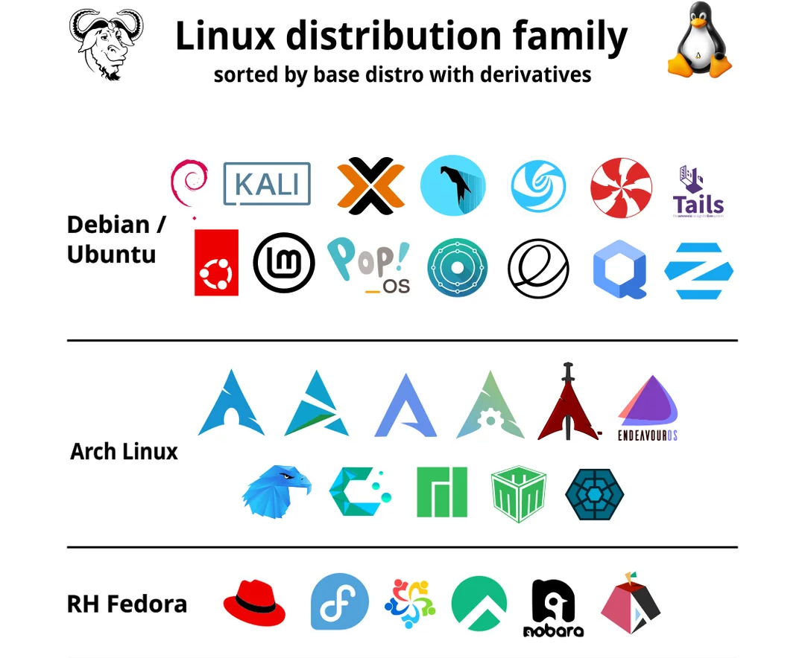
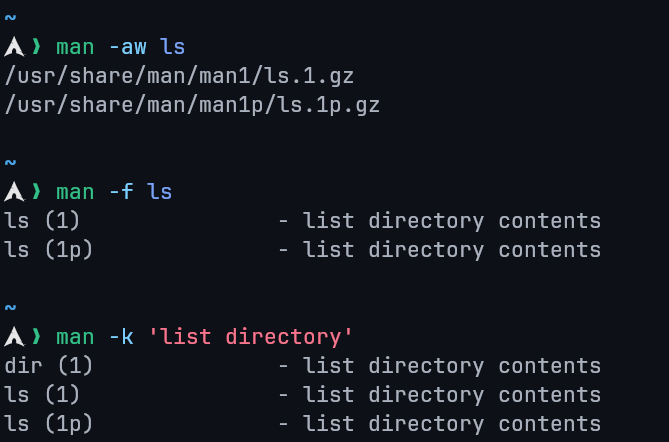
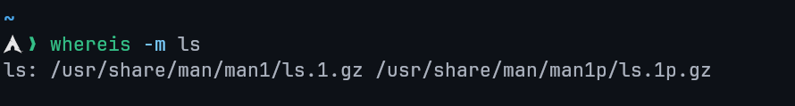

# Lecture 1: Introduction to Linux

## What is an Operating System?

- The **Operating System (OS)** is the software that starts when the computer boots and manages all system operations.
- It acts as a **manager**, controlling resources such as the CPU, memory, and storage.

**Main Functions:**

1. **Control Hardware:** Coordinates all hardware components.
2. **Run Applications:** Executes application software (e.g., browsers, editors, games).
3. **Manage Data and Files:** Handles operations like copying, moving, deleting, and renaming data.

## Before Linux

- **1980s:** Microsoft DOS dominated personal computers.
- **Apple MAC:** Superior but expensive.
- **UNIX:** Advanced but highly costly.
- Users wanted a **UNIX-like, affordable system** that could run on PCs.

## Linux Overview

- A **UNIX-like**, **free**, and **open-source** OS.
- Based on **UNIX**, designed initially for PCs but later used in **servers**, **mainframes**, and **supercomputers**.
- Runs on diverse hardware: PCs, phones, mainframes, and embedded devices.

## Linux vs Unix vs Windows

| Parameter      | Linux                | Unix           | Windows       |
| -------------- | -------------------- | -------------- | ------------- |
| Inception Year | 1991                 | 1969           | 1985          |
| Availability   | Open-source and free | Proprietary    | Paid          |
| Developer      | Linus Torvalds       | AT&T Bell Labs | Microsoft     |
| Security       | Secure               | Secure         | Less secure   |
| Virus Count    | 60–100               | 85–120         | ~60,000       |
| Interface      | GUI + CLI            | Mostly CLI     | GUI-focused   |
| Language       | C, Assembly          | C, Assembly    | C++, Assembly |
| License        | GPL (open)           | Closed         | Proprietary   |

## History of Linux

**Linux** was first released by **Linus Torvalds** on **September 17, 1991**.

- **Origin:** Linus developed Linux while he was a student at the **University of Helsinki**.
- **Collaboration:** The developers of the **Free Open Source Foundation** assisted in the development of Linux.
- **Motivation:** He created it for his computer because he could't afford a licensed operating system.
- **GPL (General Public License):** Ensures that Linux source code remains free to use, modify, and redistribute.

## Linux Operating System

- Based on the **Linux Kernel**, which handles communication between hardware and software.
- A **distribution** combines the kernel with utilities and applications, forming a complete OS.
- Various **Linux distributions** cater to different users and needs.

## Features of Linux OS

### Open Source and Free

- Source code available to everyone.
- Users can modify and redistribute freely.

### Multi-User & Multiprogramming

- Supports multiple users and simultaneous programs.

### Security

- Resistant to most viruses; supports authentication, authorization, and encryption.
- No antivirus required.

### Lightweight

- Requires minimal resources (4–8GB storage, low RAM usage).
- Supports numerous file formats.

### Graphical User Interface

- CLI by default, but can include GUI environments (GNOME, KDE, etc.).

### Stability & Performance

- Rarely crashes; supports many concurrent users efficiently.

### Portability & Compatibility

- Runs on a wide range of hardware and supports extensive applications.

### Community Support

- Backed by a large and active user/developer community.

## Why Linux?

- Open-source flexibility, stability, and reliability make it ideal for developers, servers, and end users alike.

## Linux Architecture

1. **Kernel:** Core component managing hardware and virtual resources.
2. **System Libraries:** Provide reusable functionality for developers.
3. **Shell:** Interface that interprets user commands.
4. **Hardware Layer:** Physical components (CPU, RAM, I/O devices).
5. **System Utilities:** Tools for managing system configurations, software, users, and performance.

## Linux Distributions

Main componentes of a distribution:

- Kernel + device drivers
- Shell (bash, sch, etc.)
- GUI (X11, Xfree, X.org)
- Window mangers (KDE, Gnome, etc.)
- Boot managers (LILO, GRUB, systemd-boot)
- Application software
- Installation and maintenance tools

**Examples:** Ubuntu, Mint, Fedora, Arch, Debian

- Summary: A **Linux distribution** = Kernel + Libraries + Tools + GUI + Applications.

## Linux Distribution Families



### Check Distribution

```bash
cat /etc/issue      # Distribution name
uname -a            # Kernel version
```

## Choosing the Right Distribution

- **Hardware Compatibility:** Ensure support for system architecture and devices.
- **Application Requirements:** Verify package availability.
- **Security & Stability:** Choose well-maintained distros.
- **Community Support:** Prefer active, documented communities.
- **Customizability:** Consider distros like Gentoo or Yocto for flexibility.
- **User Experience:** Evaluate desktop environments and usability.

## Linux Licensing

- Licensed under **GNU GPL v2**, ensuring source code openness.
- **GPL:** Promotes free modification and distribution.
- Linus Torvalds declined GPL v3 for the kernel due to added restrictions.

## Linux Commands

- **Commands** are instructions executed in the terminal.
- **Case-sensitive.**
- Processed by the **shell**, which interacts with the **kernel**.

**Types:**

- **Built-in Commands:** Integrated in the shell (e.g., `cd`, `echo`).
- **External Commands:** Separate executables (e.g., `ls`, `cat`).

**Command Syntax:**

```
command [ -options ] [ arguments ]
```

## Shell

- Interface between user and kernel.
- Executes user commands and manages processes.
- Popular shells: `sh`, `bash`, `csh`, `tcsh`.
- Open terminal: `Ctrl + Alt + T`
- View default shell:

```bash
echo $SHELL
```

## Bash (Bourne-Again Shell)

- Developed by **Brian Fox** for the **GNU Project**.
- Default shell for most Linux distributions.
- Functions as both a **command interpreter** and **scripting language**.
- Supports variables, conditionals, loops, and functions.
- Reads scripts directly from files.

## Shell Scripts

- A **script** is a series of commands saved in a file.
- Executed by a shell interpreter.

**Steps to Write:**

1. Create a file with commands.
2. Add a shebang line (`#!`).
3. Make it executable:

```bash
chmod u+x script.sh
```

4. Run:

```bash
./script.sh
```

**Alternative Execution:**

- Run via shell: `bash script.sh`
- Source in current shell: `source script.sh` (any variables defined by the script remain in the current shell)

## Example Script

```bash
#!/bin/bash

rm *.txt # remove all text files
ls -l
```

## Man Command

- Access command manuals using:

```bash
man <command>
```

- Contains sections: **NAME**, **SYNOPSIS**, **DESCRIPTION**, **OPTIONS**, **EXAMPLES**.
- Exit manual: press **q**.

## Manual Sections

1. General commands: Command used in the terminal.
2. System calls: Functions provided by the kernel.
3. Library functions: Functions within program libraries.
4. Special files: Devices are usually found in the /dev directory and corresponding drivers.
5. System administration commands
6. File formats and conventions
7. Kernel routines
8. Specs and interfaces
9. Games
10. Miscellaneous

## Examples

```bash
man -aw     # View all sections of a topic
man -f      # Search by command name (whatis)
man -k      # Search by keyword
whereis -m  # Find man page location
```



