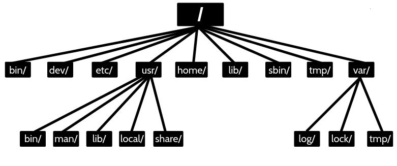
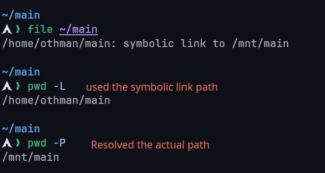
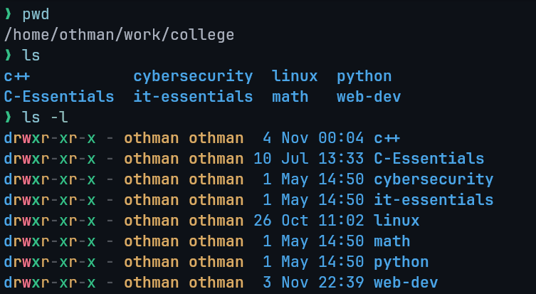
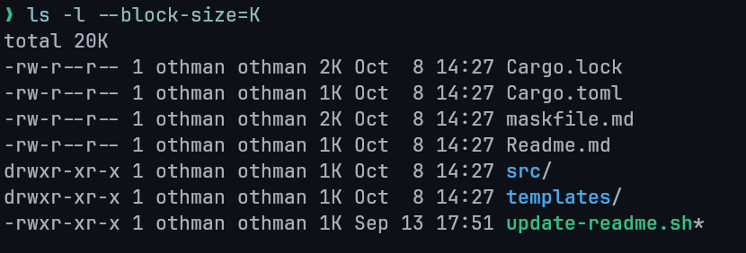
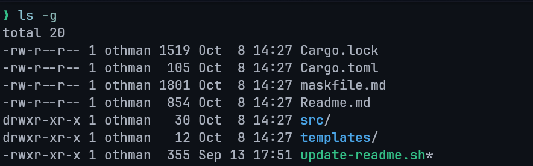
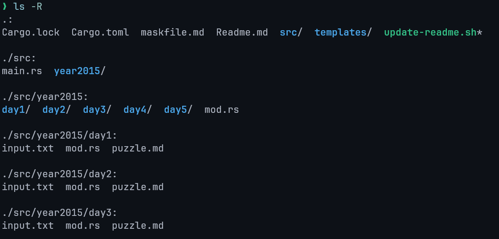

# Lecture 2: Linux Directories

## Directory

### What is a Directory?

A **directory** is a container for system and data files — essentially a folder used to organize files within the filesystem.

### Linux vs. Windows Directory Structure

- **Windows:** Each drive (e.g., `C:\`, `D:\`) has its own root.
- **Linux:** A **single root (`/`)** exists for the entire system; all files and directories branch from it.

## Linux Directory Structure



| Directory | Purpose             | Directory | Purpose               |
| :-------: | ------------------- | :-------: | --------------------- |
|  `/bin`   | User Binaries       |  `/sbin`  | System Binaries       |
|  `/etc`   | Configuration Files |  `/dev`   | Device Files          |
|  `/proc`  | Process Information |  `/var`   | Variable Files        |
|  `/tmp`   | Temporary Files     |  `/usr`   | User Programs         |
|  `/home`  | Home Directories    |  `/boot`  | Boot Loader Files     |
|  `/lib`   | System Libraries    |  `/opt`   | Optional Applications |
|  `/mnt`   | Mount Directory     | `/media`  | Removable Devices     |
|  `/srv`   | Service Data        |           |                       |

## Difference Between `/` and `/root`

| Directory | Description                                                                                        |
| --------- | -------------------------------------------------------------------------------------------------- |
| `/`       | The **root directory**, top of the Linux file hierarchy. Every directory is a subdirectory of `/`. |
| `/root`   | The **home directory** of the system administrator (root user).                                    |

## /boot

- Contains essential boot files, including the **Linux kernel** and **bootloader** (e.g. GRUB).
- Required for system startup; losing this directory prevents the OS from booting.
- Static and unshareable directory used **before user-mode processes** start.

## Linux Directory Commands

| Command | Description                                |
| ------- | ------------------------------------------ |
| `pwd`   | Prints the current working directory path. |
| `ls`    | Lists directory contents.                  |
| `cd`    | Changes the current directory.             |
| `mkdir` | Creates a new directory.                   |
| `rmdir` | Removes an empty directory.                |

## `pwd` Command

### Description

- **pwd** stands for _Print Working Directory_.
- Displays the absolute path of the current directory.
- Exists as both a **shell built-in** and a **binary** (`/bin/pwd`).

### Syntax

```bash
pwd    # Print the full filename of the current working directory.
pwd -L # Use the $PWD environment variable, even if it contains symlinks
pwd -P # Resolve all symlinks
```



### `$PWD` Environment Variable

- Stores the path of the current working directory.
- `echo $PWD` gives the same output of `pwd -L`.

### Options

- `--help`: Displays help for the command.
- `--version`: Displays version information.


## `cd` Command

### Description

- **cd** stands for _Change Directory_.
- Used to move between directories.

### Syntax

```bash
cd [directory]
```

### Examples

```bash
cd /         # Move to the root directory
cd           # Move to home directory
cd ~         # Move to home directory
cd ..        # Move to parent directory
cd Documents # Move to a subdirectory
```

### Absolute vs Relative Paths

- **Absolute Path:** Starts from `/` (root). Example: `/home/user/Documents`
- **Relative Path:** Starts from the current directory. Example: `../Downloads`

### Path Completion

- Press `Tab` to auto-complete filenames and directories.

## `ls` Command

### Description

Lists the files and directories within a directory (by default the current working directory).

### Syntax

```bash
ls [options] [directory]
```

### Common Options

| Option | Description                                      |
| ------ | ------------------------------------------------ |
| `-l`   | Long listing format with detailed info.          |
| `-a`   | Include hidden files (`.` prefix).               |
| `-A`   | Show hidden files but omit `.` and `..`.         |
| `-t`   | Sort by modification time.                       |
| `-r`   | Reverse the sorting order.                       |
| `-S`   | Sort by file size.                               |
| `-R`   | Recursive listing including subdirectories.      |
| `-i`   | Show inode numbers.                              |
| `-g`   | Show group ownership instead of file owner.      |
| `-h`   | Show human-readable sizes (e.g., KB, MB).        |
| `-d`   | List directories themselves, not their contents. |

### `ls -l` Format Fields

1. **Permissions:** e.g., `-rwxr-xr--` (user/group/others).
2. **Links:** Number of hard links.
3. **Owner:** File owner.
4. **Group:** Group ownership.
5. **Size:** File size in bytes.
6. **Date/Time:** Last modification.
7. **Name:** File or directory name.



**Custom Block Sizes:**

```bash
ls -l --block-size=M  # Display sizes in megabytes
```



### Hidden Files and Directories

- Hidden files start with a dot (`.`), e.g., `.bashrc`.
- `ls -a`: Lists all files including `.` and `..`.
- `ls -A`: Lists hidden files but omits `.` and `..`.

**Reasons for Hidden Files:**

- Keeps directories clean.
- Hides backups or configuration files.
- Prevents accidental deletion.

### Other Examples

- `ls ~` -> Lists home directory contents.
- `ls ../` -> Lists parent directory contents.

- `ls -g` -> Excludes owner column from output.
  

- `ls -R` -> Recursively lists subdirectories.
  

## `mkdir` Command

### Description

Creates directories in the filesystem.

### Syntax

```bash
mkdir [options] directory_name
```

### Options

| Option             | Description                                 |
| ------------------ | ------------------------------------------- |
| `-p` / `--parents` | Create parent directories if needed.        |
| `-v` / `--verbose` | Print a message for each directory created. |
| `-m MODE`          | Set permissions (same format as `chmod`).   |
| `--help`           | Display help information.                   |
| `--version`        | Show version info.                          |

### Examples

```bash
mkdir new_folder
mkdir -p dir1/dir2/dir3
mkdir -m 755 secure_dir
```

## `rmdir` Command

### Description

Removes **empty** directories only.

### Syntax

```bash
rmdir [options] directory_name
```

### Example

```bash
rmdir temp_folder
```

### Recursive Deletion

```bash
rmdir -p parent/child
```

Deletes a directory and its empty parent directories.

## Renaming Directories

Linux uses the `mv` command to rename directories (and files).

There is no dedicated rename command.

### Syntax

```bash
mv [options] old_name new_name
```

### Options

|   Option   | Description                            |
| :--------: | -------------------------------------- |
| `--backup` | Creates a backup before overwriting.   |
|    `-f`    | Forces overwrite without confirmation. |
|    `-i`    | Asks before overwriting.               |
|    `-v`    | Verbose output showing operations.     |

## `rename` Command

### Description

Used for batch renaming of multiple files or directories.
May need to be installed depending on the distribution.

### Installation

```bash
# Debian / Ubuntu
sudo apt install rename

# Fedora
sudo yum install prename

# Arch Linux
sudo pacman -S rename
```
