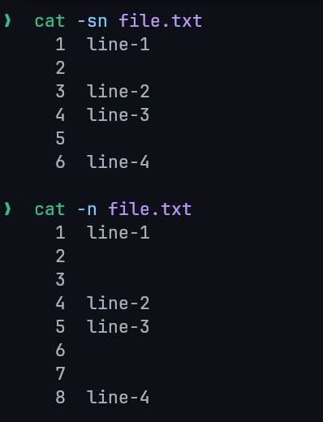
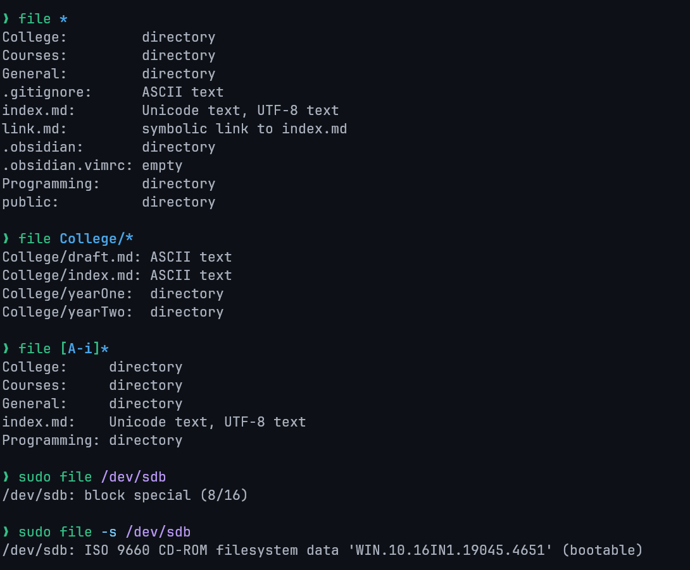

# Lecture 6: Linux Files

## 1. Core Concepts

The foundational principle of the Linux file system is that in the Linux system, everything is a file. If it is not a file, it is a process.

The term "file" in Linux has a broad scope. It encompasses not only standard data like text files, images, and compiled programs, but also system components such as disk partitions, hardware device drivers, and even directories.

Filenames in Linux are always case-sensitive. Consequently, `demo.txt` and `Demo.txt` are recognized as two distinct and separate files.

## 2. Linux File Types

Linux classifies files into several distinct types, each identified by a specific character in detailed directory listings.

`ls -l` prints the file type as the **first character** of the permission string.

**Example using `stat` command (simplified):**


| Identifier | Description                                                           |
| ---------- | --------------------------------------------------------------------- |
| `-`        | Regular: Contains programs, executable files, and text files.         |
| `d`        | Directory: Contains a list of other files and is shown in blue color. |
| `b`        | Block file                                                            |
| `c`        | Character device file                                                 |
| `p`        | Named pipe file (FIFO)                                                |
| `l`        | Symbolic link file                                                    |
| `s`        | Socket file                                                           |

> [!Note]
> The file types identified by `b`, `c`, `p`, `l`, and `s` are classified as Special files.
> The type of any given file can be determined using the `file` command.

## 3. File Management Commands

The following commands are essential for basic file management operations.

| Command  | Description                  |
| -------- | ---------------------------- |
| `file`   | Determines file type.        |
| `touch`  | Used to create a file.       |
| `rm`     | To remove a file.            |
| `cp`     | To copy a file.              |
| `mv`     | To rename or to move a file. |
| `rename` | To rename multiple files.    |

## 4. Copy & Move Commands

### `cp` Command

Copies files and directories.

- `cp <existing> <new>` (Same directory).
- `cp <file> <destination_path/>`
- `cp -r` : Copy a directory recursively.
- `cp *.txt <dest_dir>` : Copy multiple files using wildcard.
- `cp --backup` : Backup existing destination file.
- `cp -i` : Confirm before overwriting (interactive).
- `cp -p` : Preserve file properties.
- `cp -u -v` : Copy only when source is newer or dest is missing (verbose).

## 5. File Creation Methods

Linux offers multiple methods for creating new files, ranging from command-line utilities to full-featured text editors.

- Using the `cat` command
- Using the `touch` command
- Using the redirect `>` symbol
- Using the `echo` or `printf` commands
- Using text editors such as `vim`, `nano`, or `vi`

---

### 5.1 `touch` Command

The `touch` command serves two primary functions: creating a new, empty file or updating the access and modification timestamps of an existing file. It is particularly useful when you need to create a file placeholder before the data is ready to be stored.

```sh
# Create an empty file
touch new.txt
```

The key difference between `touch` and `cat` for file creation is that `touch` creates a blank, zero-byte file, whereas `cat` allows you to specify the file's content directly from the command prompt.

---

### 5.2 `cat` Command for Creation

The `cat` command can be combined with the `>` redirection operator to create a new file and immediately add content to it.

```sh
cat > test.txt
```

After executing the command, you can type the desired content directly into the terminal. To save the content and exit, press `CTRL + D`.

---

### 5.3 Redirect `>` Symbol

The redirection operator `>` can be used without a preceding command to create an empty file.

```bash
> test5.txt
```

It can be also used with a preceding command to redirect the output into the file.

```bash
# Redirect output of ls command into output.txt file overwriting its content.
ls -l > output.txt

# Redirect the output of the commands into new.txt appending into the end of the file.
pwd >> new.txt
which bash >> new.txt
```

It is important to distinguish between the two redirection operators:

- `>` **(overwrite):** Redirects output to a file. If the file exists, its contents are overwritten. If it does not exist, it is created.
- `>>` **(append):** Appends output to the end of a file. If the file does not exist, it is created.

### 5.4 `echo` and `printf` Commands

The `echo` and `printf` commands are used to create a file with content specified directly on the command line.

```bash
echo "File content" > test6.txt
```

---

### 5.5 Text Editors

Standard Linux text editors provide a more interactive way to create and edit files. Common editors include `vim`, `nano`, and `vi`.

To save and exit the `nano` editor, follow these steps:

1. Press `CTRL + X` to exit.
2. Press `y` to confirm that you want to save the changes.
3. Press `Enter` to save the file with the current name.

## 6. File Content Viewing and Manipulation

### 6.1 `cat` Command

Beyond file creation, the `cat` command is a versatile tool for viewing and manipulating file content.

```sh
# View single file: Displays the entire content of a single file to the terminal.
cat file.txt

# View multiple files: Displays the content of multiple files sequentially, one after the other.
cat file-1.txt file-2.txt file-3.txt

# Show line numbers
cat -n file.txt

# Copy contents: Redirects the content of one file into another, overwriting the destination file.
cat old.txt > new.txt

# Concatenate/Merge files: The `>>` operator appends the content of one or more files to a destination file.
cat file-1.txt file-2.txt >> file-3.txt

# Using wildcards -> merge all .txt files into all.txt
cat *.txt >> all.txt

# Highlight end of lines: displays a $ character at the end of each line, making trailing whitespace visible.
cat -e file.txt
```

- **Suppress Empty Lines:** The `-s` option suppresses multiple adjacent blank lines, replacing them with a single blank line.



> [!NOTE]
> You can use a wildcard (`*`) to select multiple files of the same type.
> For example, `cat *.txt >> filename.txt` will merge all `.txt` files in the current directory.

---

### 6.2 `tac` Command

The `tac` command (named as the reverse of `cat`) displays the contents of a file in reverse order, printing the last line first.

```bash
tac <file name>
```

## 7. File Deletion and Type Determination

### 7.1 `rm` Command Options

The `rm` (remove) command is used to delete files and directories.

| Option              | Description                                                                                                                     |
| ------------------- | ------------------------------------------------------------------------------------------------------------------------------- |
| `rm *extension`     | Deletes all files matching the given extension in the current directory.                                                        |
| `rm -r` / `rm -R`   | Recursively deletes a directory and all of its contents.                                                                        |
| `rm -i`             | Prompts for confirmation before deleting each file.                                                                             |
| `rm -rf`            | Forcefully deletes a directory and all of its contents without prompting, including write-protected files.                      |
| `-f`                | Force mode: ignores non-existent files and suppresses confirmation prompts. Does not recursively delete directories on its own. |
| `-v`                | Verbose mode: prints the names of files as they are deleted.                                                                    |
| `-d`                | Deletes an empty directory.                                                                                                     |
| `--one-file-system` | Deletes only files on the same file system as the specified directory, ignoring mounted filesystems.                            |

---

### 7.2 `file` Command Options

The `file` command determines a file's type.

- `-s`: Used for special files (e.g., block or character device files).
- `*`: Lists the types of all files in the current directory.
- `/directory_name/*`: Lists the types of all files within a specified directory.
- `[range]*`: Lists the types for all files whose names begin with a character within the specified range (e.g., `[a-c]*`).



## 8. Search Commands

### 8.1 `find` Command

Searches for files in the filesystem based on conditions.

- `find <location> <criteria> <term>`
- `.` : Current directory. `/` : Root directory.
- `find . -name "*.txt"` (Find by name).
- `find . -type f -name "*.bak"` (Find files by name and type `f`).
- `find . -type d -name ".git"` (Find directories by name and type `d`).
- `find . -newer msg.txt` (Find files newer than `msg.txt`).
- `find . -name Demo.txt -delete` (Find and delete **permanently**).

---

### 8.2 `locate` Command

Searches for files using a pre-built database (faster than `find`).

- `locate <file name>`
- Update database: `updatedb`
- `locate -n 5 "*.txt"` (Limit results).
- `locate -c Demo*` (Display The Number of Matching Entries).
- `locate -i` (Ignore case).
- `locate -e *demo.txt*` (Display only existing files, skips deleted files).
- `locate -S` (Show database stats).

---

### 8.3 `which` Command

Locates the path of an executable or command.

- `which <program_name>`
- `which -a <program_name>`: Print all matches in PATH, not just the first
- `which node cat ls`

## 9. Viewing Commands

### 9.1 `head` Command

Displays the first part (default: 10 lines) of a file.

- `head <file name>`
- `head file1.txt file2.txt` (Multiple files).
- `head -n <number> <file>` (Show specific number of lines).
- `head -c <number> <file>` (Show specific number of bytes).

---

---

### 9.2 `tail` Command

Displays the last part (default: 10 lines) of a file. Used to monitor logs. Can display multiple files.

- `tail <file name>`
- `ls -t /etc | tail -n 6` (Piped with other commands).

---

### 9.3 `more` Command

Displays file content one screen at a time (for large files). Cannot display binary files.

- `more <file name>` or `cmd | more`

- **Navigation**:
  - `Enter` (line down)
  - `Space` (next page)
  - `b` (back page)
  - `/` (search).

---

### 9.4 `less` Command

An advanced version of `more` with additional features (adjusts to window size, supports search).

- `less <file name>` or `cmd | less`

The `less` command have navigation keys similar to the `vim` editor.

- **Search**:
  - `/string` (forward searching)
  - `?string` (backward searching)
  - `n` (next match)
  - `N` (previous match).
