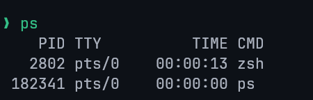
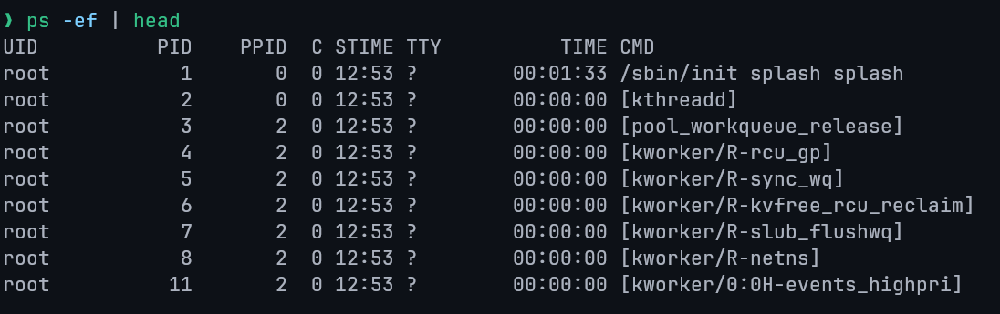
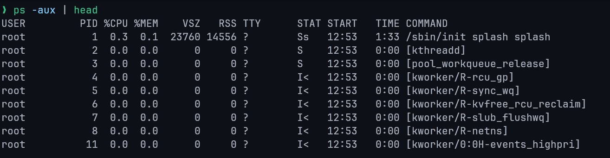
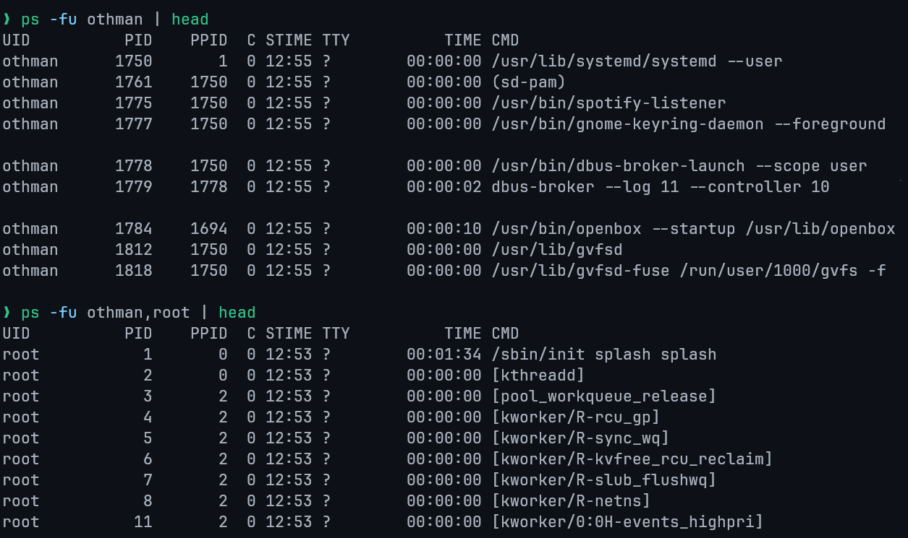
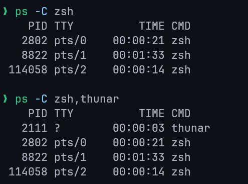
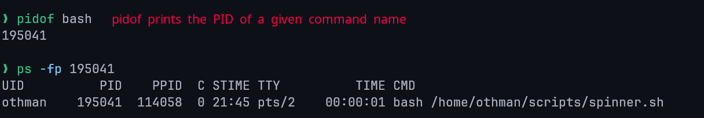
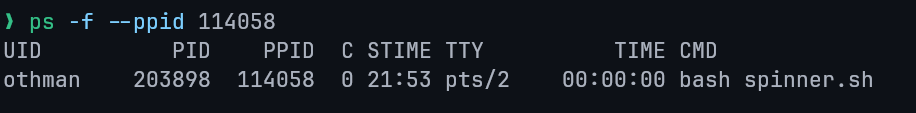

# Lecture 8: Process Management

## Core Definitions

- **Program**: Series of instructions telling the computer what to do.
- **Process**: A **program in execution**. A running instance of a program loaded into memory.
- **Process Management**: Tuning or controlling a process.
- **Job**: A process started from the shell.

## Process Types / States

### Based on Execution Mode

Processes in Linux can run in one of two modes, which determines their interaction with the user terminal.

#### Foreground Process

By default, all processes run in the foreground.
Runs on the terminal, receives input from keyboard (`stdin`) and sends output to screen (`stdout`).
Blocks the terminal until finished/killed.

#### Background Process

Runs independently without requiring keyboard input.
Allows other commands to run in the foreground simultaneously.
To run a command as a background process, append an ampersand (`&`) to the end of the command.

```bash
sleep 30 &
```

### Based on Relationships & Status

1.  **Parent process**  
    Any process that creates another process.
    Every process in Linux has a parent process, except for the very first process started by the kernel.
2.  **Child process**  
    A process created by another process (its parent).
    Each child process always has exactly one parent at any given time.
3.  **Orphan process**  
    An orphan process occurs when a parent process terminates **before** its child finishes execution.
    The orphan's PPID becomes the PID of `init` (PID 0) or `systemd` (PID 1).
4.  **Zombie process**  
    A process that has finished execution (dead) but still has an entry in the process table.
    Zombie processes consume no CPU and minimal memory, but they remain visible in process listings until reaped by their parent.
5.  **Daemon process**  
    A long-running background process that typically starts during system boot or on demand and does not interact directly with a terminal.
    Daemons are usually detached from any controlling TTY, their TTY field often appears as `?` in process listings.
    Examples include `sshd`, `cron`, and `systemd` services.

## Key Commands

### Job Control Commands

The following commands and keystrokes are used to manage jobs:

| Command / Keystroke | Description                                                            |
| ------------------- | ---------------------------------------------------------------------- |
| `jobs`              | Lists background jobs and their Process IDs.                           |
| `kill %N`           | Terminates the background job number N.                                |
| `kill PID`          | Terminates process with the given Process ID.                          |
| `fg %N`             | Brings background job N to the **foreground**.                         |
| `Ctrl+Z`            | Suspends the current foreground job.                                   |
| `bg`                | Resumes the most recently suspended job and runs it in the background. |
| `bg %N`             | Resumes the suspended job number N and runs it in the background.      |
| `Ctrl+C`            | Terminates the current foreground job.                                 |

### Monitoring & Listing Processes

There are two primary commands available in Linux to track running processes: `top` and `ps`.

#### The `top` Command

The `top` command provides a real-time, dynamic view of the processes running on the system.

- Navigate: Up/Down arrows.
- Kill: Highlight process, press `k`.
- Quit: Press `q`.

#### The `ps` Command

The `ps` (process status) command is used to view currently running processes.

**Basic Usage** Running `ps` without options shows the processes for the current user and terminal.



To display **all currently running processes in full format**, use `ps -ef`.



- `-e` : show all processes
- `-f` : full-format listing (UID, PID, PPID, CPU usage, start time, TTY, and command)

**Fields:**

- `UID`: The User ID of the process owner.
- `PID`: The unique Process ID.
- `PPID`: The Parent Process ID.
- `C`: The CPU utilization of the process.
- `STIME`: The time the process started.
- `TTY`: The terminal type where the command is running.
- `TIME`: The cumulative CPU time used by the process.
- `CMD`: The command that initiated the process.

Alternatively, a more detailed output can be obtained with `ps aux` (can be written as `ps -aux`)



- `a` : Shows information about all users
- `x` : Shows information about processes without terminals (e.g. system daemons)
- `u` : Displays the output in a **user-oriented** format, which includes columns like `%CPU` and `%MEM`.

`ps -u <username>` **(User-specific)**

The `-u` option filters the process list to show only processes belonging to a specific user.
Multiple usernames can be specified, separated by a comma.

```bash
ps -fu <username>
```



`ps -C <command>` **(By Command Name)**

The `-C` option selects processes by their command name.

```bash
ps -C <command>
```



`ps -p <PID>` **(By Process ID)**

The `-p` option allows you to query a process directly using its unique Process ID (PID).
This is useful for checking the status of a specific application or service when you already know its PID.



`ps --ppid <PPID>` **(By Parent Process ID)**

The `--ppid` option is used to list all child processes that share the same Parent Process ID.



## Terminating and Prioritizing Processes

### Terminating Processes

There are three primary methods for ending a process:

1. `CTRL+C`
   Sends an **interrupt** signal (SIGINT) to a process running in the foreground, typically exits the command.
2. `kill` Command
   Terminates or signals a process, first find its PID using the `ps` command.
   Then, use the `kill <PID>` command to terminate it.
   This sends a terminate signal (SIGTERM) by default.
3. `kill -9` Command
   If a process ignores the interrupt signal, you can force its termination using `kill -9 <PID>`.
   This sends a forceful kill signal (SIGKILL).

### Prioritizing Processes (Niceness)

In Linux, process priority can be influenced by its 'Niceness' value.

- **Niceness Value:** Determines process priority. Range: **-20 (highest) to 19 (lowest)**. Default is 0.
- **Set for new process**: `nice -n [value] [process name]`
- **Change for running process**: `renice [value] -p 'PID'`
