# Lecture 9: Linux Filters & Commands

## Filters

A Linux filter is a program that takes plain text as standard input, transforms it into a meaningful format, and returns the result as standard output.

**Key Characteristics:**

- **Input:** Accept data from standard input (`stdin`), which can be a file or the output from another program.
- **Output:** Produce output on standard output (`stdout`), which can be displayed on the screen or sent to another program/file.
- **Purpose:** Transform plain-text data.
- **Design Principle:** Filters are typically small, specialized programs, building blocks for more complex operations.

## Pipe

The pipe (`|`) is a mechanism that passes the output of one command as the input for another command.

The general syntax for using a pipe is as follows:

```bash
command1 | command2
```

This syntax sends the output generated by `command1` directly to `command2` as its input.

For example, the following command sends the output of the `ps` command to the `head` command:

```bash
ps | head -5
```

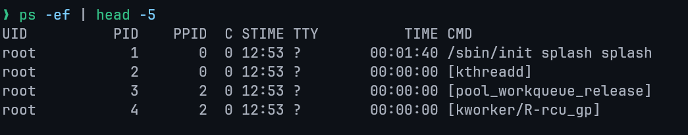

## Redirection

In Linux, standard devices are treated as files.
The keyboard is considered standard input (file descriptor 0), while the terminal screen is used for both standard output (1) and standard error (2).
Redirection allows you to change where input comes from and where output goes.

### Output Redirection

The greater-than symbol (`>`) is used to redirect output, sending the results of a command to a file instead of the terminal screen.

```
ls > list.txt
```

This example writes the output of the `ls` command into a file named `list.txt`.

### Input Redirection

The less-than symbol (`<`) is used to redirect input, telling a command to read from a file instead of the keyboard.

```
cat < file.txt
```

The `<` symbol redirects the content of `file.txt` to the standard input of the `cat` command.
`cat` then processes this input and writes it to its standard output (the terminal screen).

### Combined Example

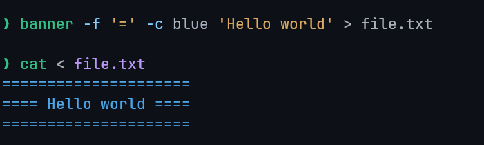

Here we redirected the output of the `banner` script to the file `file.txt`.
Then, we redirected the file `file.txt` to the input of the `cat` command, which prints it to the screen.

## Filter Commands

### `cat`

Concatenate files and display them on the standard output, line by line.

**Example:**

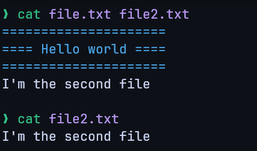

---

### `sort`

Sort lines of text files.
By default, it sorts lines alphabetically, but numerous options are available to modify the sorting mechanism.

**Examples:**

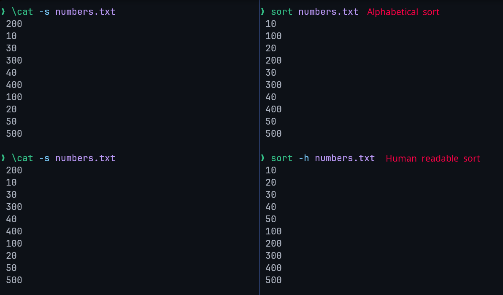

---

### `uniq`

The `uniq` command removes duplicate lines from a file's content. A critical limitation is that it can only remove _adjacent_ (continuous) duplicate lines.

**Example:**

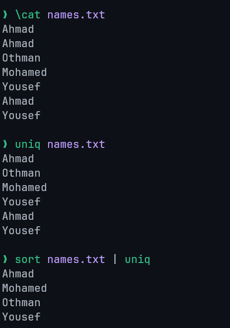

---

### `wc`

The `wc` (word count) command counts the number of lines, words, and characters in its input.

**Example:**

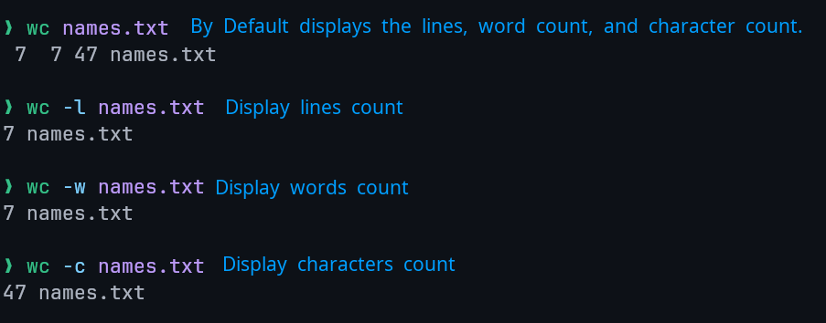

---

### `grep`

The `grep` (global regular expression print) command is used to search for a specific pattern within the content of a file.

**Example:**

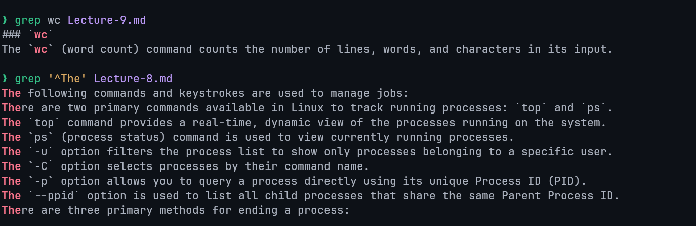

---

### `sed`

The `sed` (stream editor) command performs search and replace operations on data.

**Syntax:** `sed -e 's/search/replace/'` or `sed -e 's/search/replace/g'` for global replacement (all matches).

**Example:**

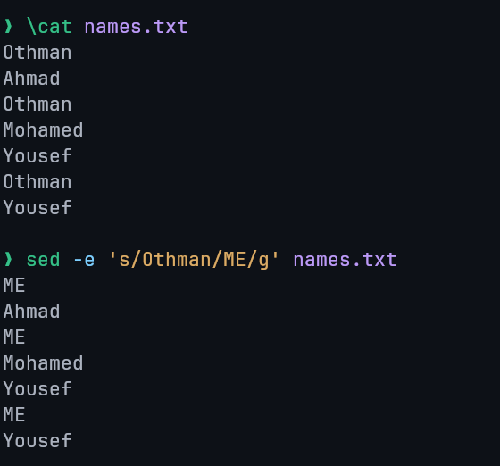

---

### `nl`

The `nl` command is used to add line numbers to text data. Similar output to `cat -n` command.

**Example:**

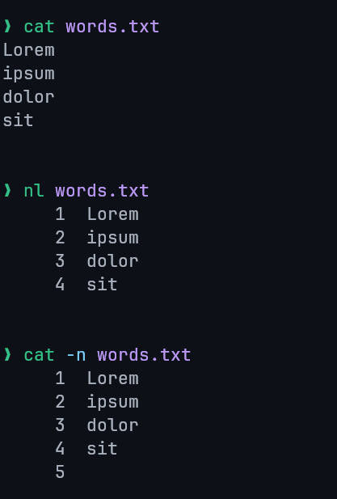

---

### `comm`

The `comm` command compares two sorted files line by line.

**Output Format:** The command produces a three-column output:

- **First column:** Contains lines unique to the first file.
- **Second column:** Contains lines unique to the second file.
- **Third column:** Contains lines that are common to both files.

**Example:**

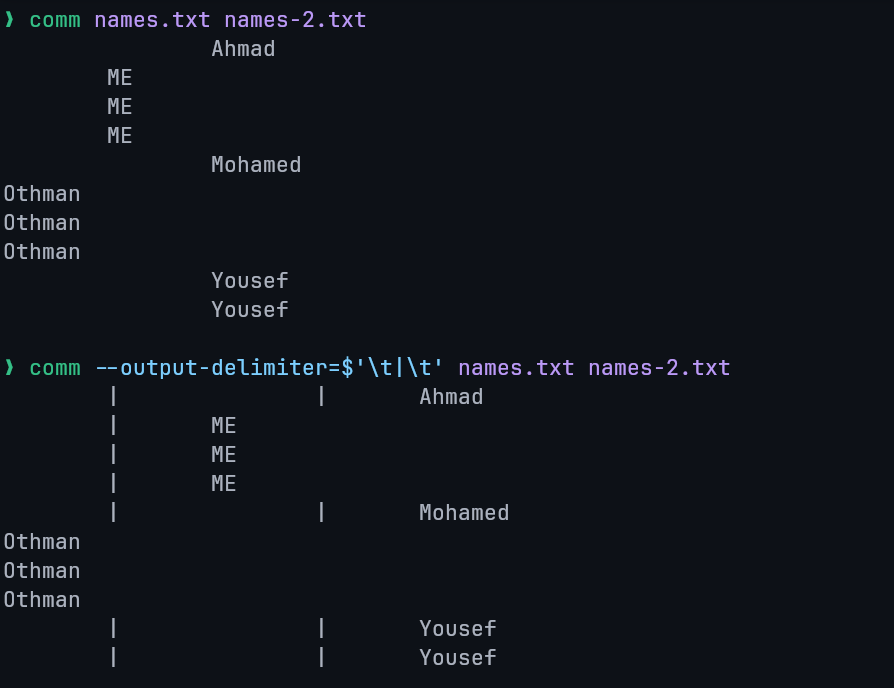

---

### `tee`

The `tee` command reads content from standard input and simultaneously writes that content to both standard output and one or more specified files.

**Example:**

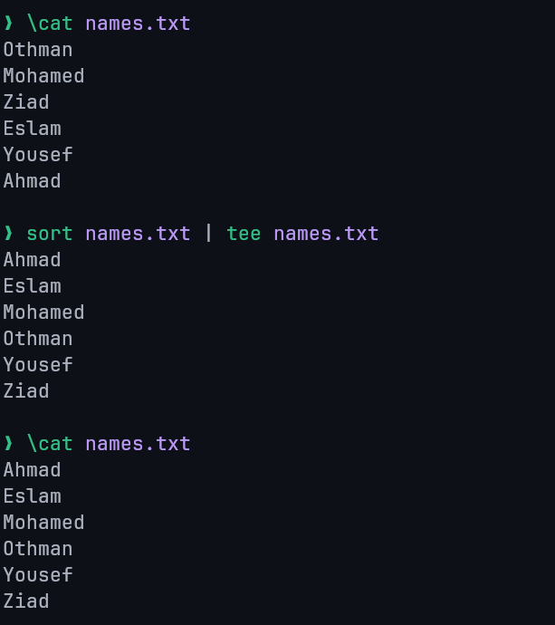

---

### `awk`

`awk` is a powerful scripting language used for advanced text processing. It is particularly useful for tasks where simpler tools like `sed` have limitations.

**Capabilities:** `awk` can be used for searching, replacing, sorting, validating, and indexing data.

**Examples:**

Searches for any line starting with "Mo", prints it and the words "is friend".

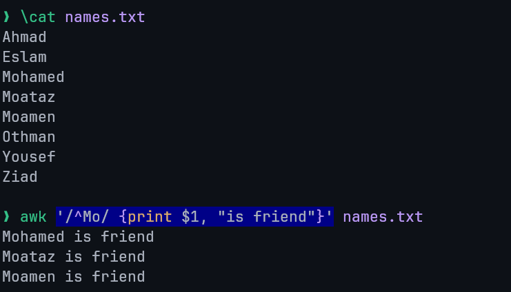

---

Prints the second field (separated with spaces by default) from each line.

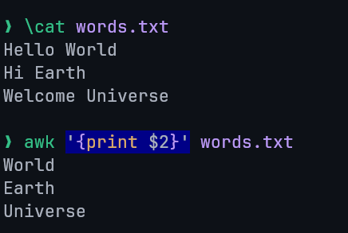

---

### `gzip` / `gunzip`

- **Purpose:** The `gzip` command is used to compress files, while the `gunzip` command is used to decompress them.
- **File Extension:** Files compressed with `gzip` are given a `.gz` extension.
- **Decompression:** Decompressing a file with `gunzip` removes the `.gz` extension.

**Examples**

**Compression:**

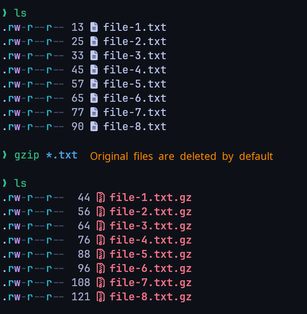

---

**Decompression:**

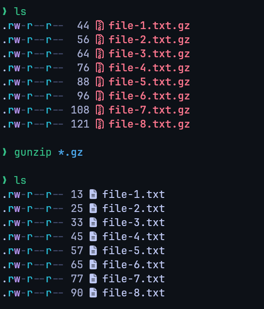
