# Ahmad Ali Ahmad Othman - Section 1
## Task 1 - Installing Linux on a virtual machine

## Step 1: Choose a distribution and download its the installation iso

For this task I will choose Ubuntu 24.04, I already downloaded the iso from the official website.

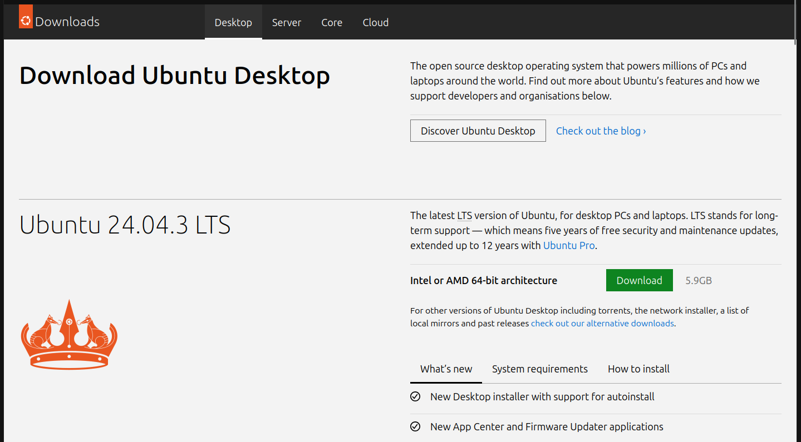

## Step 2: Create a virtual machine with Ubuntu

I will go with Oracle's VirtualBox for simplicity.

### Creating a new virtual machine

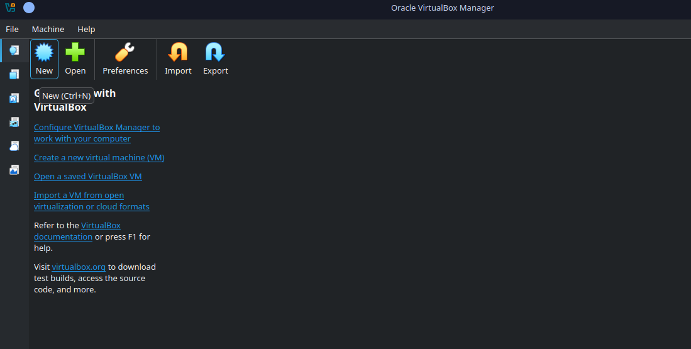

### Choose the ISO image file

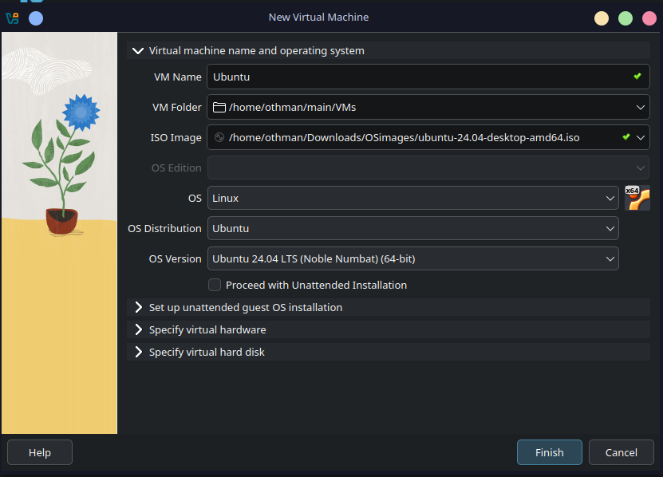

### Configure RAM and CPU cores

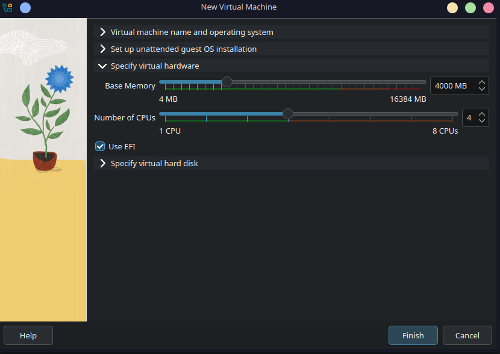

### Configure storage and virtual hard drives

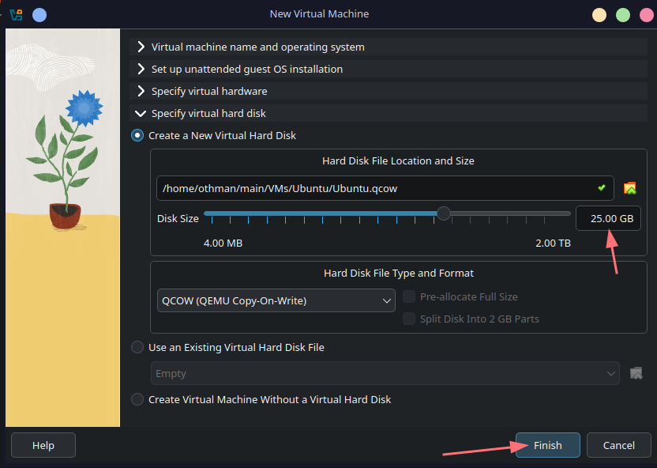

### Start the virtual machine and boot into Ubuntu

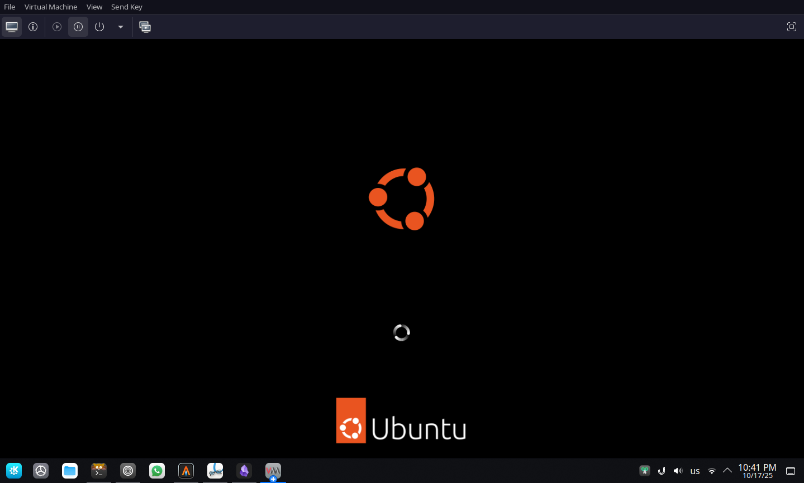

### Choose system language

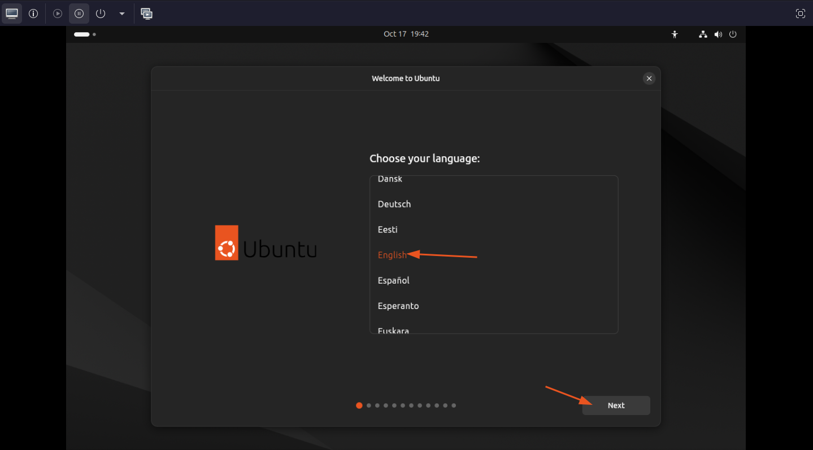

### Choose whether to erase the whole disk or partation manually

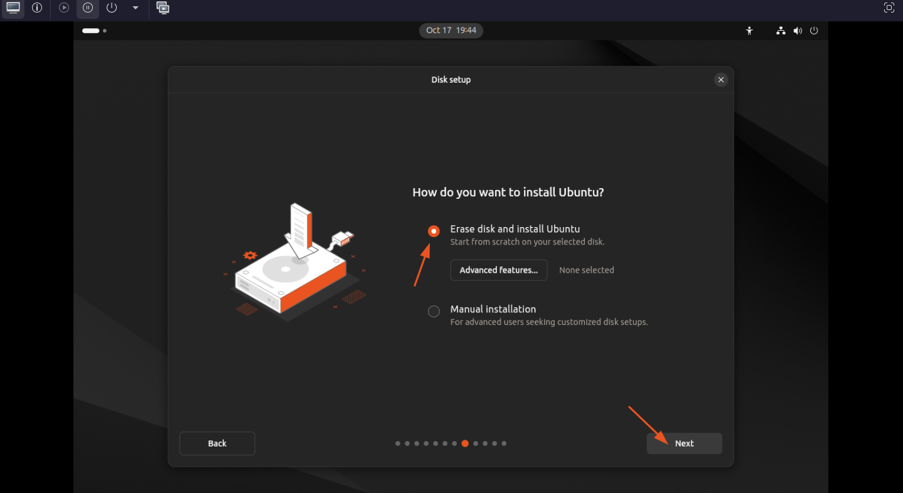

### Configure your username, hostname, and password

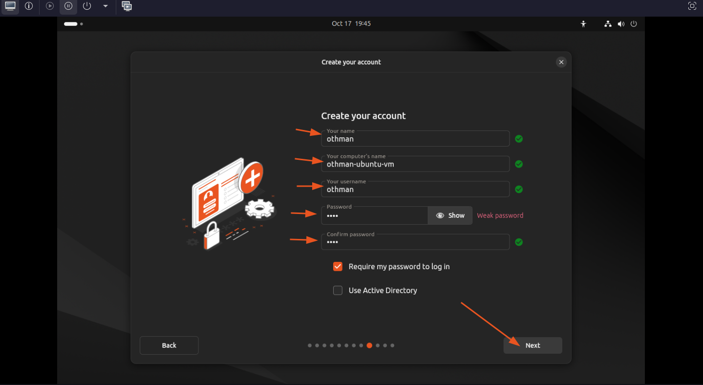

### Wait the installer to finish

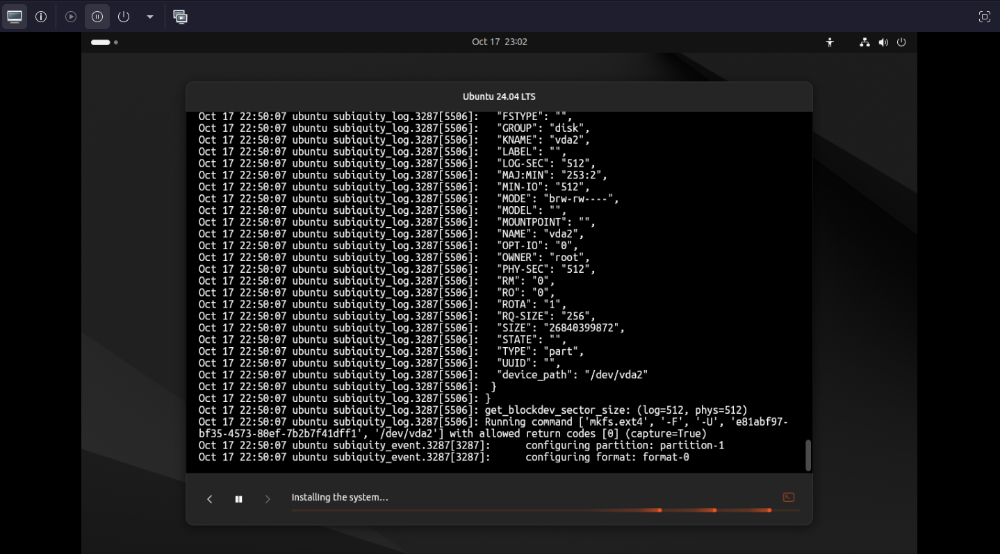

## Step 3: Reboot the system and open Ubuntu

Now we have Ubuntu up and running.

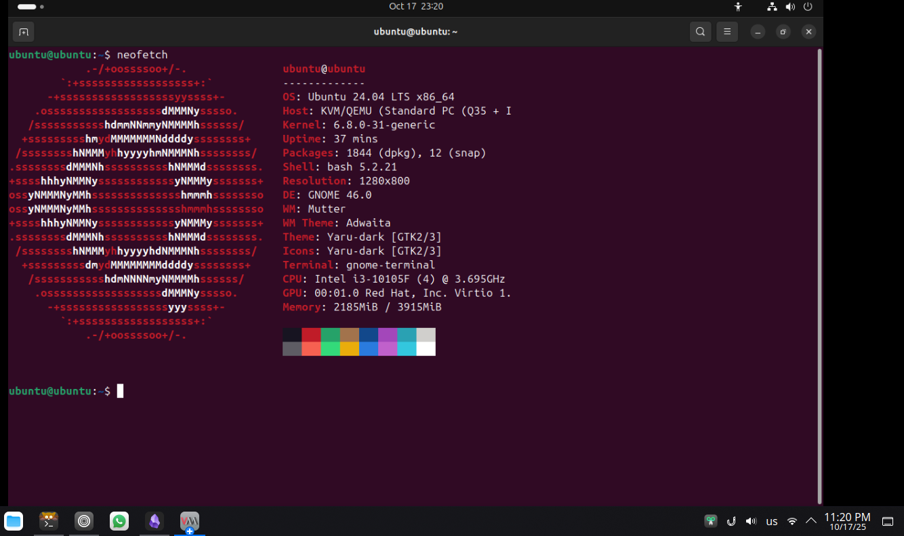