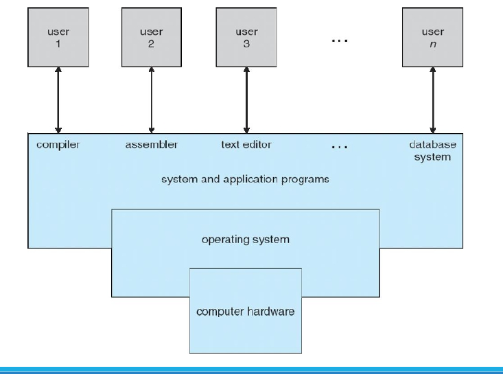
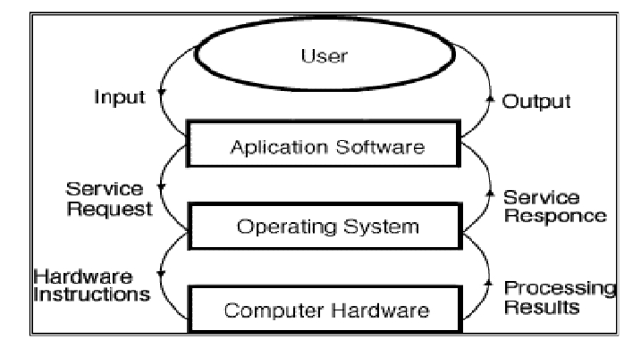

# Operating System Lecture 1-2: Introduction

https://youtube.com/playlist?list=PLqPgC1TA0L1moyG1SsYV2tilN6Cttf7My&si=ca6qnkqhU6IhR5Rc

## Reference

- Topics covered:
  - Introduction to Operating System
  - Process Management
  - CPU Scheduling
  - Deadlocks
  - Memory Management
  - I/O Systems
  - Protection and Security

## What is an Operating System?

- **Definition**: A program that acts as an intermediary between a computer user and the computer hardware.
- **Goals**:
  - Execute user programs to simplify problem-solving.
  - Make the computer system convenient to use.
  - Utilize computer hardware efficiently.
- **Kernel**: The core program running at all times on the computer.
- **Programs**:
  - **System programs**: Included with the operating system.
  - **Application programs**: All other programs.

## Computer System Structure

- **Hardware**: Provides basic computing resources (CPU, memory, I/O devices).
- **Operating System**: Manages resource usage to solve user computing problems (e.g., word processors, compilers, web browsers, databases, video games).
- **Users**: People, machines, or other computers interacting with the system.

## Services Provided by Operating Systems

1. **Program Execution**:
   - Loads programs into memory and runs them.
   - Supports normal or abnormal (error) termination.
2. **I/O Operations**:
   - Manages input/output for programs, as users cannot directly control I/O devices for efficiency and protection.
3. **File-System Manipulation**:
   - Enables programs to read, write, create, delete, and search files and directories.
   - Includes permissions management for access control.
4. **Communications**:
   - Facilitates information exchange between processes, either on the same computer (via shared memory) or across networked systems (via message passing).
   - **Shared Memory**: When two or more processes read and write to a shared section of memory.
   - **Message Passing**: When packets of information in predefined formats are moved between processes by the operating system.
5. **Error Detection**:
   - Continuously detects and corrects errors in:
     - CPU and memory hardware (e.g., memory errors, power failures).
     - I/O devices (e.g., disk parity errors, network failures, printer issues).
     - User programs (e.g., arithmetic overflow, illegal memory access, excessive CPU usage).
6. **Resource Allocation**:
   - Manages resources for multiple users or jobs, allocating CPU, memory, and I/O devices.
7. **Accounting**:
   - Tracks resource usage by users for monitoring and optimization.
8. **Protection and Security**:
   - Ensures controlled access to system resources.
   - Authenticates users and defends against invalid access attempts, including external I/O devices and network adapters.

## Historical Overview

### Mainframe Systems

- **Overview**: First computers for commercial and scientific applications.
- **Batch Systems**:
  - Large machines operated via consoles.
  - Input: Card readers, tape drives.
  - Output: Line printers, tape drives, card punches.
  - Users submitted jobs (punch cards) to operators, with no direct interaction.
  - OS was simple, transferring control between batched jobs with similar needs for efficiency.
- **Multiprogrammed Systems**:
  - Multiple jobs in memory, with CPU multiplexed among them.
  - OS switches to another job when one waits (e.g., for I/O).
- **Time-Sharing Systems**:
  - Extension of multiprogramming, with frequent CPU switching for user interaction.
  - Supports multiple users simultaneously via mouse/keyboard input.

### Personal Computer Systems

- Dedicated to a single user.
- I/O devices: Keyboards, mice, displays, small printers.
- Prioritizes user convenience and responsiveness.
- May not require advanced CPU utilization or protection features.

### Multiprocessor Systems (Parallel Systems)

- **Overview**: Multiple CPUs in close communication, sharing memory and clock.
- **Advantages**:
  - Increased throughput (more work in less time).
  - Cost-effective (shared peripherals, storage, power).
  - Improved reliability (system continues if one processor fails).
- **Types**:
  - **Symmetric Multiprocessing (SMP)**: Each processor runs an identical OS copy, supporting multiple processes without performance loss.
  - **Asymmetric Multiprocessing**: Master processor assigns tasks to slave processors, common in large systems.

### Distributed Systems

- Computation distributed across multiple processors with local memory.
- Loosely coupled, communicating via high-speed buses or networks.
- **Advantages**:
  - Resource sharing.
  - Computation speedup through load sharing.
  - Enhanced reliability.
  - Improved communication.

## Computer System Organization

- **Operation**:
  - CPUs and device controllers connect via a common bus to shared memory.
  - Concurrent execution of CPUs and devices, competing for memory cycles.
- **I/O Operations**:
  - CPU and I/O devices execute concurrently.
  - Device controllers manage specific devices with local buffers.
  - CPU moves data between main memory and controller buffers.
  - Controllers signal completion via interrupts.

## Interrupts

- **Function**: Transfer control to interrupt service routines via an interrupt vector.
- **Types**:
  - Hardware interrupts: Triggered by signals to the CPU.
  - Software interrupts: Triggered by system calls.
- **Process**: Saves the address of the interrupted instruction.

## Digital Data Representation

- **Bit**: Smallest data unit (1 or 0).
- **Byte**: 8 bits, used to measure file and program sizes.
- **Prefixes**:
  - Kilobyte (KB): $2^{10}$ bytes (1024 bytes).
  - Megabyte (MB): $2^{20}$ bytes (1024 KB).
  - Gigabyte (GB): $2^{30}$ bytes (1024 MB).
  - Terabyte (TB): $2^{40}$ bytes (1024 GB).
  - Petabyte (PB), Exabyte (EB), Zettabyte (ZB), Yottabyte (YB) follow similarly.

## Storage Hierarchy

- Organized by speed, cost, and volatility.
- **Caching**: Copies data to faster storage (e.g., main memory as a cache for secondary storage).
- **Device Drivers**: Provide a uniform interface between controllers and the OS kernel.

## Storage Structure

- **Main Memory**:
  - Only storage directly accessible by the CPU.
  - Random access, typically volatile.
- **Secondary Storage**:
  - Extends main memory with large, nonvolatile capacity.
  - **Hard Disks**: Magnetic platters divided into tracks and sectors.
  - **Solid-State Disks (SSDs)**: Faster, nonvolatile, increasingly popular.
- **Disk Controllers**: Manage logical interactions between devices and the computer.

## Caching

- Copies data from slower to faster storage temporarily.
- **Process**:
  - Check cache first; use data if present (fast).
  - If absent, copy data to cache for use.
- **Challenges**:
  - Cache size and replacement policy are critical design considerations.
  - Cache is smaller than the storage it caches.
