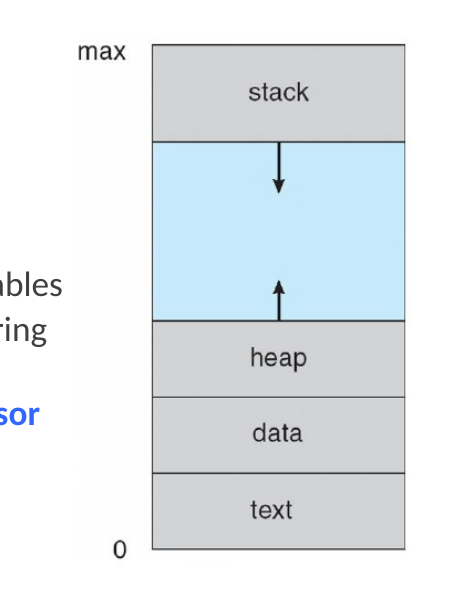
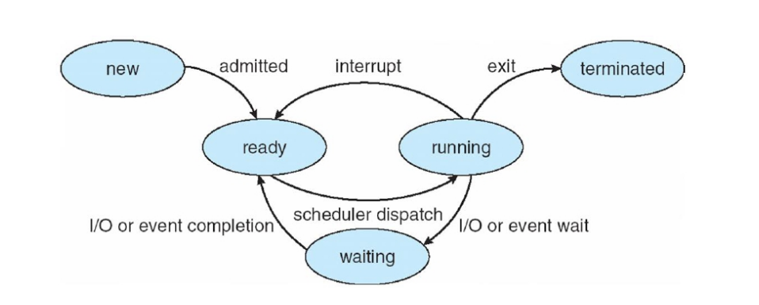
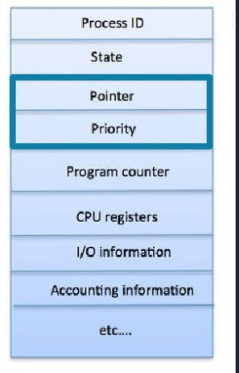
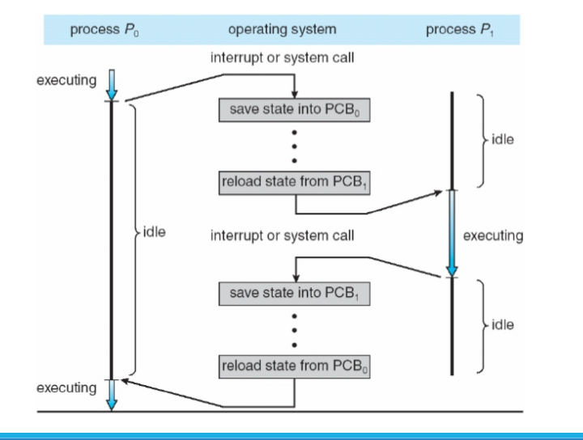
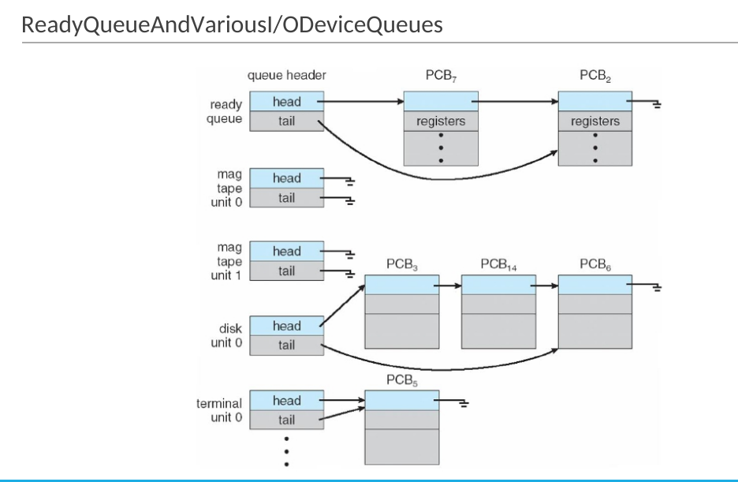
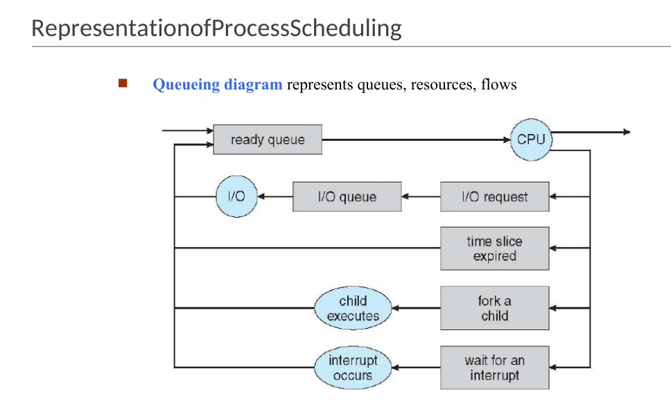
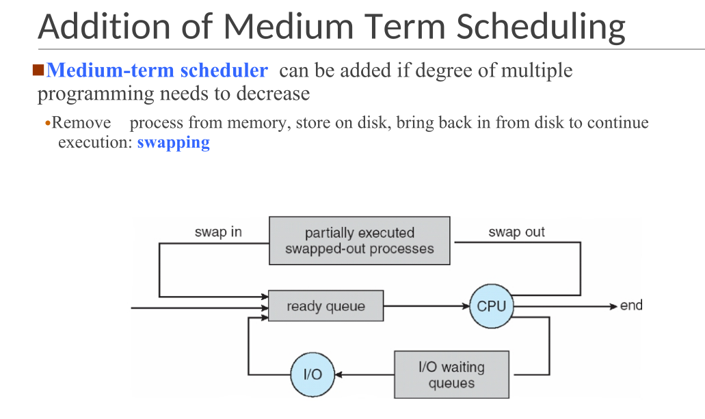
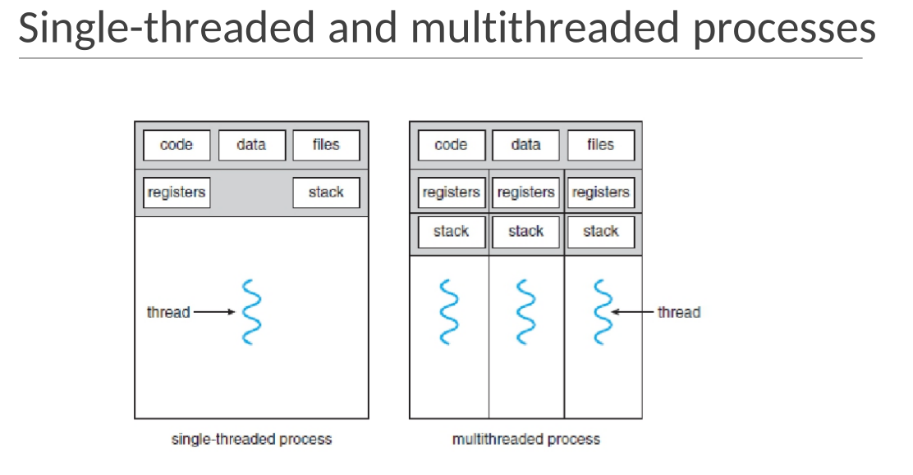
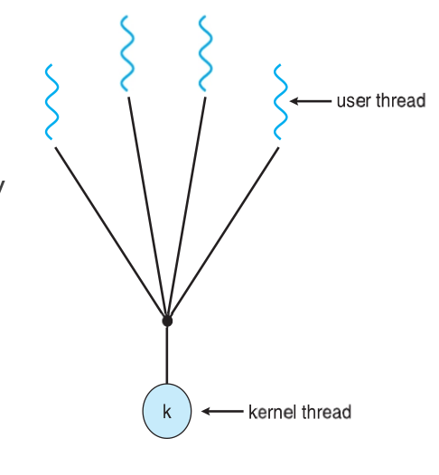
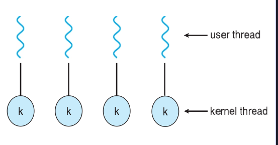

# Operating System Lecture 2: Processes and Threads

## What Is a Process?

**Definition:**  
A _process_ is a program in execution.

**Required Resources:**

- CPU time
- Memory
- Files
- I/O devices

These resources are allocated when the process is created or during execution.

---

## Types of Processes

- **Operating System processes** – execute system code.
- **User processes** – execute user code.

**Characteristics:**

- Processes can execute concurrently.
- CPU(s) are multiplexed among them for productivity.
- OS executes a variety of programs:
  - **Batch systems:** jobs
  - **Time-shared systems:** user programs or tasks

---

## Process Management

The operating system handles:

- Creation and deletion of user/system processes.
- Process scheduling.
- Synchronization, communication, and deadlock handling mechanisms.

---

## Process in Memory

A process consists of:

- **Text section** – program code.
- **Data section** – global variables.
- **Stack** – temporary data (function parameters, return addresses, local variables).
- **Heap** – dynamically allocated memory.
- **Current activity** – program counter and processor registers.

---

## Program vs Process

| Aspect   | Program                                                  | Process               |
| -------- | -------------------------------------------------------- | --------------------- |
| Nature   | Passive (on disk)                                        | Active (in execution) |
| State    | Stored executable file                                   | Executing instance    |
| Creation | Becomes process when loaded                              | Created via execution |
| Example  | Multiple users running same program = multiple processes |

Execution can start via GUI interaction or command line.

---

## Process States

As a process executes, it transitions through these states:

| State          | Description                      |
| -------------- | -------------------------------- |
| **New**        | Being created                    |
| **Running**    | Instructions are executing       |
| **Waiting**    | Waiting for an event (e.g., I/O) |
| **Ready**      | Waiting to be assigned to CPU    |
| **Terminated** | Finished execution               |

---

## Process Control Block (PCB)

A PCB (or Task Control Block) holds all process-related information:

- Process state
- Program counter (next instruction)
- CPU registers
- CPU scheduling info (priority, queue pointers)
- Memory management info (allocated memory)
- Accounting info (CPU usage, elapsed time)
- I/O status info (allocated devices, open files)

---

## Context Switch

When switching CPU execution from one process to another:

- The OS **saves** the state of the old process and **loads** the new one.
- The process state is represented in its PCB.
- **Context-switch time** is **overhead** — no useful work occurs during it.
- Dependent on hardware — systems with multiple register sets support faster switching.

---

## Process Scheduling

Goal: **Maximize CPU utilization** through efficient process switching.

**Queues:**

- **Job queue:** all processes in the system.
- **Ready queue:** processes in main memory, ready for execution.
- **Device queues:** processes waiting for I/O devices.

Processes migrate among these queues during execution.

---

## Schedulers

| Scheduler            | Frequency             | Role                                |
| -------------------- | --------------------- | ----------------------------------- |
| **Short-term (CPU)** | Frequent (ms)         | Selects next process for CPU        |
| **Long-term (Job)**  | Infrequent (s or min) | Controls degree of multiprogramming |

**Process types:**

- **I/O-bound:** spends more time in I/O, many short CPU bursts.
- **CPU-bound:** spends more time computing, few long CPU bursts.

### Medium-Term Scheduler

- Used to reduce multiprogramming degree.
- Performs **swapping**: temporarily removes processes from memory to disk.

---

## Threads

Initially, each process had a **single thread of execution**.  
To enable parallelism, a process may contain **multiple threads**, each with its own:

- Program counter
- Register set
- Stack

All threads share:

- Code section
- Data section
- OS resources (e.g., open files, signals)

---

## What Is a Thread?

A **thread** is the smallest unit of CPU execution.  
Each thread includes:

- Thread ID
- Program counter
- Register set
- Stack

Threads within a process share:

- Code
- Data
- OS resources

If multiple threads exist, the process can perform multiple tasks simultaneously.

---

## Examples

### Example 1: Word Processor

- One thread for UI and display.
- One for user input (keystrokes).
- One for background tasks (spelling/grammar check).

### Example 2: Web Server

- Each client request handled by a separate thread.
- Enables handling thousands of concurrent clients efficiently.
- Single-threaded servers can only handle one client at a time.

---

## Benefits of Multithreading

- **Responsiveness:** UI remains active even if part of the process is blocked.
- **Resource Sharing:** Threads share process resources easily.
- **Economy:** Creating threads is cheaper than creating processes.
- **Scalability:** Multiple threads can utilize multiprocessor systems efficiently.

---

## Multithreading Models

### 1. Many-to-One

- Many user threads mapped to one kernel thread.
- If one thread blocks, all block.
- No parallelism on multicore systems.
- **Examples:** Solaris Green Threads, GNU Portable Threads.

### 2. One-to-One

- Each user thread maps to one kernel thread.
- Higher concurrency than Many-to-One.
- Limited number of threads per process due to overhead.
- **Examples:** Windows, Linux, Solaris 9+.

### 3. Many-to-Many

- Multiple user threads mapped to multiple kernel threads.
- OS creates enough kernel threads to handle load.
- **Examples:** Solaris (pre-v9), Windows ThreadFiber package.

---

## Thread Cancellation

Terminating a thread before it finishes execution.

**Approaches:**

1. **Asynchronous cancellation:** terminates thread immediately.
   - Risk: may leave resources unreleased or shared data inconsistent.
2. **Deferred cancellation:** thread periodically checks for cancellation signals.

---

## Signal Handling

Used in UNIX systems to notify a process of an event.

**Mechanism:**

- Signal generated by an event.
- Delivered to a process.
- Handled by:
  - **Default handler** (provided by kernel)
  - **User-defined handler** (overrides default)

**Single-threaded:** signal delivered to process.  
**Multi-threaded:** delivery options include:

- To the specific thread concerned.
- To every thread in the process.
- To specific designated threads.
- To a single thread assigned to handle all signals.

---

## Difference Between Process and Thread

| Comparison Aspect       | Process                                         | Thread                                            |
| ----------------------- | ----------------------------------------------- | ------------------------------------------------- |
| Resource Usage          | Heavyweight, resource-intensive                 | Lightweight, less resource usage                  |
| Switching               | Requires OS intervention                        | Does not require OS intervention                  |
| Memory & File Resources | Each has its own memory and files               | Shares memory and open files                      |
| Blocking Behavior       | One blocked process halts its execution only    | Other threads can continue even if one is blocked |
| Resource Efficiency     | Uses more resources when multiple processes run | More efficient; uses fewer resources              |
| Independence            | Operates independently                          | Threads can access and modify each other's data   |
