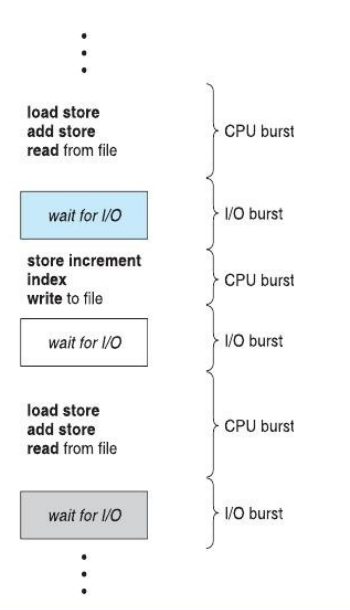

# Operating System Lecture 3: CPU Scheduling

## Introduction



- **CPU scheduling** is fundamental in multiprogrammed systems — it determines which process uses the CPU at any given time.
- A process execution cycle alternates between:
  - **CPU burst** – when the process uses the CPU.
  - **I/O burst** – when the process waits for I/O operations.
- The final CPU burst usually ends with a system call to terminate execution.

---

## CPU Scheduling Overview

- The **short-term scheduler** selects a process from the **ready queue** and allocates the CPU to it.
- Scheduling decisions occur when a process:
  1. Switches from **running → waiting**
  2. Switches from **running → ready**
  3. Switches from **waiting → ready**
  4. **Terminates**

- **Preemptive scheduling:** the scheduler can interrupt and switch processes.
- **Non-preemptive scheduling:** the CPU is released only voluntarily (termination or waiting).

---

## Preemption

- **Definition:** Temporarily removing a process from the CPU in favor of another (e.g., higher-priority or shorter job).
- Used to improve responsiveness and ensure fair CPU distribution.

---

## Non-Preemptive vs Preemptive Scheduling

| Aspect          | Preemptive Scheduling                             | Non-Preemptive Scheduling                      |
| --------------- | ------------------------------------------------- | ---------------------------------------------- |
| CPU Allocation  | CPU assigned for a limited time                   | CPU held until termination or waiting          |
| Interrupt       | Can interrupt a process anytime                   | Process runs until it voluntarily releases CPU |
| Overhead        | Context switching overhead exists                 | No overhead of switching mid-execution         |
| Starvation      | Possible if high-priority tasks frequently arrive | Possible if long jobs block short ones         |
| Flexibility     | Flexible; can prioritize urgent processes         | Rigid; cannot interrupt current task           |
| Cost            | Higher (due to switching)                         | Lower                                          |
| CPU Utilization | Higher                                            | Lower                                          |
| Waiting Time    | Lower                                             | Higher                                         |
| Response Time   | Faster                                            | Slower                                         |
| Examples        | Round Robin, Shortest Remaining Time First        | FCFS, Shortest Job First                       |

---

## Dispatcher

- The **dispatcher** transfers control of the CPU to the chosen process.  
  Steps:
  1. Context switch
  2. Switch to user mode
  3. Jump to the user program's next instruction
- **Dispatch latency:** the time required to stop one process and start another.

---

## Scheduling Criteria

| Metric              | Description                                       |
| ------------------- | ------------------------------------------------- |
| **CPU Utilization** | Keep CPU as busy as possible                      |
| **Throughput**      | Number of processes completed per time unit       |
| **Turnaround Time** | Total time from submission to completion          |
| **Waiting Time**    | Time spent waiting in the ready queue             |
| **Response Time**   | Time from request submission until first response |

### Optimization Goals

- Maximize:
  - CPU Utilization
  - Throughput
- Minimize:
  - Turnaround Time
  - Waiting Time
  - Response Time

---

## Scheduling Formulas

- **Turnaround Time** = Completion Time − Arrival Time
- **Waiting Time** = Turnaround Time − Burst Time
- **Throughput** = Total Processes ÷ Total Completion Time

---

## Scheduling Algorithms

1. **First-Come, First-Served (FCFS)**
2. **Shortest Job First (SJF)**
3. **Priority Scheduling**
4. **Round Robin (RR)**
5. **Multilevel Queue Scheduling**
6. **Multilevel Feedback Queue Scheduling**

---

## First-Come, First-Served (FCFS) Scheduling

- Processes are served in the order they arrive.
- Implemented with a **FIFO queue**:
  - Process Control Block (PCB) added to queue tail upon arrival.
  - When CPU is free, process at the head gets executed.

### Example 1

| Process | Burst Time |
| ------- | ---------- |
| P1      | 24         |
| P2      | 3          |
| P3      | 3          |

**Order:** P1 → P2 → P3  
**Gantt Chart:**

```
| P1 |------------------------| P2 |---| P3 |---|
0    24                       27   30
```

**Waiting Times:**  
P1 = 0, P2 = 24, P3 = 27  
**Average Waiting Time:** (0 + 24 + 27) / 3 = **17**

---

### Example 2

**Order:** P2 → P3 → P1  
**Gantt Chart:**

```

| P2 |---| P3 |---| P1 |------------------------|
0     3   6                            30

```

**Waiting Times:**  
P1 = 6, P2 = 0, P3 = 3  
**Average Waiting Time:** (6 + 0 + 3) / 3 = **3**

**Observation:**

- FCFS suffers from the **convoy effect**, where short processes wait behind long ones.
- Leads to low CPU and device utilization in time-sharing systems.

---

## FCFS Example Exercise

| Process | Arrival | Priority | Burst |
| ------- | ------- | -------- | ----- |
| P1      | 0       | 20       | 10    |
| P2      | 2       | 10       | 1     |
| P3      | 4       | 58       | 2     |
| P4      | 8       | 40       | 4     |
| P5      | 12      | 30       | 3     |

**Gantt Chart:**

```

| P1 |----------| P2 |-| P3 |--| P4 |----| P5 |---|
0    10         11   13  17   20

```

### Turnaround Time

| Process | End Time | Arrival | Turnaround |
| ------- | -------- | ------- | ---------- |
| P1      | 10       | 0       | 10         |
| P2      | 11       | 2       | 9          |
| P3      | 13       | 4       | 9          |
| P4      | 17       | 8       | 9          |
| P5      | 20       | 12      | 8          |

**Average Turnaround Time = 45 / 5 = 9**

### Waiting Time

| Process | Turnaround | Burst | Waiting |
| ------- | ---------- | ----- | ------- |
| P1      | 10         | 10    | 0       |
| P2      | 9          | 1     | 8       |
| P3      | 9          | 2     | 7       |
| P4      | 9          | 4     | 5       |
| P5      | 8          | 3     | 5       |

**Average Waiting Time = 25 / 5 = 5**

### Throughput

Total time = 20  
Processes = 5  
**Throughput = 5 / 20 = 0.25 processes/unit time**

---

## Summary of FCFS

| Pros                         | Cons                                       |
| ---------------------------- | ------------------------------------------ |
| Simple and easy to implement | High average waiting time                  |
| Suitable for batch systems   | Poor performance for varied burst times    |
| Fair (no starvation)         | Not suitable for time-sharing environments |
