# HTML Forms

The HTML `<form>` element creates a form for user input and acts as a container for input elements like text fields, checkboxes, radio buttons, and submit buttons. The `<input>` element is the most common form element.

---

## HTML Input Types

The `<input>` element allows users to enter data.  
Its appearance and behavior depend on the `type` attribute.

---

## Input Type: `text`

Used for short, single-line text input (like names or usernames).

```html
<label for="username">Username:</label>
<input type="text" id="username" name="username" />
```


---

## Input Type: `radio`

Lets users choose **one option** from a group.
Multiple radio inputs share the same `name` value.

```html
<form>
  <label><input type="radio" name="gender" value="male" /> Male</label>
  <label><input type="radio" name="gender" value="female" /> Female</label>
</form>
```


---

## Input Type: `checkbox`

Allows users to select **multiple options** independently.

```html
<form>
  <label><input type="checkbox" name="interest" value="coding" /> Coding</label>
  <label><input type="checkbox" name="interest" value="music" /> Music</label>
  <label><input type="checkbox" name="interest" value="sports" /> Sports</label>
</form>
```


---

## Input Type: `checked`

The `checked` attribute sets the default selected state for
`radio` or `checkbox` inputs.

```html
<input type="radio" name="color" value="blue" checked /> Blue
<input type="radio" name="color" value="red" /> Red
```


---

## Input Type: `submit`

Creates a button that sends the form data to the server.

```html
<form action="/submit" method="post">
  <input type="text" name="username" placeholder="Enter username" />
  <input type="submit" value="Submit" />
</form>
```

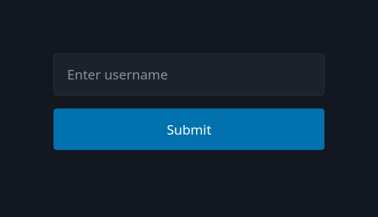

---

## Input Type: `button`

Defines a generic button that performs no default action
unless controlled by JavaScript.

```html
<input type="button" onclick="alert('Button clicked!')" value="Click Me!" />
```


---

## Combining Multiple Inputs

Forms often use different input types together for richer interactivity.

```html
<form>
  <label>Name: <input type="text" /></label><br />
  <label><input type="radio" name="plan" /> Free Plan</label>
  <label><input type="radio" name="plan" /> Premium Plan</label><br />
  <label><input type="checkbox" /> Subscribe to newsletter</label><br />
  <input type="submit" value="Sign Up" />
</form>
```


---

## Common Input Attributes

Input attributes define how an input behaves, its default value,  
and how it interacts with forms and users.

---

## The `value` Attribute

Specifies the default text or value pre-filled in an input.

```html
<input type="text" value="John Doe" />
```

- This text appears when the page loads.
- The value is sent when the form is submitted.


---

## The `name` Attribute

Defines a key under which the input's value is sent in a form submission.

```html
<form>
  <input type="text" name="username" value="ahmad" />
  <input type="submit" />
</form>
```

- Essential for server-side processing.
- Without `name`, the input data won't be included in the request.

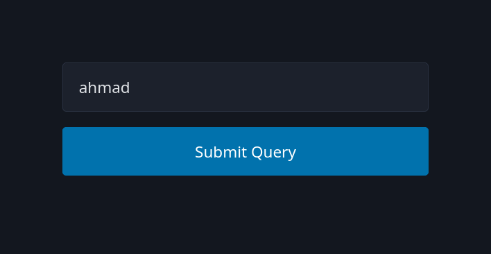

---

## The `required` Attribute

Makes an input field mandatory before submission.

```html
<form>
  <label>Email:</label>
  <input type="email" required />
  <input type="submit" />
</form>
```

- The browser prevents form submission if the field is empty.
- Provides basic form validation without JavaScript.

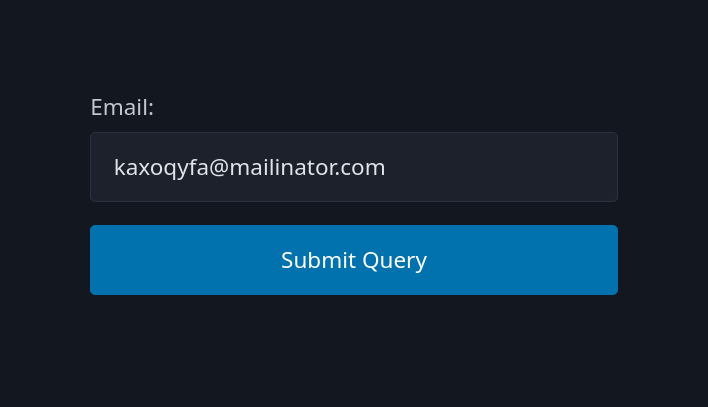

---

## The `placeholder` Attribute

Displays hint text inside the input field until the user types something.

```html
<input type="text" placeholder="Enter your name" />
```

- Placeholder text disappears once the user starts typing.
- It should **not** replace the label for accessibility reasons.


---

## Input Type: `password`

Used to enter hidden or sensitive data like passwords.

```html
<form>
  <label>Password:</label>
  <input type="password" name="password" required />
</form>
```

- Characters are visually masked for privacy.
- The value is still accessible to the browser and submitted normally.

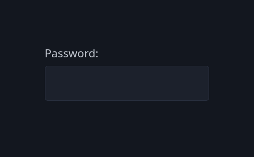

---

## Combining Attributes

Most attributes can be combined to enhance usability.

```html
<input
  type="password"
  name="pass"
  placeholder="Enter your password"
  required
  value=""
/>
```

- Always use attributes intentionally to improve UX and validation.
- Avoid unnecessary defaults or hidden states.

---

## Input Type: `hidden`

Used to store data that users don't see or edit.  
Commonly used for IDs, tokens, or metadata in forms.

```html
<form action="/profile">
  <input type="hidden" name="user_id" value="42" />
  <input type="submit" value="View Profile" />
</form>
```

- Hidden inputs are not visible but included in the form submission.

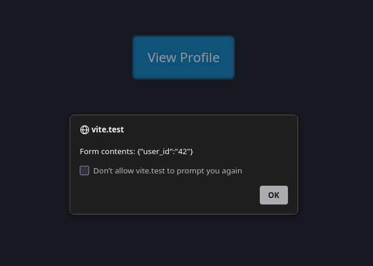

---

## Input Type: `color`

Provides a color picker for selecting colors.

```html
<label>Choose a color:</label>
<input type="color" name="themeColor" value="#1e90ff" />
```

- Returns a hex color code like `#1e90ff`.
- Supported by most modern browsers.

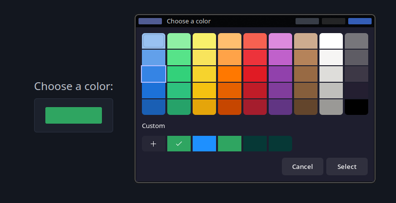

---

## Input Type: `reset`

Resets all inputs in a form to their initial values.

```html
<form>
  <input type="text" name="username" value="John" />
  <input type="color" value="#ff0000" />
  <input type="reset" value="Reset Form" />
</form>
```

- It doesn't clear the form completely; it restores defaults.
- Often used alongside a submit button.

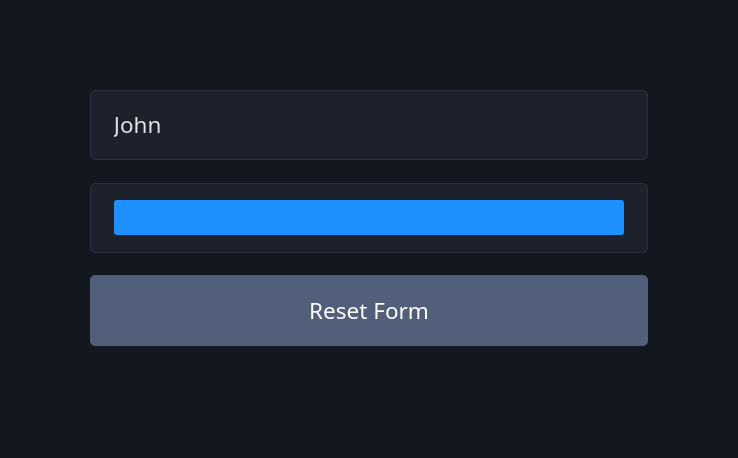

---

## Input Type: `range`

Creates a slider control for numeric values within a defined range.

```html
<label>Volume:</label>  <input type="range" min="0" max="100" value="50" /> 
```

- Uses `min`, `max`, and `value` attributes.
- Can be styled for better UX.
- Ideal for settings like brightness or volume.

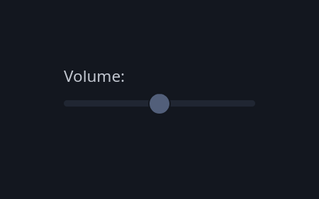

---

## The `min` and `max` Attributes

Define numeric or date limits for applicable input types.

```html
<label>Age:</label> <input type="number" name="age" min="18" max="60" />
```

- Prevents invalid values outside the range.
- Works with `number`, `range`, `date`, and similar types.

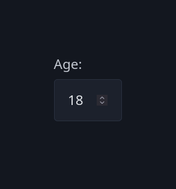

---

## The `step` Attribute

Specifies the increment between allowed values.

```html
<label>Rating:</label>
<input type="number" name="rating" min="0" max="10" step="0.5" />
```

- Determines how much the value increases or decreases with each step.
- Works well for sliders and numeric fields.

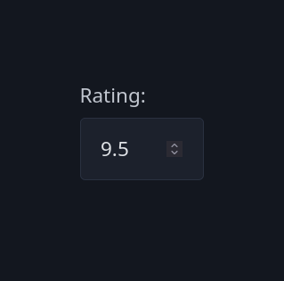

---

## Input Type: `number`

Used for numeric input.
Includes built-in validation and increment controls.

```html
<label>Quantity:</label>
<input type="number" name="qty" min="1" max="100" value="10" />
```

- Prevents non-numeric input.
- Can use `min`, `max`, and `step` for fine control.

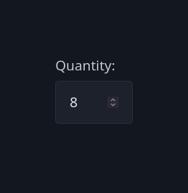

---

## The `readonly` Attribute

Makes an input uneditable but still selectable and submittable.

```html
<input type="text" value="Static text" readonly />
```

- The value can’t be changed by the user.
- Still included in form submission data.

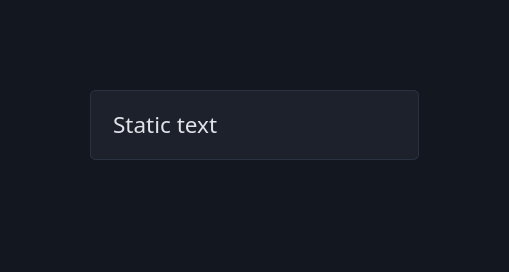

---

## The `disabled` Attribute

Disables an input completely — it’s not editable, focusable, or submitted.

```html
<input type="text" value="Disabled field" disabled />
```

- Typically used for unavailable or system-managed fields.
- Visually appears grayed out.

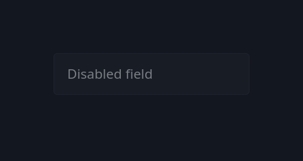

---

## The `autofocus` Attribute

Automatically focuses an input when the page loads.

```html
<input type="text" name="search" placeholder="Search..." autofocus />
<input type="text" name="something" placeholder="I'm not in focus" />
```

- Improves usability in forms with a primary field.
- Only one element per page should have it.

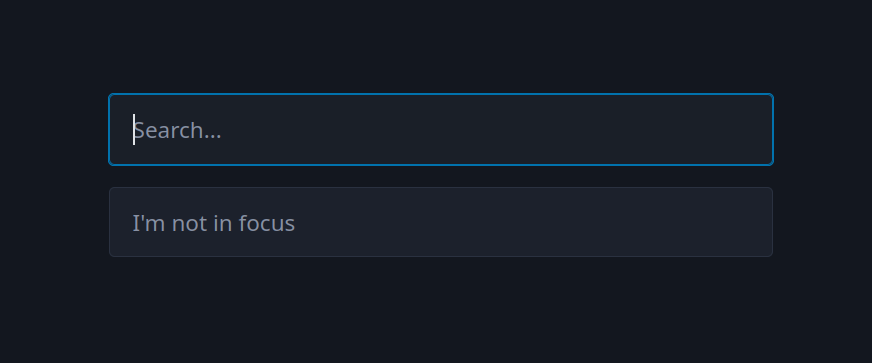

---

## The `minlength` and `maxlength` Attributes

Control the minimum and maximum number of characters for text inputs.

```html
<label>Password:</label>
<input type="password" name="password" minlength="4" maxlength="12" required />
```

- Helps enforce consistent input length.
- Works with `text`, `password`, `email`, and similar types.

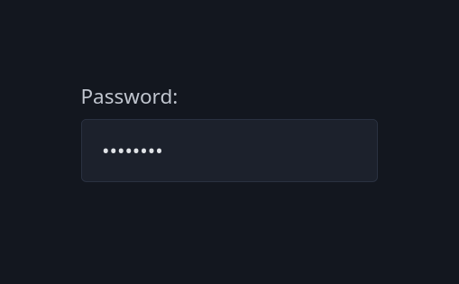

---

## Input Type: `file`

Allows users to upload files from their device.

```html
<label>Upload profile picture:</label> <input type="file" name="avatar" />
```

- Can use the `accept` attribute to limit file types.
- Multiple file uploads are possible using `multiple`.

```html
<input type="file" name="photos" accept="image/*" multiple />
```


---

## Input Type: `search`

Optimized for entering search queries.

```html
<input type="search" name="query" placeholder="Search..." />
```

- Behaves like a text input but may include a clear button.
- Semantically indicates a search field to browsers and screen readers.


---

## Input Type: `url`

Used for entering web addresses.

```html
<label>Website:</label>
<input type="url" name="homepage" placeholder="https://example.com" required />
```

- Provides built-in validation for valid URL patterns.
- Often used in contact or profile forms.

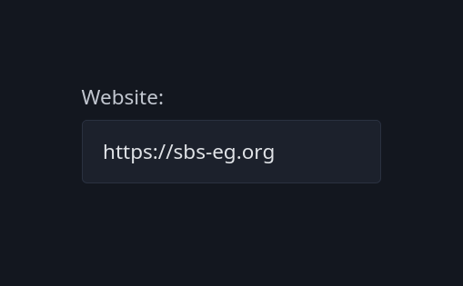

---

## Input Type: `date`

Lets users pick a date from a calendar widget.

```html
<label>Choose a date:</label>
<input type="date" name="appointment" min="2025-01-01" max="2025-12-31" />
```

- Returns value in the format `YYYY-DD-MM` (Based on user locale).
- Browser-native UI ensures consistency and accessibility.


---

## Input Type: `month`

Allows selection of a specific month and year.

```html
<label>Billing month:</label>
<input type="month" name="billing" value="2025-11" />
```

- Returns values like `2025-11`.
- Useful for billing cycles, reports, and schedules.

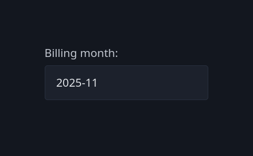

---

## Combining Date and Month Inputs

They can work together for more precise data entry.

```html
<form>
  <label>Start Date:</label>
  <input type="date" name="start" />
  <label>End Month:</label>
  <input type="month" name="end" />
</form>
```

- `date` is more general; `month` is suitable for period selection.

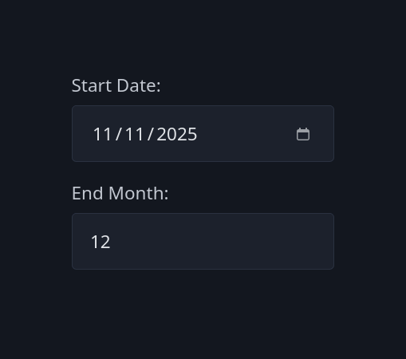

---

## Input Type: `time`

Used for selecting a time of day (hours and minutes).

```html
<label>Meeting time:</label> <input type="time" name="meeting" value="09:30" />
```

- Returns value in `HH:MM` format.
- Can use `min`, `max`, and `step` to control valid times.


---

## The `<select>` Element

Creates a dropdown menu for selecting one or more options.

```html
<select id="city" name="city">
  <option value="cairo">Cairo</option>
  <option value="giza">Giza</option>
  <option value="alexandria">Alexandria</option>
</select>
```

- Displays only one value but offers multiple choices.
- Works best for predefined, limited sets of options.

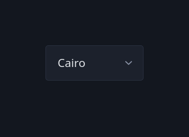

---

## The `<option>` Element

Defines the available choices inside a `<select>` element.

```html
<select name="fruit">
  <option value="apple">Apple</option>
  <option value="banana">Banana</option>
  <option value="mango">Mango</option>
</select>
```

- The `value` attribute is sent when the form is submitted.
- The text between `<option>` tags is what users see.

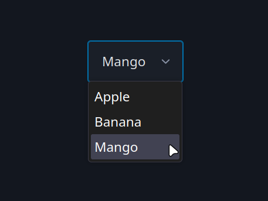

---

## The `label` for `<select>`

Associates a label with a dropdown menu for better accessibility.

```html
<label for="course">Select Course:</label>
<select id="course" name="course">
  <option value="html">HTML</option>
  <option value="css">CSS</option>
  <option value="js">JavaScript</option>
</select>
```

- The `for` attribute links the label to the `select` element by ID.
- Clicking the label focuses the dropdown.

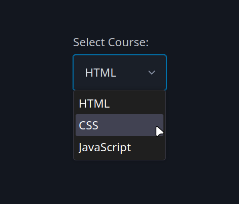

---

## The `selected` Attribute

Specifies which `<option>` is pre-selected by default.

```html
<select name="language">
  <option value="html">HTML</option>
  <option value="css">CSS</option>
  <option value="js" selected>JavaScript</option>
</select>
```

- Only one option can be selected unless `multiple` is used.
- Improves user experience by setting a default choice.


---

## The `<textarea>` Element

Allows multi-line text input for messages, comments, or descriptions.

```html
<label for="message">Message:</label>
<textarea id="message" name="message"></textarea>
```

- Unlike `<input>`, it doesn’t use a `type` attribute.
- Text entered appears as plain text between the tags.

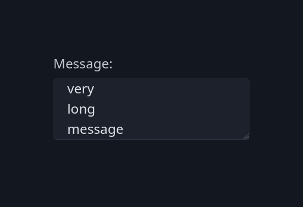

---

## `cols` and `rows` Attributes

Define the visible width and height of a `<textarea>`.

```html
<textarea
  name="feedback"
  rows="4"
  cols="40"
  placeholder="Enter feedback..."
></textarea>
```

- `rows` = number of visible text lines.
- `cols` = width in character units (approximate).
- The size can also be styled with CSS.


---

## Tasks

Let's apply what we have learned.

---

### Task 1:

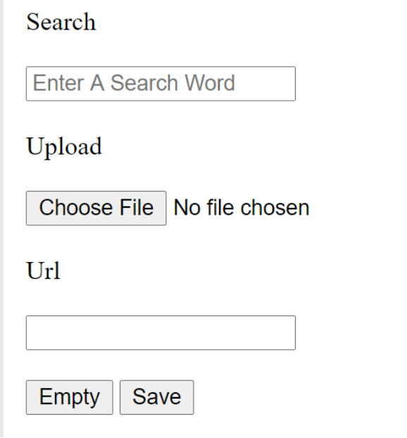

---

**Task 3**:

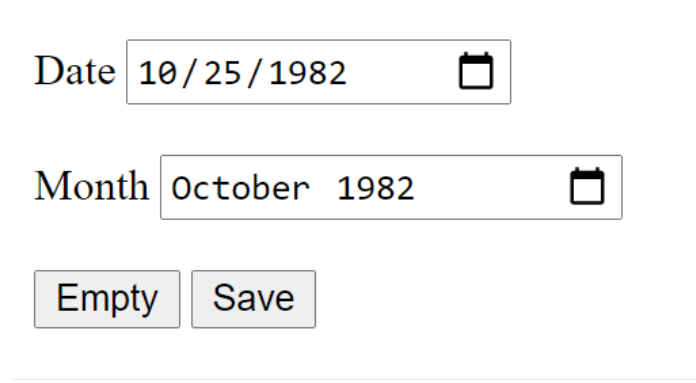

---

**Task 2**:

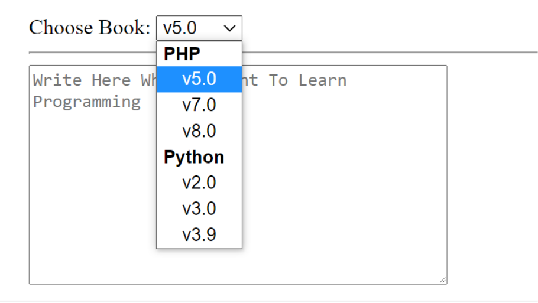
