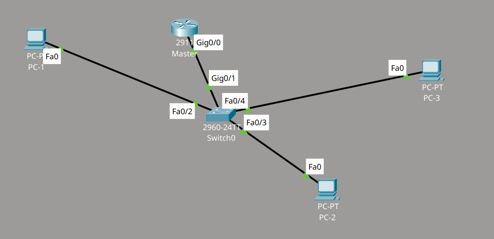
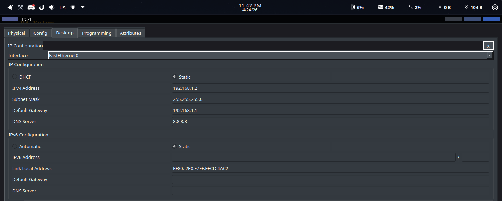
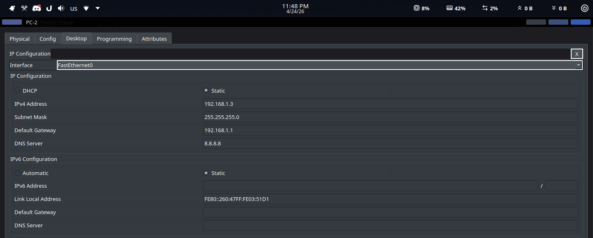
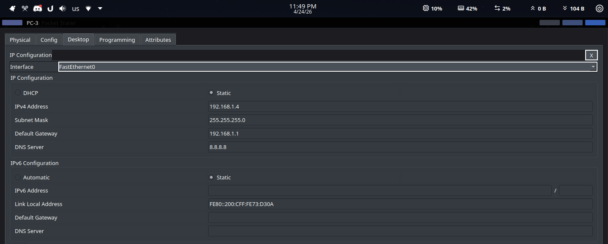

| Data    | Details                  |
| :------ | :----------------------- |
| Name    | ‎أحمد علي أحمد علي عثمان |
| Code    | 20240592                 |
| Section | 1                        |

# CCNA - Assignment 1

## Question 1

**You are assigned the IP address `172.16.0.0` with a subnet mask of `255.255.0.0`.**

### A. What is the CIDR notation for this subnet mask?

`/16`

### B. Identify the Network portion and the Host portion of this address.

Network portion: first 16 bits (`172.16`)

Host portion: last 16 bits (the last two octets)

NNNNNNNN.NNNNNNNN.HHHHHHHH.HHHHHHHH
11111111.11111111.00000000.00000000
Network.Network.Host.Host

### C. Calculate the total number of available IP addresses for hosts in this network.

The rule is: $\text{Number of usable host IPs} = 2^{\text{Number of host bits}} - 2$

We have 16 host bits, so the number of usable IPs is $2^{16} - 2 = 65534$ IPs.

## Question 2

**Consider the IP address `192.168.1.10` with a subnet mask of `255.255.255.0`.**

### A. Represent the number `255` in `8-bit` binary format.

$255_{10} = 11111111_2$

### B. Which portion of the IP address (which octets) represents the network part in this example?

Network portion: first 24 bits (`192.168.1`)

Host portion: last 8 bits (the last octet)

NNNNNNNN.NNNNNNNN.NNNNNNNN.HHHHHHHH
11111111.11111111.11111111.00000000
Network.Network.Network.Host

## Question 3

**You are tasked with setting up a small home network for a router and three specific devices using a Class C addressing scheme. Using the template from the lecture, provide the configuration details for:**

- **The Router:** `(IP Address, Subnet Mask, and Default Gateway)`
- **Device 1, 2, and 3:** `(Assign unique IP addresses, the correct Subnet Mask, and the Default Gateway)`
- **DNS:** Provide a common DNS server address to allow these devices to resolve domain names.

### Complete Network

Network used: 192.168.1.0/24 (Class C)

### Router

- IP Address: 192.168.1.1
- Subnet Mask: 255.255.255.0
- Default Gateway: N/A

### Switch

The router is connected from `GigabitEthernet0/0` to the switch on `GigabitEthernet0/1`.

### Device 1

- IP Address: 192.168.1.2
- Subnet Mask: 255.255.255.0
- Default Gateway: 192.168.1.1

### Device 2

- IP Address: 192.168.1.3
- Subnet Mask: 255.255.255.0
- Default Gateway: 192.168.1.1

### Device 3

- IP Address: 192.168.1.4
- Subnet Mask: 255.255.255.0
- Default Gateway: 192.168.1.1

### DNS

- DNS Server: 8.8.8.8

## Question 4

**Briefly explain the difference between a Static IP address and a Dynamic IP address assigned via DHCP.**

### Answer

A **Static IP address** is an IP address that is configured manually on a device and stays fixed unless it is changed by the administrator.

A **Dynamic IP address** is assigned automatically by **DHCP**. It can change over time, depending on the DHCP configuration.

## Question 5

**Why is it beneficial to logically divide one large network into multiple smaller networks?**

### Answer

It is beneficial because routers connect different networks and, by default, **do not forward broadcast packets**. This helps reduce unnecessary broadcast traffic between network segments.

It also improves control and organization, because routers use **logical addresses (IP)** to determine where packets should go and can apply **security rules** such as access lists on interfaces.
