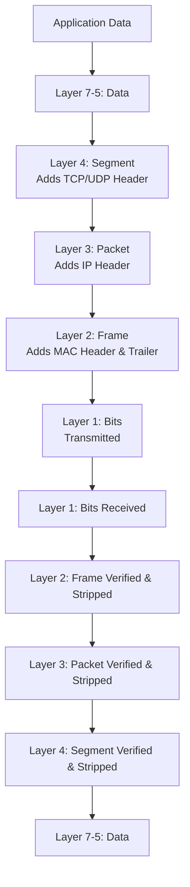

---
prev:
  text: "Lecture 1"
  link: "/College/yearTwo/secondTerm/CCNA/Lectures/Lecture-1"
next:
  text: "Lecture 3"
  link: "/College/yearTwo/secondTerm/CCNA/Lectures/Lecture-3"
title: Lecture 2
---

# CCNA - Lecture 2

## Internetworking Fundamentals

- An **internetwork** is created by connecting two or more **LANs** or **WANs** via a **router** and configuring a logical network addressing scheme (e.g., **IP**).
- **Internetworking Models:** The **OSI (Open Systems Interconnection)** model was created to enable different manufacturers' systems to communicate. It is a 7-layer conceptual framework for standardizing network functions.
- *Why this matters:* Without a common model, a DEC computer couldn't talk to an IBM computer. OSI provides the blueprint for interoperability.

## The OSI Model (7 Layers)

### Layer Structure and Function

| Layer | Name | Function | Example Devices/Protocols |
| :--- | :--- | :--- | :--- |
| 7 | **Application** | Provides network services directly to user applications. | **HTTP**, **FTP**, **SMTP**, **DNS** |
| 6 | **Presentation** | Translates, encrypts, and compresses data for the application. | **SSL/TLS**, data compression |
| 5 | **Session** | Manages (establishes, maintains, terminates) sessions between applications. | APIs, session management protocols |
| 4 | **Transport** | Ensures reliable (or unreliable) data delivery; handles segmentation, flow control, error correction. | **TCP**, **UDP**, port numbers |
| 3 | **Network** | Handles logical addressing (**IP addresses**) and routing between networks. | **Routers**, **IP** (IPv4/IPv6) |
| 2 | **Data Link** | Manages node-to-node communication; frames data; uses **MAC addresses**; detects (but doesn't correct) errors. | **Switches**, **bridges**, **Ethernet**, **ARP** |
| 1 | **Physical** | Transmits raw bits (0s and 1s) over physical medium. | Cables, hubs, repeaters, radio signals |

- **Data Flow:** On the sending device, data flows *down* from Layer 7 to Layer 1. On the receiving device, it flows *up* from Layer 1 to Layer 7. Each layer communicates *logically* with its peer layer on the other device.
- ⚠️ *The OSI model is theoretical. The internet primarily uses the **TCP/IP model**, but OSI remains the standard for understanding and troubleshooting.*

### OSI Encapsulation/De-encapsulation Process

### OSI vs. TCP/IP Model

| OSI Model | TCP/IP Model | Primary Protocols |
| :--- | :--- | :--- |
| Application, Presentation, Session | **Application Layer** | HTTP, FTP, SMTP, DNS |
| Transport | **Transport Layer** | TCP, UDP |
| Network | **Internet Layer** | IP (IPv4, IPv6) |
| Data Link, Physical | **Link Layer** | Ethernet, ARP |

## Transport Layer Reliability

- **Flow Control:** Prevents a sending host from overflowing the receiving host's buffers, which would cause data loss.
- **Connection-Oriented Communication (Reliable Data Transport)** ensures:
    - Received **segments** are acknowledged.
    - Unacknowledged segments are retransmitted.
    - Segments are re-sequenced correctly at the destination.
    - Data flow is managed to avoid congestion.
- **Positive Acknowledgment with Retransmission:** The sender transmits a segment, starts a timer, and waits for an **acknowledgment (ACK)** from the receiver. If the timer expires before the ACK returns, the sender retransmits the segment.
    - *Why?* This guarantees data isn't lost or duplicated.
- ⚠️ The setup of this reliable session (synchronization before data transfer) is called **overhead**.

## Layer 3 Devices: Routers

### How Routers Forward Packets
1.  A packet arrives on a router interface.
2.  The router checks the **destination IP address**.
3.  If the packet is *not* for the router itself, it consults its **routing table** for the destination network.
4.  **If** an entry is found, the router selects the exit interface, reframes the packet, and sends it to the next hop.
5.  **⚠️ If** no entry is found, the router **drops the packet**.

### Routed Protocols vs. Routing Protocols

| Feature | **Routed Protocols** | **Routing Protocols** |
| :--- | :--- | :--- |
| **Purpose** | Transport user data through the internetwork. | Build and maintain **routing tables** by exchanging **route updates**. |
| **What they carry** | Data packets (user traffic). | Route update packets. |
| **Examples** | **IP**, **IPX** | **RIP**, **EIGRP**, **OSPF** |

### Key Router Characteristics
- By default, routers **do not forward** any **broadcast** or **multicast** packets.
- They use **logical addresses (IP)** to determine the next hop.
- They can control security via **access lists** (rules permitting or denying packets on an interface).
- They can provide **Quality of Service (QoS)** for specific traffic types.
- They connect different **VLANs (Virtual LANs)** .

## Layer 2 Addressing and Devices

### MAC Address
- A **MAC (Media Access Control) address** is a unique 48-bit hardware address permanently embedded in a **NIC** by the manufacturer.
- *How it works:* Used for communication *within* a **LAN**. It enables devices on the same network segment to find and talk to each other directly.

### Logical Link Control (LLC) - 802.2
- Sublayer of the Data Link layer.
- **Function:** Identifies the Network layer protocol (e.g., IP) and encapsulates the packet. The **LLC header** tells the Data Link layer where to send the packet once the frame is received.
- *Why?* A single physical connection can support multiple Layer 3 protocols (e.g., IP and IPX), and LLC identifies which one is in use.

### Switches and Bridges Operation
1.  **Learning:** The device reads the **source MAC address** of every incoming frame and records it in a **filter table**, noting the port it arrived on.
2.  **Forwarding/Filtering:**
    - **If** the destination MAC address is in the table, the frame is forwarded *only* to the specific port where that device resides.
    - **⚠️ If** the destination MAC address is *not* in the table, the device **floods** the frame to *all* ports (except the incoming one).
3.  **Updating:** When the unknown device replies, the switch updates its filter table with the correct port association.