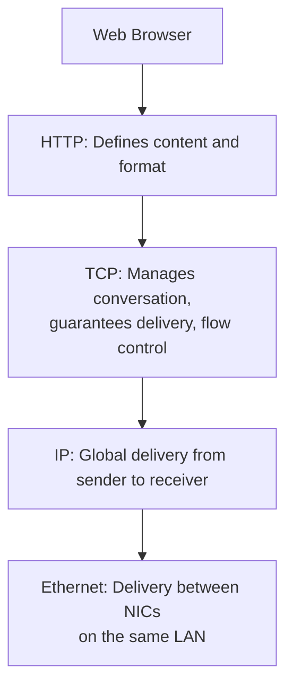

---
prev:
  text: "Lecture 2"
  link: "/College/yearTwo/secondTerm/CCNA/Lectures/Lecture-2"
next:
  text: "Lecture 4"
  link: "/College/yearTwo/secondTerm/CCNA/Lectures/Lecture-4"
title: Lecture 3
---

# CCNA - Lecture 3

## Communication Fundamentals

- All network communication requires three elements: a **source** (sender), a **destination** (receiver), and a **channel** (media) providing the communications path.
- _Why this matters:_ Connection alone is insufficient; devices must agree on _how_ to communicate.

## Protocols: The Rules of Communication

- **Protocols** are the established rules that govern communications between devices.
- _How they work:_ Just as humans require common language, grammar, and punctuation, network devices require standardized protocols to ensure messages are understandable.

### Protocol Requirements

Protocols must account for:

- Identified sender and receiver
- Common language and grammar
- Speed and timing of delivery
- Confirmation/acknowledgment requirements

### Network-Specific Protocol Requirements

| Requirement                              | Description                                                    |
| :--------------------------------------- | :------------------------------------------------------------- |
| **Message encoding**                     | Converting information into another form for transmission      |
| **Message formatting and encapsulation** | Structuring messages with specific formats (headers, trailers) |
| **Message size**                         | Encoding bits appropriately for the medium                     |
| **Message timing**                       | Managing flow control, response timeouts, and access methods   |
| **Message delivery options**             | Determining how messages reach recipients                      |

## Message Attributes

### Message Encoding

- **Encoding:** Converting information into acceptable form for transmission (bits -> light, sound, or electrical impulses).
- **Decoding:** Reversing the process to interpret information at the destination.

### Message Formatting (IPv6 Header Fields)

- **Payload Length (16 bits):** Specifies data size in bytes, excluding the IPv6 header (includes upper-layer protocol data and extension headers).
- **Next Header (8 bits):** Identifies the following protocol or extension header.
- **Hop Limit (8 bits):** Defines maximum routers the packet can pass through before being discarded.
  - Each router **decrements** the hop limit by 1.
  - ⚠️ **If** hop limit reaches **0**, the packet is **dropped**—prevents infinite routing loops.
  - **Common values:** macOS/Linux: **64**, Windows: **128**, Maximum possible: **255**

### Message Size

- Messages sent across the network are converted to **bits**.
- Bits are encoded into patterns of light (fiber), sound (modems), or electrical impulses (copper).
- Destination must **decode** signals to interpret the message.

### Message Timing

| Component            | Function                                                                                   |
| :------------------- | :----------------------------------------------------------------------------------------- |
| **Flow Control**     | Manages data transmission rate; defines how much information can be sent and at what speed |
| **Response Timeout** | Manages how long a device waits for a reply before taking action                           |
| **Access Method**    | Determines _when_ a device can send a message                                              |

- **Collisions** occur when multiple devices transmit simultaneously, corrupting messages.
- Protocols are either **proactive** (attempt to prevent collisions) or **reactive** (establish recovery methods after collisions).

### Message Delivery Options

| Method        | Type        | Description                                    |
| :------------ | :---------- | :--------------------------------------------- |
| **Unicast**   | One-to-one  | Single sender to single receiver               |
| **Multicast** | One-to-many | Single sender to a specific group of receivers |
| **Broadcast** | One-to-all  | Single sender to _all_ devices on the network  |

⚠️ **Critical Distinction:** **Broadcasts** are used in **IPv4** networks but are **NOT an option for IPv6**. IPv6 uses multicast and anycast instead.

## Network Protocol Functions

Protocols perform one or more of the following functions:

| Function                  | Description                                                               |
| :------------------------ | :------------------------------------------------------------------------ |
| **Addressing**            | Identifies sender and receiver                                            |
| **Reliability**           | Provides guaranteed delivery (acknowledgments, retransmission)            |
| **Flow Control**          | Ensures data flows at an efficient rate (prevents overwhelming receivers) |
| **Sequencing**            | Uniquely labels each transmitted segment for correct reassembly           |
| **Error Detection**       | Determines if data became corrupted during transmission                   |
| **Application Interface** | Enables process-to-process communication between network applications     |

## Protocol Interaction and Suites

### Protocol Stack Interaction

Different protocols work together hierarchically. Example data flow:

### Protocol Suite

- A **protocol suite** (or protocol stack) is a group of interrelated protocols necessary to perform communication functions.
- _Why layered?_ Higher layers provide services to applications; lower layers are concerned with moving data and providing services to upper layers.

### Protocol Type Classification

| Protocol Type             | Description                                                                 |
| :------------------------ | :-------------------------------------------------------------------------- |
| **Network Communication** | Enable two or more devices to communicate over networks                     |
| **Network Security**      | Secure data; provide authentication, integrity, and encryption              |
| **Routing**               | Enable routers to exchange information, compare paths, and select best path |
| **Service Discovery**     | Used for automatic detection of devices or services                         |

## Protocol Implementation

- Protocols can be implemented in:
  - **Software**
  - **Hardware**
  - **Both**
- Each protocol has its own:
  - **Function** (what it does)
  - **Format** (structure of messages)
  - **Rules** (how it behaves)
