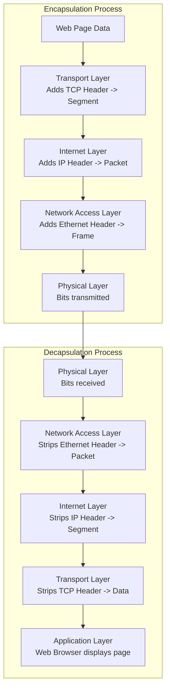

---
prev:
  text: "Lecture 3"
  link: "/College/yearTwo/secondTerm/CCNA/Lectures/Lecture-3"
next: false
title: Lecture 4
---

# CCNA - Lecture 4

## Protocol Interaction and Suites

### Protocol Stack Interaction

Different protocols work together hierarchically to enable communication.

| Protocol     | Function                                                                  |
| :----------- | :------------------------------------------------------------------------ |
| **HTTP**     | Governs web server/client interaction; defines content and format         |
| **TCP**      | Manages conversations; provides guaranteed delivery; manages flow control |
| **IP**       | Delivers messages globally from source to destination                     |
| **Ethernet** | Delivers messages between NICs on the same LAN                            |

- **Protocol Suite:** A group of interrelated protocols necessary to perform communication functions. Sets of rules working together to solve a problem.
- Protocols are viewed in **layers**: Higher layers provide services to applications; lower layers move data and provide services to upper layers.

### Evolution of Protocol Suites

| Protocol Suite                       | Description                                        |
| :----------------------------------- | :------------------------------------------------- |
| **TCP/IP (Internet Protocol Suite)** | Most common; maintained by **IETF**; open standard |
| **OSI Protocols**                    | Developed by **ISO** and **ITU**                   |
| **AppleTalk**                        | Proprietary suite by Apple Inc.                    |
| **Novell NetWare**                   | Proprietary suite by Novell Inc.                   |

## TCP/IP Protocol Suite

### Key Characteristics

- **TCP/IP** is the protocol suite used by the internet.
- **Open standard:** Freely available; any vendor can implement it.
- **Standards-based:** Endorsed by networking industry; approved by standards organizations to ensure interoperability.

### TCP/IP Layers and Protocols

- TCP/IP protocols operate at the **application**, **transport**, and **internet** layers.
- Most common **network access layer** LAN protocols: **Ethernet** and **WLAN** (wireless LAN).

### TCP/IP Communication Process

## Benefits of Layered Models

Layered models (both OSI and TCP/IP) provide:

1.  **Assist protocol design:** Protocols at specific layers have defined interfaces to adjacent layers.
2.  **Foster competition:** Products from different vendors can interoperate.
3.  **Isolate changes:** Technology changes in one layer don't affect other layers.
4.  **Common language:** Provides standardized terminology for networking functions.

## Message Segmentation and Sequencing

### Segmenting Messages

**Segmenting** is breaking messages into smaller units. **Multiplexing** interleaves multiple segmented data streams.

**Two primary benefits:**

- **Increases speed:** Large data amounts can be sent without tying up a communications link.
- **Increases efficiency:** Only failed segments need retransmission, not the entire data stream.

### Sequencing

- **Sequencing** is numbering segments so the message can be reassembled at the destination.
- **TCP** is responsible for sequencing individual segments.

## Protocol Data Units (PDUs) and Encapsulation

### Encapsulation Process

**Encapsulation** is the process where protocols add their information (headers) to data. As data moves down the stack, the PDU name changes to reflect new functions.

| Layer (TCP/IP Model) | PDU Name               | Contents                           |
| :------------------- | :--------------------- | :--------------------------------- |
| Application          | **Data** (Data Stream) | Original application data          |
| Transport            | **Segment**            | TCP/UDP header + data              |
| Internet             | **Packet**             | IP header + segment                |
| Network Access       | **Frame**              | Ethernet header + packet + trailer |
| Physical             | **Bits** (Bit Stream)  | Encoded bits for transmission      |

### Decapsulation Process

As data moves _up_ the stack:

1.  Received as **Bits** (Bit Stream)
2.  Converted to **Frame**
3.  Stripped to **Packet**
4.  Stripped to **Segment**
5.  Stripped to **Data** (Data Stream) for application processing

_How it works:_ Each layer strips its own header, then passes the remaining data to the next higher layer.

## Addressing: Layer 2 vs. Layer 3

### Address Roles

| Address Type                | Layer   | Function                                                             |
| :-------------------------- | :------ | :------------------------------------------------------------------- |
| **Network Layer Address**   | Layer 3 | Delivers **IP packet** from original source to final destination     |
| **Data Link Layer Address** | Layer 2 | Delivers **frame** from one NIC to another NIC on the _same network_ |

### Layer 3 Logical Address (IP)

- **Source IP Address:** Sending device (original source)
- **Destination IP Address:** Receiving device (final destination)
- Address may be on same link or remote.

**IP Address Structure:**

- **Network portion (IPv4)** or **Prefix (IPv6):** Left-most part; identifies the network group. All devices on same LAN/WAN share this portion.
- **Host portion (IPv4)** or **Interface ID (IPv6):** Remaining part; uniquely identifies specific device on that network.

### Addressing Rules Based on Location

#### Same Network Communication

- **If** source and destination have the **same network portion** (e.g., 192.168.1.110 and 192.168.1.9):
  - They are on the same network.
  - Data link frame uses the actual **destination MAC address** (local addressing).
  - Source MAC = originator; Destination MAC = target device on same link.

#### Different Network Communication

- **If** source and destination have **different network portions** (e.g., 192.168.1.110 and 172.16.1.1):
  - They are on different networks.
  - Layer 3 provides Layer 2 with the **default gateway (DGW)** IP address (router interface on this LAN).
  - ⚠️ **All devices must be configured with the default gateway address**; otherwise, traffic is confined to the local LAN only.
  - Once Layer 2 forwards the frame to the default gateway (router), the router begins routing to the actual destination.
