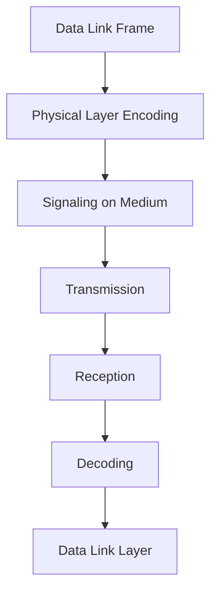

---
prev:
  text: "Lecture 4"
  link: "/College/yearTwo/secondTerm/CCNA/Lectures/Lecture-4"
next: false
title: Lecture 5
---

# Lecture 5: Physical Layer Fundamentals

The **Physical Layer (Layer 1)** is responsible for **transmitting raw bits (0s/1s)** over a physical medium. It **does NOT interpret frames or addresses** (that's Data Link Layer).

- Accepts a **complete frame** from Data Link Layer -> encodes as signals -> transmits.
- On receive: signals -> bits -> passed upward for **de-encapsulation**.

**Why this separation matters:** abstraction ensures higher layers remain independent of hardware specifics.

## Encoding, Signaling & Bandwidth

Physical layer standards address three functional areas:

- **Physical Components:** hardware (NICs, cables, connectors) that carry signals
- **Encoding:** converts bit streams into recognizable patterns for the next device
- **Signaling:** defines how bits are represented physically (varies by medium type)

- Encoding creates the pattern
- Signaling defines the physical representation of that pattern (voltage/light/radio)

## Bandwidth & Performance Terminology

### Definitions with relationships

**Bandwidth** = maximum capacity a medium can carry data, measured in bits per second (bps). Constrained by physics + medium quality.

**Latency** — time delay from source to destination (lower = better). Affected by distance + processing delays.

**Throughput** — actual data (bits) transferred per unit time (≤ bandwidth). Reduced by congestion/errors.

**Goodput** — _usable_ data transferred; formula: `Goodput = Throughput − traffic overhead`. Excludes headers/retransmissions

### Units

| Unit         | Abbreviation | Value         |
| ------------ | ------------ | ------------- |
| Bits/sec     | bps          | Base unit     |
| Kilobits/sec | Kbps         | $10^3$ bps    |
| Megabits/sec | Mbps         | $10^6$ bps    |
| Gigabits/sec | Gbps         | $10^9$ bps    |
| Terabits/sec | Tbps         | $10^{12}$ bps |

### Key Relationships

- Low latency improves real-time performance
- Throughput != Goodput: throughput counts all bits including protocol overhead; goodput counts only payload.

> [!IMPORTANT]
> Increasing bandwidth does NOT reduce latency directly.
>
> High bandwidth != high throughput (due to congestion)

## Copper Cabling

The most common network medium — inexpensive, easy to install, low electrical resistance.
It works by transmitting **electrical signals** via conductive wires.

### Limitations

- **Attenuation:**
  - signal weakens over distance
  - cause: resistance dissipates energy.
- **EMI/RFI:**
  - electromagnetic/radio frequency interference
  - cause: electromagnetic fields distort signals.
- **Crosstalk:**
  - interference (leakage) between adjacent wire pairs
  - cause: adjacent wires induce currents.

### Mitigation Strategies

- Limit cable length (reduces attenuation)
- Shielding (blocks EMI/RFI)
- Twisting pairs (reduces crosstalk via cancellation)

### Shielded Twisted-Pair (STP)

- **Braided or foil shield** (overall and/or per pair) provides EMI/RFI protection
- More expensive, harder to install than UTP
- Same RJ-45 termination

### Unshielded Twisted-Pair (UTP)

#### UTP Internal Mechanisms

- **Twisted pairs** -> cancel magnetic fields
- **Opposite polarity wires** -> reduce interference
- **Different twist rates** -> prevent crosstalk

> [!NOTE]
> UTP still resists interference despite no shielding (via twisting).

### UTP Cable Types

| Cable Type       | Wiring Standard                 | Application                                                |
| ---------------- | ------------------------------- | ---------------------------------------------------------- |
| Straight-through | Both ends T568A _or_ both T568B | Host -> Switch/Router                                      |
| Crossover        | One end T568A, other T568B      | Same device types (Host<->Host, Switch<->Switch)           |
| Rollover         | Cisco proprietary               | Host serial -> Router/Switch console (console connections) |

> [!IMPORTANT]
> Crossover cables are **legacy** — most modern NICs use **Auto-MDIX** to auto-detect cable type.

## Coaxial Cable

**Coaxial Cable** = central conductor + shielding layer.

### Components (layered)

- Inner conductor -> carries signal
- Insulation -> isolates
- Metallic shield -> blocks interference
- Outer jacket -> protection

**Why effective:** shielding acts as return path + EMI protection.

### Use Cases

- Antennas (wireless systems)
- Cable internet (customer premises)

## UTP vs. STP vs. Coaxial

| Feature                 | UTP     | STP                     | Coaxial                           |
| ----------------------- | ------- | ----------------------- | --------------------------------- |
| Shielding               | None    | Foil + braid per pair   | Woven copper braid                |
| Cost                    | Lowest  | Higher                  | Medium                            |
| Install difficulty      | Easiest | Harder                  | Moderate                          |
| Connector               | RJ-45   | RJ-45                   | BNC / N-type / F-type             |
| Interference Resistance | Lower   | Higher                  | —                                 |
| Common use              | LAN     | High-noise environments | Wireless antennas, cable internet |

## Fiber-Optic Cabling

**Fiber-optic cables** transmit data as **light pulses** (laser or LED) through pure glass strands.
They are immune to EMI/RFI and carry the highest bandwidth over the longest distances.

### Single-Mode vs. Multimode

| Feature      | Single-Mode (SMF) | Multimode (MMF)          |
| ------------ | ----------------- | ------------------------ |
| Core size    | Small (9 microns) | Larger (50/62.5 microns) |
| Light source | Laser             | LED                      |
| Distance     | Very long         | Shorter (~550m)          |
| Max speed    | Very high         | Up to 10 Gbps            |
| Jacket color | Yellow            | Orange or aqua           |
| Cost         | Higher            | Lower                    |

> [!NOTE]
> Multimode is cheaper but limited distance due to signal dispersion.

**Fiber connector types:** ST (twist-lock), SC (push-pull), LC Simplex, LC Duplex

### Fiber Use Cases

- **Enterprise backbone** -> high-speed internal links
- **FTTH** (Fiber-to-the-Home) — residential broadband
- **Long-Haul** — city/country interconnects
- **Submarine** — transoceanic, harsh undersea environments

### Fiber vs. Copper

| Issue              | UTP Copper    | Fiber-Optic    |
| ------------------ | ------------- | -------------- |
| Bandwidth          | Up to 10 Gb/s | Up to 100 Gb/s |
| Distance           | 1–100 m       | 1–100,000 m    |
| EMI/RFI immunity   | Low           | Complete       |
| Cost               | Lowest        | Highest        |
| Installation skill | Lowest        | Highest        |

## Wireless Media

**Wireless** uses electromagnetic signals (radio/microwave frequencies) to represent binary data — provides maximum mobility.

**Limitations:**

- **Coverage area** — obstacles reduce signal
- **Interference** — susceptible to common household/office devices
- **Security** — no physical access required; transmissions are publicly interceptable
- **Shared medium** — WLANs operate **half-duplex** (one device transmits at a time)

> [!IMPORTANT]
> Wireless bandwidth is shared -> more users = lower per-user throughput.

### Wireless Standards

| Standard      | IEEE Spec | Type                          |
| ------------- | --------- | ----------------------------- |
| **Wi-Fi**     | 802.11    | WLAN                          |
| **Bluetooth** | 802.15    | WPAN                          |
| **WiMAX**     | 802.16    | Point-to-multipoint broadband |
| **Zigbee**    | 802.15.4  | Low-power IoT                 |

### WLAN Required Components

- **Wireless Access Point (AP)** — connects wireless to wired network
- **Wireless NIC Adapter** — enables host wireless capability

> [!NOTE]
> WLAN is not peer-to-peer by default -> depends on AP infrastructure.

> [!IMPORTANT]
> WLANs operate **half-duplex** — unlike wired Ethernet which can be full-duplex.
>
> WLANs require stringent policies to prevent unauthorized access.

## Process Flow: End-to-End Transmission

**Order Matters:**

1. Encoding ensures recognizable patterns
2. Signaling adapts to medium
3. Transmission occurs
4. Reverse process reconstructs data

> [!IMPORTANT]
> If encoding fails -> receiver cannot interpret signals -> data loss
