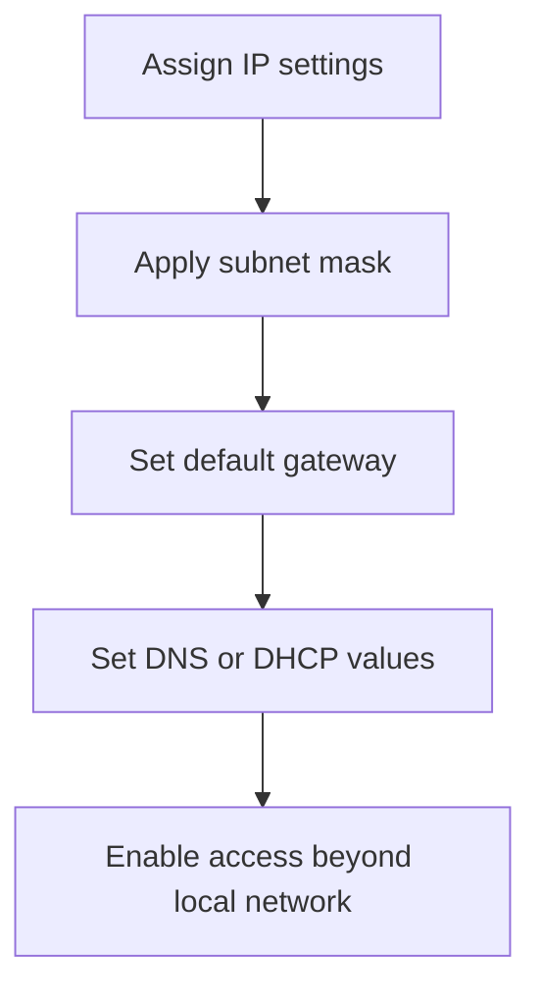

---
prev:
  text: "Lecture 5"
  link: "/College/yearTwo/secondTerm/CCNA/Lectures/Lecture-5"
next:
  text: "Lecture 7"
  link: "/College/yearTwo/secondTerm/CCNA/Lectures/Lecture-7"
title: Lecture 6
---

## Lecture 6: IP Address Foundations

**IP address** is a numerical label assigned to a device on a network that uses the **Internet Protocol (IP)** for communication. It identifies a device on a specific network and helps create logical communication between source and destination, so it is both an identifier and a delivery reference.

An IPv4 address is written as **four decimal numbers separated by dots**, such as **192.168.1.1**. The address is split into two logical parts:

- **Prefix** or **network address**: identifies the physical network.
- **Suffix** or **host address**: identifies the individual device on that network.

This division matters because routers forward traffic by network portion first, then the local network delivers it to the correct host.

> [!IMPORTANT]
> **Public** and **private** describe _where an address is used_.
> **Static** and **dynamic** describe _how an address is assigned or whether it changes_.

## IP Address Types

**Public IP address** is the address associated with a whole network for communication outside the local network. In the lecture model, the router receives it from the **ISP**, which is why many internal devices can appear to the Internet through one outward-facing address.

**Private IP address** is a unique address used for devices inside a local network such as home or office devices. It stays internal because local communication needs per-device identification even when outside networks only see the router.

**Static IP address** stays fixed unless changed by an administrator. It is useful when a device must remain reachable at a predictable address.

**Dynamic IP address** is assigned temporarily, usually by **DHCP**, and can change over time. This works because automatic reuse of addresses reduces manual setup effort.

| Concept     | Meaning                        | Main boundary                       |
| ----------- | ------------------------------ | ----------------------------------- |
| **Public**  | Used outside the local network | Typically assigned to router by ISP |
| **Private** | Used inside the local network  | Unique per local device             |
| **Static**  | Fixed assignment               | Changes only by administration      |
| **Dynamic** | Temporary assignment           | Expires or changes automatically    |

### Website IP Types

| Type             | Definition                       | Why it matters                                                            |
| ---------------- | -------------------------------- | ------------------------------------------------------------------------- |
| **Shared IP**    | One IP used by multiple websites | Common for smaller sites with lower resource demands                      |
| **Dedicated IP** | One unique IP per website        | Avoids reputation problems from other sites and allows access by IP alone |

## IPv4, IPv6, and IP Classes

**IPv4** uses a **32-bit** address space, so the total number of addresses is **2^32**, which is more than 4 billion. It became the main production version in **1983**, and the small address space is why later expansion became necessary.

**IPv6** uses a **128-bit** address space and provides about **340 undecillion** addresses. It was introduced to solve IPv4 address exhaustion, so the larger bit length directly increases scalability.

| Version  | Size        | Exam focus                            |
| -------- | ----------- | ------------------------------------- |
| **IPv4** | **32-bit**  | Widely used, limited address space    |
| **IPv6** | **128-bit** | Created to provide far more addresses |

The lecture also classifies IPv4 addresses by leading range and default mask.

| Class | Range                            | Default mask      | Typical use                     |
| ----- | -------------------------------- | ----------------- | ------------------------------- |
| **A** | **1.0.0.0 to 126.255.255.255**   | **255.0.0.0**     | Large networks                  |
| **B** | **128.0.0.0 to 191.255.0.0**     | **255.255.0.0**   | Medium networks                 |
| **C** | **192.0.0.0 to 223.255.255.255** | **255.255.255.0** | Small networks                  |
| **D** | **224 to 239**                   | N/A               | Multitasking in lecture wording |
| **E** | **240 to 254**                   | N/A               | Research and development        |

> [!CAUTION]
> **127.x.x.x** is _not_ a normal assignable network start in this lecture because **127** is reserved for **loopback** functions.

## IPv4 Subnetting Logic

**Subnetting** is the logical division of one large network into smaller networks. It works by using a **subnet mask** to mark which bits belong to the network and which belong to the host.

**Subnet mask** is a **32-bit** value written like an IPv4 address. Bits set to **1** mark the **network portion**; bits set to **0** mark the **host portion**, so the mask defines both identity and size of the subnet.

Example: **192.168.1.10** with **255.255.255.0** means the first three octets are network and the last octet is host.

| Mask              | CIDR    | Meaning                         |
| ----------------- | ------- | ------------------------------- |
| **255.0.0.0**     | **/8**  | Class A default, large network  |
| **255.255.0.0**   | **/16** | Class B default, medium network |
| **255.255.255.0** | **/24** | Class C default, small network  |

For **255.255.0.0**, the binary pattern is `11111111.11111111.00000000.00000000`, so there are **16 network bits** and **16 host bits**. The available host count is:

**2^16 - 2 = 65,534**

The minus 2 matters because one address is reserved for the **network address** and one for the **broadcast address**.

> [!IMPORTANT]
> If all host bits are **0**, the value represents the **network address**.
> If all host bits are **1**, the value represents the **broadcast address**.
> Neither is a normal host address.

## Network Configuration Components

**Network configuration** is the process of setting rules, interfaces, and device settings so routers, switches, servers, and computers can communicate correctly. Configuration works only when addressing, masks, gateways, and support services match the same network design.

- **IP address**: identifies the device.
- **Subnet mask**: separates network bits from host bits.
- **Default gateway**: usually the router that forwards traffic to other networks.
- **DNS (Domain Name System)**: converts **computer names** or **FQDNs** to IP addresses and can also perform reverse lookup.
- **DHCP (Dynamic Host Configuration Protocol)**: automatically assigns IP address, subnet mask, default gateway, and DNS server values.
- **NAT (Network Address Translation)**: maps private addresses to a single public address so multiple internal devices can access the Internet.
- **VLAN (Virtual LAN)**: segments a larger network into smaller isolated groups to improve security and reduce broadcast traffic.
- **Firewall**: permits or blocks traffic according to security rules.
- **SSID (Service Set Identifier)** with **WPA2** and password: identifies and secures a Wi-Fi network.



```text
# Purpose: example IPv4 settings for a small home network
Router: 192.168.1.1 / 255.255.255.0 / Gateway 192.168.1.1 / DNS 8.8.8.8
Device 1: 192.168.1.2 / 255.255.255.0 / Gateway 192.168.1.1
Device 2: 192.168.1.3 / 255.255.255.0 / Gateway 192.168.1.1
Device 3: 192.168.1.4 / 255.255.255.0 / Gateway 192.168.1.1
Wi-Fi: SSID HomeNetwork / WPA2 / Password securepass123
```

## Routing Protocols and Path Selection

**Routing protocols** are rules routers use to exchange route information and update the **routing table**; they do _not_ move user data themselves. This matters because the protocol chooses paths indirectly by teaching routers where destinations are.

| Type                | Definition                                | Key contrast                               |
| ------------------- | ----------------------------------------- | ------------------------------------------ |
| **Static routing**  | Path manually configured by administrator | More control and security, less automation |
| **Dynamic routing** | Routers learn routes automatically        | More scalable, less manual work            |

**Distance Vector Routing Protocol (DVR)** advertises routing tables to directly connected neighbors at intervals. It uses more bandwidth and converges slowly because routers repeatedly exchange tables after changes.

**RIP (Routing Information Protocol)** is a distance-vector protocol used in **LAN** and **WAN** networks, with versions **RIPv1** and **RIPv2**. It uses **hop count** as its metric, so path choice depends on number of routers crossed, not bandwidth or delay.

**Hop count** increases by **1** each time a packet passes through a router. In `PC1 -> Router1 -> Router2 -> Router3 -> PC2`, the hop count is **3**.

_If a RIP route needs more than **15 hops**, it is not accepted._

**IGRP (Interior Gateway Routing Protocol)** is a Cisco distance-vector protocol that improves on RIP by using **load, bandwidth, delay, and reliability** as metrics, broadcasting every **90 seconds**, and allowing a maximum hop count of **255**.

**Link-state routing** calculates the best route using path speed and resource cost. It maintains a **neighbor table**, **topology table**, and **routing table**, so routers know both nearby adjacencies and wider network structure.

**EIGRP (Enhanced Interior Gateway Routing Protocol)** is a **hybrid** protocol combining distance-vector and link-state behavior. **OSPF (Open Shortest Path First)** is a **link-state IGP** that uses the **Shortest Path First (SPF)** method and the **Dijkstra algorithm** to recalculate paths when topology changes.
