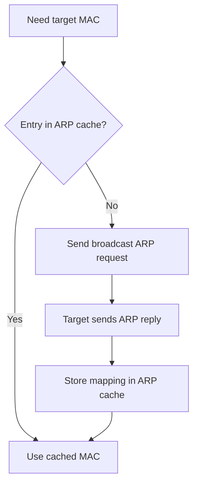

---
prev:
  text: "Lecture 6"
  link: "/College/yearTwo/secondTerm/CCNA/Lectures/Lecture-6"
next:
  text: "Lecture 8"
  link: "/College/yearTwo/secondTerm/CCNA/Lectures/Lecture-8"
title: Lecture 7
---

# CCNA - Lecture 7

## ARP Purpose and Boundaries

**Address Resolution Protocol (ARP)** maps an **IPv4 address** to a **MAC (Media Access Control) address** on a local network. It exists because **IPv4** is a **32-bit logical address** used at the network layer, while a **MAC address** is a **48-bit physical address** used at the data link layer, so a host needs both before it can deliver a frame on a LAN.

ARP is used when one device wants to communicate with another device on the **same network**. It does _not_ route packets between networks by itself; it only resolves the local hardware address needed for frame delivery.

| Concept         | Meaning                          | Boundary                       |
| --------------- | -------------------------------- | ------------------------------ |
| **IP address**  | Logical network-layer identifier | Used for end-to-end addressing |
| **MAC address** | Physical data-link identifier    | Used for local frame delivery  |
| **ARP**         | IPv4-to-MAC mapping process      | Used for local resolution      |

> [!IMPORTANT]
> ARP resolves **IP -> MAC** for local delivery.
> **Reverse ARP** and **Inverse ARP** are different mechanisms and must not be confused with normal ARP.

## How ARP Works

Every IPv4 host keeps an **ARP cache** that stores recently learned IP-to-MAC mappings. This matters because repeated communication would be slow if every frame required a new broadcast.

When a host needs to send to another local host, it follows this order:

1. Check the **ARP cache** for an existing mapping.
2. If found, use the stored **MAC address** immediately.
3. If not found, send a **broadcast ARP request** asking which device owns the target IP.
4. The device with that IP sends an **ARP reply** containing its MAC address.
5. The sender stores the result in the cache for future use.

The order matters because cache lookup avoids unnecessary broadcasts, while broadcast is only the fallback when the mapping is unknown.



## ARP Terms and Resolution Methods

**ARP cache** is the table that stores resolved MAC addresses for later reuse. **ARP cache timeout** is the period an entry remains valid, which prevents stale mappings from staying forever.

**ARP request** is a broadcast asking for the MAC address of a known IP. **ARP reply** is the unicast response from the device that owns that IP, enabling the sender to continue communication.

The lecture lists three **binding** methods, where **binding** means associating a protocol address with a hardware address:

- **Table lookup**: stored bindings are searched in memory.
- **Dynamic resolution**: a message is sent just in time and the destination responds.
- **Closed-form computation**: the hardware address is derived from the protocol address.

Dynamic resolution is the most ARP-like idea because it resolves the address only when needed instead of preloading all mappings.

## Types of ARP and Edge Cases

| Type                   | Definition                                              | Why it matters                                                             |
| ---------------------- | ------------------------------------------------------- | -------------------------------------------------------------------------- |
| **Proxy ARP**          | Router replies on behalf of a device on another subnet  | Allows cross-subnet communication without extra host routing configuration |
| **Gratuitous ARP**     | Device sends ARP for its own IP                         | Updates other ARP tables and helps detect IP conflicts                     |
| **Reverse ARP (RARP)** | Device learns its own IP from its MAC                   | Replaced by **DHCP**                                                       |
| **Inverse ARP**        | Maps a known MAC or virtual-circuit identifier to an IP | Used in networks such as **ATM**                                           |

> [!CAUTION]
> **Gratuitous ARP** is not asking for another host's address; it advertises the sender's own mapping.
>
> **RARP** is obsolete in the lecture context because **DHCP** replaced it.

ARP reduces manual configuration because end hosts do not need to know every destination MAC address in advance. The stored set of mappings is called the **ARP table** or **ARP cache**.

## MAC Address vs. IP Address

The exam trap is mixing **physical** and **logical** addressing. A **MAC address** works at the **data link layer** and identifies a network interface on the local segment. An **IP address** works at the **network layer** and identifies a host logically across internetworks.

| Feature                     | **MAC address**                  | **IP address**                                                |
| --------------------------- | -------------------------------- | ------------------------------------------------------------- |
| Meaning                     | **Media Access Control** address | **Internet Protocol** address                                 |
| Size in lecture             | **48-bit**                       | **32-bit**                                                    |
| OSI role                    | Link/Data Link layer             | Network layer                                                 |
| Address type                | Physical                         | Logical                                                       |
| Related protocol in lecture | Found using **ARP**              | In RARP/Inverse ARP context, mapped from lower-level identity |

```bash
# Purpose: display local network details including MAC address
ipconfig /all
```

## VPN Fundamentals and Benefits

**Virtual Private Network (VPN)** creates an end-to-end private connection over a public network. It is **virtual** because traffic crosses a public infrastructure such as the Internet, and **private** because encryption protects confidentiality during transport.

Modern VPNs use technologies such as **IPsec** and **SSL**. Encryption and authentication matter because a public network cannot be assumed trustworthy.

| Benefit           | Why it matters                                                         |
| ----------------- | ---------------------------------------------------------------------- |
| **Cost savings**  | Uses existing Internet connectivity instead of dedicated private links |
| **Security**      | Protects traffic with encryption and authentication                    |
| **Scalability**   | Easier to add users without major infrastructure growth                |
| **Compatibility** | Works across many WAN and broadband options                            |

If privacy is required across the Internet, a VPN is preferred because plain traffic over a public network is exposed.

## VPN Types and GRE over IPsec

**Site-to-site VPN** connects networks through **VPN gateways**. Internal hosts usually do not know a VPN is being used because encryption occurs between gateways, not at every end host.

**Remote-access VPN** creates a secure connection between a client and a VPN termination device. It is typically started dynamically when the user needs remote connectivity.

Remote-access VPNs can be:

- **Clientless SSL VPN**: uses a web browser.
- **Client-based VPN**: requires software such as **Cisco AnyConnect Secure Mobility Client**.

| Feature            | **IPsec**                   | **SSL**                                    |
| ------------------ | --------------------------- | ------------------------------------------ |
| Applications       | Extensive, all IP-based     | Limited, mainly web-based and file sharing |
| Authentication     | Strong, often two-way       | Moderate, one-way or two-way               |
| Client need        | Usually VPN client required | Web browser can be enough                  |
| Connection options | More limited                | More extensive                             |

**GRE (Generic Routing Encapsulation)** is a tunneling protocol that can carry multiple network-layer protocols plus **multicast** and **broadcast** traffic, but it is _not secure by itself_ because it does not provide encryption. Standard **IPsec** secures traffic but normally supports **unicast** tunnels only, so **GRE over IPsec** combines GRE's flexibility with IPsec's security.

In **GRE over IPsec**:

- **Passenger protocol**: original packet, such as **IPv4**, **IPv6**, or an **OSPF** update.
- **Carrier protocol**: **GRE**, which encapsulates the original packet.
- **Transport protocol**: the outer **IPv4** or **IPv6** used to forward the packet.

This design matters because routing updates such as **OSPF** can then cross a secure VPN tunnel.
