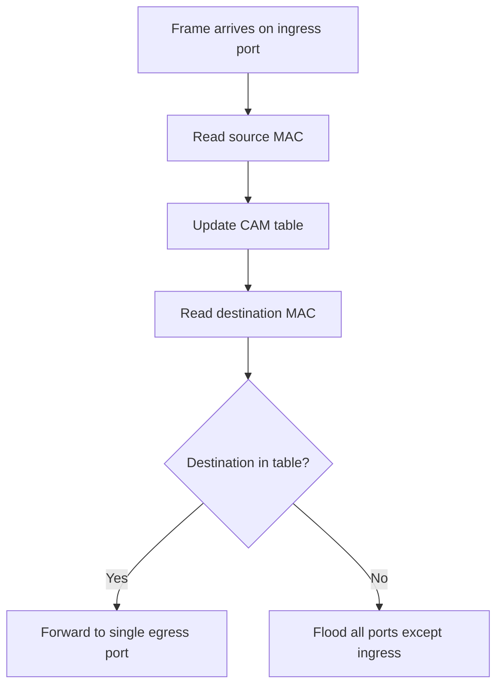

---
prev:
  text: "Lecture 7"
  link: "/College/yearTwo/secondTerm/CCNA/Lectures/Lecture-7"
next: false
title: Lecture 8
---

## Switching Fundamentals

**Switching** is the process a **Layer 2 switch** uses to receive a frame on one interface and send it out another interface based on addressing information. It works at frame level, so the switch makes decisions using **MAC addresses**, not IP routing logic.

Two terms define frame direction:

- **Ingress**: frame entering an interface.
- **Egress**: frame leaving an interface.

A switch forwards using the **ingress interface** and the **destination MAC address**. It will _never_ send traffic back out the same interface on which the frame was received, because that would not move the frame closer to the destination.

> [!IMPORTANT]
> A switch decision is based on the **destination MAC address**, but the switch learns by examining the **source MAC address**.

## MAC Address Table and Learn-and-Forward

The **MAC address table**, also called the **CAM (Content Addressable Memory) table**, stores which MAC address was seen on which switch port. This matters because a switch cannot choose the correct egress port until it has learned where the destination device is located.

The switch uses a two-step **learn-and-forward** process:

1. **Learn**: examine the **source MAC address**.
2. Add the source MAC to the table if it is new.
3. If the MAC is already present, reset its timeout to **5 minutes**.
4. **Forward**: examine the **destination MAC address**.
5. If the destination exists in the table, send the frame only out the mapped port.
6. If the destination is unknown, **flood** the frame out all interfaces except the ingress interface.

The order matters because the switch must first build knowledge from incoming traffic before it can forward future traffic efficiently.



## Forwarding Methods

Switches use **ASICs (application-specific integrated circuits)** to make fast forwarding decisions. The lecture gives two forwarding methods, and the exam trap is speed versus error handling.

| Method                | How it works                                         | Main tradeoff                        |
| --------------------- | ---------------------------------------------------- | ------------------------------------ |
| **Store-and-forward** | Receives the entire frame before forwarding          | Higher delay, better validation      |
| **Cut-through**       | Starts forwarding as soon as destination MAC is read | Lower delay, weaker error protection |

**Store-and-forward switching** is Cisco's preferred method because it checks the whole frame before forwarding it. **Cut-through switching** is used when very low latency is the priority, so the switch sacrifices some checking to forward faster.

> [!CAUTION]
> If the question asks which method is preferred for frame validation and reliability, choose **store-and-forward**, not cut-through.

## Store-and-Forward vs. Cut-Through

**Store-and-forward switching** has two main characteristics:

- **Error checking**: checks the **FCS (Frame Check Sequence)** for **CRC (Cyclic Redundancy Check)** errors.
- **Buffering**: stores the frame while checking it.

This method discards bad frames and can handle different ingress and egress speeds because buffering absorbs the speed mismatch.

**Cut-through switching** forwards immediately after reading the destination MAC address. It is appropriate when latency must be under **10 microseconds**, but it does _not_ check the FCS, so it can propagate errors.

The **fragment-free** variation checks that the frame is at least **64 bytes**, which eliminates **runts**. That check improves on basic cut-through, but it still does not provide full FCS validation.

| Feature                | **Store-and-forward** | **Cut-through**  |
| ---------------------- | --------------------- | ---------------- |
| Frame reception        | Entire frame          | Partial frame    |
| FCS check              | Yes                   | No               |
| Error propagation      | Lower                 | Higher           |
| Speed mismatch support | Yes                   | No               |
| Best use               | Reliability           | Very low latency |

## Collision Domains

A **collision domain** is the part of a network where transmissions can collide because devices compete for the same medium. It matters because collisions force retransmission, which lowers network quality and wastes bandwidth.

Switches reduce congestion by separating traffic, and with **full duplex** links, collisions are eliminated. If one or more devices operate in **half-duplex**, a collision domain still exists because devices must contend for the same bandwidth.

- **Full duplex**: no collisions on that link.
- **Half-duplex**: collisions are possible.
- More devices in one collision domain: more contention and more retransmissions.

_Collision does not happen between two devices connected to different switch ports._ That is the key switch advantage compared with shared-media behavior.

> [!IMPORTANT]
> Most devices use **auto-negotiation** by default for duplex and speed, so mismatched duplex settings can affect whether collisions occur.

## Broadcast Domains

A **broadcast domain** includes all **Layer 1** and **Layer 2** devices that receive a broadcast on a LAN. It grows as more switches and hosts are added because **Layer 2 switches flood broadcasts** out all interfaces except the ingress interface.

Only a **Layer 3 device**, such as a **router**, breaks a broadcast domain. The router receives the broadcast but does _not_ forward it into the next network segment, which limits the spread of broadcast traffic.

If the number of devices in the broadcast domain increases, the number of broadcasts also increases, and performance can drop because all hosts must process those broadcast frames.

| Topic            | **Broadcast domain**        | **Collision domain**                       |
| ---------------- | --------------------------- | ------------------------------------------ |
| Traffic type     | Broadcast traffic           | Simultaneous transmissions on shared media |
| Broken by        | **Router / Layer 3 device** | **Switch ports** and full-duplex links     |
| Effect of growth | More broadcast load         | More collision risk                        |
| Switch behavior  | Floods broadcast frames     | Separates ports to reduce collisions       |

```text
# Purpose: exam memory rule for domains
Switch: breaks collision domains
Router: breaks broadcast domains
```
