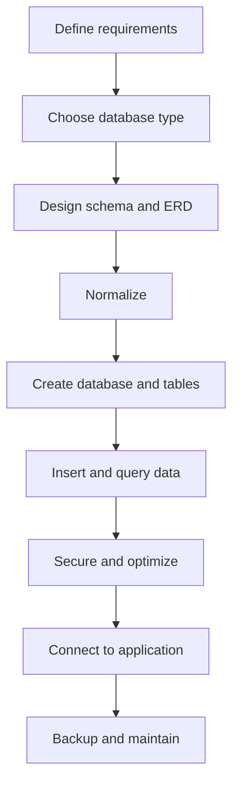

---
prev:
  text: "Lectures"
  link: "/College/yearTwo/secondTerm/DBProgramming/Lectures/index"
next:
  text: "Lecture 2"
  link: "/College/yearTwo/secondTerm/DBProgramming/Lectures/Lecture-2"
title: Lecture 1
---

# Database Programming - Lecture 1

## Database and Structure

A **database** is an organized collection of **related data** used to **store, retrieve, organize, and communicate** information. It excludes unrelated files because value comes from structure. A **table** is the basic storage object. A **row** or **record** is one horizontal entry, while a **column** or **field** is one vertical attribute.

| Term               | Definition                           | Boundary / Trap                   |
| ------------------ | ------------------------------------ | --------------------------------- |
| **Database**       | Organized collection of related data | Not just a folder of random files |
| **Table**          | Basic storage object                 | Stores data as rows and columns   |
| **Row / Record**   | One horizontal entry                 | Represents one entity instance    |
| **Column / Field** | One vertical attribute               | Same property across many rows    |

> [!IMPORTANT]
> If data is not related or not structured for retrieval, it does not fit the lecture's definition of a database.

## Database Types and When to Use Them

The lecture separates database types by **storage location**, **schema rigidity**, and **scalability**.
  
- A **centralized database** stores data in one main system.  
- A **distributed database** spreads data across connected systems.  
- A **relational database** stores data in tables and uses **SQL**.  
- A **NoSQL database** is built for **scalability**, **flexibility**, and **unstructured or semi-structured data**, so it does not depend on fixed schemas.  
- A **cloud database** stores data in a cloud environment for scalable online access. 

| Type            | Best Fit                   | Example           |
| --------------- | -------------------------- | ----------------- |
| **Centralized** | One main controlled source | Central library   |
| **Distributed** | Multi-location access      | Cassandra, HBase  |
| **Relational**  | Structured data            | MySQL, Oracle     |
| **NoSQL**       | Flexible data              | MongoDB, Firebase |
| **Cloud**       | Scalable cloud apps        | AWS, Azure        |

> [!WARNING]
> **Relational** and **NoSQL** are not opposites in every case; the exam trap is assuming NoSQL means "no structure at all." The lecture only says it avoids fixed schemas and traditional tables.

## Steps to Create a Database

The lecture gives a 9-step workflow; the order matters because each step depends on the previous one.

1. Define **purpose and requirements**: data, relationships, access, security, scalability.
2. Choose the **database type**.
3. Design the **schema** and **ERD**: tables, attributes, **PK**, **FK**.
4. Apply **normalization**: **1NF** atomic values, **2NF** remove partial dependencies, **3NF** remove transitive dependencies.
5. Create database and tables in SQL.
6. Insert and query data.
7. Secure and optimize: roles, encryption, backups.
8. Connect to an application.
9. Backup and maintain.



> [!NOTE]
> _Normalization is applied before heavy data insertion because bad design copied into many rows becomes harder to fix later._

## Keys and Relationships

A **DBMS key** is an attribute, or set of attributes, that uniquely identifies a row. A **candidate key** is a minimal unique key with no redundant attribute. The chosen candidate key becomes the **primary key**, which cannot be **NULL** or duplicated. Remaining candidate keys are **alternate keys**. A **foreign key** matches a primary key in another table. A **composite key** uses more than one attribute when one attribute is not enough.

| Key Type          | Critical Rule                          |
| ----------------- | -------------------------------------- |
| **Candidate Key** | Unique with no redundant attribute     |
| **Primary Key**   | Unique and not `NULL`                  |
| **Alternate Key** | Candidate key not chosen               |
| **Foreign Key**   | References another table's primary key |
| **Composite Key** | Uses multiple columns                  |

Relationships are logical connections between tables. **One-to-One** means each row in table A matches one row in table B. **One-to-Many** means one row in A can match many rows in B, but each row in B matches one row in A. **Many-to-Many** means both sides can match many rows.

> [!IMPORTANT]
> _A foreign key does not have to be unique; uniqueness is a primary-key rule, not a foreign-key rule._

## DBMS, SQL, and Statement Types

A **Database Management System (DBMS)** is software used to create and maintain databases. It handles large data volumes, security, backups, importing/exporting, application interaction, and **concurrency**, meaning multiple users or processes can access and modify data without interfering. The four core operations are **CRUD**: **Create**, **Read**, **Update**, and **Delete**. A **Relational Database Management System (RDBMS)** is a DBMS based on relational tables and accessed using **SQL**.

**SQL** stands for **Structured Query Language** and is an **ANSI standard** used to interact with an RDBMS. It is standardized, but implementations vary between systems, so code may need modification when moved between databases.

| SQL Category | Purpose             | Example                      |
| ------------ | ------------------- | ---------------------------- |
| **DQL**      | Query stored data   | `SELECT`                     |
| **DDL**      | Define schema       | `CREATE`, `ALTER`            |
| **DCL**      | Control access      | `GRANT`, `REVOKE`            |
| **DML**      | Change stored data  | `INSERT`, `UPDATE`, `DELETE` |
| **TCL**      | Manage transactions | `COMMIT`, `ROLLBACK`         |

```sql
-- Query stored data
SELECT * FROM Students;

-- Add a new row
INSERT INTO Students (id, name) VALUES (1, 'Ali');
```

## MySQL and Practical Setup

**MySQL** is an **open-source**, **free**, **relational database management system** described as fast, reliable, scalable, easy to use, cross-platform, and ANSI SQL compliant. It supports Linux, macOS, Windows, and many language APIs.

For a website that shows database data, the lecture requires: an **RDBMS** such as MySQL, a **server-side scripting language** such as PHP, **SQL** to retrieve data, and **HTML/CSS** to present it. MySQL installation in the lecture is Windows-oriented: choose the web installer if internet is available, otherwise choose the full installer.
