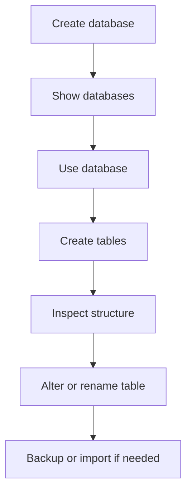

---
prev:
  text: "Lecture 1"
  link: "/College/yearTwo/secondTerm/DBProgramming/Lectures/Lecture-1"
next:
  text: "Lecture 3"
  link: "/College/yearTwo/secondTerm/DBProgramming/Lectures/Lecture-3"
title: Lecture 2
---

# Database Programming - Lecture 2

## MySQL Data Types and Selection Rules

A **data type** specifies what kind of value a column can store, which operations are valid on that value, and how the value is stored. This matters because the wrong type wastes storage, weakens validation, or causes wrong calculations. The lecture groups MySQL types into **numeric**, **string**, **date and time**, and **JSON**. A type also sets boundaries such as range, precision, or format.

| Category          | Stores                        | Main boundary                      |
| ----------------- | ----------------------------- | ---------------------------------- |
| **Numeric**       | Whole numbers, decimals, bits | Range and precision matter         |
| **String**        | Text or binary content        | Length and storage behavior matter |
| **Date and Time** | Date, time, or both           | Format and valid range matter      |
| **JSON**          | Structured JSON objects       | Must follow JSON structure         |

> [!IMPORTANT]
> A column should use the smallest correct type that still fits its values, because type choice affects storage, validation, and query behavior.

## Numeric Types: Exact vs. Approximate

**Integer types** store whole numbers only, including positive and negative values. They do not store fractions. The lecture lists **TINYINT**, **SMALLINT**, **MEDIUMINT**, **INT**, and **BIGINT**, where size changes storage and range. Integer columns can also be **signed** or **unsigned**; unsigned removes negative values and extends the positive range. For decimal numbers, MySQL uses **FLOAT**, **DOUBLE**, and **DECIMAL(M,D)**, where **M** is total digits and **D** is digits after the decimal point. The exam distinction is that **FLOAT** and **DOUBLE** are approximate, while **DECIMAL** is precise.

| Type             | Use                      | Key rule                      |
| ---------------- | ------------------------ | ----------------------------- |
| **INT** family   | Whole numbers            | No fractional part            |
| **FLOAT**        | Decimal values           | Approximate precision         |
| **DOUBLE**       | Larger decimal precision | Still approximate             |
| **DECIMAL(M,D)** | Exact decimal values     | Best when exact value matters |
| **BIT(n)**       | Binary bits              | `n` is from `1` to `64`       |

> [!WARNING]
> _Do not confuse **DECIMAL** with **FLOAT** or **DOUBLE**. They may all show decimals, but only **DECIMAL** is intended for exact financial-style values._

## String, Binary, and JSON Types

**String types** store text or binary content. **CHAR(n)** always stores the full fixed length and pads shorter values with spaces, while **VARCHAR(n)** stores only the actual value length. **CHAR** fits fixed-size values better, but **VARCHAR** is more space-efficient for variable text. For large text, the lecture includes **TINYTEXT**, **TEXT**, **MEDIUMTEXT**, and **LONGTEXT**; for binary data such as files, images, or encrypted content, it includes **TINYBLOB**, **BLOB**, **MEDIUMBLOB**, and **LONGBLOB**. **ENUM** allows one predefined value, while **SET** allows multiple predefined values. **JSON** stores structured **JavaScript Object Notation** data using objects and arrays.

| Type pair                | Meaning                          | Exam trap                                      |
| ------------------------ | -------------------------------- | ---------------------------------------------- |
| **CHAR** vs. **VARCHAR** | Fixed length vs. variable length | `CHAR(10)` pads spaces; `VARCHAR(10)` does not |
| **ENUM** vs. **SET**     | Choose one vs. choose multiple   | Both use predefined values                     |
| **TEXT** vs. **BLOB**    | Text content vs. binary content  | BLOB is not ordinary text                      |

> [!NOTE]
> _JSON objects use `{}` with key-value pairs, while JSON arrays use `[]` with ordered values. The type stores structured JSON, not arbitrary malformed text._

## Date and Time Types with Boundaries

**DATE** stores only a date in `YYYY-MM-DD` format and has range `1000-01-01` to `9999-12-31`. **DATETIME** stores both date and time in `YYYY-MM-DD HH:MM:SS` format with range `1000-01-01 00:00:00` to `9999-12-31 23:59:59`. **TIMESTAMP** uses the same format, but stores values internally in **UTC** and converts them to the session time zone when retrieved. Its range is smaller: `1970-01-01 00:00:01 UTC` to `2038-01-19 03:14:07 UTC`. **TIME** stores only time with range `-838:59:59` to `838:59:59`. The lecture also shows **YEAR** for year-only storage.

| Type          | Stores        | Key boundary                              |
| ------------- | ------------- | ----------------------------------------- |
| **DATE**      | Date only     | No time part                              |
| **DATETIME**  | Date and time | No UTC conversion rule mentioned          |
| **TIMESTAMP** | Date and time | Uses UTC conversion; smaller range        |
| **TIME**      | Time only     | Can store negative and positive durations |
| **YEAR**      | Year only     | Stores year value only                    |

## Database and Table Commands

**CREATE DATABASE** is a **DDL** statement used to create a new database. After creation, **SHOW DATABASES** checks what exists, and **USE database_name** selects one for later commands. The order matters: create first, verify second, select third. If a database name already exists, `CREATE DATABASE` without **IF NOT EXISTS** causes an error, so the safer pattern is `CREATE DATABASE IF NOT EXISTS ...`. The lecture states there is no easy rename path for databases; if the name is wrong, create a new database and delete the old one with **DROP DATABASE**. Backup and restore are handled with **mysqldump** and `mysql` input redirection.



```sql
-- Create a database safely without failing if it already exists
CREATE DATABASE IF NOT EXISTS mydatabase;

-- Show existing databases on the server
SHOW DATABASES;

-- Select the database for later table commands
USE mydatabase;
```

## Table Creation, Inspection, and Modification

**CREATE TABLE** defines a table and its columns, so each column must be paired with a data type. After creation, **SHOW TABLES** lists tables in the current database, while **SHOW FULL TABLES** also shows table type such as **BASE TABLE**, **VIEW**, or **SYSTEM VIEW**. To inspect column structure, the lecture treats **DESCRIBE**, **DESC**, **SHOW COLUMNS**, and **EXPLAIN** as ways to retrieve table definition information. **TRUNCATE TABLE** removes only table data, but keeps the table structure; **DROP TABLE** removes both data and structure. **TEMPORARY TABLE** stores data only for the current client session and is deleted automatically when the session ends. **ALTER TABLE** changes structure by adding, dropping, modifying, or renaming columns.

| Command                       | Keeps structure? | Main use                  |
| ----------------------------- | ---------------- | ------------------------- |
| **TRUNCATE TABLE**            | Yes              | Remove all rows only      |
| **DROP TABLE**                | No               | Remove table completely   |
| **DESCRIBE / DESC / EXPLAIN** | Yes              | Inspect structure         |
| **ALTER TABLE**               | Yes              | Change existing structure |

> [!IMPORTANT]
> _A `DROP` clause in **ALTER TABLE** will not work if the column being dropped is the only column left in the table._

```sql
-- Create a table with explicit column types
CREATE TABLE pet (
  name VARCHAR(20),
  owner VARCHAR(20),
  species VARCHAR(20),
  sex CHAR(1),
  birth DATE,
  death DATE
);

-- Inspect table structure
DESCRIBE pet;

-- Remove rows but keep the table definition
TRUNCATE TABLE pet;
```
