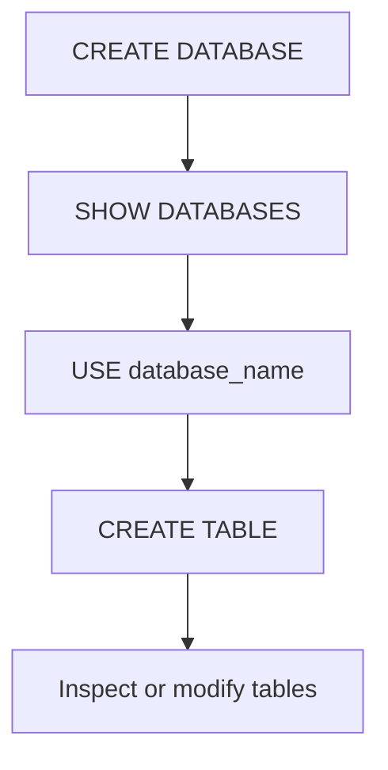

---
prev:
  text: "Lecture 2"
  link: "/College/yearTwo/secondTerm/DBProgramming/Lectures/Lecture-2"
next:
  text: "Lecture 4"
  link: "/College/yearTwo/secondTerm/DBProgramming/Lectures/Lecture-4"
title: Lecture 3
---

# Database Programming - Lecture 3

## Database Creation and Safe Selection

**CREATE DATABASE** is a **DDL** command used to create a new database in **MySQL RDBMS**. This matters because a database must exist before tables can be created inside it. The safe exam pattern is to create the database, verify it with **SHOW DATABASES**, then choose it with **USE** before running table commands. If a database already exists and `CREATE DATABASE` is executed again without **IF NOT EXISTS**, MySQL raises an error. The lecture also states there is no easy direct rename workflow for databases, so a wrong name is corrected by creating a new database and deleting the old one with **DROP DATABASE \[IF EXISTS\]**.



> [!IMPORTANT]
> *`USE` does not require a semicolon, although adding one does no harm. The exam trap is thinking it must end with `;` to work.*

## Backup, Export, and Import Logic

**mysqldump** is the MySQL command-line tool used to create database backups. This matters because destructive operations such as **DROP DATABASE** or **DROP TABLE** cannot be undone safely without a backup. The lecture gives three export forms: export one whole database, export selected tables from a database, or export all databases in a host. Import is done with the `mysql` command-line tool using input redirection, where the backup file content is loaded into a target database. The exam boundary is that **mysqldump** creates the backup file, while `mysql ... < dumpfile_path` restores from that file.

| Operation | Tool | Purpose |
| --------- | ---- | ------- |
| **Export one database** | `mysqldump` | Create one database backup |
| **Export selected tables** | `mysqldump` | Back up only needed tables |
| **Export all databases** | `mysqldump --all-databases` | Full host backup |
| **Import backup** | `mysql` | Restore saved data into a database |

```sql
-- Export one database to a backup file
mysqldump -u username -p database_name > output_file.sql

-- Import a dump file into a target database
mysql -u username -p new_database_name < dumpfile_path
```

## Table Creation and Listing Rules

`CREATE TABLE` creates a table inside the selected database, and every column must be declared with a **data type**. This matters because table structure controls what values can later be inserted. The safer syntax uses `IF NOT EXISTS` to avoid errors if the table name is already present. After creation, `SHOW TABLES` lists tables in the current database. `SHOW FULL TABLES` adds a second output column showing whether each object is a `BASE TABLE`, `VIEW`, or `SYSTEM VIEW`. The lecture also shows `SHOW TABLES IN database_name` and `SHOW TABLES FROM database_name`, which both target a specific database explicitly instead of relying only on the current one.

| Command                 | Returns                  | Boundary                      |
| ----------------------- | ------------------------ | ----------------------------- |
| **SHOW TABLES**         | Table names only         | Uses current database         |
| **SHOW FULL TABLES**    | Names plus object type   | Distinguishes table vs. view  |
| **SHOW TABLES IN db**   | Tables in named database | Database specified explicitly |
| **SHOW TABLES FROM db** | Tables in named database | Same purpose as `IN` here     |

> [!WARNING]
> *Creating a table without selecting the correct database first can place work in the wrong schema or fail, so database selection must happen before table creation.*

## Inspecting Table Structure

To **describe** a table means retrieving its structure, including field names, data types, and constraints. This matters because inspection is how you verify a table before changing or querying it. The lecture treats **SHOW COLUMNS**, **DESCRIBE**, **DESC**, and **EXPLAIN** as structure-inspection commands. **SHOW COLUMNS FROM table_name** lists column details directly. **DESCRIBE** and **DESC** return the same result, with **DESC** only being a shortcut for **DESCRIBE**. **EXPLAIN** is presented in the lecture as a synonym for **DESCRIBE** when checking table definition. A specific column can also be inspected by passing a column name or pattern after the table name in **DESCRIBE** or **DESC**.

| Command | Meaning | Exam trap |
| ------- | ------- | --------- |
| **SHOW COLUMNS** | Show all columns in a table | Focuses on columns only |
| **DESCRIBE** | Show table structure | Full word form |
| **DESC** | Shortcut for `DESCRIBE` | Not a different command result |
| **EXPLAIN** | Lecture treats it as structure synonym | Same structural purpose here |

## Deleting Data vs. Deleting Structure

**TRUNCATE TABLE** deletes only the data inside an existing table, but keeps the table structure for future use. This matters because the table can still accept new rows after truncation. In contrast, **DROP TABLE** deletes both the stored data and the table definition itself. The exam trap is confusing row deletion with structure deletion. The lecture also emphasizes that **DROP TABLE** is dangerous because it cannot be undone unless a backup exists. Another special case is the **TEMPORARY TABLE**, which stores data only for the current client session and is removed automatically when that session ends. Temporary tables are therefore session-scoped, not permanent database objects.

| Command / Type | Data removed | Structure removed | Lifetime |
| -------------- | ------------ | ----------------- | -------- |
| **TRUNCATE TABLE** | Yes | No | Permanent table remains |
| **DROP TABLE** | Yes | Yes | Object removed fully |
| **TEMPORARY TABLE** | Session data | Structure ends with session | Auto-deleted at session end |

> [!IMPORTANT]
> *If the requirement is “empty the table but keep it,” use **TRUNCATE TABLE**, not **DROP TABLE**.*

## ALTER TABLE Operations and Constraints

**ALTER TABLE** modifies the structure of an existing table. This matters because schema design often changes after creation. The lecture groups operations into adding columns, dropping columns, changing type or name, changing default values, adding or removing constraints, and renaming the table. Use **ADD** to add a column, and optionally place it with **FIRST** or **AFTER col_name**. Use **DROP** to remove a column, but the lecture notes that a drop clause does not work if that column is the only one left. Use **MODIFY** to change a column definition, while **CHANGE** renames and modifies a column together. Constraints shown include **PRIMARY KEY**, **FOREIGN KEY**, **UNIQUE**, **NOT NULL**, and default-value changes.

| ALTER option | Main effect | Example idea |
| ------------ | ----------- | ------------ |
| **ADD column** | Add new column | `ADD age INT` |
| **DROP column** | Remove column | `DROP age` |
| **MODIFY column** | Change definition | `MODIFY age TINYINT` |
| **CHANGE column** | Rename and modify | `CHANGE age student_age INT` |
| **ADD UNIQUE** | Enforce uniqueness | `ADD UNIQUE(email)` |
| **RENAME TO** | Rename table | `RENAME TO new_table` |

```sql
-- Add a column and place it after an existing column
ALTER TABLE CUSTOMERS ADD ID INT AFTER NAME;

-- Change a column definition
ALTER TABLE CUSTOMERS MODIFY ID VARCHAR(20);

-- Rename a table
ALTER TABLE CUSTOMERS RENAME TO BUYERS;
```

> [!NOTE]
> *Use **MODIFY** when changing definition only, but use **CHANGE** when the column name itself must also change.*
