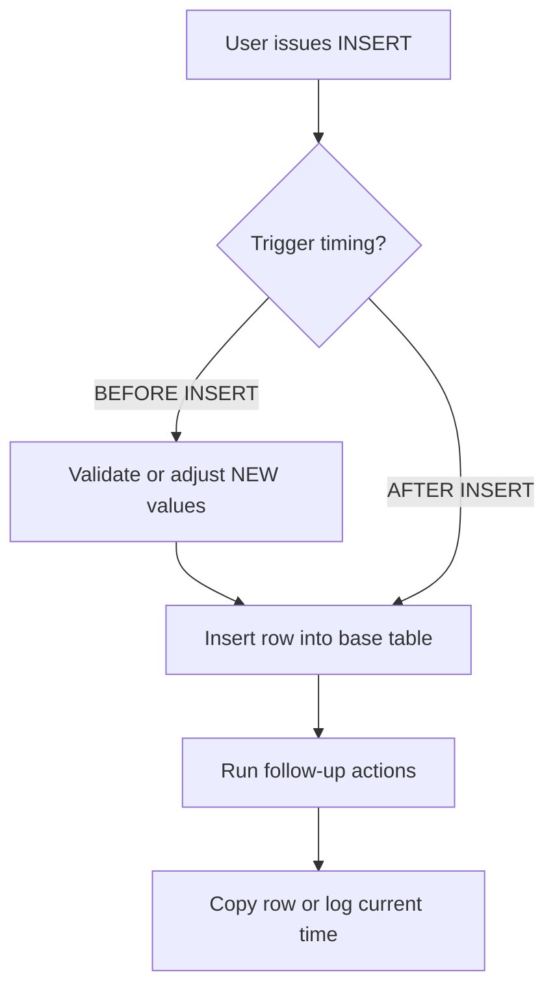

---
prev:
  text: "Lecture 7"
  link: "/College/yearTwo/secondTerm/DBProgramming/Lectures/Lecture-7"
next:
  text: "Lecture 9"
  link: "/College/yearTwo/secondTerm/DBProgramming/Lectures/Lecture-9"
title: Lecture 8
---

# Database Programming - Lecture 8

## Stored Procedures: Definition, Scope, and Call Model

A **stored procedure** is a named collection of precompiled SQL statements stored inside the database. It includes a **procedure name**, an optional **parameter list**, and executable SQL logic, so one `CALL` can perform inserts, updates, calculations, or conditional work. The boundary is that a procedure runs only when called explicitly; it is not automatic, and it is not a virtual table like a view.

Procedures matter because they centralize repeated logic in the database. A **recursive stored procedure** calls itself, but the lecture notes that MySQL does not support recursion well, so treat recursion as a limitation.

```sql
-- Purpose: Define a reusable SQL routine and execute it later with CALL
DELIMITER &&
CREATE PROCEDURE procedure_name ([IN | OUT | INOUT] parameter_name datatype)
BEGIN
  -- declaration section
  -- executable section
END &&
DELIMITER ;

CALL procedure_name();
```

## Procedure Parameters and Data Flow

**IN**, **OUT**, and **INOUT** are the three procedure parameter modes. **IN** sends a value from the caller into the procedure only. **OUT** sends a value out of the procedure, usually into a session variable such as `@M`. **INOUT** does both: the caller provides an initial value, and the procedure returns an updated value through the same parameter.

This matters because the parameter mode defines where data starts and where it finishes after execution.

| Parameter mode | Value enters procedure | Value leaves procedure | Typical use |
| -------------- | ---------------------- | ---------------------- | ----------- |
| **IN**         | Yes                    | No                     | Search/filter input |
| **OUT**        | No                     | Yes                    | Return one result |
| **INOUT**      | Yes                    | Yes                    | Modify passed value |

> [!WARNING]
> _A trigger cannot accept parameters, so do not confuse trigger logic with procedure parameter modes._

## Procedure Management Commands

Procedure management includes **show/list**, **drop**, and limited **alter** operations. To delete one, use **`DROP PROCEDURE [IF EXISTS] procedure_name;`**. The `IF EXISTS` boundary matters because it avoids an error when the object is missing.

**ALTER PROCEDURE** exists, but its scope is narrow. It can change characteristics such as **SQL SECURITY**, **COMMENT**, **DEFINER**, or labels like **NOT DETERMINISTIC** and **CONTAINS SQL**. It cannot change the procedure body or parameter list, so logic changes usually require drop and recreate.

1. **Create** the procedure first because no management command works without an existing object.
2. **Show** it when verifying name or existence before modification.
3. **Alter** only metadata-like characteristics.
4. **Drop** it when the routine is obsolete or must be rebuilt fully.

## Triggers: Automatic Execution and Timing

A **trigger** is a special stored procedure that runs automatically in response to a table event. The main contrast is explicit versus automatic execution: a procedure needs `CALL`, while a trigger fires because a **DML** action occurs. In this lecture, DML means **`INSERT`**, **`UPDATE`**, and **`DELETE`** on a table or view. The boundary is that triggers respond to data-modification events, not manual calls.

The trigger timing keywords shown are **BEFORE INSERT** and **AFTER INSERT**. **BEFORE INSERT** runs before the row is stored, so it suits validation or value adjustment. **AFTER INSERT** runs after insertion succeeds, so it suits follow-up work such as copying data into another table and recording the current time.



> [!IMPORTANT]
> _If the logic needs input parameters, a trigger is the wrong object; use a stored procedure instead._

## Trigger Management and Views

Trigger administration uses **`CREATE TRIGGER`**, **`SHOW TRIGGERS`**, and **`DROP TRIGGER`**. The lecture also highlights **pattern matching** and **`WHERE`** with `SHOW TRIGGERS`, so listings can be filtered. If `DROP TRIGGER IF EXISTS` is used on a missing trigger, MySQL returns a warning rather than an error, and **`SHOW WARNING`** displays that note.

A **view** is a **virtual table** based on the result set of an SQL statement. It has rows and columns like a real table, but its fields come from one or more real tables, so the view stores the query definition rather than independent base data. Views are used to structure data, restrict access, and summarize data for reports.

| Object | Stores executable logic | Runs automatically | Accepts parameters | Acts like a table |
| ------ | ----------------------- | ------------------ | ------------------ | ----------------- |
| **Procedure** | Yes | No | Yes | No |
| **Trigger**   | Yes | Yes | No | No |
| **View**      | No  | No | No | Yes, virtually |

## View Rules and Indexes

Use **`CREATE VIEW`** to build a view from one table, multiple tables, or another view, and use **`ALTER VIEW`** to update the definition without dropping it. The critical condition is **`WITH CHECK OPTION`**, which forces every `INSERT` or `UPDATE` through the view to satisfy the view's own condition. If a row would fall outside the view definition, MySQL rejects the statement. This matters because a view can limit what users may create or modify, not just what they can see.

An **index** is a structure that speeds up record retrieval by creating entries for indexed column values. It improves search performance because MySQL can avoid scanning every row. A **PRIMARY** index is created automatically for a primary key, while other indexes are **non-clustered** or **secondary** indexes. **`CREATE UNIQUE INDEX`** forbids duplicates; plain **`CREATE INDEX`** allows them.

```sql
-- Purpose: Create a filtered virtual table and enforce its condition
CREATE VIEW view_name AS
SELECT column_list
FROM table_name
WHERE condition
WITH CHECK OPTION;

-- Purpose: Speed up lookups on frequently searched columns
CREATE INDEX index_name ON table_name (column_name);
CREATE UNIQUE INDEX index_name ON table_name (column_name);
```

> [!NOTE]
> _Indexes mainly improve lookup speed; only a unique index also enforces no-duplicate values._
