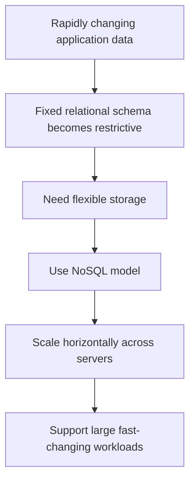

---
prev:
  text: "Lecture 8"
  link: "/College/yearTwo/secondTerm/DBProgramming/Lectures/Lecture-8"
next: false
title: Lecture 9
---

# Database Programming - Lecture 9

## RDBMS Limits That Led to NoSQL

A **Relational Database Management System (RDBMS)** stores data in fixed tables with predefined columns and data types. This is strong for structured data, but the lecture focuses on where it becomes restrictive. In an RDBMS, a record must fit the schema, unused fields often become **`NULL`**, data types must match the column definition, and multiple values should not be packed into one field because that breaks normalization and usually forces extra tables, keys, and joins.

The main limits are performance, scalability, rigidity, and cost. RDBMS handle **structured data** well but struggle with **unstructured** or **semi-structured data** such as multimedia, emails, and social media content. They usually scale **vertically**, meaning a single server is made stronger, which becomes expensive and has hardware limits. A fixed schema also makes frequent change risky in large systems.

> [!IMPORTANT]
> _The exam trap is not that RDBMS are bad; the real point is that they are less suitable when data changes often, grows massively, or does not fit clean table structures._

## NoSQL: Definition, Need, and Boundaries

**NoSQL** stands for **Not Only SQL**. It is a class of **non-relational data storage systems** built to manage **structured**, **semi-structured**, and **unstructured data** without requiring a fixed table schema. The lecture boundary is explicit: NoSQL databases do not depend on the relational model's fixed tables and do not use joins as a core design idea.

NoSQL became necessary because of the explosion of social media platforms, cloud storage growth such as **Amazon S3**, frequent schema changes in modern applications, and the expansion of the open-source community. These pressures favored systems that could adapt quickly and scale across many servers instead of depending on one increasingly powerful machine.

The lecture also lists features NoSQL historically did not provide in the same way as classic relational systems: **joins**, **GROUP BY**, and full **ACID transactions**. This matters because NoSQL often trades some relational features for scalability and speed.

| Concept       | RDBMS                | **NoSQL**                          |
| ------------- | -------------------- | ---------------------------------- |
| Schema        | Fixed                | **Schema-less or flexible**        |
| Data model    | Tables and relations | **Multiple non-relational models** |
| Scaling style | Vertical             | **Horizontal**                     |
| Joins         | Core feature         | **Usually reduced or avoided**     |

## NoSQL Characteristics

The first major characteristic is **schema-less design**, meaning each record or document can have a different structure. This matters because applications can evolve without repeatedly redesigning rigid tables. The second is **horizontal scalability**, which means the system scales out across multiple servers. This is important for cloud and big-data workloads because adding machines is often easier than endlessly upgrading one server.

The third characteristic is **high performance**, especially for fast reads and writes in real-time web applications. The fourth is **flexible data models**, which may include **JSON**, **XML**, **key-value pairs**, or **graph structures**. The fifth is **no complex joins**, meaning NoSQL often improves speed by reducing relational cross-table operations.

> [!WARNING]
> _Schema-less does not mean structure-free. It means the structure can vary between records instead of being locked before storage._

## NoSQL Types and Best Fit

The lecture gives four main **NoSQL types**, and exam questions often ask you to match each type to its data shape. A **key-value data model** stores data as a key and its associated value. It works well when retrieval is based mainly on a unique lookup key. A **column-oriented database** stores data by columns rather than only by complete rows and is used in the lecture for **time-series data**, such as temperature readings over time.

A **document-oriented database** stores records as self-contained documents, often with flexible internal fields. This works well when one object may need slightly different attributes from another. A **graph data model** stores data as nodes and relationships, so it is suitable when the connection between records is as important as the records themselves.

| **NoSQL type**        | Core idea                 | Best fit from lecture logic |
| --------------------- | ------------------------- | --------------------------- |
| **Key-value**         | One key maps to one value | Fast lookup by key          |
| **Column-oriented**   | Data organized by columns | **Time-series data**        |
| **Document-oriented** | Flexible document records | Varying record structures   |
| **Graph**             | Nodes plus relationships  | Relationship-heavy data     |

## SQL vs. NoSQL Comparison Logic

**SQL** systems are relational, schema-driven, and join-oriented. They are strong when the data structure is stable and relational integrity is the main priority. **NoSQL** systems are non-relational, flexible, and designed for scale-out workloads. They are strong when the data model changes often, when very large volumes must be distributed across servers, or when quick reads and writes matter more than traditional relational features.

The exam comparison should be phrased as trade-offs, not winners and losers. If the requirement is fixed structure, strict relational design, and traditional transactions, **SQL** is the better fit. If the requirement is rapid schema change, big data, cloud distribution, or unstructured content, **NoSQL** is the better fit.

1. Choose **SQL** when relationships, joins, and stable schemas are the main need.
2. Choose **NoSQL** when flexibility, distributed scaling, and mixed data formats are the main need.
3. Check the data shape first because the model choice follows the structure of the data.

> [!NOTE]
> _The phrase **Not Only SQL** does not mean SQL is removed from computing; it means non-relational systems were created to solve problems that classic relational systems handle less efficiently._
