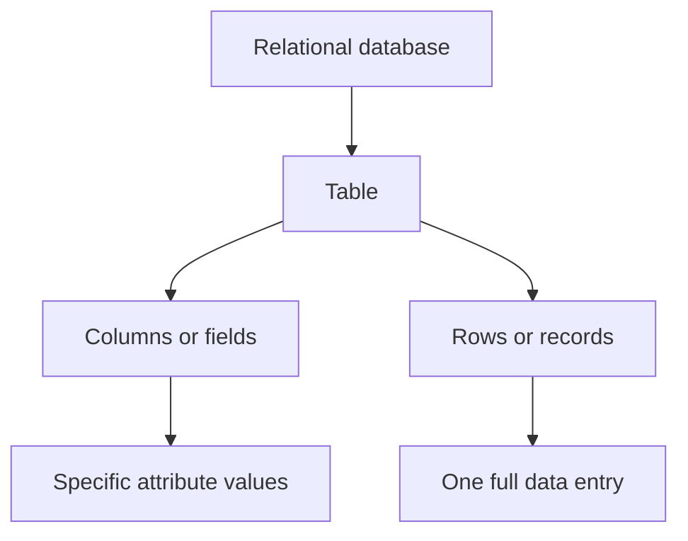

---
prev:
  text: "Sections"
  link: "/College/yearTwo/secondTerm/DBProgramming/Sections/index"
next:
  text: "Section 2"
  link: "/College/yearTwo/secondTerm/DBProgramming/Sections/Section-2"
title: Section 1
---

# Database Programming - Section 1

## SQL: Definition, Scope, and Core Purpose

**Structured Query Language (SQL)** is a programming language used to store and process information in a **relational database**. A relational database stores data in **tables** made of **rows** and **columns**, with relationships between values as part of the design. SQL is not just for reading data; it can store, update, delete, search, retrieve, maintain, and optimize database information.

The boundary is important for exams: SQL is the language, while **MySQL** is a relational database program that uses SQL queries. SQL defines commands; MySQL executes them.

| Term | Meaning | Boundary |
| ---- | ------- | -------- |
| **SQL** | Language for database operations | Not the database software itself |
| **Relational database** | Data stored in related tables | Not graph, document, or key-value storage |
| **MySQL** | Open-source relational DBMS | Uses SQL rather than replacing it |

## SQL System Components and Data Units

A **SQL table** is the most common and simplest storage form in a relational database. A table contains **rows** and **columns**, and relationships between tables reduce duplication. A **field** or **attribute** is a column designed to hold one specific type of information for every record. A **record** or **row** is one complete entry in the table. A **column** is the vertical set of values for one field across all records.

A **NULL value** means a field has no value. This matters because **`NULL`** is different from **`0`** and different from spaces; it represents missing or unspecified data, not zero quantity and not text content. If an exam asks whether blank, zero, and null are identical, the correct answer is no.



> [!WARNING]
> _A **`NULL`** value is not the same as `0` and not the same as a space-filled field._

## Constraints and Statement Structure

**Constraints** are rules enforced on table columns to limit what data can be stored. They improve **accuracy** and **reliability** by preventing invalid values. The lecture distinguishes **column-level constraints**, which apply to one column only, from **table-level constraints**, which apply to the whole table.

**SQL statements** or **SQL queries** are valid instructions understood by a relational DBMS. They are built from elements such as identifiers, variables, and search conditions. An **`INSERT`** statement stores a new record in a table.

```sql
-- Purpose: Insert one new record into a table
INSERT INTO Mattress_table (brand_name, cost)
VALUES ('A', '499');
```

> [!IMPORTANT]
> _A query is valid only when it follows SQL syntax and semantics; a malformed statement is rejected before execution._

## How SQL Works Internally

When an SQL statement is submitted, the **parser** processes it first. The parser **tokenizes** the statement, checks **correctness**, and checks **authorization**. Correctness means the statement follows SQL rules. If required syntax is missing, such as a missing semicolon in the lecture example, the parser returns an error.

Authorization means the parser verifies whether the user has permission to perform the requested action. A syntactically correct query can still fail if the user is not allowed to manipulate the target data.

1. The user submits an SQL statement.
2. The **parser** tokenizes and analyzes it.
3. The system checks **correctness** against SQL rules.
4. The system checks **authorization** for the user.
5. The DBMS executes the command only if both checks succeed.

## SQL Command Categories

SQL commands are grouped by purpose. **Data Definition Language (DDL)** designs or changes database structure and includes commands such as **`CREATE`**. **Data Query Language (DQL)** retrieves stored data and is represented by **`SELECT`**. **Data Manipulation Language (DML)** adds or changes records and includes commands such as **`INSERT`**. The lecture also mentions **`TRUNCATE TABLE`**, which deletes table data but not the table itself.

**Data Control Language (DCL)** manages access rights, such as **`GRANT`**, while **Transaction Control Language (TCL)** manages transaction outcomes, such as **`ROLLBACK`** to undo an erroneous transaction. The exam trap is confusing structure commands with data commands.

| Category | Main purpose | Example command | Key boundary |
| -------- | ------------ | --------------- | ------------ |
| **DDL** | Define structure | **`CREATE`** | Changes objects, not row content |
| **DQL** | Retrieve data | **`SELECT`** | Reads without defining structure |
| **DML** | Insert or modify data | **`INSERT`** | Changes records |
| **DCL** | Control permissions | **`GRANT`** | Manages user access |
| **TCL** | Control transactions | **`ROLLBACK`** | Reverses transaction effects |

## Normalization, Integrity, and Security

**Database normalization** is the process of organizing data efficiently. Its two main goals are eliminating **redundant data** and ensuring **data dependencies make sense**, meaning only related data should be stored together. This reduces wasted space and improves logical consistency.

The lecture also names **data integrity**, especially **entity integrity**, which ensures there are no duplicate rows in a table. On the security side, **SQL injection** is a cyberattack that tricks the database with malicious SQL queries to retrieve, modify, or corrupt data. This matters because user input must never be treated as trusted SQL.

Finally, the section contrasts **SQL** and **NoSQL**. SQL is suited to **transactional** and **analytical applications** and stores data in **tabular form**. **NoSQL** refers to **non-relational databases** that do not use tables as their primary model and may store **graphs**, **documents**, **columns**, or **key-values**, making them more suitable for **responsive, heavy-usage applications**.

> [!NOTE]
> _Normalization improves storage logic, while SQL injection is a security threat; they are unrelated concepts that are often tested near each other because both affect database quality._
