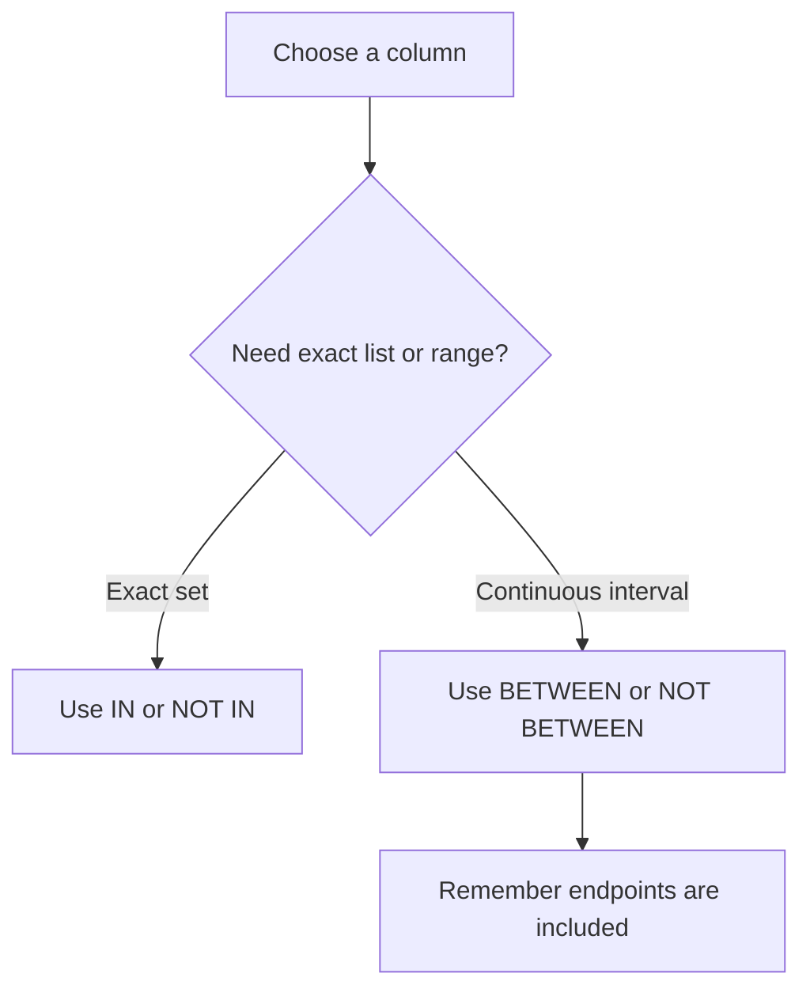

---
prev:
  text: "Section 2"
  link: "/College/yearTwo/secondTerm/DBProgramming/Sections/Section-2"
next:
  text: "Section 4"
  link: "/College/yearTwo/secondTerm/DBProgramming/Sections/Section-4"
title: Section 3
---

# Database Programming - Section 3

## SQL Aliases: Purpose, Scope, and Limits

An **SQL alias** is a temporary name given to a **table** or a **column** during a query. This matters because aliases improve readability, shorten repeated names, and make combined or calculated output easier to understand. The key boundary is that an alias exists only for the duration of that query; it does not rename the real table or column in the database.

Aliases are usually created with the **`AS`** keyword. They are especially useful when multiple tables appear in one query, when functions are used, when column names are long, or when several columns are combined into one displayed result. If the alias contains spaces, the lecture notes that it requires **double quotation marks** or **square brackets**.

```sql
-- Purpose: Rename output columns or tables only inside the current query
SELECT CustomerID AS ID, CustomerName AS Name
FROM Customers AS c;
```

> [!WARNING]
> _An alias changes the query output label, not the stored schema._

## Column Aliases vs. Table Aliases

A **column alias** changes how a result column is displayed, while a **table alias** creates a short reference name for a table inside the query. This distinction matters because column aliases improve output readability, but table aliases simplify query writing and join conditions.

If two or more columns are combined into one result, a column alias is often used to label the combined expression. If two or more tables are involved, table aliases reduce repetition and make each column source easier to identify. In joined queries, using aliases can prevent ambiguity when tables share column names.

| Alias type | Applied to | Main benefit | Boundary |
| ---------- | ---------- | ------------ | -------- |
| **Column alias** | Result column | Better output name | Does not shorten table references |
| **Table alias** | Table in query | Shorter query syntax | Does not rename table permanently |

## GROUP BY and Aggregate Logic

The **`GROUP BY`** statement groups rows that share the same value into **summary rows**. This matters because raw rows stay separate until `GROUP BY` collects them into one result per group. The lecture pairs `GROUP BY` with aggregate functions such as **`COUNT()`**, **`MAX()`**, **`MIN()`**, **`SUM()`**, and **`AVG()`**, so the grouped output usually shows one computed result for each group.

If the question asks why grouping is used, the answer is that aggregation without grouping produces one overall result, but aggregation with `GROUP BY` produces one result per repeated category. The grouped rows can also be sorted after grouping, such as listing country counts from highest to lowest.

```sql
-- Purpose: Count rows inside each repeated category
SELECT Country, COUNT(*) AS CustomerCount
FROM Customers
GROUP BY Country;
```

## IN Operator: Multiple Exact Matches

The **`IN`** operator tests whether a value matches any item in a listed set. This matters because `IN` is shorthand for multiple **`OR`** conditions written more compactly. If the same column must be compared with several exact values, `IN` reduces repetition and makes the condition easier to read.

The opposite form, **`NOT IN`**, excludes all listed values. The lecture also shows that `IN` can compare against a **subquery**, not only against a fixed list, so the accepted values may come from another table. The boundary is that `IN` checks exact membership in a set; it does not search ranges or patterns.

```sql
-- Purpose: Match one column against several exact values
SELECT *
FROM Customers
WHERE Country IN ('Germany', 'France', 'UK');
```

> [!IMPORTANT]
> _Use **`IN`** for exact listed values, not for partial text matching or numeric ranges._

## BETWEEN: Inclusive Ranges for Numbers, Text, and Dates

The **`BETWEEN`** operator selects values inside a given range, and the lecture states clearly that it is **inclusive**. This means both the beginning value and the ending value are included in the result. The boundary matters because a common exam trap is assuming `BETWEEN` excludes one or both endpoints.

`BETWEEN` can be used with **numbers**, **text**, and **dates**. **`NOT BETWEEN`** returns values outside the range. The lecture also combines `BETWEEN` with `IN`, which shows that range filtering and set exclusion can be used together in the same `WHERE` clause.



| Operator | Best use | Includes endpoints? |
| -------- | -------- | ------------------- |
| **IN** | Exact listed values | Not a range |
| **BETWEEN** | Continuous range | **Yes** |

## LIKE and Wildcard Pattern Matching

The **`LIKE`** operator searches for a specified pattern inside a column, usually in a `WHERE` clause. This matters because `LIKE` is used when exact equality is too strict and partial text matching is needed. The lecture gives two wildcard symbols: **`%`** represents zero, one, or many characters, while **`_`** represents exactly one character.

If a name must start with `a`, a pattern like `a%` is used. If a letter must appear in the second position, the underscore wildcard helps express that fixed-position rule. The boundary is that `%` is variable-length matching, while `_` is single-character matching only.

```sql
-- Purpose: Search by text pattern instead of exact equality
SELECT *
FROM Customers
WHERE CustomerName LIKE 'a%';
```

> [!NOTE]
> _Use **`LIKE`** for patterns, **`IN`** for exact listed values, and **`BETWEEN`** for inclusive ranges; confusing these operators changes query meaning._
