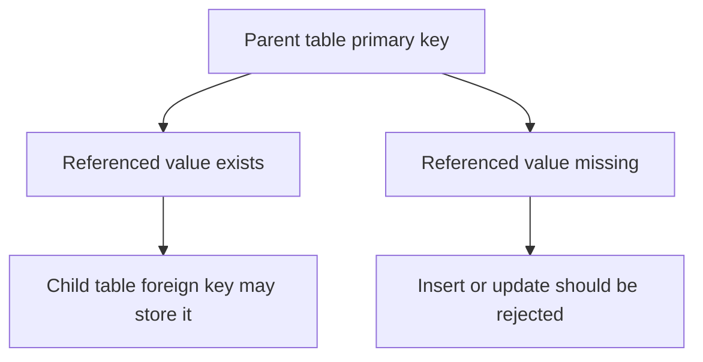

---
prev:
  text: "Section 3"
  link: "/College/yearTwo/secondTerm/DBProgramming/Sections/Section-3"
next:
  text: "Section 5"
  link: "/College/yearTwo/secondTerm/DBProgramming/Sections/Section-5"
title: Section 4
---

# Database Programming - Section 4

## PRIMARY KEY: Identity and Boundaries

A **PRIMARY KEY** is a constraint that uniquely identifies each record in a table. This matters because the database needs one reliable way to distinguish every row from every other row. A primary key must contain **unique values** and cannot contain **`NULL`** values, so it combines uniqueness with mandatory presence.

The lecture’s key boundary is that a table can have only **one** primary key, but that one key may contain **one column** or **multiple columns**. If multiple columns are used together, the result is a **composite primary key**. This does not mean the table has several primary keys; it still has one primary key made from multiple fields.

| Property | **PRIMARY KEY** rule |
| -------- | -------------------- |
| Uniqueness | Required |
| `NULL` allowed | No |
| Count per table | One only |
| Columns used | One or many |

## PRIMARY KEY on CREATE TABLE vs. ALTER TABLE

A primary key can be defined when the table is created or added later with **`ALTER TABLE`**. This matters because the timing changes the preparation required. On **`CREATE TABLE`**, the key is part of the original schema design. On **`ALTER TABLE`**, the table already exists, so the column data must already satisfy the primary key rules before the constraint can be added.

If the table already contains duplicates or nulls in the intended key column, adding the primary key later will fail. The order matters: first ensure valid existing data, then apply the key constraint.

```sql
-- Purpose: Define a primary key when the table is created
CREATE TABLE Persons (
  ID INT,
  LastName VARCHAR(255),
  CONSTRAINT PK_Person PRIMARY KEY (ID)
);

-- Purpose: Add a primary key to an existing table
ALTER TABLE Persons
ADD CONSTRAINT PK_Person PRIMARY KEY (ID);
```

> [!IMPORTANT]
> _A composite key made from `ID + LastName` is still one primary key, not two._

## FOREIGN KEY: Parent-Child Relationship Logic

A **FOREIGN KEY** is a field, or collection of fields, in one table that refers to the **PRIMARY KEY** in another table. This matters because it preserves valid relationships between tables. The table that contains the foreign key is the **child table**, and the table whose primary key is referenced is the **parent table** or **referenced table**.

The lecture emphasizes that a foreign key prevents invalid data from being inserted into the child column because the value must already exist in the parent table. This boundary is central: a foreign key does not create uniqueness in the child table; it protects the link between tables.



## FOREIGN KEY Creation and Removal

A foreign key can be created during **`CREATE TABLE`** or later with **`ALTER TABLE`**. This matters because the logic is similar to primary key creation, but the validation now depends on another table. If the child table contains values not found in the parent table, the foreign key constraint cannot be added successfully.

The lecture also includes dropping a foreign key constraint. That removes the enforced relationship rule, so later child values are no longer checked against the parent key. The exam trap is confusing relationship enforcement with physical data copying; the foreign key stores a reference, not a copy of the parent row.

| Constraint | Main purpose | Depends on another table? |
| ---------- | ------------ | ------------------------- |
| **PRIMARY KEY** | Identify each row uniquely | No |
| **FOREIGN KEY** | Protect table relationships | Yes |

## SQL Statements and SELECT Basics

An **SQL statement** is a command sent to the database system. The lecture lists common statements such as **`SELECT`**, **`UPDATE`**, **`DELETE`**, **`INSERT INTO`**, and **`CREATE INDEX`**. This matters because each statement class changes or retrieves data in a different way.

The **`SELECT`** statement retrieves data from a database, and its output is called a **result-set**. If specific columns are needed, list them by name. If all columns are needed, use **`SELECT *`**. The lecture also notes that SQL keywords are **not case sensitive**, so `select` and `SELECT` are treated the same. Many systems also require a **semicolon** at the end of each statement, especially when separating multiple statements.

```sql
-- Purpose: Retrieve selected columns from a table
SELECT CustomerName, City
FROM Customers;

-- Purpose: Retrieve all columns from a table
SELECT *
FROM Customers;
```

## Comments and SQL Operator Categories

**SQL comments** explain code or prevent part of a statement from executing. **Single-line comments** start with **`--`** and continue to the end of the line. **Multi-line comments** start with **`/*`** and end with **`*/`**. This matters because comments can document logic or temporarily disable code without deleting it.

The lecture also groups **SQL operators** into categories: **arithmetic**, **bitwise**, **comparison**, **compound**, and **logical** operators. These categories matter because operators define how SQL expressions calculate values, compare values, combine conditions, or manipulate bits. The exam focus is classification and purpose rather than memorizing every symbol from the slides.

```sql
-- Purpose: Explain or temporarily disable parts of SQL code
SELECT * FROM Customers; -- single-line comment

/* multi-line comment
  used for longer explanations
*/
SELECT * FROM Orders;
```

> [!NOTE]
> _Comments affect readability, not stored data; operators affect evaluation, filtering, or calculation inside statements._
