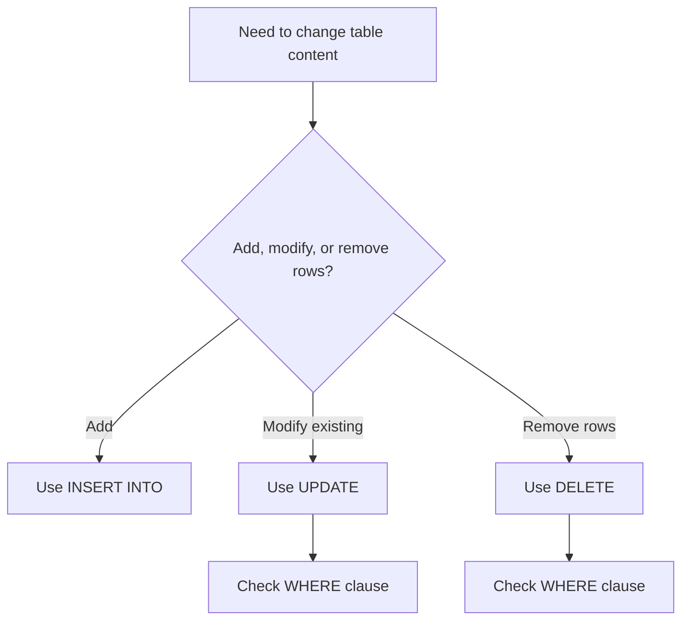

---
prev:
  text: "Section 5"
  link: "/College/yearTwo/secondTerm/DBProgramming/Sections/Section-5"
next:
  text: "Section 7"
  link: "/College/yearTwo/secondTerm/DBProgramming/Sections/Section-7"
title: Section 6
---

# Database Programming - Section 6

## DISTINCT and WHERE: Removing Duplicates vs. Filtering Rows

**`SELECT DISTINCT`** returns only different values, while **`WHERE`** filters rows that satisfy a condition. This matters because the two clauses solve different problems: `DISTINCT` removes duplicates from the returned values, but `WHERE` decides which rows enter the result at all. If a column contains repeated countries and the exam asks for unique country names, `DISTINCT` is the correct tool.

The boundary is that `DISTINCT` does not test truth conditions; it only removes repeated result values. `WHERE` can be used not only in `SELECT`, but also in **`UPDATE`** and **`DELETE`**, so its effect can be much more dangerous when changing data.

```sql
-- Purpose: Return only unique values from a column
SELECT DISTINCT Country
FROM Customers;

-- Purpose: Return only rows that match a condition
SELECT *
FROM Customers
WHERE Country = 'Mexico';
```

## WHERE Conditions, Data Types, and Boolean Logic

The **`WHERE`** clause extracts only records that fulfill a specified condition. This matters because every later operation works only on the filtered rows. The lecture highlights a key syntax boundary: **text values** should be enclosed in quotes, while **numeric values** should not. Using the wrong form can cause errors or incorrect comparisons.

`WHERE` conditions are often combined with **`AND`**, **`OR`**, and **`NOT`**. **`AND`** requires all connected conditions to be true. **`OR`** requires at least one condition to be true. **`NOT`** reverses the truth of a condition. Parentheses matter in complex expressions because they control grouping and therefore the final logic.

| Operator  | Result rule                 | Exam trap                 |
| --------- | --------------------------- | ------------------------- |
| **`AND`** | All conditions must be true | Stronger filter than `OR` |
| **`OR`**  | Any condition may be true   | Can return many more rows |
| **`NOT`** | Reverses the condition      | Must be placed carefully  |

> [!IMPORTANT]
> _In complex filters, parentheses decide how `AND` and `OR` combine; without them, the meaning may change._

## ORDER BY: Sorting Rules and Multi-Column Priority

The **`ORDER BY`** keyword sorts the result-set. By default, sorting is **ascending**, and **`DESC`** is required for descending order. This matters because sorting changes display order, not which rows are selected. If the question asks for records from highest to lowest or alphabetically by country, `ORDER BY` controls the answer format.

The lecture also shows sorting by **several columns**. In multi-column sorting, SQL sorts by the first column first. If multiple rows have the same value there, it then sorts those tied rows by the next column. Each column can use its own direction, such as ascending by country and descending by customer name.

```sql
-- Purpose: Sort by one column or by multiple priorities
SELECT *
FROM Customers
ORDER BY Country ASC, CustomerName DESC;
```

## INSERT INTO: Adding New Records Safely

The **`INSERT INTO`** statement adds new records to a table. This matters because insertion affects table content without changing structure. The lecture gives two forms: one where column names are listed explicitly, and one where all column values are supplied in the table's defined order. Listing columns is safer because it makes the value-to-column mapping explicit.

The lecture also notes that an **auto-increment** field, such as `CustomerID`, is generated automatically when a new record is inserted, so the value does not need to be provided manually. If only some columns are listed, the insert applies only to those columns and leaves the rest to defaults, nulls, or automatic generation.

```sql
-- Purpose: Insert a new row with explicit column mapping
INSERT INTO Customers (CustomerName, City, Country)
VALUES ('New Customer', 'Cairo', 'Egypt');
```

## NULL Testing and UPDATE Logic

A **`NULL`** value means a field has no value. The lecture emphasizes that `NULL` cannot be tested with normal comparison operators such as **`=`**, **`<`**, or **`<>`**. This matters because `NULL` is not a normal comparable value; use **`IS NULL`** or **`IS NOT NULL`** instead.

The **`UPDATE`** statement modifies existing records. Its most critical boundary is the **`WHERE`** clause: if `WHERE` is omitted, **all records** in the table are updated. This makes `UPDATE` one of the highest-risk statements in SQL. If `WHERE Country = 'Mexico'` is used, multiple rows may change; if `WHERE CustomerID = 1` is used, only one intended row should change.

```sql
-- Purpose: Test for missing values and update targeted rows
SELECT * FROM Customers WHERE Address IS NULL;
SELECT * FROM Customers WHERE Address IS NOT NULL;

UPDATE Customers
SET ContactName = 'Juan'
WHERE Country = 'Mexico';
```

> [!WARNING]
> _Never use `=` to test `NULL`, and never run `UPDATE` without checking its `WHERE` clause._

## DELETE: Removing Rows Without Dropping the Table

The **`DELETE`** statement removes existing records from a table. This matters because it changes table data while keeping the table structure, attributes, and indexes intact. The lecture explicitly distinguishes deleting rows from deleting the whole table.

As with `UPDATE`, the **`WHERE`** clause is the safety boundary. If `WHERE` is omitted, all rows in the table are deleted. If a specific condition is supplied, only matching rows are removed. The exam trap is confusing `DELETE` with dropping a table: `DELETE` removes records, but the table definition remains.



> [!NOTE]
> _`INSERT INTO` adds rows, `UPDATE` changes existing rows, and `DELETE` removes rows; none of them change the table schema itself._
