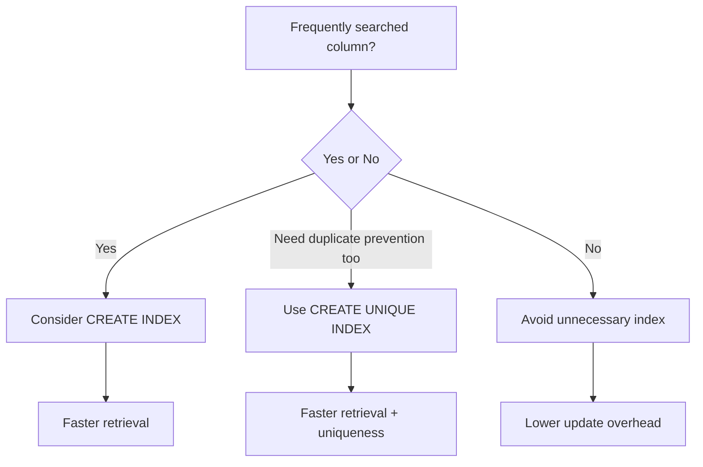

---
prev:
  text: "Section 7"
  link: "/College/yearTwo/secondTerm/DBProgramming/Sections/Section-7"
next:
  text: "Section 9"
  link: "/College/yearTwo/secondTerm/DBProgramming/Sections/Section-9"
title: Section 8
---

# Database Programming - Section 8

## LIMIT Clause: Restricting Returned Rows

The section starts with the **`LIMIT`** clause in MySQL. Its purpose is to restrict how many rows a query returns. This matters most with large tables, because returning thousands of records can reduce performance and make the result harder to inspect. If an exam question asks for the first few records only, `LIMIT` is the direct answer.

The boundary is that `LIMIT` affects the **number of rows in the result**, not the table itself. It does not delete, update, or permanently hide records. It is usually used with **`SELECT`**, and it becomes more meaningful when combined with **`ORDER BY`**, because then the limited rows follow a defined sorting rule instead of an arbitrary order.

```sql
-- Purpose: Return only a limited number of rows
SELECT *
FROM Customers
LIMIT 3;

-- Purpose: Filter first, then restrict the result size
SELECT *
FROM Customers
WHERE Country = 'Germany'
LIMIT 2;
```

> [!IMPORTANT]
> _`LIMIT` only reduces the displayed result set. It does not remove rows from the database._

## CHECK Constraint: Restricting Allowed Values

The **`CHECK`** constraint is used to limit the value range that can be placed in a column. This is a data-integrity rule, so its role is preventive: it stops invalid data before it is stored. For example, if a table must allow only ages `18` or older, a `CHECK` constraint can enforce that rule automatically.

There are two important boundaries in the slides. If a `CHECK` constraint is defined on a **single column**, it controls valid values for that column only. If it is defined at the **table level**, it can use more than one column and enforce a condition involving multiple values in the same row.

| CHECK usage            | Scope                        | Example meaning                |
| ---------------------- | ---------------------------- | ------------------------------ |
| **Column-level CHECK** | One column                   | `Age >= 18`                    |
| **Table-level CHECK**  | One or more columns together | Rule depends on several values |

```sql
-- Purpose: Enforce a valid age during table creation
CREATE TABLE Persons (
  ID int,
  LastName varchar(255),
  FirstName varchar(255),
  Age int,
  CHECK (Age >= 18)
);
```

The lecture also shows that `CHECK` can be created when the table already exists by using **`ALTER TABLE`**. Naming the constraint is useful because the same name can later be referenced when dropping it.

```sql
-- Purpose: Add a named CHECK constraint to an existing table
ALTER TABLE Persons
ADD CONSTRAINT CHK_Person CHECK (Age >= 18);
```

To remove the rule, use a statement that **drops the CHECK constraint**. The exact syntax can differ between database systems, but the lecture point is the operation itself: a named constraint can be removed after creation.

> [!WARNING]
> _A `CHECK` constraint prevents invalid inserts or updates; it is not just documentation._

## CREATE INDEX: Faster Search with Update Cost

The **`CREATE INDEX`** statement is used to create indexes on tables. An **index** helps the database retrieve data more quickly, especially on columns that are searched often. The user does not normally see the index directly in query output, but the database engine uses it internally to improve lookup speed.

The main tradeoff is also stated clearly in the lecture: updating a table with indexes takes more time than updating a table without indexes, because the index must also be updated. This means indexes should be created on columns that are **frequently searched**, not everywhere.

| Index type                | Duplicate values | Main effect                            |
| ------------------------- | ---------------- | -------------------------------------- |
| **`CREATE INDEX`**        | Allowed          | Improves search speed                  |
| **`CREATE UNIQUE INDEX`** | Not allowed      | Improves speed and prevents duplicates |

```sql
-- Purpose: Create a normal index on one column
CREATE INDEX idx_lastname
ON Persons (LastName);

-- Purpose: Create a unique index
CREATE UNIQUE INDEX idx_email
ON Persons (Email);
```

The lecture also notes that an index can be created on a **combination of columns** by listing multiple column names inside parentheses. This is useful when searches regularly depend on more than one field together.

```sql
-- Purpose: Create an index on multiple columns
CREATE INDEX idx_name
ON Persons (LastName, FirstName);
```

If an index is no longer needed, use **`DROP INDEX`** to delete it from the table.



> [!NOTE]
> _Indexes improve retrieval speed, but they add maintenance cost during insert, update, and delete operations._

## AUTO_INCREMENT: Automatic Key Generation

The last topic is **`AUTO_INCREMENT`**, which allows a unique number to be generated automatically whenever a new record is inserted into a table. This is usually applied to a **primary key** column such as `Personid`. The purpose is to avoid manually entering a new unique identifier for every row.

In MySQL, the keyword is **`AUTO_INCREMENT`**. By default, the starting value is `1`, and it increases by `1` for each new record. The lecture also notes that the starting value can be changed if a different sequence start is required.

```sql
-- Purpose: Define an automatically generated primary key
CREATE TABLE Persons (
  Personid int NOT NULL AUTO_INCREMENT,
  LastName varchar(255) NOT NULL,
  FirstName varchar(255),
  PRIMARY KEY (Personid)
);
```

When inserting a new record, the auto-increment column does **not** need to be supplied manually. The database generates it automatically, while the remaining provided columns are stored normally.

```sql
-- Purpose: Insert a row without specifying the auto-generated key
INSERT INTO Persons (FirstName, LastName)
VALUES ('Lars', 'Monsen');
```

## High-Yield Contrast Pairs

| Pair                                             | Key difference                                                       |
| ------------------------------------------------ | -------------------------------------------------------------------- |
| **`LIMIT`** vs. **`WHERE`**                      | `LIMIT` restricts row count; `WHERE` filters by condition            |
| **Column CHECK** vs. **Table CHECK**             | One controls a single column; the other can compare multiple columns |
| **`CREATE INDEX`** vs. **`CREATE UNIQUE INDEX`** | Normal index allows duplicates; unique index blocks them             |
| **Index speed** vs. **Index cost**               | Faster retrieval but slower updates                                  |
| **Manual key entry** vs. **`AUTO_INCREMENT`**    | User enters the key manually vs. database generates it               |
