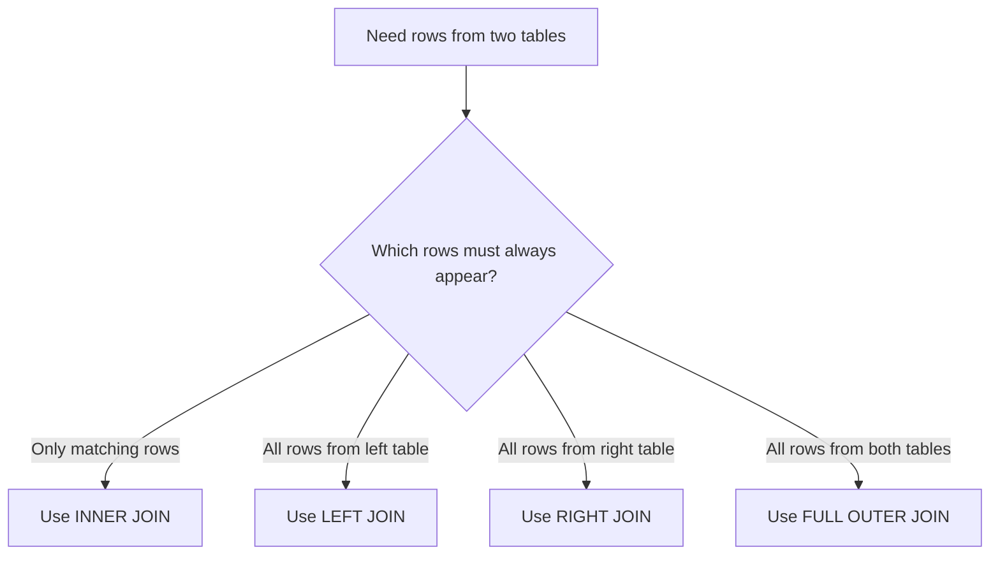

---
prev:
  text: "Section 8"
  link: "/College/yearTwo/secondTerm/DBProgramming/Sections/Section-8"
next: false
title: Section 9
---

# Database Programming - Section 9

## SQL JOINS: Combining Rows from Related Tables

A **`JOIN`** clause combines rows from two or more tables based on a related column. This matters because query data is often split across tables such as `Orders`, `Customers`, `Employees`, and `Shippers`.

The key boundary is that a join does **not** merge tables permanently. It builds a result set by matching rows, and each join type differs in how it handles unmatched rows.

| Join type | What it returns | Key boundary |
| --------- | --------------- | ------------ |
| **`INNER JOIN`** | Only matching rows in both tables | Unmatched rows are excluded |
| **`LEFT JOIN`** | All rows from left table + matching right rows | Left side always appears |
| **`RIGHT JOIN`** | All rows from right table + matching left rows | Right side always appears |
| **`FULL OUTER JOIN`** | All rows from both tables | Can produce a very large result |
| **`SELF JOIN`** | A table joined with itself | Requires aliases |
| **`CROSS JOIN`** | Every row of table1 with every row of table2 | Row counts multiply |

## INNER JOIN: Keep Only Matches

**`INNER JOIN`** selects records that have matching values in both tables. If an order has no matching customer, that order does not appear.

```sql
-- Purpose: Return only orders that have matching customers
SELECT Orders.OrderID, Customers.CustomerName
FROM Orders
INNER JOIN Customers
ON Orders.CustomerID = Customers.CustomerID;
```

The slides also show joining **three tables**. The rule stays the same: every added table needs its own join condition.

```sql
-- Purpose: Join three related tables in one result
SELECT Orders.OrderID, Customers.CustomerName, Shippers.ShipperName
FROM ((Orders
INNER JOIN Customers ON Orders.CustomerID = Customers.CustomerID)
INNER JOIN Shippers ON Orders.ShipperID = Shippers.ShipperID);
```

> [!IMPORTANT]
> _If a row has no match on one side, `INNER JOIN` removes it from the final result._

## LEFT JOIN and RIGHT JOIN: Preserve One Side

**`LEFT JOIN`** returns all records from the left table and matching records from the right table. If no right-side match exists, the left row still appears. **`RIGHT JOIN`** does the opposite.

The exam question is usually: *which table must always be preserved?* If all customers must appear, use `LEFT JOIN` with `Customers` on the left. If all employees must appear, use `RIGHT JOIN` with `Employees` on the right.

| Join | Guaranteed rows | Typical example |
| ---- | ---------------- | --------------- |
| **`LEFT JOIN`** | Every row from left table | All customers, with any orders they may have |
| **`RIGHT JOIN`** | Every row from right table | All employees, with any orders they placed |

```sql
-- Purpose: Return all customers, with matching orders if they exist
SELECT Customers.CustomerName, Orders.OrderID
FROM Customers
LEFT JOIN Orders
ON Customers.CustomerID = Orders.CustomerID;

-- Purpose: Return all employees, with matching orders if they exist
SELECT Orders.OrderID, Employees.LastName
FROM Orders
RIGHT JOIN Employees
ON Orders.EmployeeID = Employees.EmployeeID;
```



> [!WARNING]
> _In outer joins, unmatched rows are still returned from the preserved side; do not assume every row has a match._

## FULL OUTER JOIN: Keep Everything

**`FULL OUTER JOIN`** returns all records from both tables, whether a match exists or not. The lecture explicitly warns that this can return a **very large result set**.

```sql
-- Purpose: Return all customers and all orders, matched where possible
SELECT Customers.CustomerName, Orders.OrderID
FROM Customers
FULL OUTER JOIN Orders
ON Customers.CustomerID = Orders.CustomerID;
```

It is broader than `LEFT JOIN` and `RIGHT JOIN` because it preserves both sides at once.

## SELF JOIN and CROSS JOIN

A **`SELF JOIN`** is a regular join where a table is joined with itself. Because the same table name is used twice, **aliases** are required.

```sql
-- Purpose: Join a table with itself using aliases
SELECT A.CustomerName, B.CustomerName
FROM Customers A, Customers B
WHERE A.City = B.City AND A.CustomerID <> B.CustomerID;
```

**`CROSS JOIN`** returns all records from both tables. Every row in the first table is paired with every row in the second, so the result row count is multiplied. If a `WHERE` clause later filters the combinations, the behavior can resemble an inner join.

```sql
-- Purpose: Return every possible row combination
SELECT Customers.CustomerName, Shippers.ShipperName
FROM Customers
CROSS JOIN Shippers;
```

> [!NOTE]
> _`SELF JOIN` reuses one table with aliases, while `CROSS JOIN` creates every possible pair between two tables._

## Stored Procedure Recap

The final slide briefly revisits the **stored procedure**. A **procedure** is a collection of pre-compiled SQL statements stored inside the database. It contains a **name**, a **parameter list**, and SQL statements. The section also repeats the three parameter modes: **`IN`**, **`OUT`**, and **`INOUT`**.

| Parameter type | Direction | Meaning |
| -------------- | --------- | ------- |
| **`IN`** | Into procedure | Supplies an input value |
| **`OUT`** | Out of procedure | Returns a value |
| **`INOUT`** | Both directions | Receives and returns a value |

```sql
-- Purpose: Show the main stored procedure structure
CREATE PROCEDURE procedure_name (IN p_value INT)
BEGIN
  SELECT p_value;
END;
```

## High-Yield Contrast Pairs

| Pair | Key difference |
| ---- | -------------- |
| **`INNER JOIN`** vs. **`LEFT JOIN`** | Inner keeps only matches; left preserves all left rows |
| **`LEFT JOIN`** vs. **`RIGHT JOIN`** | Preserved side changes from left to right |
| **`RIGHT JOIN`** vs. **`FULL OUTER JOIN`** | Right preserves one side; full preserves both |
| **`SELF JOIN`** vs. **`CROSS JOIN`** | Self reuses one table; cross pairs every row of two tables |
| **`IN`** vs. **`OUT`** vs. **`INOUT`** | Input only, output only, or both |
