| Name    | ‎أحمد علي أحمد علي عثمان |
| :------ | :----------------------- |
| Code    | 20240592                 |
| Section | 1                        |

# Database Programming Task 1

## Preparation: Create the table and insert the data

```sql
-- Q0. Create the table and insert the data.
CREATE TABLE Employees(
  EmployeeId  INTEGER       PRIMARY KEY AUTOINCREMENT,
  Name        VARCHAR(255)  NOT NULL,
  Age         INT           NOT NULL,
  Department  TEXT          NOT NULL CHECK(Department IN ('IT', 'HR', 'Marketing')),
  Salary      FLOAT         NOT NULL,
  City        VARCHAR(255)  NOT NULL
);

INSERT INTO Employees (Name, Age, Department, Salary, City)
VALUES
  ('Alice',   25, 'IT',        60000, 'New York'),
  ('Bob',     30, 'HR',        50000, 'Chicago'),
  ('Charlie', 35, 'IT',        70000, 'New York'),
  ('David',   28, 'Marketing', 55000, 'Chicago'),
  ('Eva',     40, 'HR',        65000, 'Los Angeles'),
  ('Frank',   29, 'IT',        72000, 'New York');
```

### Output

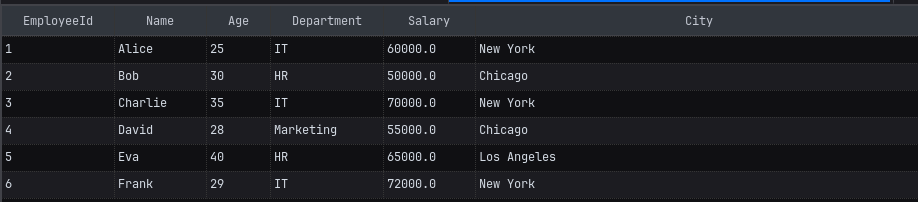

## Question 1

Write a query to select all columns from the Employees table.

### Solution

```sql
SELECT * FROM Employees;
```

### Output

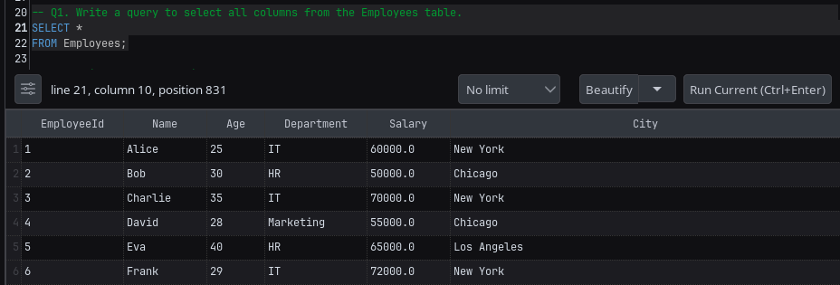

## Question 2

Write a query to display only the Name and Department of all employees.

### Solution

```sql
SELECT Name, Department FROM Employees;
```

### Output

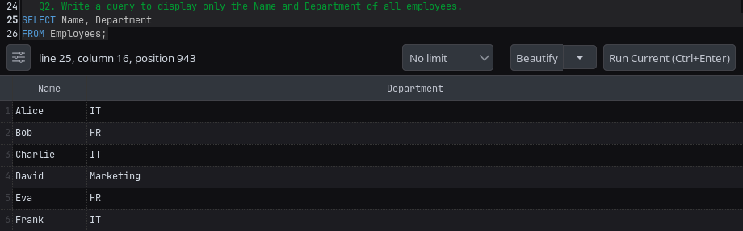

## Question 3

Write a query to find all employees who work in the IT department.

### Solution

```sql
SELECT *
FROM Employees
WHERE Department = 'IT';
```

### Output

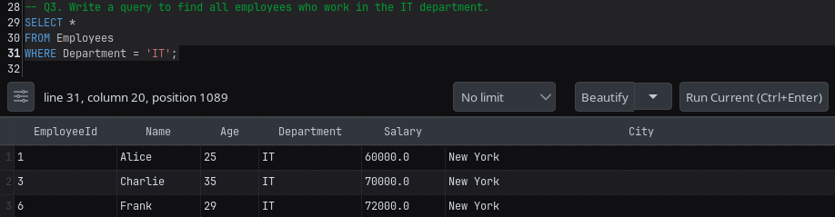

## Question 4

Write a query to find employees who live in New York.

### Solution

```sql
SELECT *
FROM Employees
WHERE City = 'New York';
```

### Output

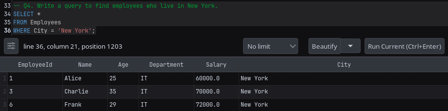

## Question 5

Write a query to find employees who have a salary greater than 60,000.

### Solution

```sql
SELECT *
FROM Employees
WHERE Salary > 60000;
```

### Output

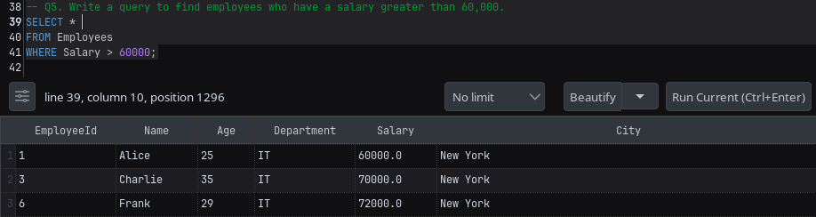

## Question 6

Write a query to find employees who are older than 30 years.

### Solution

```sql
SELECT *
FROM Employees
WHERE Age > 30;
```

### Output

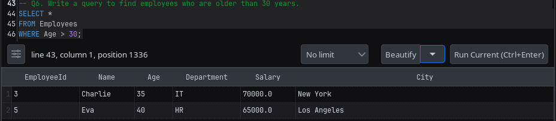

## Question 7

Write a query to find employees who are between 25 and 35 years old.

### Solution

```sql
SELECT *
FROM Employees
WHERE Age BETWEEN 25 AND 35;
```

### Output

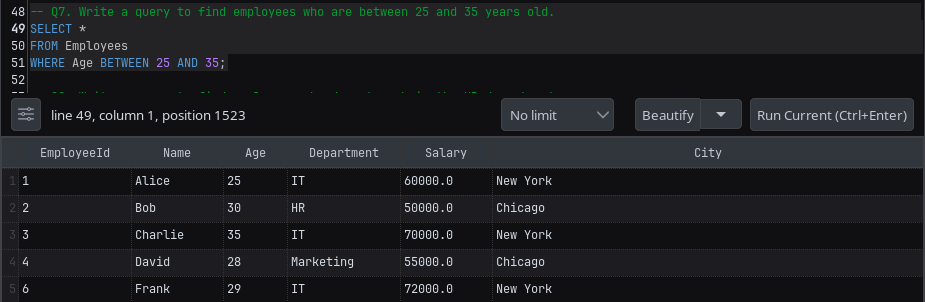

## Question 8

Write a query to find employees who do not work in the HR department.

### Solution

```sql
SELECT *
FROM Employees
WHERE Department != 'HR';
```

### Output

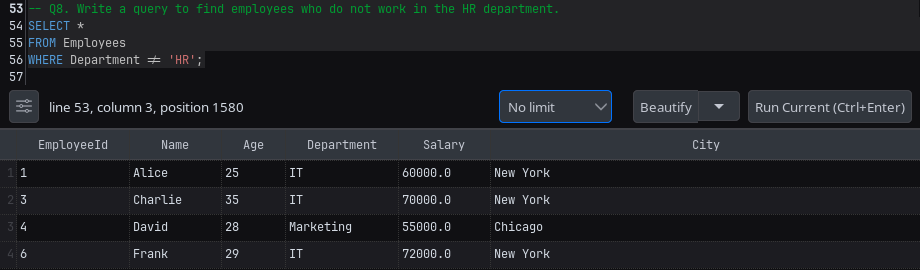

## Question 9

Write a query to display all employees sorted by Salary in descending order.

### Solution

```sql
SELECT *
FROM Employees
ORDER BY Salary DESC;
```

### Output

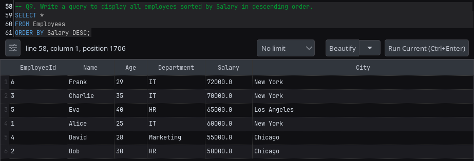

## Question 10

Write a query to display all employees sorted by Department first (A-Z) and then by Age in ascending order.

### Solution

```sql
SELECT *
FROM Employees
ORDER BY Department ASC, Age ASC;
```

### Output

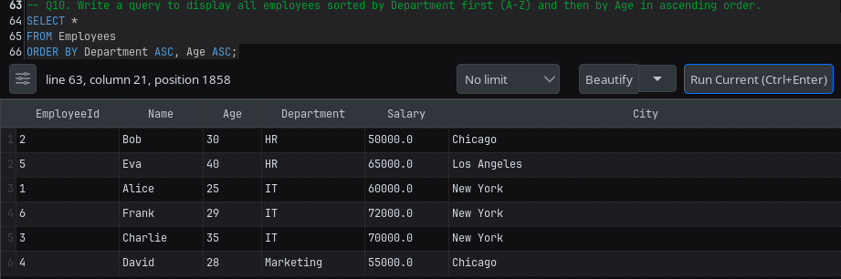

## Question 11

Write a query to find all unique departments in the company.

### Solution

```sql
SELECT DISTINCT Department FROM Employees;
```

### Output

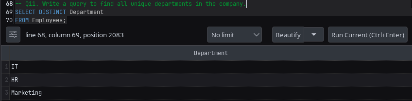

## Question 12

Write a query to find all unique cities where employees live.

### Solution

```sql
SELECT DISTINCT City FROM Employees;
```

### Output

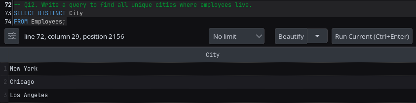

## Question 13

Write a query to count how many employees are in each department.

### Solution

```sql
SELECT Department, COUNT(*) as Total
FROM Employees
GROUP BY Department
ORDER BY Total DESC;
```

### Output

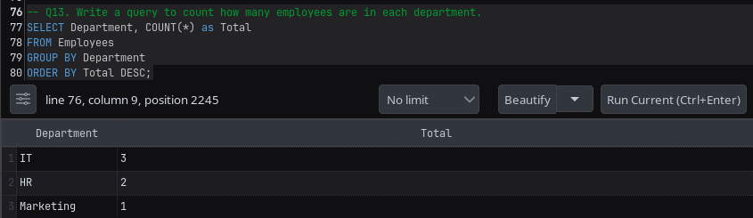

## Question 14

Write a query to count the number of employees in each city.

### Solution

```sql
SELECT City, COUNT(*) as Total
FROM Employees
GROUP BY City
ORDER BY Total DESC;
```

### Output

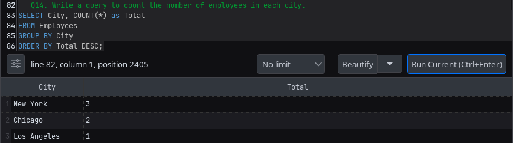

## Question 15

Write a query to find the average salary per department.

### Solution

```sql
SELECT Department, AVG(Salary) as 'Average Salary'
FROM Employees
GROUP BY Department;
```

### Output

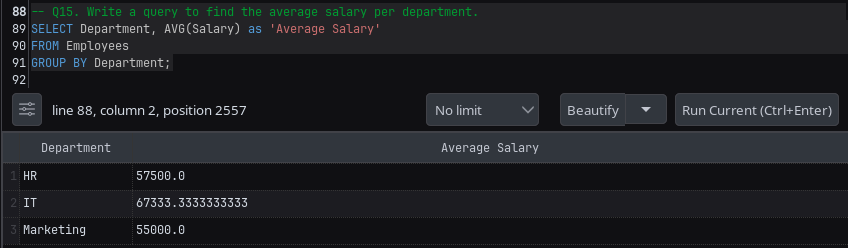

## Question 16

Write a query to find departments where the average salary is more than 60,000.

### Solution

```sql
SELECT Department, AVG(Salary) as 'Average Salary'
FROM Employees
GROUP BY Department
HAVING AVG(Salary) > 60000;
```

### Output

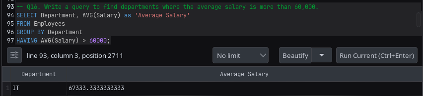

## Question 17

Write a query to find cities that have at least 2 employees.

### Solution

```sql
SELECT City, COUNT(*) as Total
FROM Employees
GROUP BY City
HAVING Total >= 2;
```

### Output

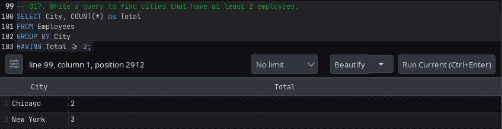

## Question 18

Write a query to find the top 3 highest-paid employees.

### Solution

```sql
SELECT *
FROM Employees
ORDER BY Salary DESC
LIMIT 3;
```

### Output

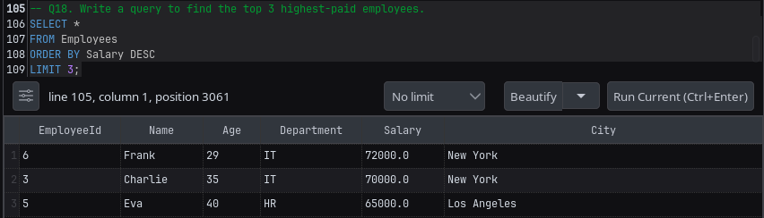

## Question 19

Write a query to find the youngest employee

### Solution

```sql
SELECT *
FROM Employees
ORDER BY Age ASC
LIMIT 1;
```

### Output

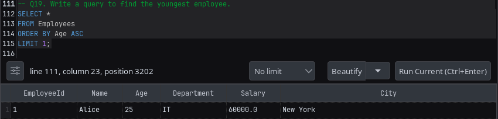
