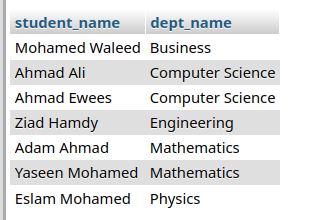
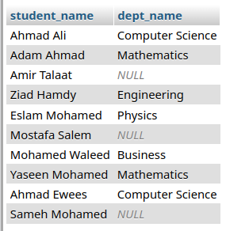
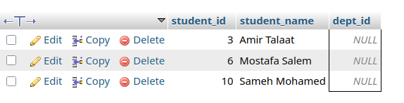
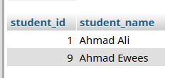
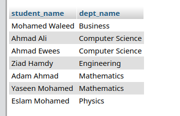
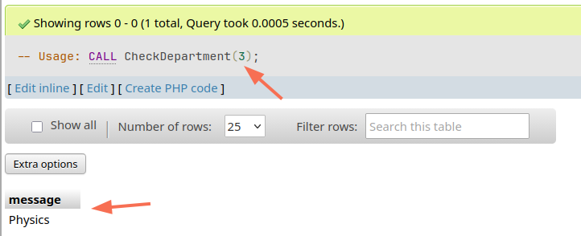
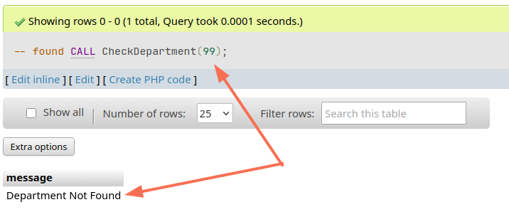
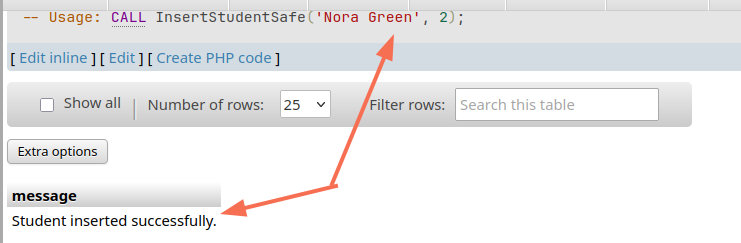
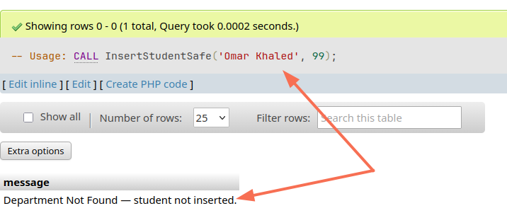

| Name    | ‎أحمد علي أحمد علي عثمان |
| :------ | :----------------------- |
| Code    | 20240592                 |
| Section | 1                        |

# Database Programming Task 2

## Q1: Create the `Students` table

**Question:** Write an SQL statement to create a table `Students` with the following columns: `student_id` (Primary Key), `student_name`, `dept_id`.

**Answer:**

```sql
CREATE TABLE IF NOT EXISTS Students (
  student_id    INTEGER       PRIMARY KEY AUTO_INCREMENT,
  student_name  VARCHAR(255)  NOT NULL UNIQUE,
  dept_id       INTEGER
);
```

---

## Q2: Create the `Departments` table

**Question:** Write an SQL statement to create a table `Departments` with the following columns: `dept_id` (Primary Key), `dept_name`.

**Answer:**

```sql
CREATE TABLE IF NOT EXISTS Departments(
  dept_id    INTEGER       PRIMARY KEY AUTO_INCREMENT,
  dept_name  VARCHAR(255)  NOT NULL UNIQUE
);
```

---

## Q3: Foreign Key relationship + insert data

**Question:** Create a relationship between `Students` and `Departments` using a Foreign Key. Insert 5 records into `Departments` and 10 records into `Students` (some with a department, some with NULL).

**Answer:**

```sql
-- Q3: Add FK constraint + insert data
ALTER TABLE Students
ADD CONSTRAINT fk_student_dept
FOREIGN KEY (dept_id) REFERENCES Departments(dept_id);

-- 5 departments

INSERT INTO Departments (dept_name) VALUES 
  ('Computer Science'),
  ('Mathematics'),
  ('Physics'),
  ('Engineering'),
  ('Business');

-- 10 Students
INSERT INTO Students (student_name, dept_id) VALUES
  ('Ahmad Ali',      1),
  ('Adam Ahmad',     2),
  ('Amir Talaat',    NULL),
  ('Ziad Hamdy',     4),
  ('Eslam Mohamed',  3),
  ('Mostafa Salem',  NULL),
  ('Mohamed Waleed', 5),
  ('Yaseen Mohamed', 2),
  ('Ahmad Ewees',    1),
  ('Sameh Mohamed',  NULL);
```

---

## Q4: INNER JOIN

**Question:** Write a query to display student names and department names using `INNER JOIN`.

**Answer:**

```sql
SELECT s.student_name, d.dept_name
FROM Students s
INNER JOIN Departments d ON s.dept_id = d.dept_id;
```

**Output:**


---

## Q5: LEFT JOIN

**Question:** Write a query to display all students even if they do not have a department using `LEFT JOIN`.

**Answer:**

```sql
SELECT s.student_name, d.dept_name
FROM Students s
LEFT JOIN Departments d ON s.dept_id = d.dept_id;
```

**Output:**


---

## Q6: RIGHT JOIN

**Question:** Write a query to display all departments even if they have no students using `RIGHT JOIN`.

**Answer:**

```sql
SELECT s.student_name, d.dept_name
FROM Students s
RIGHT JOIN Departments d ON s.dept_id = d.dept_id;
```

**Output:**



---

## Q7: FULL OUTER JOIN

**Question:** Write a query to display all data from both tables using `FULL OUTER JOIN`.

**Answer:**

```sql
SELECT s.student_name, d.dept_name
FROM Students s
FULL OUTER JOIN Departments d 
ON s.dept_id = d.dept_id;
```

**Output:**



---

## Q8: Students with no department

**Question:** Write a query to display students who do not belong to any department.

**Answer:**

```sql
SELECT *
FROM Students
WHERE dept_id IS NULL;
```

**Output:**



---

## Q9: Departments with no students

**Question:** Write a query to display departments that have no students.

**Answer:**

```sql
SELECT d.dept_name
FROM Departments d
LEFT JOIN Students s ON d.dept_id = s.dept_id
WHERE s.student_id IS NULL;
```

**Output:**


---

## Q10: Stored Procedure — students by department (IN)

**Question:** Create a Stored Procedure that takes `dept_id` as an input parameter and returns all students in that department.

**Answer:**

```sql
DELIMITER $$

CREATE PROCEDURE GetStudentsByDept(IN p_dept_id INT)
BEGIN
  SELECT student_id, student_name
  FROM Students
  WHERE dept_id = p_dept_id;
END$$

DELIMITER ;

-- Example Usage:
CALL GetStudentsByDept(1);
```

**Output:**



---

## Q11: Stored Procedure — total student count (OUT)

**Question:** Create a Stored Procedure that returns the total number of students using an `OUT` parameter.

**Answer:**

```sql
DELIMITER $$

CREATE PROCEDURE GetTotalStudents(OUT p_total INT)
BEGIN
  SELECT COUNT(*) INTO p_total
  FROM Students;
END$$

DELIMITER ;

-- Usage:
CALL GetTotalStudents(@total);
SELECT @total;
```

**Output:**


---

## Q12: Stored Procedure — add 10 to a number (INOUT)

**Question:** Create a Stored Procedure that takes a number, adds 10 to it, and returns the result using an `INOUT` parameter.

**Answer:**

```sql
DELIMITER $$

CREATE PROCEDURE AddTen(INOUT p_number INT)
BEGIN
  SET p_number = p_number + 10;
END$$

DELIMITER ;

-- Usage:
SET @num = 25;
CALL AddTen(@num);
SELECT @num;  -- returns 35
```

**Output:**


---

## Q13: Stored Procedure — student count per department (IN + OUT)

**Question:** Create a Stored Procedure that takes `dept_id` as input and returns the number of students in that department.

**Answer:**

```sql
DELIMITER $$

CREATE PROCEDURE CountStudentsInDept(
  IN  p_dept_id INT,
  OUT p_count   INT
)
BEGIN
  SELECT COUNT(*) INTO p_count
  FROM Students
  WHERE dept_id = p_dept_id;
END$$

DELIMITER ;

-- Usage:
CALL CountStudentsInDept(1, @count);
SELECT @count;
```

**Output:**


---

## Q14: Stored Procedure — student names with department names (JOIN)

**Question:** Create a Stored Procedure that uses `JOIN` to return `student_name` and `dept_name`.

**Answer:**

```sql
DELIMITER $$

CREATE PROCEDURE GetStudentsWithDepts()
BEGIN
  SELECT s.student_name, d.dept_name
  FROM Students s
  INNER JOIN Departments d ON s.dept_id = d.dept_id;
END$$

DELIMITER ;

-- Usage:
CALL GetStudentsWithDepts();
```

**Output:**



---

## Q15: Stored Procedure — check if department exists

**Question:** Create a Stored Procedure that checks if `dept_id` exists; if not, returns `'Department Not Found'`.

**Answer:**

```sql
DELIMITER $$

CREATE PROCEDURE CheckDepartment(IN p_dept_id INT)
BEGIN
  DECLARE v_count INT;

  SELECT COUNT(*) INTO v_count
  FROM Departments
  WHERE dept_id = p_dept_id;

  IF v_count = 0 THEN
    SELECT 'Department Not Found' AS message;
  ELSE
    SELECT dept_name AS message
    FROM Departments
    WHERE dept_id = p_dept_id;
  END IF;
END$$

DELIMITER ;

-- Usage:
CALL CheckDepartment(3);   -- found
CALL CheckDepartment(99);  -- 'Department Not Found'
```

**Output:**





---

## Q16: Stored Procedure — insert student only if department exists

**Question:** Create a Stored Procedure that inserts a new student only if `dept_id` exists.

**Answer:**

```sql
DELIMITER $$

CREATE PROCEDURE InsertStudentSafe(
  IN p_student_name VARCHAR(100),
  IN p_dept_id      INT
)
BEGIN
  DECLARE v_count INT;

  SELECT COUNT(*) INTO v_count
  FROM Departments
  WHERE dept_id = p_dept_id;

  IF v_count = 0 THEN
    SELECT 'Department Not Found — student not inserted.' AS message;
  ELSE
    INSERT INTO Students (student_name, dept_id)
    VALUES (p_student_name, p_dept_id);

    SELECT 'Student inserted successfully.' AS message;
  END IF;
END$$

DELIMITER ;

-- Usage:
CALL InsertStudentSafe('Nora Green', 2);  -- inserted
CALL InsertStudentSafe('Omar Kh', 99);    -- rejected
```

**Output:**




