| Name    | أحمد علي أحمد علي عثمان |
| :------ | :----------------------- |
| Code    | 20240592                 |
| Section | 1                        |

# Database Programming Task 3

## Base Tables Setup

```sql
CREATE TABLE Departments (
  dept_id   INT PRIMARY KEY AUTO_INCREMENT,
  dept_name VARCHAR(100) NOT NULL
);

CREATE TABLE Employees (
  emp_id    INT PRIMARY KEY AUTO_INCREMENT,
  name      VARCHAR(100) NOT NULL,
  salary    DECIMAL(10, 2),
  hire_date DATE,
  dept_id   INT,
  FOREIGN KEY (dept_id) REFERENCES Departments(dept_id)
);

INSERT INTO Departments (dept_name) VALUES
  ('IT'),
  ('HR'),
  ('Finance');

INSERT INTO Employees (name, salary, hire_date, dept_id) VALUES
  ('Sara',   5000, '2022-03-15', 1),
  ('Omar',   7000, '2020-06-01', 1),
  ('Lara',   4500, '2023-11-20', 2),
  ('Mohamed', 6000, '2019-08-10', 3),
  ('Mariam', 5500, '2024-01-05', 2);
```

---

## Q1: Create Projects table

**Question:** Create a table `Projects` with `project_id` (PK), `project_name`, and `dept_id` (FK).

**Answer:**

```sql
CREATE TABLE Projects (
  project_id   INT PRIMARY KEY AUTO_INCREMENT,
  project_name VARCHAR(150) NOT NULL,
  dept_id      INT,
  FOREIGN KEY (dept_id) REFERENCES Departments(dept_id)
);
```

---

## Q2: Alter Employees to add email column

**Question:** Alter `Employees` table to add a column `email`.

**Answer:**

```sql
ALTER TABLE Employees
  ADD COLUMN email VARCHAR(255);
```

---

## Q3: Insert 2 employees with NULL department

**Question:** Insert 2 new employees with NULL department.

**Answer:**

```sql
INSERT INTO Employees (name, salary, hire_date, dept_id) VALUES
  ('Nour',   4800, '2024-05-10', NULL),
  ('Khaled', 5200, '2024-07-22', NULL);
```

---

## Q4: Increase salary by 10% for IT department

**Question:** Update salary of all employees in IT department by 10%.

**Answer:**

```sql
UPDATE Employees e
  JOIN Departments d ON e.dept_id = d.dept_id
SET e.salary = e.salary * 1.10
WHERE d.dept_name = 'IT';
```

---

## Q5: All employees even without department (LEFT JOIN)

**Question:** Display all employees even if they do not have a department using `LEFT JOIN`.

**Answer:**

```sql
SELECT e.emp_id, e.name, e.salary, d.dept_name
FROM Employees e
LEFT JOIN Departments d ON e.dept_id = d.dept_id;
```

**Output:**

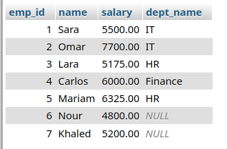

---

## Q6: All departments even without employees (RIGHT JOIN)

**Question:** Display all departments even if they have no employees using `RIGHT JOIN`.

**Answer:**

```sql
SELECT d.dept_id, d.dept_name, e.name AS employee_name
FROM Employees e
RIGHT JOIN Departments d ON e.dept_id = d.dept_id;
```

**Output:**

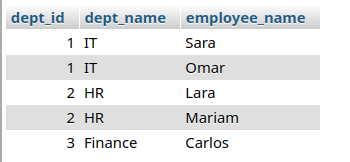

---

## Q7: Employees whose name ends with 'a'

**Question:** Retrieve employees whose names end with `'a'`.

**Answer:**

```sql
SELECT * FROM Employees
WHERE name LIKE '%a';
```

**Output:**

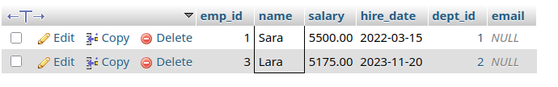

---

## Q8: Employees whose name contains 'ar'

**Question:** Retrieve employees whose names contain `'ar'`.

**Answer:**

```sql
SELECT * FROM Employees
WHERE name LIKE '%ar%';
```

**Output:**

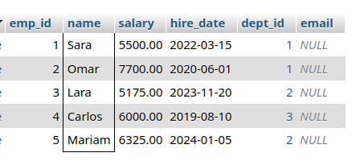

---

## Q9: Lowest 2 salaries

**Question:** Display lowest 2 salaries.

**Answer:**

```sql
SELECT name, salary FROM Employees
ORDER BY salary ASC
LIMIT 2;
```

**Output:**

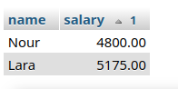

---

## Q10: Employees ordered by name ascending

**Question:** Display employees ordered by name ascending.

**Answer:**

```sql
SELECT * FROM Employees
ORDER BY name ASC;
```

**Output:**

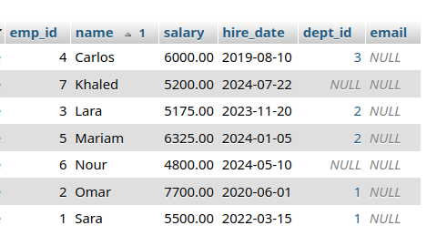

---

## Q11: Total salaries per department

**Question:** Display total salaries per department.

**Answer:**

```sql
SELECT d.dept_name, SUM(e.salary) AS total_salary
FROM Employees e
JOIN Departments d ON e.dept_id = d.dept_id
GROUP BY d.dept_id, d.dept_name;
```

**Output:**

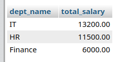

---

## Q12: Departments with more than 1 employee

**Question:** Display departments having more than 1 employee.

**Answer:**

```sql
SELECT d.dept_name, COUNT(e.emp_id) AS employee_count
FROM Employees e
JOIN Departments d ON e.dept_id = d.dept_id
GROUP BY d.dept_id, d.dept_name
HAVING COUNT(e.emp_id) > 1;
```

**Output:**

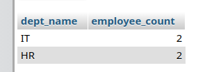

---

## Q13: Employee names in lowercase

**Question:** Display employee names in lowercase.

**Answer:**

```sql
SELECT LOWER(name) AS name_lowercase
FROM Employees;
```

**Output:**

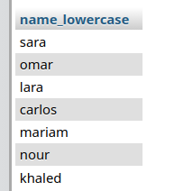

---

## Q14: Concatenate name and salary

**Question:** Concatenate name and salary.

**Answer:**

```sql
SELECT CONCAT(name, ' - ', salary) AS name_and_salary
FROM Employees;
```

**Output:**

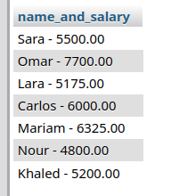

---

## Q15: Current date and time

**Question:** Display current date and time.

**Answer:**

```sql
SELECT NOW() AS current_datetime;
```

**Output:**


---

## Q16: Employees hired in the last 2 years

**Question:** Retrieve employees hired in the last 2 years.

**Answer:**

```sql
SELECT * FROM Employees
WHERE hire_date >= DATE_SUB(CURDATE(), INTERVAL 2 YEAR);
```

**Output:**

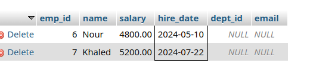

---

## Q17: Procedure — highest salary in a department

**Question:** Create a procedure to return the highest salary in a given department.

**Answer:**

```sql
DELIMITER $$

CREATE PROCEDURE GetHighestSalary(IN p_dept_id INT)
BEGIN
  SELECT d.dept_name, MAX(e.salary) AS highest_salary
  FROM Employees e
  JOIN Departments d ON e.dept_id = d.dept_id
  WHERE e.dept_id = p_dept_id;
END$$

DELIMITER ;

-- Usage:
CALL GetHighestSalary(1);
```

**Output:**

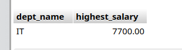

---

## Q18: Procedure — increase salary by percentage

**Question:** Create a procedure to increase salary by a given percentage for a department.

**Answer:**

```sql
DELIMITER $$

CREATE PROCEDURE IncreaseSalary(IN p_dept_id INT, IN p_percent DECIMAL(5,2))
BEGIN
  UPDATE Employees
  SET salary = salary * (1 + p_percent / 100)
  WHERE dept_id = p_dept_id;
END$$

DELIMITER ;

-- Usage:
SELECT salary FROM Employees WHERE dept_id = 2;
CALL IncreaseSalary(2, 15);  -- 15% raise for dept 2
SELECT salary FROM Employees WHERE dept_id = 2;
```

**Output Before:**

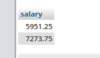

**Output After:**

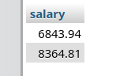

---

## Q19: BEFORE UPDATE trigger — prevent salary decrease

**Question:** Create a `BEFORE UPDATE` trigger to prevent salary decrease.

**Answer:**

```sql
DELIMITER $$

CREATE TRIGGER prevent_salary_decrease
BEFORE UPDATE ON Employees
FOR EACH ROW
BEGIN
  IF NEW.salary < OLD.salary THEN
    SIGNAL SQLSTATE '45000'
      SET MESSAGE_TEXT = 'Error: Salary cannot be decreased.';
  END IF;
END$$

DELIMITER ;
```

---

## Q20: AFTER DELETE trigger — log deleted employees

**Question:** Create an `AFTER DELETE` trigger to log deleted employees.

**Answer:**

```sql
-- First, create the log table
CREATE TABLE IF NOT EXISTS Deleted_Employees_Log (
  log_id      INT PRIMARY KEY AUTO_INCREMENT,
  emp_id      INT,
  name        VARCHAR(100),
  salary      DECIMAL(10, 2),
  dept_id     INT,
  deleted_at  DATETIME DEFAULT CURRENT_TIMESTAMP
);

DELIMITER $$

CREATE TRIGGER log_deleted_employee
AFTER DELETE ON Employees
FOR EACH ROW
BEGIN
  INSERT INTO Deleted_Employees_Log (emp_id, name, salary, dept_id, deleted_at)
  VALUES (OLD.emp_id, OLD.name, OLD.salary, OLD.dept_id, NOW());
END$$

DELIMITER ;
```
