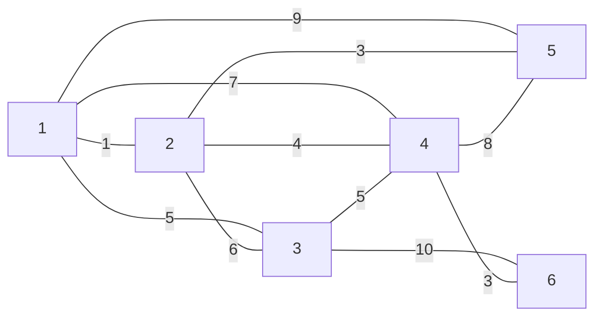
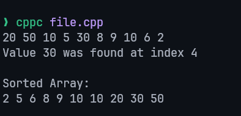

| Name    | أحمد علي أحمد علي عثمان |
| :------ | :---------------------- |
| Code    | 20240592                |
| Section | 1                       |

# Data Structures Assignment 1

## Task 1

### 1.1 Explain the definition of Asymptotic notations (Big O, Big Omega, Big Theta)

Asymptotic notation is a way of describing the performance of an algorithm or operation.

It can be used to describe either time complexity or space complexity.
For example, adding two numbers is always **O(1)**, which means constant time.
On the other hand, an algorithm such as binary search takes **O(log n)** time, which means its running time depends on the number of elements in the array.

- **Big O**: describes the **upper bound** or **worst-case** growth of an algorithm. For example, when sorting a completely unsorted array such as `[6, 5, 4, 3, 2, 1]`, Big O tells us the maximum amount of work the algorithm may need.
- **Big Omega**: describes the **lower bound** or **best-case** growth of an algorithm. For example, when sorting an already sorted array such as `[1, 2, 3, 4, 5, 6]`, Big Omega tells us the minimum amount of work the algorithm needs.
- **Big Theta**: describes the **tight bound** of an algorithm. This means the algorithm grows at the same rate from both above and below, so it gives the most accurate description of its actual growth rate.
  For example, if an algorithm always scans every element in an array once, then its running time is `Θ(n)`. If another algorithm may need up to `n^2` comparisons, then its running time is `O(n^2)`.

**Comparison Table:**

| Notation  | Meaning                                      | Example                                              |
| --------- | -------------------------------------------- | ---------------------------------------------------- |
| Big O     | At most this much (upper bound / worst case) | "Takes at most 10 min" — could be 1 min, could be 10 |
| Big Omega | At least this much (lower bound / best case) | "Takes at least 10 min" — could be 10, could be 30   |
| Big Theta | Exactly this much (tight bound — BOTH)       | "Takes exactly 10 min" — always around 10            |

---

### 1.2 Illustrate the main applications of stack?

Stacks are used in many applications because they follow the **Last In, First Out (LIFO)** rule. The most common uses are:

- **Function calls and recursion:** Programming languages use a call stack to store active function calls. The last function called is the first one to return. Example: When calling these functions `join(map(split("HELLO"), toLowercase))`, they would be executed from inside out: `split` -> `map` -> `toLowercase` -> `join`.
- **Undo/Redo operations:** Text editors and design applications store recent actions in a stack so the last action can be undone first.
- **Browser history:** The browser keeps track of visited pages in a stack. When you click the Back button, it returns to the most recently visited page.

---

### 1.3 Apply the array and stack using C++ or Java programming language

```java
class Array {
  private int length; // How many items can we store
  private int size;   // Index of the last stored item
  private int[] items;

  // constructor
  public Array(int length) {
    this.items = new int[length];
    this.length = length;
    this.size = -1;
  }

  public void push(int item) {
    if (this.isFull()) System.err.println("Array is full!");
    else {
      this.size++;
      this.items[this.size] = item;
    }
  }

  public int pop() {
    // NOTE: The item isn't really removed, it will be overwritten in the next push.
    if (this.isEmpty()) {
      System.err.println("Array is empty!");
      return -1;
    } else return this.items[this.size--];
  }

  public void display() {
    System.out.print("[");
    for (int i = 0; i <= this.size; i++) System.out.print(" " + this.items[i]);
    System.out.println(" ]");
  }

  /*
    * returns how many items are actually stored in the array.
   */
  public int size() {
    return this.size + 1;
  }

  /*
    * returns how many items can be stored in the array.
   */
  public int length() {
    return this.length;
  }

  public boolean isEmpty() {
    return this.size == -1;
  }

  public boolean isFull() {
    return this.size == this.length - 1;
  }
}
```

```java
class Stack {
  private int top;
  private int length;
  private int[] items;

  public Stack(int length) {
    this.length = length;
    this.top = -1;
    this.items = new int[length];
  }

  public void push(int item) {
    if (this.isFull()) System.err.println("Stack is full!");
    else {
      this.top++;
      this.items[this.top] = item;
    }
  }

  public int pop() {
    if (this.isEmpty()) {
      System.err.println("Stack is empty!");
      return -1;
    } else return items[this.top--];
  }

  public int size() {
    return this.top + 1;
  }

  public int length() {
    return this.length;
  }

  public int top() {
    if (this.isEmpty()) {
      System.err.println("Stack is empty!");
      return -1;
    }

    return this.items[this.top];
  }

  public boolean isEmpty() {
    return this.top == -1;
  }

  public boolean isFull() {
    return this.top == this.length - 1;
  }

  public void display() {
    System.out.print("[");
    for (int i = this.top; i >= 0; i--) System.out.print(" " + this.items[i]);
    System.out.println(" ]");
  }
}
```

## Task 2

### 2.1 Explain a concrete data structure for a First In First Out (FIFO) and illustrate the main applications of it?

The concrete data structure used for **First In, First Out (FIFO)** processing is the **queue**.

A queue inserts data from the **rear** and removes data from the **front**, so the first element added is the first one removed.
The main operations are `enqueue` to insert an element, `dequeue` to remove an element, and `front/peek` to read the first element without deleting it.

Applications of queues include:

- **CPU scheduling:** Processes waiting for CPU time are managed in a queue, such as in Round Robin scheduling.
- **GitHub Actions:** Jobs are queued so they run in order.
- **Music queue:** In applications such as Spotify or YouTube Music, songs are played in the order they were added.
- **Call center systems:** Incoming calls are queued and handled by the next available agent.
- Any application that requires data to be processed in arrival order.

---

### 2.2 Define the operation of linked list and compare between the different types of linked lists?

A linked list is a linear data structure that stores data in nodes, where each node contains the data and one or more links to other nodes. Unlike an array, linked-list elements are not stored in consecutive memory locations.

The main operations of a linked list are:

- Creation: initialize the list so that the head points to `null`.
- Insertion: add a new node at the beginning, at the end, or at a specific position.
- Deletion: remove a node from the beginning, end, or a specific position.
- Traversal: move through the list node by node to display or process all elements.
- Searching: check nodes one by one until the required value is found.
- Updating: change the value stored in a node when needed.

There are several types of linked lists:

- Singly Linked List: Uses a node and a pointer to the `next` node.
- Doubly Linked List: Uses a node and pointers to the `next` and `previous` nodes.
- Circular Linked List: The last node points back to the first node instead of `null`.
- Doubly Circular Linked List: Each node has `next` and `previous` links, and the list forms a circle.

Comparison between the types:

| Type                        | Traversal                              | Memory usage | Advantage                                         | Disadvantage                      |
| --------------------------- | -------------------------------------- | ------------ | ------------------------------------------------- | --------------------------------- |
| Singly linked list          | Forward only                           | Low          | Simple and easy to implement                      | Cannot move backward              |
| Doubly linked list          | Forward and backward                   | Higher       | Easier insertion and deletion around a known node | Uses extra memory                 |
| Circular linked list        | Forward in repeated cycle              | Low          | Useful for round-robin processing                 | Must be careful to stop traversal |
| Doubly circular linked list | Forward and backward in repeated cycle | Highest      | Very flexible navigation                          | Most complex type                 |

---

### 2.3 Apply the queues using C++ or Java accurately?

```java
class Queue {
  private int front;
  private int rear;
  private int length;
  private int[] items;

  public Queue(int length) {
    this.front = -1;
    this.rear = -1;
    this.length = length;
    this.items = new int[length];
  }

  public void enqueue(int item) {
    if (this.isFull()) System.err.println("Queue is full!");
    else {
      if (this.front == -1) this.front = 0;
      this.rear++;
      this.items[this.rear] = item;
    }
  }

  public int dequeue() {
    if (this.isEmpty()) {
      System.err.println("Queue is empty!");
      return -1;
    } else {
      int f = this.items[this.front];
      if (++this.front > this.rear) {
        this.front = -1;
        this.rear = -1;
      }

      return f;
    }
  }

  public int size() {
    if (this.isEmpty()) return 0;
    return this.rear - this.front + 1;
  }

  public int front() {
    if (this.isEmpty()) {
      System.err.println("Queue is empty!");
      return -1;
    } return this.items[this.front];
  }

  public int back() {
    if (this.isEmpty()) {
      System.err.println("Queue is empty!");
      return -1;
    } return this.items[this.rear];
  }

  public boolean isEmpty() {
    return this.front == -1;
  }

  public boolean isFull() {
    return this.rear == this.length - 1;
  }

  public void display() {
    System.out.print("[");
    for (int i = this.front; i <= this.rear; i++) System.out.printf(" %d", this.items[i]);
    System.out.println(" ]");
  }
}
```

## Task 3

### 3.1 Illustrate what is meant by minimum spanning tree and Dijkstra algorithms, apply both algorithms on the mentioned graph

**Graph:**



#### Minimum Spanning Tree

A minimum spanning tree is a set of edges that connects all vertices in a connected weighted graph without forming a cycle and with the minimum possible total weight.

Using Kruskal's algorithm, we sort the edges from the smallest weight to the largest weight and choose the smallest edge each time without creating a cycle.

Sorted edges:

- `1-2 = 1`
- `2-5 = 3`
- `4-6 = 3`
- `2-4 = 4`
- `1-3 = 5`
- `3-4 = 5`
- `2-3 = 6`
- `1-4 = 7`
- `4-5 = 8`
- `1-5 = 9`
- `3-6 = 10`

Choose the edges in order while avoiding cycles:

- `1-2 = 1`
- `2-5 = 3`
- `4-6 = 3`
- `2-4 = 4`
- `1-3 = 5`

Now all 6 vertices are connected using `6 - 1 = 5` edges, so the MST is complete.

Total weight of the minimum spanning tree:

`1 + 3 + 3 + 4 + 5 = 16`

#### Dijkstra Algorithm

Dijkstra's algorithm finds the shortest path from one source vertex to all other vertices in a graph with non-negative edge weights.

Assume the source vertex is `1`.

Initial distances:

- `d(1) = 0`
- `d(2) = infinity`
- `d(3) = infinity`
- `d(4) = infinity`
- `d(5) = infinity`
- `d(6) = infinity`

Step 1: Start from vertex `1`

- `d(2) = 1`
- `d(3) = 5`
- `d(4) = 7`
- `d(5) = 9`

Step 2: Visit vertex `2` because it has the smallest temporary distance

- `d(3) = min(5, 1 + 6) = 5`
- `d(4) = min(7, 1 + 4) = 5`
- `d(5) = min(9, 1 + 3) = 4`

Step 3: Visit vertex `5`

- `d(4) = min(5, 4 + 8) = 5`

Step 4: Visit vertex `3`

- `d(4) = min(5, 5 + 5) = 5`
- `d(6) = min(infinity, 5 + 10) = 15`

Step 5: Visit vertex `4`

- `d(6) = min(15, 5 + 3) = 8`

Step 6: Visit vertex `6`

- No shorter path is found

Final shortest distances from vertex `1`:

- `1 = 0`
- `2 = 1`
- `5 = 4`
- `3 = 5`
- `4 = 5`
- `6 = 8`

So the shortest path from `1` to `6` is:

`1 -> 2 -> 4 -> 6`

with total cost:

`1 + 4 + 3 = 8`

### 3.2 Differentiate between Graph and trees.

A tree is a special type of graph. It is connected and has no cycles. In many computer-science applications, a tree is also treated as a hierarchical structure with a root node.

A graph is a more general structure made of vertices and edges. It may be directed or undirected, weighted or unweighted, connected or disconnected, and it may contain cycles.

Main differences:

| Feature                   | Tree                              | Graph                            |
| ------------------------- | --------------------------------- | -------------------------------- |
| Structure                 | Hierarchical                      | General network                  |
| Cycles                    | Not allowed                       | May exist                        |
| Root node                 | Usually present                   | Not required                     |
| Connectivity              | Always connected                  | May be connected or disconnected |
| Number of edges           | For `n` vertices, exactly `n - 1` | No fixed rule                    |
| Path between two vertices | Exactly one path                  | One, many, or no path            |

Applications of trees include file systems, binary search trees, and expression trees.
Applications of graphs include maps, communication networks, and route planning.

Therefore, every tree is a graph, but not every graph is a tree.

## Task 4

Given the following array:

```
[20, 50, 10, 5, 30, 8, 9, 10, 6, 2]
```

### 4.1 Apply any sorting technique to sort the array elements in C++ and apply a sequential search algorithm to search for the value 30.

> [!NOTE]
> The sorting method modifies the original array.

```cpp
#include <iostream>

using namespace std;

void bubbleSort(int arr[], int length) {
  for (int i = 0; i < length; i++) {
    bool isSorted = true;
    for (int j = 0; j < length - i - 1; j++) {
      if (arr[j] > arr[j + 1]) {
        int temp = arr[j];
        arr[j] = arr[j + 1];
        arr[j + 1] = temp;
        isSorted = false;
      }
    }
    // if we didn't swap anything, then the array is already sorted.
    if (isSorted) break;
  }
}

int search(int arr[], int length, int value) {
  for (int i = 0; i < length; i++) {
    if (arr[i] == value) return i;
  }
  return -1; // -1 means not found
}

int main() {
  int arr[10] = {20, 50, 10, 5, 30, 8, 9, 10, 6, 2};

  for (auto i : arr) printf("%d ", i);

  int index = search(arr, 10, 30);
  if (index == -1) cout << "\nValue 30 was not found!\n\n";
  else printf("\nValue 30 was found at index %d\n\n", index);

  bubbleSort(arr, 10);
  cout << "Sorted Array:\n";
  for (auto i : arr) printf("%d ", i);
  printf("\n");

  return 0;
}
```

**Output:**



### 4.2 Illustrate how to calculate the complexity of the previous programs? And discuss how to evaluate the complexity of these algorithms?

Searching techniques are methods used to locate a required value in a data set.

- Sequential search checks the elements one by one from the beginning until the required value is found or the list ends.
- Binary search works only on a sorted array and repeatedly divides the search space into two halves, so it is faster than sequential search for large sorted data sets.

Sorting techniques are methods used to arrange data in ascending or descending order. Examples include bubble sort, selection sort, insertion sort, merge sort, quick sort, and heap sort.

To calculate complexity, we study how the number of operations grows when the input size `n` increases. This is usually expressed using asymptotic notation such as `O`, `Ω`, and `Θ`.

#### 1. Bubble Sort

Bubble sort uses two loops. The outer loop repeats passes over the array, and the inner loop compares adjacent elements and swaps them when needed.

- Worst case time complexity: `O(n^2)` because there can be about `n(n - 1) / 2` comparisons.
- Best case time complexity: `O(n)` when the array is already sorted and no swaps are needed.
- Average case time complexity: `O(n^2)`.
- Space complexity: `O(1)` because it sorts inside the same array.

#### 2. Sequential Search

Sequential search checks each item one by one.

- Best case time complexity: `O(1)` when the value is the first element.
- Worst case time complexity: `O(n)` when the value is the last element or does not exist.
- Average case time complexity: `O(n)` because about half of the list may need to be checked.
- Space complexity: `O(1)` because only a few extra variables are used.

Asymptotic analysis helps evaluate algorithms in the following ways:

- It helps compare algorithms without depending on computer speed or programming language.
- It shows how an algorithm behaves as the input size becomes small or large.
- It helps choose the better algorithm for a specific problem.
- It shows the trade-off between time complexity and space complexity.
- It helps explain why an algorithm that is acceptable for small input may become inefficient for large input.

Therefore, for the previous programs, sequential search is simpler but slower on large data sets than faster search methods such as binary search, while bubble sort is easy to implement but inefficient compared with algorithms such as merge sort or quick sort for large arrays.
