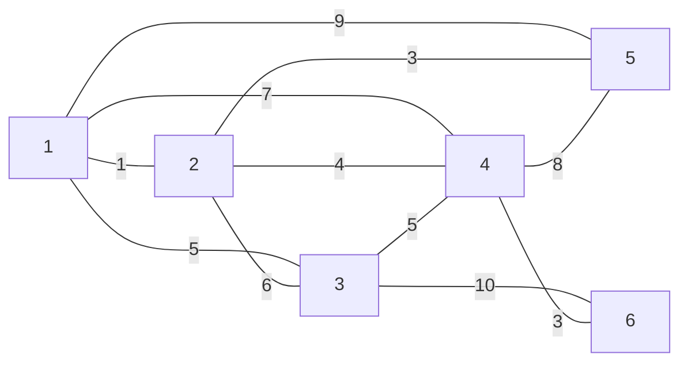

# Data Structures Assignment 1

## Task 1

### 1.1 Explain the definition of Asymptotic notations (Big O, Big Omega, Big Theta)

Asymptotic notation is a way of describing the performance of a given algorithm or operation.

It can be used with time or space.
Example: The operation of adding two numbers would always be **O(1)** which means constant time (nearly instant).
While an algorithm like Binary Search would take **O(log n)** which means it varies depending on how many elements are in the array.

Big O: The **Worst Case**, in the worst scenario (e.g. Sorting an array that's completely scrambled: sorting the array `[6, 5, 4, 3, 2, 1]`). This describes the maximum time an algorithm could take, the algorithm will never perform worse than this.
Big Omega: The **Best Case**, in the best scenario (e.g. Sorting an array already sorted array: `[1, 2, 3, 4, 5, 6]`). This describes the minimum time an algorithm takes. It cannot run faster than that.
Big Theta: The **Average Case**, in the average/normal scenario (e.g. Sorting an array that's partially sorted: `[1, 4, 2, 3, 6, 5]`).

**Comparison Table:**

| Notation  | Meaning                                      | Example                                              |
| --------- | -------------------------------------------- | ---------------------------------------------------- |
| Big O     | At most this much (upper bound / worst case) | "Takes at most 10 min" — could be 1 min, could be 10 |
| Big Omega | At least this much (lower bound / best case) | "Takes at least 10 min" — could be 10, could be 30   |
| Big Theta | Exactly this much (tight bound — BOTH)       | "Takes exactly 10 min" — always around 10            |

---

### 1.2 Illustrate the main applications of stack?

Stacks could be used in a wide variety of applications. That includes:

- Undo/Redo menus: The programs stores the operations you did in a stack, when you press **undo** it applies the last action you performed.
- Browser History: The browser keeps track of what pages you visited in a stack as well. When you click Back button it goes to the last visited webpage.
- Call Stack in programming languages: Your code uses `join(map(split("HELLO"), toLowercase))`. These functions would be called from inside out: split -> map -> toLowercase -> join.

---

### 1.3 Apply the array and stack using C++ or Java programming language

```java
class Array {
  private int length; // How many items can we store
  private int size;   // Index of the last stored item
  private int[] items;

  // constructor
  public Array(int length) {
    this.items = new int[length];
    this.length = length;
    this.size = -1;
  }

  public void push(int item) {
    if (this.isFull()) System.err.println("Array is full!");
    else {
      this.size++;
      this.items[this.size] = item;
    }
  }

  public int pop() {
    // NOTE: The item isn't really removed, it will be overwritten in the next push.
    if (this.isEmpty()) {
      System.err.println("Array is empty!");
      return -1;
    } else return this.items[this.size--];
  }

  public void display() {
    System.out.print("[");
    for (int i = 0; i <= this.size; i++) System.out.print(" " + this.items[i]);
    System.out.println(" ]");
  }

  /*
    * returns how many items are actually stored in the array.
   */
  public int size() {
    return this.size + 1;
  }

  /*
    * returns how many items can be stored in the array.
   */
  public int length() {
    return this.length;
  }

  public boolean isEmpty() {
    return this.size == -1;
  }

  public boolean isFull() {
    return this.size == this.length - 1;
  }
}
```

```java
class Stack {
  private int top;
  private int length;
  private int[] items;

  public Stack(int length) {
    this.length = length;
    this.top = -1;
    this.items = new int[length];
  }

  public void push(int item) {
    if (this.isFull()) System.err.println("Stack is full!");
    else {
      this.top++;
      this.items[this.top] = item;
    }
  }

  public int pop() {
    if (this.isEmpty()) {
      System.err.println("Stack is empty!");
      return -1;
    } else return items[this.top--];
  }

  public int size() {
    return this.top + 1;
  }

  public int length() {
    return this.length;
  }

  public int top() {
    if (this.isEmpty()) {
      System.err.println("Stack is empty!");
      return -1;
    }

    return this.items[this.top];
  }

  public boolean isEmpty() {
    return this.top == -1;
  }

  public boolean isFull() {
    return this.top == this.length - 1;
  }

  public void display() {
    System.out.print("[");
    for (int i = this.top; i >= 0; i--) System.out.print(" " + this.items[i]);
    System.out.println(" ]");
  }
}
```

---

## Task 2

### 2.1 Explain a concrete data structure for a First In First Out (FIFO) and illustrate the main applications of it?

#### Your Answer

---

### 2.2 Define the operation of linked list and compare between the different types of linked lists?

#### Your Answer

---

### 2.3 Apply the queues using C++ or Java accurately?

#### Your Answer

```java
// Queue implementation

```

---

## Task 3

### 3.1 Illustrate what is meant by minimum spanning tree and Dijkstra algorithms, apply both algorithms on the mentioned graph

**Graph:**



#### Your Answer

**Minimum Spanning Tree:**

---

**Dijkstra Algorithm:**

---

### 3.2 Differentiate between Graph and trees.

#### Your Answer

---

## Task 4

Given the following array:

```
[20, 50, 10, 5, 30, 8, 9, 10, 6, 2]
```

### 4.1 Apply any sorting technique to sort the array elements in C++ and apply a sequential search algorithm to search for the value 30.

#### Your Answer

```cpp
// Sorting implementation

```

```cpp
// Sequential search for value 30

```

### 4.2 Illustrate how to calculate the complexity of the previous programs? And discuss how to evaluate the complexity of these algorithms?

#### Your Answer
