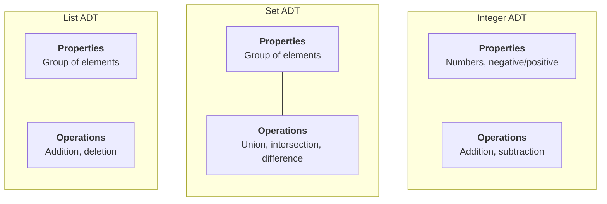
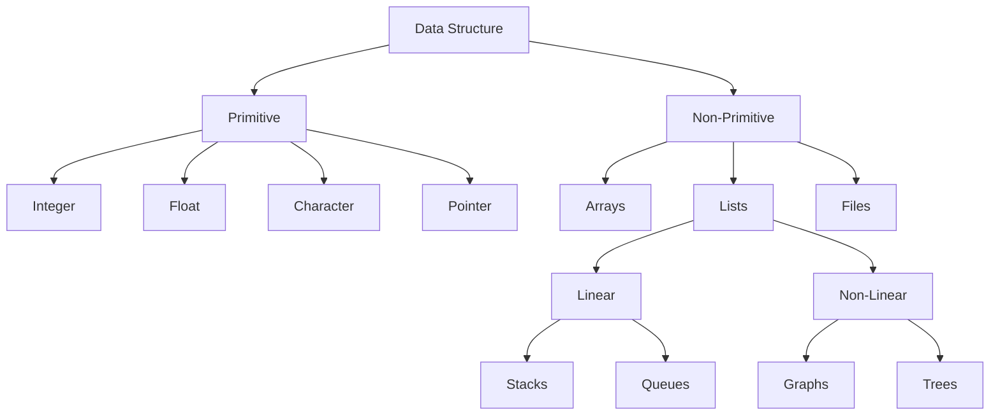

# Data Structures - Lecture 1

## Data Structure Fundamentals

**Data** is a basic entity or fact used in calculation or manipulation. A **data structure** organizes data items by considering their relationships to each other. Selecting a good data structure lets the programmer design more efficient programs.

Efficiency is measured by two metrics:

- **Space complexity** — memory required
- **Time complexity** — number of key operations performed

One solution may use more space but less time; another uses less space but more time. You sacrifice one for the other.

Space needed by a program breaks into three categories:

- **Instruction space**
- **Data space**
- **Environment stack space** — holds return addresses, values of local variables, and formal parameter values of invoked functions

## Memory Management

| Type                      | Timing       | C++ Example                        |
| ------------------------- | ------------ | ---------------------------------- |
| **Static** (compile time) | Compile time | `std::array<float, 5> a; float f;` |
| **Dynamic** (run time)    | Run time     | `int* ptr = new int[10];`          |

```cpp
struct Employee {
  int emp_code;
  char emp_name[50];
  float emp_salary;
};

// Allocates a contiguous block: 4 + 50 + 4 = 58 bytes (+ padding)
Employee* str_ptr = new Employee;
```

> [!NOTE]
> Dynamic allocation with `new` calls the constructor. You must use `delete` to free memory. Prefer `std::vector` and smart pointers (`std::unique_ptr`, `std::shared_ptr`) over raw `new`/`delete`.

## Abstraction

**Abstraction** means considering high-level characteristics without getting bogged down in implementation details. A car user thinks about driving, not the engine mechanics; the engineer handles internals.

### Abstract Data Type (ADT)

**ADT** = organized data + a set of operations for manipulating it, precisely specified independent of any particular implementation.

Key properties:

- Defines an **interface** — a contract between implementers and users
- **Encapsulation** (information hiding) — hides data structure implementation inside the ADT
- The **user** program works at the user level; the **implementation** program specifies how operations work
- User code does **not** change when implementation changes

ADT is a **black box** — it hides the inner structure and design of the data type. The user sees only interface and operations.

```cpp
// ADT as a pure interface — defines what, not how
template <typename T>
class Stack {
public:
  virtual void push(const T&) = 0;
  virtual T pop() = 0;
  virtual T top() const = 0;
  virtual bool isEmpty() const = 0;
  virtual ~Stack() = default;
};
```

Why use ADT?

1. Saves time — user studies the interface at a high level instead of understanding detailed implementation
2. Reusable — the ADT can be used across different programs
3. Change-isolated — implementation changes without affecting other components



### ADT vs Data Structure

| ADT                                     | Data Structure                                    |
| --------------------------------------- | ------------------------------------------------- |
| Logical description                     | Concrete implementation                           |
| Implementation-independent              | Implementation-dependent                          |
| Specifies **what** operations exist     | Specifies **how** operations work                 |
| Example: List ADT says "add an element" | Example: List implemented as array or linked list |

## Classification of Data Structures

Data structures classify along three independent dimensions:

- **Linear** vs **Non-linear**
- **Homogeneous** (same type) vs **Non-homogeneous** (mixed types)
- **Static** (fixed size, compile-time) vs **Dynamic** (variable size, run-time)



**Primitive**: Integer, Float, Character, Pointer
**Non-primitive, linear**: Arrays, Stacks, Queues, Linked Lists
**Non-primitive, non-linear**: Trees, Graphs

## Common Data Structures

### Array

An **array** is a collection of same-type items stored contiguously in memory. It is the most efficient structure for storing and accessing sequences.

```cpp
std::array<int, 10> A;  // 10 ints, contiguous, zero-indexed
A[3] = 27;
// Address calculation: &A[3] = &A[0] + 3 * sizeof(int)
```

One-dimensional: single row indexed `0` to `n-1`. Two-dimensional: grid with rows `0..m-1` and columns `0..n-1`.

### Stack

Follows **Last In First Out (LIFO)**. The last item pushed is the first popped. Insert (`push`) and remove (`pop`) both happen at the top.

### Queue

Follows **First In First Out (FIFO)**. The first element inserted is the first removed. Insert at rear, remove from front.

### Linked List

A **linear** data structure where elements are **not stored contiguously**. Each **node** contains a data field and a pointer to the next node.

```cpp
template <typename T>
struct Node {
  T data;
  Node* next;
};
```

### Tree

A **nonlinear** structure consisting of nodes connected by edges. One node is the **root** with zero or more subtrees.

### Graph

A set of **vertices V** and **edges E** connecting them. Used in geography, engineering, games, and puzzles.

## Why Data Structures Matter

1. Used in almost every program or software system
2. Essential ingredients of many efficient algorithms; make management of huge data (databases) possible
3. Some languages emphasize data structures as the key organizing factor in software design

---

_6 min read (source: 14 min)_
