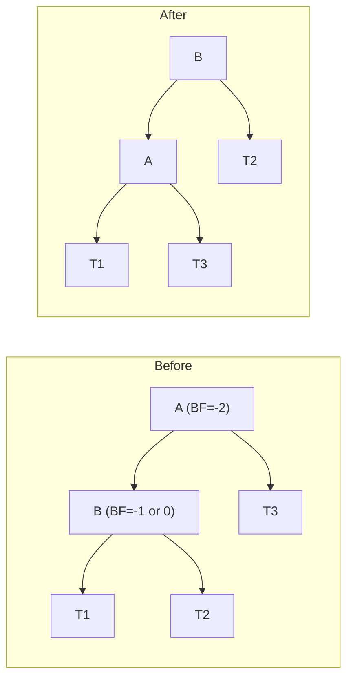

# Data Structures - Lecture 10

## Why AVL Tree?

A plain BST degrades to O(n) height in the worst case (sorted input). An **AVL tree** maintains O(log n) height by keeping every node's subtrees approximately equal in height. It is a BST with an added **balance constraint**.

## AVL Tree Definition

An **AVL tree** (Adelson-Velsky & Landis, 1962) is a BST where for every node, the **balance factor** (height of right subtree minus height of left subtree) is in {-1, 0, +1}.

**Balance factor states:**

| State           | Balance Factor | Meaning              |
| --------------- | -------------- | -------------------- |
| **Balanced**    | -1, 0, or +1   | No rotation needed   |
| **Left-heavy**  | -2 or less     | Needs right rotation |
| **Right-heavy** | +2 or more     | Needs left rotation  |

> [!NOTE]
> AVL trees guarantee O(log n) for search, insert, and delete because the height is always O(log n).

## Rotations

When an insert or delete causes imbalance, a **rotation** restores the balance factor. There are four cases determined by where the imbalance is and which child caused it.

### LL Imbalance -> Single Right Rotation

**Condition:** Node A has balance factor -2, left child B has balance factor -1 or 0.



**Fix:** Single right rotation at A — B becomes the new root of this subtree, A becomes B's right child.

### RR Imbalance -> Single Left Rotation

**Condition:** Node A has balance factor +2, right child B has balance factor +1 or 0.

**Fix:** Single left rotation at A — B becomes root, A becomes B's left child.

### LR Imbalance -> Double Rotation (Left-Right)

**Condition:** Node A has balance factor -2, left child B has balance factor +1.

**Fix:** First left rotate at B, then right rotate at A. C (B's right child) becomes the new root.

### RL Imbalance -> Double Rotation (Right-Left)

**Condition:** Node A has balance factor +2, right child B has balance factor -1.

**Fix:** First right rotate at B, then left rotate at A. C (B's left child) becomes the new root.

| Imbalance   | Child BF             | Rotation Type | Steps                                    |
| ----------- | -------------------- | ------------- | ---------------------------------------- |
| **LL** (-2) | Left child: -1 or 0  | Single right  | Right rotate at A                        |
| **RR** (+2) | Right child: +1 or 0 | Single left   | Left rotate at A                         |
| **LR** (-2) | Left child: +1       | Double        | Left rotate at B, then right rotate at A |
| **RL** (+2) | Right child: -1      | Double        | Right rotate at B, then left rotate at A |

## AVLTree Class (C++)

```cpp
template <typename T>
struct AVLNode {
  T data;
  AVLNode* left;
  AVLNode* right;
  int height;
};

template <typename T>
class AVLTree {
private:
  AVLNode<T>* root;

  int height(AVLNode<T>* node) const {
    return node ? node->height : -1;
  }

  int balanceFactor(AVLNode<T>* node) const {
    return height(node->right) - height(node->left);
  }

  void updateHeight(AVLNode<T>* node) {
    node->height = 1 + std::max(height(node->left), height(node->right));
  }

  AVLNode<T>* rotateRight(AVLNode<T>* A) {
    AVLNode<T>* B = A->left;
    A->left = B->right;
    B->right = A;
    updateHeight(A);
    updateHeight(B);
    return B;
  }

  AVLNode<T>* rotateLeft(AVLNode<T>* A) {
    AVLNode<T>* B = A->right;
    A->right = B->left;
    B->left = A;
    updateHeight(A);
    updateHeight(B);
    return B;
  }

  AVLNode<T>* rebalance(AVLNode<T>* node) {
    updateHeight(node);
    int bf = balanceFactor(node);

    if (bf < -1) {
      if (balanceFactor(node->left) > 0) {
        node->left = rotateLeft(node->left);  // LR case
      }
      return rotateRight(node);                // LL case
    }

    if (bf > 1) {
      if (balanceFactor(node->right) < 0) {
        node->right = rotateRight(node->right);  // RL case
      }
      return rotateLeft(node);                    // RR case
    }

    return node;
  }

  AVLNode<T>* insertHelper(AVLNode<T>* node, T key) {
    if (!node) {
      return new AVLNode<T>{key, nullptr, nullptr, 0};
    }

    if (key < node->data) {
      node->left = insertHelper(node->left, key);
    }
    else if (key > node->data) {
      node->right = insertHelper(node->right, key);
    } else return node;  // duplicates not allowed

    return rebalance(node);
  }

  AVLNode<T>* removeHelper(AVLNode<T>* node, T key) {
    if (!node) return nullptr;

    if (key < node->data) {
      node->left = removeHelper(node->left, key);
    }
    else if (key > node->data) {
      node->right = removeHelper(node->right, key);
    }
    else {
      if (!node->left) return node->right;
      if (!node->right) return node->left;

      // Two children: find inorder predecessor
      AVLNode<T>* pred = node->left;
      while (pred->right) pred = pred->right;
      node->data = pred->data;
      node->left = removeHelper(node->left, pred->data);
    }

    return rebalance(node);
  }

public:
  AVLTree() { this->root = nullptr; }

  void insert(T key) {
    this->root = insertHelper(this->root, key);
  }

  void remove(T key) {
    this->root = removeHelper(this->root, key);
  }
};
```

> [!NOTE]
> Insert and delete follow standard BST logic, then call `rebalance` on every node along the path back to root. The `rebalance` method checks the balance factor and applies the appropriate rotation.

Click the following [link](https://liveexample.pearsoncmg.com/dsanimation/AVLTree.html) to see a visualization of insert, delete and search.

---

_5 min read (source: 7 min)_
