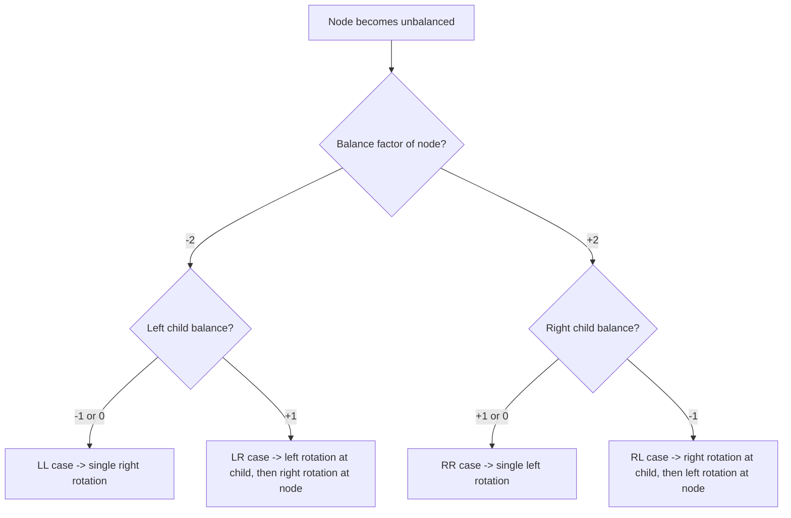

# Trees III: AVL Trees

## AVL Tree Motivation and Boundary

An **AVL tree** is a **well-balanced binary search tree**. It is not a perfectly balanced tree like a complete binary tree; it is a compromise that keeps tree height small enough for fast operations.

This matters because **search**, **insertion**, and **deletion** in a binary tree depend on the height of the tree. In the worst case, ordinary height can become **O(n)**, but an AVL tree keeps maximum height at **O(log n)**.

The lecture boundary is important: AVL trees keep the ordinary **BST ordering rule**, then add a balance condition on top of it.

| Concept                     | Meaning                                                      | Why it matters                       |
| --------------------------- | ------------------------------------------------------------ | ------------------------------------ |
| **BST rule**                | left subtree keys are smaller, right subtree keys are larger | keeps searching directional          |
| **Perfectly balanced tree** | shape is as full as possible                                 | fast, but costly to maintain exactly |
| **AVL tree**                | BST with tight local height control                          | preserves near-logarithmic height    |

> [!CAUTION]
> An AVL tree must satisfy both the **BST rule** and the **AVL balance rule**.

## Balance Factor, Left-Heavy, and Right-Heavy

The **balance factor** of a node is:

```text
balance factor = height(right subtree) - height(left subtree)
```

A node is **balanced** if the factor is **-1, 0, or +1**. If it becomes **-2** or **+2**, the node is unbalanced and a **rotation** is required.

| Balance factor   | Interpretation              | Status                |
| ---------------- | --------------------------- | --------------------- |
| **-1**           | left subtree taller by 1    | balanced, left-heavy  |
| **0**            | equal heights               | balanced              |
| **+1**           | right subtree taller by 1   | balanced, right-heavy |
| **-2** or **+2** | height difference too large | unbalanced            |

## Rotation Cases and When to Use Them

There are **four possible rotations**. The exam idea is to identify the first unbalanced node, inspect its child, then choose the matching case.



### LL rotation

Occurs when `bf(A) = -2` and the left child has balance `-1` or `0`. Fixed by a **single right rotation**.

### RR rotation

Occurs when `bf(A) = +2` and the right child has balance `+1` or `0`. Fixed by a **single left rotation**.

### LR rotation

Occurs when `bf(A) = -2` and the left child has balance `+1`. Fixed by **left rotation at the child**, then **right rotation at the node**.

### RL rotation

Occurs when `bf(A) = +2` and the right child has balance `-1`. Fixed by **right rotation at the child**, then **left rotation at the node**.

> [!IMPORTANT]
> **LL** and **RR** are outer cases and use one rotation. **LR** and **RL** are inner cases and use two.

## Single vs. Double Rotation

| Case   | Node balance | Child balance           | Fix              |
| ------ | ------------ | ----------------------- | ---------------- |
| **LL** | `-2`         | Left child `-1` or `0`  | Right rotation   |
| **RR** | `+2`         | Right child `+1` or `0` | Left rotation    |
| **LR** | `-2`         | Left child `+1`         | Left, then right |
| **RL** | `+2`         | Right child `-1`        | Right, then left |

The order matters. In an inner case, rotating only at the unbalanced node would not place the middle subtree correctly. The first rotation converts the inner case into an outer case; the second rotation finishes the repair.

## AVL Structure and Class Design

The lecture states that an **AVL tree is a binary tree**, so **AVLTree** can be designed to extend the **BST** class. The main design idea is reuse: keep ordinary BST logic, then add AVL rebalancing behavior.

> [!CAUTION]
> The extracted source used for this lecture stops at the class-design statement. It names later implementation topics in the objectives, but the recovered pages did not include them.

## High-Yield Traps

1. **AVL** does not mean perfectly balanced; it means each node differs in subtree height by at most **1**.
2. The lecture defines **balance factor** as `right height - left height`, so negative means left side is taller.
3. **`-1`, `0`, `+1`** are still balanced values; **`-2`** and **`+2`** trigger repair.
4. **LL** and **RR** use one rotation; **LR** and **RL** use two.
5. Rebalancing changes shape, but the goal is to preserve **BST order** while reducing height.
