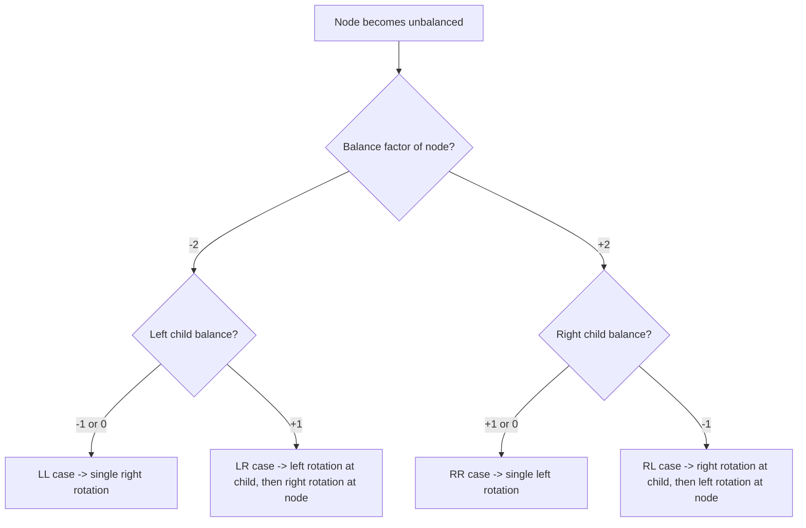

# Data Structures - Lecture 10

## AVL Tree Motivation and Boundary

An **AVL tree** is a **well-balanced binary search tree**. It is not a perfectly balanced tree like a complete binary tree; the goal is a cheaper compromise that keeps height small enough for fast operations. This matters because **search**, **insertion**, and **deletion** in any binary tree depend on the tree height: in the worst case, height can become **O(n)**, but in an AVL tree the maximum height is **O(log n)**.

The lecture boundary is important: insertion and deletion follow the **same basic search path as a regular BST**, then the tree may need **rebalancing**. So AVL trees do not replace BST ordering rules; they add a balance condition on top of BST structure.

| Concept                     | Meaning                                                      | Why it matters                          |
| --------------------------- | ------------------------------------------------------------ | --------------------------------------- |
| **BST rule**                | Left subtree keys are smaller, right subtree keys are larger | Keeps searching directional             |
| **Perfectly balanced tree** | Shape is as full/complete as possible                        | Fast, but expensive to maintain exactly |
| **AVL tree**                | BST with tight local height control                          | Preserves near-logarithmic height       |

> [!CAUTION]
> _An AVL tree is not "any balanced-looking tree." It must still satisfy BST ordering and the AVL balance condition at every node._

## Balance Factor, Left-Heavy, and Right-Heavy

The **balance factor** of a node is:

```text
balance factor = height(right subtree) - height(left subtree)
```

A node is **balanced** if its balance factor is **-1, 0, or +1**. A node is **left-heavy** if the balance factor is **-1** and **right-heavy** if it is **+1**. This definition explains why the sign matters: a negative value means the left side is taller because left height is being subtracted from right height.

If a node becomes **-2** or **+2** after insertion or deletion, the node is no longer balanced and a **rotation** is required. Rotation is a local restructuring that changes shape without breaking the BST order.

| Balance factor   | Interpretation                      | Status                |
| ---------------- | ----------------------------------- | --------------------- |
| **-1**           | Left subtree is taller by 1         | Balanced, left-heavy  |
| **0**            | Both subtrees have equal height     | Balanced              |
| **+1**           | Right subtree is taller by 1        | Balanced, right-heavy |
| **-2** or **+2** | Height difference exceeds AVL limit | Unbalanced            |

## Rotation Cases and When to Use Them

There are **four possible rotations**. The exam idea is to identify the first unbalanced node, inspect its child, then choose the matching case.



### LL rotation

An **LL imbalance** occurs at node **A** when `bf(A) = -2` and its left child **B** has balance factor **-1 or 0**. The fix is a **single right rotation at A**. This works because the extra height came from the left-left side, so one right pivot restores the height relation.

### RR rotation

An **RR imbalance** occurs at node **A** when `bf(A) = +2` and its right child **B** has balance factor **+1 or 0**. The fix is a **single left rotation at A**. This is the mirror image of LL.

### LR rotation

An **LR imbalance** occurs at node **A** when `bf(A) = -2` and its left child **B** has balance factor **+1**. If **B**'s right child is **C**, the fix is a **double rotation**: first **left rotate at B**, then **right rotate at A**. Two steps are needed because the taller path bends inward.

### RL rotation

An **RL imbalance** occurs at node **A** when `bf(A) = +2` and its right child **B** has balance factor **-1**. If **B**'s left child is **C**, the fix is: first **right rotate at B**, then **left rotate at A**. This is the mirror image of LR.

> [!IMPORTANT]
> _Single rotations fix outer imbalances (`LL`, `RR`). Double rotations fix inner imbalances (`LR`, `RL`)._

## Single vs. Double Rotation

| Case   | Node balance | Child balance           | Fix              |
| ------ | ------------ | ----------------------- | ---------------- |
| **LL** | `-2`         | Left child `-1` or `0`  | Right rotation   |
| **RR** | `+2`         | Right child `+1` or `0` | Left rotation    |
| **LR** | `-2`         | Left child `+1`         | Left, then right |
| **RL** | `+2`         | Right child `-1`        | Right, then left |

The order matters. In an inner case, rotating only at the unbalanced node would not place the middle subtree correctly. The first rotation converts the inner case into an outer case; the second rotation finishes the repair.

## AVL Structure and Class Design

The lecture states that an **AVL tree is a binary tree**, so the **AVLTree** class can be designed to **extend the BST class**. The design idea is reuse: keep the ordinary BST search/insertion/deletion framework, then add **rebalancing** behavior and any stored balance/height information needed by the AVL implementation.

```cpp
// Purpose: show the lecture's design idea in C++ form.
class BST {
public:
  // Standard BST operations live here.
};

class AVLTree : public BST {
public:
  // AVL-specific rebalancing logic is added here.
};
```

> [!CAUTION]
> _The extracted source stops at the class-design statement. It names insertion, deletion, implementation, testing, and complexity in the objectives, but those later details are not present in the extracted pages used here, so they are not expanded beyond the lecture's explicit claims._

## High-Yield Traps

1. **AVL** does not mean perfectly balanced; it means each node differs in subtree height by at most **1**.
2. The lecture defines **balance factor** as `right height - left height`, so negative means left side is taller.
3. **`-1`, `0`, `+1`** are still balanced values; **`-2`** and **`+2`** trigger repair.
4. **LL** and **RR** use one rotation; **LR** and **RL** use two.
5. Rebalancing changes shape, but the goal is to preserve **BST order** while reducing height.
