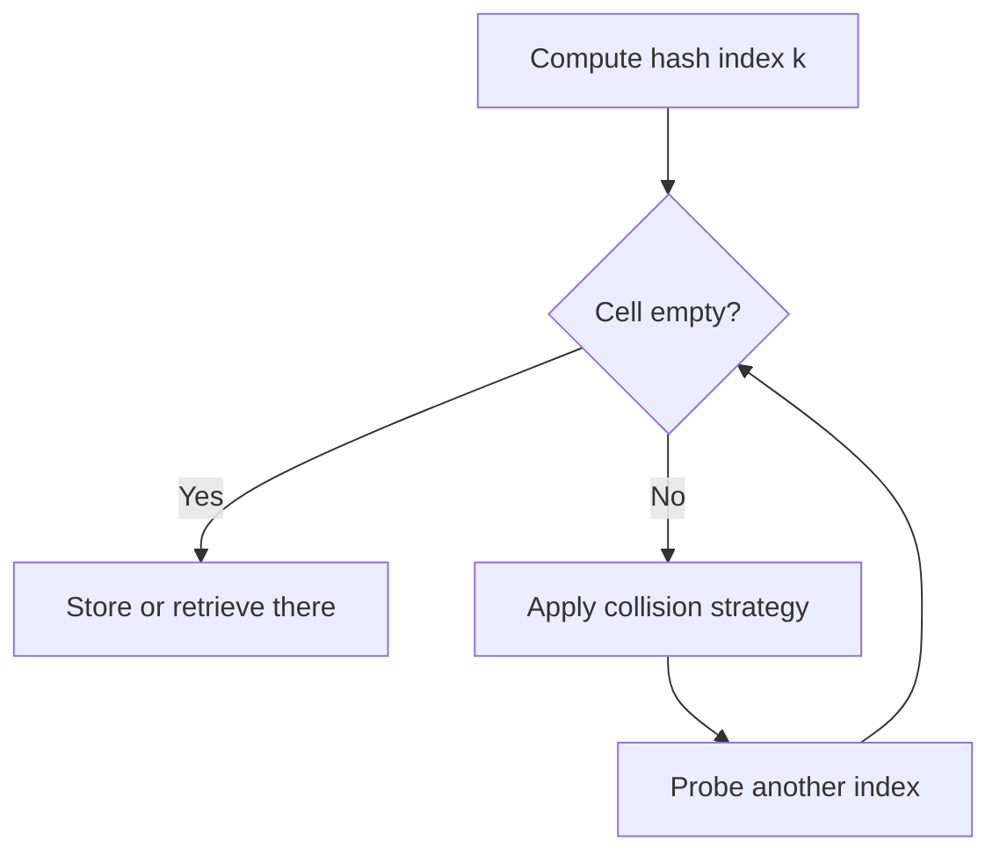

# Search Structures I: Hashing

## Hashing and Why It Matters

**Hashing** is a technique that retrieves a value using an index obtained from a key, without performing a normal search through all stored elements. The lecture presents it as an alternative to balanced tree searching.

| Structure idea           | Access logic                   | Typical time in lecture |
| ------------------------ | ------------------------------ | ----------------------- |
| **Balanced search tree** | follow comparisons down levels | **O(log n)**            |
| **Hash table**           | compute index from key         | **O(1)**                |

> [!CAUTION]
> Hashing avoids ordinary search only after the key has been mapped to a valid index.

## Map, Hash Table, and Hash Function

A **map** stores **entries**, and each entry has a **key** and a **value**. The **hash table** is the array used for storage, and the **hash function** maps the key to an index.

The lecture uses two stages:

1. convert the key into a **hash code**
2. compress the hash code into a table index

| Term              | Meaning                           | Boundary                |
| ----------------- | --------------------------------- | ----------------------- |
| **Key**           | search field of an entry          | used to locate data     |
| **Value**         | data associated with the key      | returned after lookup   |
| **Hash code**     | integer form derived from the key | not yet the final index |
| **Hash function** | mapping to table index            | must land inside bounds |

## Collision and Open Addressing

A **collision** occurs when two keys map to the same table index. One solution is **open addressing**, where the algorithm searches for another location in the table.

The probing method determines which alternative cells are checked. The order matters because different probe patterns cause different clustering behavior.



> [!IMPORTANT]
> _In open addressing, collided entries do not stay together in one bucket. The algorithm keeps searching for another table location._

The lecture compares three probe methods:

Here is the information organized into a table:

| Probing Method        | Mechanism                                                                                              | Key Property / Issue                                                                                                        |
| --------------------- | ------------------------------------------------------------------------------------------------------ | --------------------------------------------------------------------------------------------------------------------------- |
| **Linear probing**    | Checks consecutive cells starting from the original index `k`.                                         | Simple, but causes **clustering** – groups of occupied consecutive cells grow, making later insertions and searches slower. |
| **Quadratic probing** | Increases the offset by squares: for `j = 1, 2, 3, ...`, checked positions are `k`, `k+1`, `k+4`, etc. | Reduces clustering; can avoid the clustering problem seen in linear probing (as stated in the lecture).                     |
| **Double hashing**    | Uses a **secondary hash function** to determine the step size.                                         | (The lecture example follows, but the provided text ends here: "The lecture example is:")                                   |

Lecture example:

```text
h'(k) = 7 - k % 7
```

## Separate Chaining and Buckets

The second collision strategy is **separate chaining**. Entries with the same hash index are stored together in a **bucket** instead of being moved to another array location.

This means collided entries remain at the original index and are stored together in a bucket, unlike open addressing, which relocates them to other indices.

| Collision strategy    | Where collided entries go  | Key distinction                   |
| --------------------- | -------------------------- | --------------------------------- |
| **Open addressing**   | Other table cells          | Probe sequence is required        |
| **Separate chaining** | Same index inside a bucket | Multiple entries share one bucket |

> [!CAUTION]
> A **bucket** is not a single entry. One bucket may hold multiple collided entries.

## Load Factor, Rehashing, and Design Direction

The lecture objectives explicitly name **load factor** and **rehashing**, which signals that hash-table performance depends on table fullness and that resizing/reorganization may be necessary.

The design direction in the lecture connects hashing to implementing both **maps** and **sets**.

## High-Yield Traps

1. **Hash code** is not automatically the final array index; it is typically compressed into one.
2. **Collision** means two keys map to the same index, not that hashing has failed.
3. **Linear probing** uses consecutive cells and suffers from clustering.
4. **Quadratic probing** and **double hashing** are both open-addressing methods, not separate chaining.
5. **Separate chaining** keeps collisions at the same index inside a **bucket**.
6. The extracted slides name **load factor** and **rehashing**, but they do not provide the full procedural details here, so no extra formulas are invented beyond that scope.
