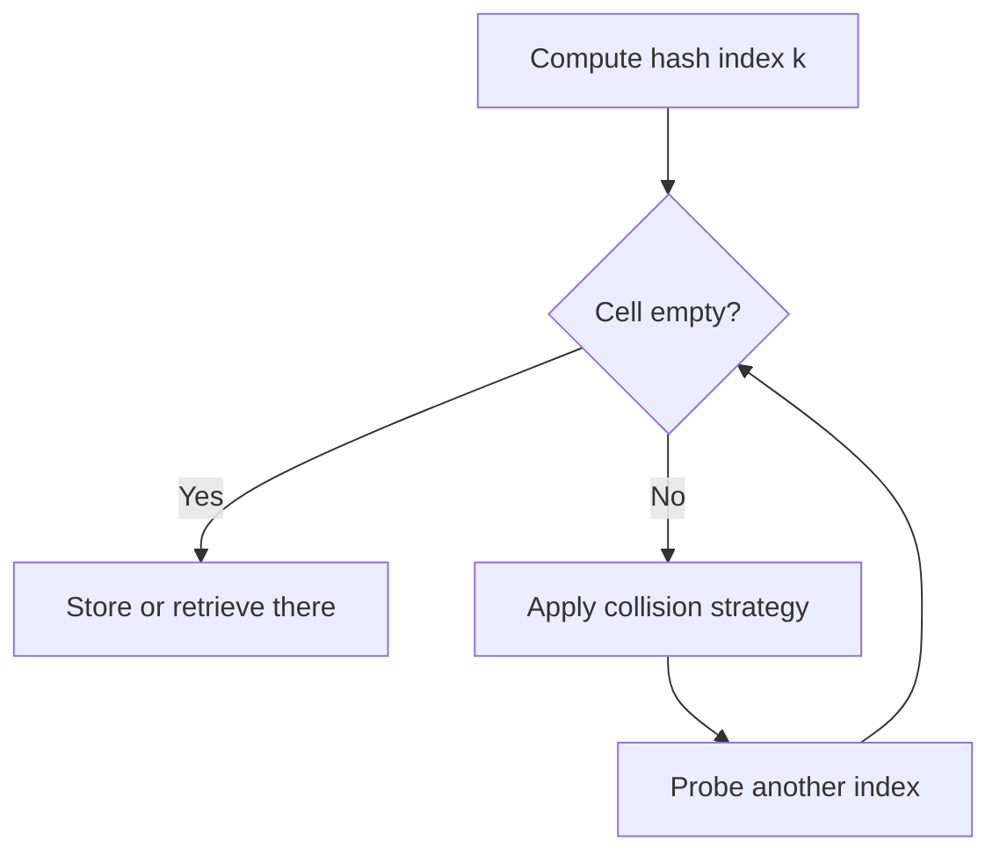

## Hashing and Why It Matters

**Hashing** is a technique that retrieves a value using an index obtained from a key, without performing a search through all elements. The core goal is speed: while a well-balanced search tree gives **O(log n)** lookup, hashing is used to support **search**, **insert**, and **delete** in **O(1)** time on average. This works because the key is transformed directly into a table position.

The lecture frames hashing as an alternative to tree-based searching, not as a replacement for every structure. Its benefit depends on being able to map keys into array positions efficiently.

| Structure idea           | Access logic                   | Typical time in lecture |
| ------------------------ | ------------------------------ | ----------------------- |
| **Balanced search tree** | Follow comparisons down levels | **O(log n)**            |
| **Hash table**           | Compute index from key         | **O(1)**                |

> [!CAUTION]
> _Hashing avoids ordinary search, but only after a key has been mapped to an index by a suitable function._

## Map, Hash Table, and Hash Function

A **map** is a data structure that stores **entries**, and each entry has two parts: **key** and **value**. The **key** is also called a **search key** because it is used to find the associated value. The lecture also notes that a map may be called a **dictionary**, **hash table**, or **associative array**, though "map" is the preferred term.

The array used to store values is the **hash table**. The rule that maps a key to an index in that table is the **hash function**. A typical design has two stages:

1. Convert the key into an integer called a **hash code**.
2. Compress that hash code into a valid table index.

This separation matters because real keys may be strings or large numbers, while the table needs a bounded array position.

| Term              | Meaning                             | Boundary                      |
| ----------------- | ----------------------------------- | ----------------------------- |
| **Key**           | Search field of an entry            | Used to locate data           |
| **Value**         | Data associated with the key        | Returned after lookup         |
| **Hash code**     | Integer form derived from the key   | Not yet a final table index   |
| **Hash function** | Mapping from key/hash code to index | Must land inside table bounds |

## Collision and Open Addressing

A **collision** occurs when two keys map to the same hash-table index. Since a single array cell cannot directly hold two different entries in the same slot under simple storage, the collision must be resolved. One major strategy in the lecture is **open addressing**, where the algorithm searches for another location in the table.

The probing method determines which alternative cells are checked. The order matters because different probe patterns cause different clustering behavior.



> [!IMPORTANT]
> _In open addressing, collided entries do not stay together in one bucket. The algorithm keeps searching for another table location._

## Linear Probing, Quadratic Probing, and Double Hashing

**Linear probing** checks consecutive cells starting from the original index `k`. This is simple, but it causes **clustering**, meaning groups of occupied consecutive cells grow and make later insertions and searches slower.

**Quadratic probing** reduces clustering by increasing the offset by squares: for `j = 1, 2, 3, ...`, the checked positions are `k`, `k + 1`, `k + 4`, and so on. The lecture explicitly states that quadratic probing can avoid the clustering problem seen in linear probing.

**Double hashing** uses a **secondary hash function** to determine the step size. The lecture example is:

```text
h'(k) = 7 - k % 7
```

This helps avoid clustering because different keys can move through the table using different increments.

| Method                | Next location idea                    | Main point                   |
| --------------------- | ------------------------------------- | ---------------------------- |
| **Linear probing**    | Consecutive cells                     | Simple, but clustering grows |
| **Quadratic probing** | Add `j^2`                             | Reduces clustering           |
| **Double hashing**    | Add a step from another hash function | Better spread of probes      |

## Separate Chaining and Buckets

The second collision strategy is **separate chaining**. Instead of looking for another array position, all entries with the same hash index are stored in the same location. Each such location is called a **bucket**, and a bucket is a container that can hold multiple entries.

This means a collision does not force the entry into another index; it stays at the computed index and is grouped with other colliding entries in that bucket. The main contrast with open addressing is where collided elements go.

| Collision strategy    | Where collided entries go  | Key distinction                   |
| --------------------- | -------------------------- | --------------------------------- |
| **Open addressing**   | Other table cells          | Probe sequence is required        |
| **Separate chaining** | Same index inside a bucket | Multiple entries share one bucket |

> [!CAUTION]
> _Do not confuse a bucket with a single entry. In separate chaining, one index may correspond to a container holding several entries._

## Load Factor, Rehashing, and Design Direction

The objectives explicitly include **load factor** and the need for **rehashing**, even though the extracted slides do not expand them in detail. The safe lecture-faithful interpretation is that hash-table performance depends on how full the table becomes, and rehashing is needed when the table must be reorganized to preserve efficient access.

The design slides also show the implementation direction:

```cpp
// Purpose: show the lecture's class relationship idea.
class MyMap {
public:
  // Map behavior is defined here.
};

class MyHashMap : public MyMap {
public:
  // Hashing-based map implementation goes here.
};

class MySet {
public:
  // Set behavior is defined here.
};

class MyHashSet : public MySet {
public:
  // Hashing-based set implementation goes here.
};
```

The lecture therefore connects hashing to implementing both **maps** and **sets**.

## High-Yield Traps

1. **Hash code** is not automatically the final array index; it is typically compressed into one.
2. **Collision** means two keys map to the same index, not that hashing has failed.
3. **Linear probing** uses consecutive cells and suffers from clustering.
4. **Quadratic probing** and **double hashing** are both open-addressing methods, not separate chaining.
5. **Separate chaining** keeps collisions at the same index inside a **bucket**.
6. The extracted slides name **load factor** and **rehashing**, but they do not provide the full procedural details here, so no extra formulas are invented beyond that scope.
