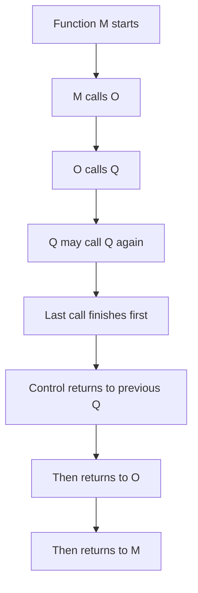

# Stacks I: Stack ADT and LIFO Behavior

## Stack Definition and Boundaries

A **stack** is a **linear non-primitive data structure** and an **ordered list of elements of the same type**. All operations are performed at one end only, called the **top**. A stack follows **LIFO (Last-In, First-Out)** behavior.

| Concept   | Meaning                            | Includes                | Excludes                |
| --------- | ---------------------------------- | ----------------------- | ----------------------- |
| **Top**   | active end of the stack            | push and pop position   | bottom or middle access |
| **LIFO**  | last inserted leaves first         | reverse retrieval order | FIFO behavior           |
| **Stack** | ordered same-type linear structure | one-end updates         | random deletion         |

> [!CAUTION]
> In the stack ADT, operations are allowed only at the **top**.

## Stack Operations and Contracts

The core operations are **CreateStack**, **StackEmpty**, **StackFull**, **Push**, and **Pop**.

| Operation       | Precondition           | Postcondition       | Trap                      |
| --------------- | ---------------------- | ------------------- | ------------------------- |
| **CreateStack** | none                   | stack becomes empty | forgetting initialization |
| **Push**        | initialized, not full  | item added at top   | overflow if full          |
| **Pop**         | initialized, not empty | top item removed    | underflow if empty        |
| **StackEmpty**  | initialized            | boolean result      | does not modify stack     |
| **StackFull**   | initialized            | boolean result      | mainly for static stacks  |

## System Stack and Real Use

A major application is the **system stack**, which manages function calls. Nested or recursive calls fit LIFO naturally, because the most recent call must finish first.

## Contiguous Stack Idea

A **contiguous implementation** stores stack items adjacently in memory, so the stack is kept in an **array**. The lecture highlights two top-pointer conventions:

1. `top = -1` means empty and `top` points to the current last item after insertion
2. `top = 0` means empty and `top` stores the next insertion position

_Exam trap:_ do not mix the formulas of these two conventions.

## Push and Pop: Order and Error Cases

In the `top = -1` model, **push** increments `top` before writing, while **pop** reads before decrementing. That order matters because `top` points to the current valid element.

The lecture also contrasts two designs:

| Pair              | First specification      | Second specification    |
| ----------------- | ------------------------ | ----------------------- |
| **Push**          | caller ensures not full  | checks overflow inside  |
| **Pop**           | caller ensures not empty | checks underflow inside |
| **Design effect** | simpler contract         | safer contract          |

## Stack Application: Reversing a Line of Text

To reverse text, each character is pushed as it is read, then popped and printed. LIFO makes the output the reverse of the input.

> [!CAUTION]
> In a **static stack**, reversing can stop early if the stack becomes full.

## StackTop and ADT vs. Implementation View

The lecture distinguishes between a **user view** and an **implementation view** of `StackTop`.

| Version                 | Advantage                 | Limitation                   |
| ----------------------- | ------------------------- | ---------------------------- |
| **User view**           | respects the ADT boundary | may require extra operations |
| **Implementation view** | simpler and faster        | breaks information hiding    |

The central idea is that ADT users should think in terms of allowed operations, not hidden internal storage.
