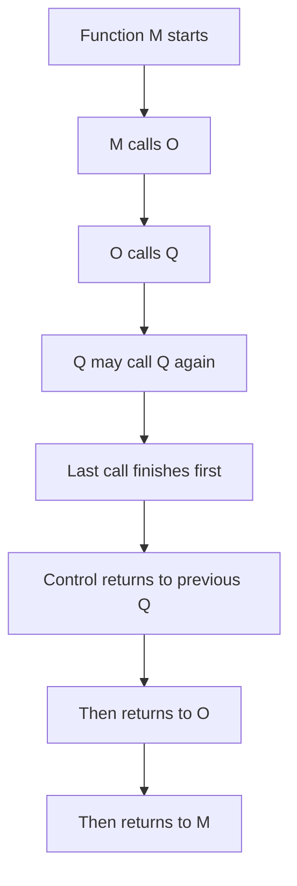

# Data Structures - Lecture 2

## Stack Definition and Boundaries

A **stack** is a **linear non-primitive data structure** and an **ordered list of elements of the same type**. All operations are performed at one end only, called the **top**. A stack follows **LIFO (Last-In, First-Out)** behavior: the last element pushed is the first element popped.

**Why this matters:** restricting access to one end is what creates LIFO order; if insertion or deletion were allowed in the middle or at both ends, it would no longer match the lecture definition of a stack.

| Concept   | Meaning                            | Includes                | Excludes                |
| --------- | ---------------------------------- | ----------------------- | ----------------------- |
| **Top**   | Active end of the stack            | Push and pop position   | Bottom or middle access |
| **LIFO**  | Last inserted leaves first         | Reverse retrieval order | FIFO behavior           |
| **Stack** | Ordered same-type linear structure | One-end updates         | Random deletion         |

> [!CAUTION]
> _Do not confuse a **stack** with a general list._ In the stack ADT, operations are allowed only at the **top**.

## Stack Operations and Their Contracts

The core operations are **CreateStack**, **StackEmpty**, **StackFull**, **Push**, and **Pop**. Each should be understood through its **precondition** and **postcondition**.

**Why this matters:** exam questions often test whether an operation assumes a valid state first, or whether it handles errors internally.

### Core Operation Rules

1. **CreateStack**: initializes the stack as empty.
2. **StackEmpty**: returns true if no elements exist.
3. **StackFull**: returns true if no more elements can be added in a static stack.
4. **Push**: adds a new entry onto the top.
5. **Pop**: removes the top entry and returns it.

| Operation       | Precondition           | Postcondition       | Trap                      |
| --------------- | ---------------------- | ------------------- | ------------------------- |
| **CreateStack** | None                   | Stack becomes empty | Forgetting initialization |
| **Push**        | Initialized, not full  | Item added at top   | Overflow if full          |
| **Pop**         | Initialized, not empty | Top item removed    | Underflow if empty        |
| **StackEmpty**  | Initialized            | Boolean result      | Does not modify stack     |
| **StackFull**   | Initialized            | Boolean result      | Mainly for static stacks  |

## System Stack and Real Use

A major application is the **system stack**, which manages function calls. Nested or recursive calls fit LIFO naturally, because the most recent call must finish first.

**Why this matters:** recursion works because each new call is pushed above the previous one, and returns occur in reverse order.



## Contiguous Stack Implementation Using an Array

A **contiguous implementation** stores stack items adjacent in memory, so the stack is kept in an **array**. The top position is stored in an integer field named **top**.

**Why this matters:** contiguous storage makes indexing simple, but capacity is fixed in advance.

```cpp
// Represents a static stack using contiguous array storage.
const int MAX = 10;
using EntryType = char;

struct StackType {
  int top;
  EntryType entry[MAX];
};
```

The lecture’s first style uses `top = -1` to mean the stack is empty. In that model, a full stack has `top == MAX - 1`.

```cpp
// Initializes the stack to the empty state.
void CreateStack(StackType* s) {
  s->top = -1;
}

bool StackEmpty(StackType s) {
  return s.top == -1;
}

bool StackFull(StackType s) {
  return s.top == MAX - 1;
}
```

## Push and Pop: Order and Error Cases

In the `top = -1` model, **push** increments `top` before writing, while **pop** reads before decrementing. That order matters because `top` points to the current valid element.

```cpp
// Pushes an item when the stack is known not to be full.
void Push(EntryType item, StackType* s) {
  s->entry[++s->top] = item;
}

// Pops an item when the stack is known not to be empty.
void Pop(EntryType* item, StackType* s) {
  *item = s->entry[s->top--];
}
```

The lecture also shows another specification where `Push` and `Pop` check **overflow** and **underflow** internally.

> [!IMPORTANT]
> The safer specification is usually the one that checks errors internally, because it still behaves correctly when the caller fails to test `StackFull` or `StackEmpty` first.

| Pair              | First Specification                | Second Specification           |
| ----------------- | ---------------------------------- | ------------------------------ |
| **Push**          | Requires not full as precondition  | Checks overflow inside         |
| **Pop**           | Requires not empty as precondition | Checks underflow inside        |
| **Design effect** | Faster, simpler contract           | Safer, more defensive contract |

## Stack Application: Reversing a Line of Text

To reverse text, each character is pushed as it is read, then popped and printed. LIFO makes the output the reverse of the input.

**Why this matters:** this is a direct proof of how LIFO transforms order.

```cpp
// Reverses a line by pushing input characters, then popping them.
StackType stack;
char item;
CreateStack(&stack);

item = getchar();
while (!StackFull(stack) && item != '\n') {
  Push(item, &stack);
  item = getchar();
}

while (!StackEmpty(stack)) {
  Pop(&item, &stack);
  putchar(item);
}
```

> [!CAUTION]
> _In a static stack, reversing stops early if the stack becomes full._ Capacity limits are part of the algorithm’s behavior.

## StackTop and ADT vs. Implementation View

The lecture gives two versions of **StackTop**, which returns the top element while leaving the stack unchanged. At the **user view**, it uses only public stack operations. At the **implementation view**, it reads the internal array directly.

**Why this matters:** the user version respects the **ADT interface**, while the implementation version depends on hidden representation.

```cpp
// Implementation-view version: accesses internal storage directly.
EntryType StackTop(StackType* s) {
  return s->entry[s->top];
}
```

| Version                 | Advantage             | Limitation                          |
| ----------------------- | --------------------- | ----------------------------------- |
| **User view**           | Respects ADT boundary | May require extra operations        |
| **Implementation view** | Simpler and faster    | Breaks information hiding for users |

The lecture also presents another static style where `top = 0` means empty and `top` stores the next insertion position. In that model, `isEmpty()` checks `top == 0`, `isFull()` checks `top == STACK_SIZE`, `push` writes then increments, and `pop` decrements then reads. _Exams may compare these two top conventions, so do not mix their formulas._
