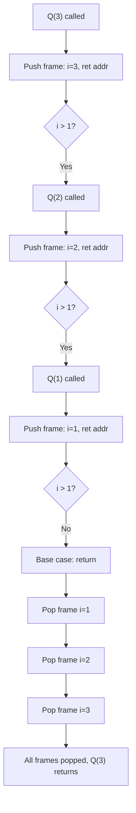

# Data Structures - Lecture 2

## Stack Definition

**Stack** is a **linear, non-primitive** data structure — an ordered list of same-type elements where all operations occur at one end called **top**. Follows **Last In First Out (LIFO)**: the last item pushed is the first popped.

## Stack Operations

| Operation   | Description                         | Precondition                    |
| ----------- | ----------------------------------- | ------------------------------- |
| **Create**  | Initialize stack to empty           | None                            |
| **isEmpty** | Check if stack has no elements      | Stack initialized               |
| **isFull**  | Check if stack has reached capacity | Stack initialized               |
| **Push**    | Add item to top of stack            | Stack initialized and not full  |
| **Pop**     | Remove top item from stack          | Stack initialized and not empty |

## Contiguous Implementation

Stack items stored in an array; `top` tracks the current top position.

```cpp
const int MAX = 10;

class Stack {
private:
  char items[MAX];
  int top;

public:
  Stack() {
    this->top = -1;
  }

  bool isEmpty() const {
    return this->top == -1;
  }

  bool isFull() const {
    return this->top == MAX - 1;
  }

  // Specification 1: assumes precondition (not full)
  void push(char item) {
    this->items[++this->top] = item;
  }

  // Specification 2: checks overflow (safer)
  void pushChecked(char item) {
    if (this->isFull()) {
      throw std::overflow_error("Stack overflow");
    }
    this->items[++this->top] = item;
  }

  // Specification 1: assumes precondition (not empty)
  void pop(char& item) {
    item = this->items[this->top--];
  }

  // Specification 2: checks underflow
  void popChecked(char& item) {
    if (this->isEmpty()) {
      throw std::underflow_error("Stack underflow");
    }
    item = this->items[this->top--];
  }

  char getTop() const {
    return this->items[this->top];
  }
};
```

Specification 2 (with overflow/underflow checks) is better in practice — it prevents undefined behavior when the stack is full or empty.

## User View vs Implementation View

- **User view**: interacts through the public interface (push, pop, isEmpty, isFull, getTop)
- **Implementation view**: knows the internal array and `top` index

As a **user** of the class, use only public methods:

```cpp
// getTop() directly returns the top element without removing it
char item = s.getTop();
```

As an **implementer** (inside the class), direct access to `this->items[this->top]` is allowed — the user never sees it.

## Stack Types

| Type        | Size                  | Implementation |
| ----------- | --------------------- | -------------- |
| **Static**  | Fixed at compile time | Array          |
| **Dynamic** | Grows at run time     | Linked list    |

## Exercise: Reverse a String

```cpp
#include <iostream>
#include "Stack.h"

int main() {
  Stack stack;
  char item = getchar();
  while (!stack.isFull() && item != '\n') {
    stack.push(item);
    item = getchar();
  }
  while (!stack.isEmpty()) {
    stack.pop(item);
    putchar(item);
  }
}
```

## System Stack

The **call stack** is the system's runtime stack for function calls. When `M()` calls `N()` calls `O()`, each return address is pushed onto the system stack. Recursion works because each call pushes a new frame (local variables + return address).

```cpp
void Q(int i) {
  if (i > 1)
    Q(i - 1);
}
```

Each recursive call pushes a new stack frame. When the base case (`i <= 1`) is reached, frames pop off one by one.



---

_4 min read (source: 12 min)_
