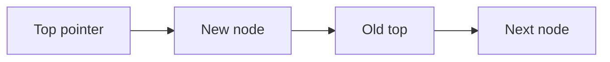

# Data Structures - Lecture 5

## Linked Stack and Linked Queue Overview

Lecture 5 replaces array-based **stack** and **queue** storage with **linked nodes**. The key gain is dynamic growth without shifting elements.

| Term             | Meaning in this lecture                                   | Why it matters                     |
| ---------------- | --------------------------------------------------------- | ---------------------------------- |
| **Node**         | One record containing data and a pointer to the next node | It is the basic storage unit       |
| **Linked stack** | A stack whose top is the first node in a linked chain     | Push and pop happen at the head    |
| **Linked queue** | A queue tracked by both front and rear pointers           | Enqueue and dequeue stay efficient |

_Common error:_ linked does not mean unordered.

## Shared Node Representation

Both structures use the same node idea: one data field and one link field.

```cpp
// Basic node used by the lecture's linked structures.
using EntryType = char;

struct Node {
  EntryType info;
  Node* next;
};
```

A linked structure stores elements in separate nodes connected by pointers.

## Linked Stack Representation and Operations

In a **linked stack**, the stack variable is a pointer to the top node.

```cpp
// The stack points directly to the top node.
using StackType = Node*;

void CreateStack(StackType* s) {
  *s = nullptr;
}

int StackEmpty(StackType s) {
  return s == nullptr;
}

int StackFull(StackType s) {
  return 0;
}
```

`CreateStack` sets the top pointer to `nullptr`. `StackEmpty` checks whether a top node exists. `StackFull` returns `0` because there is no fixed array limit here.

> [!NOTE]
> In linked implementations, "full" usually means memory allocation failed, not that a predefined `MAX` was reached.

### Push and Pop in a Linked Stack

Push creates a new node, links it to the old top, then makes it the new top.

```cpp
// Insert at the head so the new node becomes the top.
void Push(EntryType item, StackType* s) {
  Node* p = new Node;
  p->info = item;
  p->next = *s;
  *s = p;
}
```

Pop returns the top data, then moves the top pointer to the next node.

```cpp
// Remove the current top node and advance the top pointer.
void Pop(EntryType* item, StackType* s) {
  *item = (*s)->info;
  Node* p = *s;
  *s = (*s)->next;
  delete p;
}
```



_Common error:_ save the old top node before advancing the pointer.

### Clearing a Linked Stack

The stack is cleared by deleting head nodes until the top becomes null.

```cpp
// Repeatedly remove head nodes until the stack is empty.
void ClearStack(StackType* s) {
  Node* q;
  while (*s) {
    q = *s;
    *s = (*s)->next;
    delete q;
  }
}
```

Dynamic nodes must be released explicitly.

## Linked Queue Representation and Operations

In a **linked queue**, efficient insertion and deletion require both `front` and `rear`.

```cpp
// The queue tracks both ends.
struct QueueType {
  Node* front;
  Node* rear;
};

void CreateQueue(QueueType* q) {
  q->front = nullptr;
  q->rear = nullptr;
}

int QueueEmpty(QueueType q) {
  return q.front == nullptr;
}

int QueueFull(QueueType q) {
  return 0;
}
```

An empty queue has both pointers set to `nullptr`. `QueueFull` returns `0` for the same reason as the linked stack.

## Enqueue and Dequeue Logic

`Enqueue` creates a new last node. If the queue was empty, both `front` and `rear` point to it. Otherwise, the old `rear` links to it, then `rear` moves.

```cpp
// Insert at the rear while preserving the front pointer.
void Enqueue(EntryType item, QueueType* q) {
  Node* p = new Node;
  p->info = item;
  p->next = nullptr;

  if (!q->rear) {
    q->front = p;
  } else {
    q->rear->next = p;
  }

  q->rear = p;
}
```

`Dequeue` removes the front node, advances `front`, and clears `rear` if the queue becomes empty.

```cpp
// Remove from the front; if queue becomes empty, clear rear too.
void Dequeue(EntryType* item, QueueType* q) {
  *item = q->front->info;
  Node* p = q->front;
  q->front = q->front->next;
  delete p;

  if (!q->front) {
    q->rear = nullptr;
  }
}
```

> [!CAUTION]
> The special case after `Dequeue` is testable: when the last node is removed, both `front` and `rear` must be `nullptr`. Leaving `rear` unchanged creates a dangling pointer.

## Clearing a Linked Queue

The queue is cleared by deleting from `front` until no nodes remain.

```cpp
// Walk from front to rear, deleting each node.
void ClearQueue(QueueType* q) {
  Node* p;
  while (q->front) {
    p = q->front;
    q->front = q->front->next;
    delete p;
  }
  q->rear = nullptr;
}
```

## Linked vs Array Implementations

| Point          | Linked stack/queue               | Array stack/queue            |
| -------------- | -------------------------------- | ---------------------------- |
| Capacity       | Grows dynamically                | Fixed by declared array size |
| Memory layout  | Non-contiguous nodes             | Contiguous cells             |
| Full condition | Usually only if memory fails     | Reaches `MAX`                |
| Extra storage  | Needs pointer field in each node | No link field needed         |
| Clearing       | Must deallocate nodes            | Usually reset indices only   |

Exam idea: array implementations manage positions, while linked implementations manage **pointers between nodes**.

## Slide-Level Traps to Remember

### Pointer-update order

Wrong pointer-update order can lose nodes or leak memory.

### The lecture's written code has notation issues

Some slide lines are written imprecisely, especially stack `Pop`. The intended order is: read data, save old node, move pointer, delete old node.

### Why linked queue needs two pointers

If only `front` is stored, enqueue requires traversal to the end. `rear` avoids that cost.
