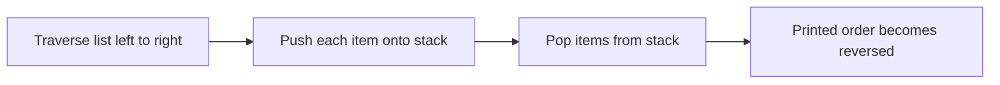

# Lists II: Linked-List Use Cases

## Linked Lists Use Cases

Lecture 6 covers printing a singly linked list, printing it in reverse, and storing data in a **doubly sorted linked list**.

| Term                   | Meaning in this lecture                      | Why it matters                            |
| ---------------------- | -------------------------------------------- | ----------------------------------------- |
| **Traversal**          | visiting nodes one by one from head to null  | used for printing and searching           |
| **Reverse print**      | outputting list elements from last to first  | shows how to recover reverse order        |
| **Doubly linked list** | each node has `next` and `prev`              | supports movement in both directions      |
| **Sorted insertion**   | inserting a node in its correct key position | keeps the list ordered after every update |

## Printing All List Elements

Printing in normal order is a forward traversal from head to null. This pattern is the basis of many linked-list operations.

> [!NOTE]
> In a singly linked list, forward traversal is easy because each node stores the address of the next node only.

## Printing in Reverse Order

The lecture prints in reverse by pushing list items onto a **stack**, then popping them.

Because a singly linked list has no backward pointer, reverse output needs extra help from a stack.

_Common error:_ reverse printing does not reverse the links.

## Doubly Sorted Linked List Structure

The second half defines a list whose nodes are linked in both directions and kept sorted by key.

| Field       | Purpose                |
| ----------- | ---------------------- |
| `info.key`  | sorting field          |
| `info.data` | associated information |
| `next`      | link to next node      |
| `prev`      | link to previous node  |
| `head`      | pointer to first node  |

## Sorted Insertion by Key

The insertion logic is:

1. find the insertion position
2. make the new node point to its neighbors
3. update neighboring nodes to point to the new node
4. update `head` when insertion happens at the beginning

> [!CAUTION]
> The slide code is rough around end-of-list insertion. The exam idea is the sorted insertion pattern itself: search by key, fix `next`, fix `prev`, then repair neighbor links and possibly `head`.

## What the Source Explicitly Requires

The lecture states these required tasks for the doubly sorted linked list:

1. write the node type definition
2. write an initialization function
3. write an insertion function
4. write a deletion function that removes a node of a specific key after retrieving its information

Only the first three were illustrated in the recovered lecture material.
