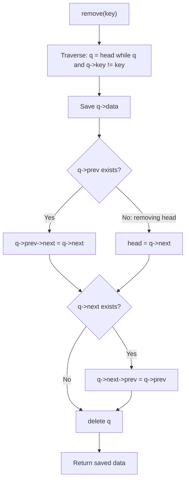

# Data Structures - Lecture 6

## Printing a Linked List

Traverse from head to NULL, visiting each node. Print the data at each step.

```cpp
void DoublySortedList::print() const {
  Node* current = head;
  while (current != nullptr) {
    std::cout << current->data.value << " ";
    current = current->next;
  }
}
```

## Printing in Reverse Using a Stack

A **stack** reverses order because of **LIFO** — last pushed element is first popped. Push all elements while traversing forward, then pop to print in reverse.

```cpp
void DoublySortedList::printReverse() const {
  LinkedStack stack;
  Node* current = head;
  while (current != nullptr) {
    stack.push(current->data.value);
    current = current->next;
  }
  while (!stack.isEmpty()) {
    std::cout << stack.pop() << " ";
  }
}
```

> [!NOTE]
> This uses the `LinkedStack` class from Lecture 5. The algorithm is **O(n)** time and **O(n)** space for the stack.

## Doubly Sorted Linked List

A **doubly sorted linked list** is a linked structure where each node has two pointers (`prev` and `next`) and data is kept **sorted by a key field** at all times.

### Node Structure

```cpp
struct Entry {
  int key;
  char value;
};

struct Node {
  Entry data;
  Node* next;
  Node* prev;
};

class DoublySortedList {
private:
  Node* head;

public:
  DoublySortedList();
  void print() const;
  void printReverse() const;
  void insert(Entry entry);
  Entry remove(int key);
};
```

### Constructor

```cpp
DoublySortedList::DoublySortedList() {
  this->head = nullptr;
}
```

### insert (Sorted by Key)

Traverses to find the correct position by key, then splices the new node in. Maintains sorted order.

```cpp
void DoublySortedList::insert(Entry entry) {
  Node* newNode = new Node;
  newNode->data = entry;
  newNode->next = nullptr;
  newNode->prev = nullptr;

  if (!this->head) {
    this->head = newNode;
  } else {
    Node* current = this->head;
    // Find the position where entry.key should be inserted
    while (current && entry.key > current->data.key) {
      current = current->next;
    }

    // Insert newNode before 'current'
    newNode->next = current;
    newNode->prev = current->prev;

    if (current->prev) {
      current->prev->next = newNode;
    } else {
      this->head = newNode;  // new smallest key
    }

    current->prev = newNode;
  }
}
```

> [!WARNING]
> The insertion traverses until it finds a node with a greater key or reaches the end.
> When `current` is `NULL` (insert at tail), `newNode->next = NULL` and then `current->prev = newNode` — but since `current` is `NULL`, this dereferences `NULL`.
> The loop condition should be `while (current && entry.key > current->data.key)` and the final `current->prev = newNode` only runs when `current` exists.

### remove (by Key)

Searches for the node with the matching key, unlinks it from both sides, and deallocates.

```cpp
Entry DoublySortedList::remove(int key) {
  Node* q = this->head;
  while (q && q->data.key != key) q = q->next;
  Entry item = q->data;

  if (q->prev) q->prev->next = q->next;
  else this->head = q->next;

  if (q->next) q->next->prev = q->prev;

  delete q;
  return item;
}
```



## Exercises

### Exercise 1: Print All Elements

Implement `print()` as a method on `DoublySortedList`. It traverses from head, printing each node's data.

```cpp
void DoublySortedList::print() const {
  Node* p = this->head;
  while (p) {
    std::cout << p->data.value << " ";
    p = p->next;
  }
}
```

**Time complexity:** O(n) — single traversal.

### Exercise 2: Print in Reverse

Implement `printReverse()` as a method using a stack to reverse the order.

```cpp
void DoublySortedList::printReverse() const {
  LinkedStack s;
  Node* p = this->head;
  while (p) {
    s.push(p->data.value);
    p = p->next;
  }
  while (!s.isEmpty()) {
    std::cout << s.pop() << " ";
  }
}
```

**Why it works:** Stack reverses order via LIFO — first element pushed is last popped.

### Exercise 3: Doubly Sorted Linked List

Implement a doubly sorted linked list with create, insert (sorted by key), and delete (by key) operations. See the class definition and methods above.

---

_5 min read (source: 5 min)_
