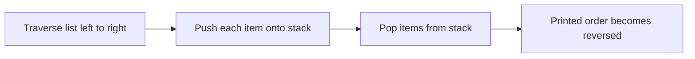

# Data Structures - Lecture 6

## Linked Lists Use Cases

Lecture 6 covers printing a singly linked list, printing it in reverse, and storing data in a **doubly sorted linked list**.

| Term                   | Meaning in this lecture                      | Why it matters                            |
| ---------------------- | -------------------------------------------- | ----------------------------------------- |
| **Traversal**          | Visiting nodes one by one from head to null  | Used for printing and searching           |
| **Reverse print**      | Outputting list elements from last to first  | Shows how to recover reverse order        |
| **Doubly linked list** | Each node has `next` and `prev`              | Supports movement in both directions      |
| **Sorted insertion**   | Inserting a node in its correct key position | Keeps the list ordered after every update |

## Singly Linked List Base Type

The lecture starts from the usual singly linked list declaration.

```cpp
// Base singly linked list node used by the first use cases.
using EntryType = char;

struct Node {
  EntryType info;
  Node* next;
};

using ListType = Node*;
```

The list is empty when `L == nullptr`.

## Printing All List Elements

Printing in normal order is a forward traversal from head to null.

```cpp
// Print the list from head to tail.
void PrintList(ListType L) {
  Node* p = L;

  while (p) {
    cout << p->info;
    p = p->next;
  }
}
```

This pattern is the basis of many linked-list operations.

> [!NOTE]
> In a singly linked list, forward traversal is easy because each node stores the address of the next node only.

## Printing in Reverse Order

The slide prints in reverse by pushing list items onto a **stack**, then popping them.

```cpp
// Traverse the list, store items in a stack, then print in reverse.
void PrintReverse(ListType L) {
  Node* p = L;
  StackType s;
  CreateStack(&s);

  while (p) {
    Push(p->info, &s);
    p = p->next;
  }

  EntryType c;
  while (!StackEmpty(s)) {
    Pop(&c, &s);
    cout << c;
  }
}
```



Because a singly linked list has no backward pointer, reverse output needs extra help from a stack.

_Common error:_ reverse printing does not reverse the links.

## Why a Stack Solves Reverse Printing

A **stack** returns elements in reverse arrival order:

| Step | Action                         | Result                               |
| ---- | ------------------------------ | ------------------------------------ |
| 1    | Traverse the linked list       | Elements are seen from first to last |
| 2    | Push each element onto a stack | Last list item reaches stack top     |
| 3    | Pop until stack is empty       | Output becomes last to first         |

## Doubly Sorted Linked List Structure

The second half defines a list whose nodes are linked in both directions and kept sorted by key.

```cpp
// Data item stored inside the doubly sorted list.
struct EntryData {
  int key;
  char data;
};

struct DNode {
  EntryData info;
  DNode* next;
  DNode* prev;
};

struct DListType {
  DNode* head;
};
```

| Field       | Purpose                               |
| ----------- | ------------------------------------- |
| `info.key`  | The sorting field                     |
| `info.data` | The associated information            |
| `next`      | Link to the next node                 |
| `prev`      | Link to the previous node             |
| `head`      | Pointer to the first node in the list |

`next` and `prev` make the structure **doubly** linked.

## Initialization

Initialization makes `head` null.

```cpp
// Initialize the doubly sorted list as empty.
void CreateDL(DListType* dl) {
  dl->head = nullptr;
}
```

## Sorted Insertion by Key

The insert code searches for the first node whose key is not smaller than the new key, then inserts before it.

```cpp
// Insert a node before the first node with key >= e.key.
void Insert(DListType* dl, EntryData e) {
  DNode* p = new DNode;
  p->info = e;

  DNode* q = dl->head;

  if (dl->head == nullptr) {
    p->prev = nullptr;
    p->next = nullptr;
    dl->head = p;
  } else {
    while (q && e.key > q->info.key) {
      q = q->next;
    }

    p->next = q;
    p->prev = q ? q->prev : nullptr;

    if (q && q->prev) {
      q->prev->next = p;
    } else {
      dl->head = p;
    }

    if (q) {
      q->prev = p;
    }
  }
}
```

The pointer logic is:

1. Find the insertion position.
2. Make the new node point to its neighbors.
3. Update the neighboring nodes to point back to the new node.
4. Update `head` when insertion happens at the beginning.

> [!CAUTION]
> The slide code is rough around end-of-list insertion. The exam idea is the pattern: search by key, fix `next`, fix `prev`, then repair neighbor links and possibly `head`.

## What the Source Explicitly Requires

The lecture states these required tasks for the doubly sorted linked list:

1. Write the node type definition.
2. Write an initialization function.
3. Write an insertion function.
4. Write a deletion function that removes a node of a specific key after retrieving its information.

Only the first three are illustrated. The deletion requirement is listed, but its implementation is not shown here.

_Exam caution:_ remember the deletion contract, but do not treat it as fully specified code.

## Singly vs Doubly Linked Use Cases

| Point                  | Singly linked list            | Doubly sorted linked list    |
| ---------------------- | ----------------------------- | ---------------------------- |
| Links per node         | One: `next`                   | Two: `next` and `prev`       |
| Traversal direction    | Forward only                  | Forward and backward         |
| Use in this lecture    | Printing and reverse printing | Ordered storage by key       |
| Extra helper structure | Stack used for reverse output | No stack shown for insertion |

A singly linked list is enough for forward traversal, but ordered insertion with two-sided updates is easier in a doubly linked list.
