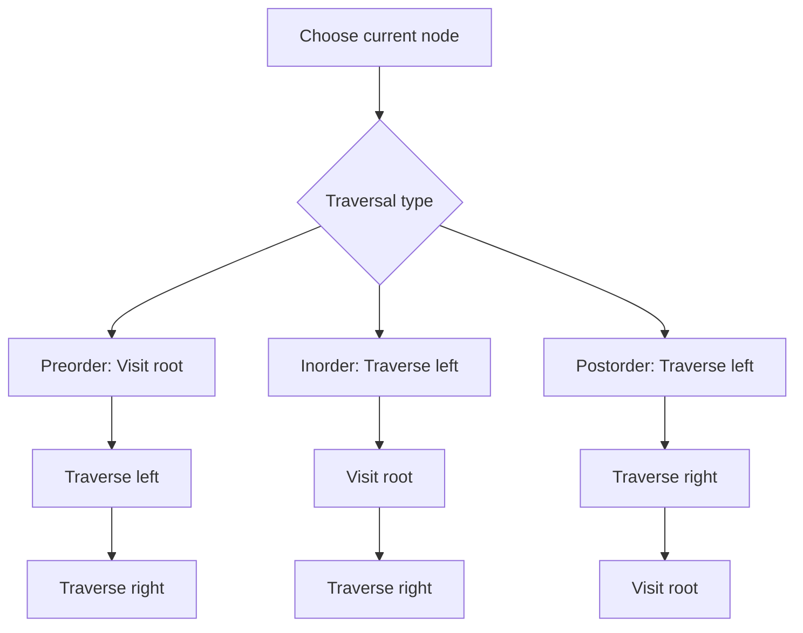

# Data Structures - Lecture 7

## Tree Basics and Why Trees Matter

A **tree** is a non-linear data structure used for **hierarchical relationships**. The lecture defines it as an **acyclic** structure of linked nodes.

| Term          | Exam meaning                                                                      |
| ------------- | --------------------------------------------------------------------------------- |
| **Tree**      | A collection of nodes that may be empty or may start from one root with subtrees. |
| **Hierarchy** | Data is organized by parent-child relationships, not by one linear order.         |
| **Acyclic**   | No cycles; following links does not return to the same node.                      |

Examples from the lecture:

- folders and files on a computer
- family or organizational charts
- compiler parse trees
- decision trees

## Formal Tree Definition

The lecture gives this recursive definition:

- a tree may be empty
- if not empty, it consists of a node `r` called the **root**
- the root may have zero or more nonempty **subtrees** `T1, T2, ..., Tk`
- each subtree is connected to `r` by an edge

Many tree algorithms follow this same recursive pattern.

## Core Terminology

### Node Relationships

| Term        | Meaning                                       |
| ----------- | --------------------------------------------- |
| **Root**    | Topmost node of the tree.                     |
| **Leaf**    | Node with no children.                        |
| **Parent**  | A node that refers to another node.           |
| **Child**   | A node referenced by a parent.                |
| **Sibling** | Nodes with the same parent.                   |
| **Subtree** | A smaller tree rooted at one child of a node. |

### Path and Shape Terms

| Term       | Meaning                                       |
| ---------- | --------------------------------------------- |
| **Path**   | A sequence of edges.                          |
| **Size**   | Number of nodes in the tree.                  |
| **Depth**  | Number of edges from a node to the root.      |
| **Level**  | Length of the path from the root to the node. |
| **Height** | Longest path from a node to a leaf.           |
| **Degree** | Maximum number of subtrees or children.       |

_Common exam trap:_ the slides describe both **depth** and **level** using path length from the root, so use the lecture wording if asked directly.

## Binary Trees

A **binary tree** is a tree in which no node has more than two children, usually called **left** and **right** successors.

The lecture also gives this recursive definition:

- a binary tree may be empty
- otherwise it has a root
- its left child is the root of a binary subtree
- its right child is the root of a binary subtree

### Special Binary Tree Shapes

| Type                          | Meaning                                       |
| ----------------------------- | --------------------------------------------- |
| **Left-skewed**               | Every node has only a left subtree.           |
| **Right-skewed**              | Every node has only a right subtree.          |
| **Complete binary tree**      | Every level is full except possibly the last. |
| **Full (strict) binary tree** | Every non-leaf node has exactly two children. |

_Important distinction:_ **full** and **complete** are not the same.

## Tree Traversals

A **traversal** is the examination of tree elements in a particular order.

| Traversal     | Order             | Memory hint               |
| ------------- | ----------------- | ------------------------- |
| **Preorder**  | root, left, right | Visit root first.         |
| **Inorder**   | left, root, right | Root stays in the middle. |
| **Postorder** | left, right, root | Root is visited last.     |



### Why Traversal Order Matters

- **Preorder**: root first.
- **Inorder**: root between left and right.
- **Postorder**: root last; useful for deletion.

## Expression Trees

An **expression tree** is a binary tree that stores an arithmetic expression.

- leaves contain **operands** such as constants or variables
- internal nodes contain **operators**
- the left subtree gives the left operand
- the right subtree gives the right operand

This is important in parsing and syntactical analysis.

_Key exam idea:_ parentheses and operator structure appear naturally in the tree shape.

## Tree Representation in Memory

The lecture uses linked nodes for binary-tree implementation.

```cpp
// Binary tree node with left and right children.
using EntryType = char;

struct NodeType {
  EntryType info;
  NodeType* right;
  NodeType* left;
};

using TreeType = NodeType*;
```

Each node stores:

- the data item `info`
- a left-child pointer
- a right-child pointer

An empty tree is represented by `nullptr`.

## Basic Tree ADT Operations

### Create, Empty, and Full

```cpp
void CreateTree(TreeType* t) {
  *t = nullptr;
}

int EmptyTree(TreeType t) {
  return !t;
}

int FullTree(TreeType t) {
  return 0;
}
```

The lecture treats a linked tree as having no fixed array capacity, so `FullTree` returns `0`.

## Recursive Traversal Implementations

### Inorder

```cpp
void Inorder(TreeType t, void (*pvisit)(EntryType*)) {
  if (t) {
    Inorder(t->left, pvisit);
    (*pvisit)(&(t->info));
    Inorder(t->right, pvisit);
  }
}
```

### Preorder

```cpp
void Preorder(TreeType t, void (*pvisit)(EntryType*)) {
  if (t) {
    (*pvisit)(&(t->info));
    Preorder(t->left, pvisit);
    Preorder(t->right, pvisit);
  }
}
```

### Postorder

```cpp
void Postorder(TreeType t, void (*pvisit)(EntryType*)) {
  if (t) {
    Postorder(t->left, pvisit);
    Postorder(t->right, pvisit);
    (*pvisit)(&(t->info));
  }
}
```

The slides also show a non-recursive inorder traversal using a stack to simulate recursion.

## Size, Height, and Clearing the Tree

### Size

```cpp
int Size(TreeType t) {
  if (!t) {
    return 0;
  }
  return 1 + Size(t->left) + Size(t->right);
}
```

The size of a tree is:

- `0` for the empty tree
- otherwise `1 + left size + right size`

### Height

```cpp
int Height(TreeType t) {
  if (!t) {
    return 0;
  }
  int a = Height(t->left);
  int b = Height(t->right);
  return (a > b) ? 1 + a : 1 + b;
}
```

The slide has a typo in `heigth`, but the intended logic is `1 + max(left, right)`.

### ClearTree

```cpp
void ClearTree(TreeType* t) {
  if (*t) {
    ClearTree(&(*t)->left);
    ClearTree(&(*t)->right);
    delete *t;
    *t = nullptr;
  }
}
```

This is a **postorder-like** action: delete children before the parent.

## High-Yield Comparisons

| Idea                                         | Tree meaning                                                                                |
| -------------------------------------------- | ------------------------------------------------------------------------------------------- |
| Linear vs non-linear                         | Trees model branching relationships instead of one sequence.                                |
| General tree vs binary tree                  | General tree may have many children; binary tree has at most two.                           |
| Full vs complete                             | Full focuses on exactly two children for each non-leaf; complete focuses on filling levels. |
| Recursive traversal vs stack-based traversal | Both can produce the same order; the stack-based version simulates recursion.               |

## Final Review Points

- A tree is hierarchical and acyclic.
- A binary tree has at most two children per node.
- Traversals are **preorder**, **inorder**, and **postorder**.
- Expression trees store operators internally and operands in leaves.
- Linked tree nodes contain data plus left/right pointers.
- `Size` and `Height` are recursive.
- `ClearTree` deletes children before the parent.
