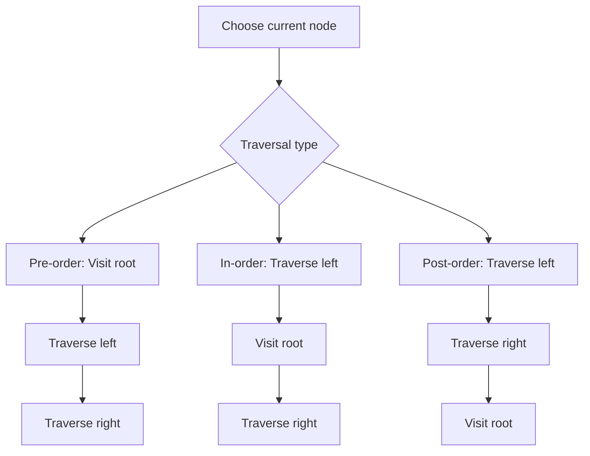

# Trees I: Tree Basics and Traversals

## Tree Basics and Why Trees Matter

A **tree** is a non-linear data structure used for **hierarchical relationships**. The lecture defines it as an **acyclic** structure of linked nodes.

| Term          | Exam meaning                                                                      |
| ------------- | --------------------------------------------------------------------------------- |
| **Tree**      | A collection of nodes that may be empty or may start from one root with subtrees. |
| **Hierarchy** | Data is organized by parent-child relationships, not by one linear order.         |
| **Acyclic**   | No cycles; following links does not return to the same node.                      |

Examples from the lecture:

- folders and files on a computer
- family or organizational charts
- compiler parse trees
- decision trees

## Formal Tree Definition

The lecture gives this recursive definition:

- a tree may be empty
- if not empty, it has a node `r` called the **root**
- the root may have zero or more nonempty **subtrees**
- each subtree is connected to the root by an edge

## Core Terminology

| Term        | Meaning                                       |
| ----------- | --------------------------------------------- |
| **Root**    | Topmost node of the tree.                     |
| **Leaf**    | Node with no children.                        |
| **Parent**  | A node that refers to another node.           |
| **Child**   | A node referenced by a parent.                |
| **Sibling** | Nodes with the same parent.                   |
| **Subtree** | A smaller tree rooted at one child of a node. |
| **Path**    | A sequence of edges.                          |
| **Size**    | Number of nodes in the tree.                  |
| **Depth**   | Number of edges from a node to the root.      |
| **Level**   | Length of the path from the root to the node. |
| **Height**  | Longest path from a node to a leaf.           |
| **Degree**  | Maximum number of subtrees or children.       |

**Exam trap:** the slides describe both **depth** and **level** using path length from the root, so use the lecture wording when asked directly.

## Binary Trees

A **binary tree** is a tree in which no node has more than two children, usually called **left** and **right**.

### Special Binary Tree Shapes

| Type                          | Meaning                                       |
| ----------------------------- | --------------------------------------------- |
| **Left-skewed**               | Every node has only a left subtree.           |
| **Right-skewed**              | Every node has only a right subtree.          |
| **Complete binary tree**      | Every level is full except possibly the last. |
| **Full (strict) binary tree** | Every non-leaf node has exactly two children. |

_Important distinction:_ **full** and **complete** are not the same.

## Tree Traversals

A **traversal** is the examination of tree elements in a particular order.

| Traversal      | Order             | Memory hint               |
| -------------- | ----------------- | ------------------------- |
| **Pre-order**  | root, left, right | Visit root first.         |
| **In-order**   | left, root, right | Root stays in the middle. |
| **Post-order** | left, right, root | Root is visited last.     |

### Why Traversal Order Matters

- **Pre-order** visits root first
- **In-order** puts root between left and right
- **Post-order** visits root last and suits deletion logic

## Expression Trees

An **expression tree** is a binary tree representing an arithmetic expression.

- leaves contain **operands** such as constants or variables
- internal nodes contain **operators**
- tree shape reflects grouping and precedence naturally
- the left subtree gives the left operand
- the right subtree gives the right operand

This is important in parsing and syntactical analysis.

**Key exam idea:** parentheses and operator structure appear naturally in the tree shape.

## High-Yield Comparisons

| Idea                                         | Tree meaning                                                                                |
| -------------------------------------------- | ------------------------------------------------------------------------------------------- |
| Linear vs non-linear                         | Trees model branching relationships instead of one sequence.                                |
| General tree vs binary tree                  | General tree may have many children; binary tree has at most two.                           |
| Full vs complete                             | Full focuses on exactly two children for each non-leaf; complete focuses on filling levels. |
| Recursive traversal vs stack-based traversal | Both can produce the same order; the stack-based version simulates recursion.               |

## Final Review Points

- A tree is hierarchical and acyclic.
- A binary tree has at most two children per node.
- Traversals are **pre-order**, **in-order**, and **post-order**.
- Expression trees store operators internally and operands in leaves.
